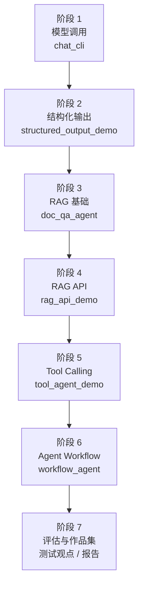

# Agent 学习路线

> 这份路线不是让你背框架名，而是带你一步一步做出一个“能查资料、能调用工具、能按流程完成任务”的小型 Agent。每一阶段都配有场景、文件、demo 和学完后应该能说清楚的话。

## 1. 先用一个场景理解这条路线

假设你以后在日本项目现场遇到这样的需求：

```text
公司有很多社内规程、设计书、FAQ 和手顺书。
业务人员希望输入一个问题，系统能先查资料，再整理回答。
如果资料不够，系统不要乱猜。
后续还希望系统能调用内部 API，生成任务清单或报告草稿。
```

这就是一个很典型的 `生成AI + RAG + API連携 + Agent` 学习场景。

你最终要做出的东西，可以先想成：

```text
用户问题
  -> 模型理解问题
  -> 查本地或社内资料
  -> 判断资料是否足够
  -> 必要时调用工具
  -> 输出答案、来源、下一步建议
```

这条路线的重点不是一开始就做“很聪明的全自动 Agent”，而是先把每一层能力搭稳。

## 2. 先知道每个目录负责什么

| 目录 / 文件 | 是什么 | 你什么时候看 |
| --- | --- | --- |
| [Agent系统框架与术语.md](./Agent系统框架与术语.md) | Agent 系统知识总览 | 不知道 Agent、Tool、Memory、Observation 是什么时先看 |
| [02-模型调用基础.md](./02-模型调用基础.md) | 模型 API 调用基础 | 第一次把 Python 程序接到 LLM 时看 |
| [../llm-lab/04-RAG.md](../llm-lab/04-RAG.md) | RAG 基础主教程 | 学文档读取、切分、检索、引用时看 |
| [04-RAG.md](./04-RAG.md) | Agent 中的 RAG | 已懂 RAG 后，看 Agent 怎么把 RAG 当工具用 |
| [03-Tool Calling.md](./03-Tool%20Calling.md) | 工具调用教程 | 想让模型调用文件、搜索、API 等工具时看 |
| [05-Agent工作流.md](./05-Agent工作流.md) | Agent 工作流教程 | 想把任务拆成分析、计划、总结等步骤时看 |
| [projects/](./projects/README.md) | 可运行 demo 集合 | 每学一章就跑一个 demo |

## 3. 整体路线图



初学者只要记住这条主线：

```text
先会问模型 -> 再让输出稳定 -> 再会查资料 -> 再做成 API -> 再让模型用工具 -> 最后做工作流
```

## 4. 阶段 1：模型调用

### 这是什么

模型调用就是让你的 Python 程序通过 API 问大模型，并拿到回答。

它还不是 Agent，只是所有后续能力的入口。

```text
用户输入 -> Python 程序 -> LLM API -> 模型回答
```

### 具体场景

你做一个命令行小工具：

```text
输入：请用三句话总结 RAG 是什么
输出：模型返回一段总结
```

### 先看这些文件

| 文件 | 看什么 |
| --- | --- |
| [02-模型调用基础.md](./02-模型调用基础.md) | 模型调用是什么、属于哪一层 |
| [projects/chat_cli/README.md](./projects/chat_cli/README.md) | 怎么运行最小聊天 demo |
| [projects/chat_cli/main.py](./projects/chat_cli/main.py) | 程序怎么读取问题、调用模型、打印结果 |

### 学完要能说清楚

```text
模型调用是 LLM 应用的最底层能力。程序负责组织输入，模型负责生成回答，程序再处理输出。
```

日本现场可以说：

```text
LLM API を呼び出して、ユーザー入力に対する応答を取得する基本処理です。
```

## 5. 阶段 2：结构化输出

### 这是什么

结构化输出是让模型不要只返回自由文本，而是返回程序能解析的 JSON 或固定字段。

它很重要，因为真实系统通常不是只把回答显示给人看，还要把结果交给后端、数据库或下一个流程。

### 具体场景

你输入一个需求：

```text
帮我做一个社内文档问答系统
```

模型不要只写一段话，而是返回：

```json
{
  "goal": "社内文档问答",
  "tasks": ["读取文档", "切分文本", "检索", "生成回答"],
  "risk": "答案需要带来源"
}
```

### 先看这些文件

| 文件 | 看什么 |
| --- | --- |
| [projects/structured_output_demo/README.md](./projects/structured_output_demo/README.md) | 结构化输出 demo 怎么跑 |
| [projects/structured_output_demo/main.py](./projects/structured_output_demo/main.py) | `Pydantic` schema 怎么约束模型输出 |

### 学完要能说清楚

```text
结构化输出是 LLM 应用进入业务系统的关键。它让模型输出从“自然语言文本”变成“程序可处理的数据”。
```

日本现场可以说：

```text
構造化出力により、モデルの回答を JSON 形式で受け取り、後続処理や API 連携に利用できます。
```

## 6. 阶段 3：RAG / 社内検索

### 这是什么

RAG 是“先查资料，再让模型基于资料回答”的知识库问答架构。

基础教程归到 [../llm-lab/04-RAG.md](../llm-lab/04-RAG.md)。
本目录的 [04-RAG.md](./04-RAG.md) 只看 Agent 视角：RAG 如何作为 `知识工具` 被 Agent 调用。

### 具体场景

你有一个本地文档目录：

```text
docs/
  社内规程.md
  API设计书.md
  FAQ.md
```

用户问：

```text
请问 API 失败时应该怎么处理？
```

系统应该先查文档，再基于命中的片段回答，并显示来源。

### 先看这些文件

| 文件 | 看什么 |
| --- | --- |
| [../llm-lab/04-RAG.md](../llm-lab/04-RAG.md) | RAG 基础、流程和最小代码 |
| [04-RAG.md](./04-RAG.md) | Agent 如何把 RAG 当作知识工具 |
| [projects/doc_qa_agent/README.md](./projects/doc_qa_agent/README.md) | 本地文档问答 demo |
| [projects/doc_qa_agent/main.py](./projects/doc_qa_agent/main.py) | `iter_text_files()`、`chunk_text()`、`retrieve()`、`answer_question()` |

### 学完要能说清楚

```text
RAG 的价值不是让模型更会聊天，而是让模型基于企业资料回答，并给出来源。
```

日本现场可以说：

```text
RAG は社内文書を検索し、その検索結果に基づいて回答を生成する仕組みです。
```

## 7. 阶段 4：RAG API / 后端整合

### 这是什么

后端整合就是把命令行里的 RAG 能力做成 HTTP API，让前端或其他系统可以调用。

```text
前端 / 业务系统 -> FastAPI -> RAG -> LLM -> JSON response
```

### 具体场景

前端页面发请求：

```http
POST /ask
{
  "question": "社内规程里如何申请权限？"
}
```

后端返回：

```json
{
  "answer": "需要提交权限申请单，并经过负责人审批。",
  "sources": ["社内规程.md"]
}
```

### 先看这些文件

| 文件 | 看什么 |
| --- | --- |
| [projects/rag_api_demo/README.md](./projects/rag_api_demo/README.md) | FastAPI 版 RAG 怎么运行 |
| [projects/rag_api_demo/main.py](./projects/rag_api_demo/main.py) | API 路由、请求体、响应体、RAG 调用 |
| [projects/rag_api_demo/基本设计.md](./projects/rag_api_demo/基本设计.md) | API 版 RAG 的设计说明 |
| [projects/rag_api_demo/测试观点.md](./projects/rag_api_demo/测试观点.md) | 怎么从测试角度看 RAG API |

### 学完要能说清楚

```text
RAG API 是把文档问答能力服务化。它让前端、业务系统或其他服务可以通过 HTTP 调用生成 AI 能力。
```

日本现场可以说：

```text
FastAPI を利用して RAG 機能を API 化し、他システムから利用できる形にします。
```

## 8. 阶段 5：Tool Calling

### 这是什么

Tool Calling 是让模型提出“我要调用哪个工具、参数是什么”，再由程序真正执行工具。

模型不是自己读硬盘、查数据库、调 API。模型只提出工具调用请求，Python 程序负责执行。

### 具体场景

用户说：

```text
请读取 README.md，并总结这个项目是做什么的。
```

Agent 的处理过程：

```text
模型判断需要读文件
  -> 发出 read_file(path="README.md")
  -> Python 工具读取文件
  -> 把文件内容回填给模型
  -> 模型生成总结
```

### 先看这些文件

| 文件 | 看什么 |
| --- | --- |
| [03-Tool Calling.md](./03-Tool%20Calling.md) | 工具调用的角色、数据流、注意点 |
| [projects/tool_agent_demo/README.md](./projects/tool_agent_demo/README.md) | 工具调用 demo 怎么跑 |
| [projects/tool_agent_demo/main.py](./projects/tool_agent_demo/main.py) | `build_tools()`、`call_tool()`、`resolve_path()`、`run_agent()` |

### 学完要能说清楚

```text
Tool Calling 是 Agent 从“只会说”变成“可以通过程序做事”的关键机制。
```

日本现场可以说：

```text
Tool Calling により、モデルが外部ツールや API を利用するための呼び出し要求を出し、実行はアプリ側で制御します。
```

## 9. 阶段 6：Agent 工作流

### 这是什么

Agent 工作流是把任务拆成多个可观察、可控制、可测试的步骤。

它不是让模型无限自由行动，而是把复杂任务变成固定流程。

### 具体场景

用户说：

```text
帮我规划一个社内搜索 Agent 的实现方案。
```

工作流可以拆成：

```text
分析需求 -> 生成计划 -> 输出最终建议
```

### 先看这些文件

| 文件 | 看什么 |
| --- | --- |
| [05-Agent工作流.md](./05-Agent工作流.md) | 工作流、Planner、State、Finalizer 是什么 |
| [projects/workflow_agent/README.md](./projects/workflow_agent/README.md) | 工作流 Agent demo 怎么跑 |
| [projects/workflow_agent/main.py](./projects/workflow_agent/main.py) | `analyze_task()`、`plan_task()`、`finalize_task()` |

### 学完要能说清楚

```text
工作流 Agent 的重点是可控。它把任务拆成明确阶段，每个阶段都有输入、输出和检查点。
```

日本现场可以说：

```text
Agent ワークフローは、AI エージェントの処理を複数ステップに分けて制御する仕組みです。
```

## 10. 阶段 7：评估与作品集

### 这是什么

评估不是“能跑就行”，而是确认这个 Agent 是否可靠、可解释、能交付。

你要看：

- 回答是否基于资料
- 来源是否正确
- 工具调用是否安全
- 失败时是否能说明原因
- 成本和延迟是否可接受

### 先看这些文件

| 文件 | 看什么 |
| --- | --- |
| [projects/tool_agent_demo/测试观点.md](./projects/tool_agent_demo/测试观点.md) | 工具型 Agent 怎么测试 |
| [projects/tool_agent_demo/简单测试用例表.md](./projects/tool_agent_demo/简单测试用例表.md) | 最小测试用例怎么写 |
| [projects/rag_api_demo/试验结果报告.md](./projects/rag_api_demo/试验结果报告.md) | 怎么把 demo 讲成试验报告 |

### 学完要能说清楚

```text
Agent 的交付重点不是功能多，而是可控、可验证、有边界、能说明失败原因。
```

日本现场可以说：

```text
Agent の評価では、回答品質、出典、ツール実行の安全性、エラー時の挙動を確認します。
```

## 11. 12 周学习节奏

| 周数 | 目标 | 主要文件 | 输出物 |
| --- | --- | --- | --- |
| 第 1 周 | 会调模型 | `02-模型调用基础.md`、`chat_cli` | 能运行命令行问答 |
| 第 2 周 | 会让输出稳定 | `structured_output_demo` | 能输出 JSON 任务清单 |
| 第 3-4 周 | 会做本地 RAG | `../llm-lab/04-RAG.md`、`doc_qa_agent` | 能基于本地文档回答并带来源 |
| 第 5-6 周 | 会做 RAG API | `rag_api_demo` | 能用 HTTP 调用 RAG |
| 第 7-8 周 | 会做工具调用 | `03-Tool Calling.md`、`tool_agent_demo` | 能让模型调用只读文件工具 |
| 第 9-10 周 | 会做工作流 | `05-Agent工作流.md`、`workflow_agent` | 能跑分析、计划、总结三阶段 |
| 第 11-12 周 | 会整理作品集 | 测试观点、试验报告 | 能说明设计、测试、风险和改进 |

## 12. 初学者最容易卡住的地方

| 卡住点 | 为什么会卡 | 怎么处理 |
| --- | --- | --- |
| 一开始就想做复杂 Agent | 概念太多，工具、记忆、计划、评估混在一起 | 先跑 `chat_cli` 和 `doc_qa_agent` |
| 只看框架名 | `LangChain`、`LlamaIndex`、`AutoGen` 听起来很厉害，但不知道解决什么问题 | 先用本仓库 demo 看清输入、处理、输出 |
| RAG 和 Agent 分不清 | RAG 是查资料回答，Agent 是决定下一步和调用工具 | 先看 [../llm-lab/04-RAG.md](../llm-lab/04-RAG.md)，再看 [04-RAG.md](./04-RAG.md) |
| Tool Calling 以为是模型直接执行 | 实际执行者是程序，不是模型 | 看 `tool_agent_demo/main.py` 的 `call_tool()` |
| 不知道怎么讲作品 | 只会说“我做了一个 demo” | 用需求概要、基本设计、测试观点、试验报告来讲 |

## 13. 最重要的原则

- 每一阶段都要能跑一个 demo。
- 每一阶段都要能说清楚“输入是什么、处理在哪里、输出是什么”。
- 先学日本现场更常见的 `RAG + Python + API連携`，再学复杂 Agent。
- Agent 不是越自由越好，真实项目更重视可控、可测、有边界。
- 作品集不要只放代码，还要放需求、设计、测试、试验结果。
