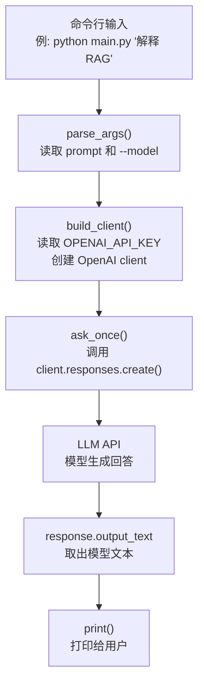

# Agent 前置：模型调用基础

> 归位说明：完整的模型调用基础教程统一看 [../llm-lab/02-模型调用基础.md](../llm-lab/02-模型调用基础.md)。本文只保留 Agent 学习前需要复习的最小模型调用链路，并用 `chat_cli` 说明代码定位。

## 1. 先用一个小场景理解

假设你在日本项目现场做一个最小生成 AI 验证：

```text
业务人员输入一句问题：
请用三句话说明 RAG 是什么。

系统要做的事：
把这个问题交给 LLM API，然后把模型回答打印出来。
```

这时候还没有 RAG，也没有工具调用，更没有复杂 Agent。

它只是最基础的模型调用：

```text
用户输入
  -> Python 程序
  -> OpenAI / Azure OpenAI / Bedrock 等 LLM API
  -> 模型返回文本
  -> Python 程序打印结果
```

## 2. 模型调用是什么

`模型调用` 是 LLM 应用开发最基础的一层，指的是你的程序通过 API 把消息发送给大模型，并接收模型返回结果。

它不是 Agent 框架本身，而是所有后续能力的基础能力。

在项目里，模型调用通常属于：

| 分类 | 说明 |
| --- | --- |
| 技术类型 | LLM API 调用、后端集成基础 |
| 系统层次 | 模型调用层 / LLM Client 层 |
| 常见 SDK | OpenAI SDK、Azure OpenAI SDK、AWS Bedrock SDK |
| 日本现场说法 | `LLM API連携`, `生成AI API連携`, `モデル呼び出し` |

一句话先记住：

- `模型调用` 是把大模型能力接进自己程序的第一步。

## 3. 本章对应哪个 demo

本章主要看：

| 文件 | 作用 |
| --- | --- |
| [projects/chat_cli/README.md](./projects/chat_cli/README.md) | 告诉你怎么运行最小命令行聊天 demo |
| [projects/chat_cli/main.py](./projects/chat_cli/main.py) | 真正的 Python 代码 |

先不要急着改很多功能。初学时先把这几个函数看懂：

| 函数 / 常量 | 是什么 | 作用 |
| --- | --- | --- |
| `DEFAULT_MODEL` | 默认模型名 | 不传 `--model` 时使用哪个模型 |
| `SYSTEM_INSTRUCTIONS` | 系统指令 | 给模型的基础行为说明 |
| `parse_args()` | 命令行参数解析 | 读取用户输入的 prompt 和 model |
| `build_client()` | 客户端创建 | 从 `OPENAI_API_KEY` 创建 OpenAI client |
| `ask_once()` | 单次模型调用 | 把 prompt 发给模型并返回回答 |
| `run_interactive()` | 交互循环 | 让用户连续输入问题 |
| `main()` | 程序入口 | 决定是一次性提问还是进入交互模式 |

## 4. 代码处理流程



对应到代码：

| 顺序 | 文件 / 函数 | 输入 | 输出 | 学习重点 |
| --- | --- | --- | --- | --- |
| 1 | `main.py -> parse_args()` | 命令行参数 | `args.prompt`, `args.model` | 程序怎么接收用户输入 |
| 2 | `main.py -> build_client()` | `OPENAI_API_KEY` | `OpenAI` client | API key 不写死在代码里 |
| 3 | `main.py -> ask_once()` | client、model、prompt | 回答文本 | 真正调用模型的位置 |
| 4 | `client.responses.create()` | instructions、input、model | API response | LLM API 调用结构 |
| 5 | `response.output_text` | response | 文本 | 怎么取出模型回答 |

## 5. 一次性提问和交互模式

`chat_cli` 有两种用法。

### 一次性提问

适合快速测试模型调用是否成功：

```bash
python main.py "用一句话解释什么是 RAG"
```

处理流程：

```text
命令行 prompt -> ask_once() -> 打印一次回答 -> 程序结束
```

### 交互模式

如果不传 prompt，就进入交互模式：

```bash
python main.py
```

处理流程：

```text
用户输入问题 -> ask_once() -> 打印回答 -> 等待下一次输入
```

这一段对应 [projects/chat_cli/main.py](./projects/chat_cli/main.py) 里的 `run_interactive()`。

## 6. 初学者要先看懂的 5 个概念

| 概念 | 是什么 | 在代码哪里 |
| --- | --- | --- |
| API Key | 调用模型服务的凭证 | `os.getenv("OPENAI_API_KEY")` |
| Client | 和模型服务通信的对象 | `OpenAI(api_key=api_key)` |
| Model | 具体使用哪个模型 | `model=args.model` |
| Instructions | 给模型的系统说明 | `SYSTEM_INSTRUCTIONS` |
| Input | 用户本次问题 | `input=prompt` |

先把这些看懂，比一开始就研究 Agent 框架更重要。

## 7. 和后续章节的关系

| 后续能力 | 为什么依赖模型调用 |
| --- | --- |
| 结构化输出 | 还是模型调用，只是要求模型返回 JSON |
| RAG | 先检索资料，再把资料和问题一起传给模型 |
| Tool Calling | 先调用模型，让模型决定要不要用工具 |
| Agent Workflow | 多次模型调用组合成多个阶段 |

也就是说，后面看起来复杂，其实都离不开这一句：

```python
client.responses.create(...)
```

## 8. 常见错误与排查

| 问题 | 可能原因 | 怎么看 |
| --- | --- | --- |
| `OPENAI_API_KEY is not set` | 没有配置环境变量 | 先设置 `OPENAI_API_KEY` |
| 请求失败 | 网络、key、模型名或额度问题 | 看 `ERROR: request failed` 后面的异常 |
| 输出太自由 | instructions 太宽泛 | 调整 `SYSTEM_INSTRUCTIONS` |
| 不知道响应在哪里 | 没看 response 对象 | 先用 `response.output_text` |
| 只会聊天 | 没理解后续系统怎么接 | 下一步看结构化输出和 RAG |

## 9. 学完要能说清楚

中文：

```text
模型调用是 LLM 应用的最底层能力。程序负责组织输入，模型负责生成回答，程序再处理输出。Agent、RAG、Tool Calling 都是在这个基础上继续组合出来的。
```

日本語：

```text
モデル呼び出しは LLM アプリの基本処理です。アプリ側で入力や指示を組み立て、LLM API を呼び出し、返ってきた応答を後続処理に渡します。
```

## 10. 完成标志

- 能运行 `chat_cli`。
- 能解释 `parse_args()`、`build_client()`、`ask_once()` 分别做什么。
- 能知道 API key 为什么放在环境变量里。
- 能区分 `instructions` 和 `input`。
- 能说明模型调用和 Agent 的区别：模型调用只是一次请求，Agent 是多步骤、可调用工具的系统。
