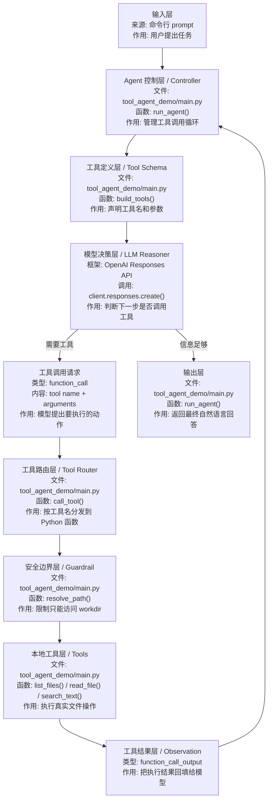

# Tool Calling

## 1. Tool Calling 是什么

`Tool Calling` 可以先理解成：

```text
让模型按固定格式提出“我要调用哪个工具、参数是什么”，再由程序真正执行工具的机制。
```

日语现场可以说成：

```text
ツール呼び出しは、モデルが外部ツールや API を利用するための仕組みです。
```

## 2. 为什么 Tool Calling 很重要

没有工具调用，模型大多只能“说”。

有了工具调用，模型才开始具备“做”的能力，比如：

- 读文件
- 查数据库
- 调 HTTP 接口
- 写报告

但如果按日本现场和派遣案件的优先级来看，`Tool Calling` 通常不是最先要求的能力。

更常见的顺序是：

- 先会模型调用
- 再会结构化输出
- 再会 `RAG`
- 再把这些能力接进系统
- 最后才开始做工具调用和半自动 Agent

## 3. 这一阶段要掌握什么

- 工具接口设计
- 参数 schema
- 工具选择
- 工具结果回填
- 错误处理

## 4. 先把角色分清楚

学习 `Tool Calling` 时，最容易混乱的是：

- 到底是谁在“决定”
- 到底是谁在“执行”
- 工具结果为什么还要再交回模型

可以先按下面这张表理解。先看“是什么”，再看“核心作用”。

| 角色 / 名词 | 日语现场说法 | 是什么 | 核心作用 | 在示例中的位置 |
| --- | --- | --- | --- | --- |
| User | 利用者 / 依頼者 | 提出任务的人或系统 | 给出目标，例如“帮我读 README 并总结” | 命令行参数 `prompt` |
| Model | モデル / LLM | 负责判断和生成内容的大模型 | 判断是否需要工具、选择哪个工具、生成最终回答 | `client.responses.create(...)` |
| Tool | ツール / 外部ツール | 程序提供给模型使用的外部能力 | 真正读取文件、列目录、搜索文本 | `list_files` / `read_file` / `search_text` |
| Tool schema | ツールスキーマ | 工具名称、参数、说明的结构定义 | 告诉模型工具叫什么、需要什么参数 | `build_tools()` |
| Tool call | ツール呼び出し要求 | 模型发出的工具调用请求 | 表示模型决定“我现在要用某个工具” | `response.output` 里的 `function_call` |
| Tool result | ツール実行結果 | 工具执行后的真实结果 | 把文件内容或搜索结果交回模型 | `function_call_output` |
| Agent loop | エージェントループ | 模型判断、工具执行、结果回填的循环 | 多次推进任务，直到得到最终回答 | `run_agent()` |

关键点：

- 模型不直接读你的硬盘。
- 模型只会发出“我要调用哪个工具、参数是什么”的请求。
- Python 程序才是真正执行工具的人。
- 工具结果要回填给模型，模型才能基于真实结果继续回答。

## 5. Tool Calling 的数据流



对应到 `agent-lab/projects/tool_agent_demo/main.py`：

| 顺序 | 框架层 | 文件 / 类 / 函数 | 输入是什么 | 输出是什么 | 作用 |
| --- | --- | --- | --- | --- | --- |
| 1 | 输入层 | `parse_args()` | 命令行任务、模型名、工作目录 | `args.prompt`、`args.model`、`args.workdir` | 接收用户目标 |
| 2 | 基础设施层 | `build_client()` | `OPENAI_API_KEY` | OpenAI client | 创建模型客户端 |
| 3 | Tool Schema 层 | `build_tools()` | Python 工具定义 | `tools` schema | 告诉模型有哪些工具可用 |
| 4 | Agent Controller 层 | `run_agent()` | 用户任务、工具 schema、历史状态 | 下一轮模型输入或最终回答 | 管理循环和状态 |
| 5 | LLM Reasoner 层 | `client.responses.create(...)` | 任务 + 工具说明 + 工具结果 | `function_call` 或回答文本 | 判断是否需要工具 |
| 6 | Tool Router 层 | `call_tool()` | 工具名 + 参数 | 工具执行结果 | 把模型请求分发到实际函数 |
| 7 | Guardrail 层 | `resolve_path()` | `workdir` + 相对路径 | 安全路径或错误 | 防止越界访问文件 |
| 8 | Tools 层 | `list_files()` / `read_file()` / `search_text()` | 路径或关键词 | 文件列表、文件内容、搜索结果 | 执行真实动作 |
| 9 | Observation 层 | `function_call_output` | 工具执行结果 | 回填给模型的 JSON 字符串 | 让模型看到真实结果 |
| 10 | 输出层 | `run_agent()` | 模型最终文本 | 最终回答 | 返回给用户 |

## 6. 推荐先做的工具

- `read_file`
- `list_files`
- `write_file`
- `http_get`
- `search_text`

如果后面偏业务系统，还可以加：

- `query_db`
- `run_sql`
- `call_internal_api`

如果按案件导向，最有价值的往往是：

- `search_internal_docs`
- `query_db`
- `call_internal_api`
- `read_spec_file`

## 7. 怎么判断一个函数适不适合做工具

一个函数适合做工具，通常满足这些条件：

- 输入参数明确：例如 `path`、`query`、`url`
- 输出可以被模型理解：例如 JSON、列表、摘要文本
- 职责单一：只读文件就只读文件，不要顺便搜索和总结
- 有安全边界：文件路径、SQL、HTTP 请求都不能完全放开
- 失败时可解释：返回 `ok: false` 和错误原因，而不是直接让程序崩溃

反过来，如果一个工具“什么都能做”，模型反而更难稳定调用。

## 8. 设计工具时要注意

- 参数要尽量清晰
- 工具职责要单一
- 不要把很多动作塞进一个工具
- 结果要可读、可回填
- 高风险工具要有限制

## 9. 最小学习顺序

建议按这个顺序读代码：

1. 先看 `build_tools()`，理解工具对模型长什么样。
2. 再看 `list_files()` / `read_file()` / `search_text()`，理解真实动作在哪里发生。
3. 再看 `call_tool()`，理解工具名如何分发到 Python 函数。
4. 最后看 `run_agent()`，理解为什么需要循环。

这样读会比一上来从 `main()` 往下硬看更清楚。

## 10. 中文 / 日语对照

| 中文 | 日语 | 日本项目现场常见表达 |
| --- | --- | --- |
| 工具调用 | ツール呼び出し | 外部 API をツールとして呼び出します |
| 工具定义 | ツール定義 | ツール名とパラメータを定義します |
| 参数 schema | パラメータスキーマ | 入力パラメータの型をスキーマで制御します |
| 工具执行结果 | ツール実行結果 | 実行結果をモデルに返します |
| 权限边界 | 権限制御 / 安全制御 | アクセス可能な範囲を制限します |
| 工作目录 | 作業ディレクトリ | 指定された作業ディレクトリ内だけを操作します |

## 11. 完成标志

- 能让模型选择工具
- 能拿工具结果继续推理
- 能完成一个多步任务
- 能解释 schema、tool call、tool result 三者的区别
- 能说清楚为什么要限制 `workdir`

## 12. 常见坑

- 工具太大太杂
- 参数名模糊
- 返回结果太长，污染上下文
- 没有权限边界
- 在还没把 `RAG` 和后端集成做稳之前，过早上复杂 Agent
- 把“模型会调用工具”误解成“模型真的能直接操作系统”
