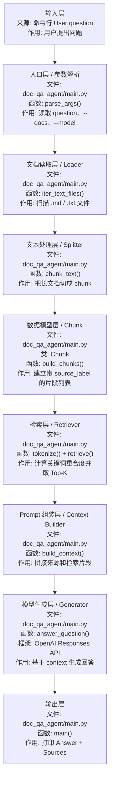

# RAG

## 1. RAG 是什么

`RAG` 是 `Retrieval-Augmented Generation` 的缩写，可以先理解成：

```text
先从外部资料里检索相关内容，再让模型基于这些资料生成回答的技术。
```

日语现场可以说成：

```text
RAG は、社内文書などを検索し、その検索結果に基づいて回答を生成する仕組みです。
```

## 2. 为什么要学 RAG

很多 Agent 不是缺“推理”，而是缺“信息”。

RAG 的核心作用是：

- 给模型补外部知识
- 减少只靠记忆回答的问题
- 提高基于本地资料回答的准确性

如果按日本 IT 现场和派遣案件来看，`RAG` 往往比复杂 Agent 更优先。

因为企业最先落地的通常是：

- 社内搜索
- 文档问答
- 规则和手顺检索
- 业务资料辅助问答

## 3. 这一阶段要掌握什么

- 文本切分
- 向量化
- 检索
- 检索后生成
- 引用来源

## 4. 先把 RAG 的角色分清楚

`RAG` 不是一个单独函数，而是一条处理链。每个角色都很重要。

| 角色 / 名词 | 日语现场说法 | 是什么 | 核心作用 | 在示例中的位置 |
| --- | --- | --- | --- | --- |
| Document | 文書 / ドキュメント | 被检索的原始资料 | 提供企业制度、设计书、FAQ 等知识来源 | `--docs` 指定的目录 |
| Loader | ローダー / 読み込み処理 | 读取文档的程序模块 | 找到并读取可用文件 | `iter_text_files()` |
| Chunk | チャンク / 分割片 | 文档切分后的小片段 | 作为检索和引用的最小单位 | `Chunk` dataclass |
| Splitter | 分割処理 / スプリッター | 把长文档切成片段的模块 | 控制检索粒度，避免上下文过长 | `chunk_text()` |
| Retriever | 検索器 / リトリーバー | 从片段中找相关内容的模块 | 根据问题挑出最相关片段 | `retrieve()` |
| Top-K | 上位 K 件 | 检索排名前 K 个结果 | 控制送给模型的片段数量 | `TOP_K` |
| Context | コンテキスト / 検索結果コンテキスト | 拼给模型看的资料上下文 | 把命中的片段整理成模型输入 | `build_context()` |
| Generator | 生成器 / 回答生成 | 调用模型生成回答的模块 | 基于上下文生成最终回答 | `answer_question()` |
| Source | 出典 / 参照元 | 答案依据的来源信息 | 告诉用户答案来自哪个文件片段 | `source_label` |

一句话理解：

- `RAG` 的重点不是“模型自己知道”，而是“系统先找到资料，再让模型基于资料回答”。

## 5. RAG 的系统数据流



按照框架分层理解，`RAG` 可以看成：

```text
输入层 -> 文档读取层 -> 文本处理层 -> 检索层 -> Prompt 组装层 -> 模型生成层 -> 输出层
```

对应到 `agent-lab/projects/doc_qa_agent/main.py`：

| 顺序 | 框架层 | 文件 / 类 / 函数 | 输入是什么 | 输出是什么 | 作用 |
| --- | --- | --- | --- | --- | --- |
| 1 | 输入层 | 命令行参数 -> `parse_args()` | 用户问题、文档目录、模型名 | `args.question`、`args.docs`、`args.model` | 接收用户请求 |
| 2 | 文档读取层 / Loader | `main.py` -> `iter_text_files()` | `--docs` 目录 | 文件路径列表 | 找到可读取的 `.md` / `.txt` |
| 3 | 文本处理层 / Splitter | `main.py` -> `chunk_text()` | 单个文档文本 | 文本片段列表 | 把长文档切成适合检索的小块 |
| 4 | 数据模型层 | `Chunk` 类 + `build_chunks()` | 文件路径和文本片段 | `list[Chunk]` | 给每个片段加 `source_label` 和 `content` |
| 5 | 检索准备层 | `tokenize()` | 用户问题和 chunk 内容 | 词集合 | 为关键词匹配做准备 |
| 6 | 检索层 / Retriever | `retrieve()` | `question` + `list[Chunk]` | Top-K `Chunk` | 选出最相关的资料片段 |
| 7 | Prompt 组装层 | `build_context()` | Top-K `Chunk` | `Retrieved context` 字符串 | 把来源和片段内容整理成模型输入 |
| 8 | 模型生成层 | `answer_question()` + OpenAI Responses API | `question` + `context` | 模型回答文本 | 要求模型只基于检索上下文回答 |
| 9 | 输出层 | `main()` | 回答文本 + Top-K `Chunk` | `Answer` + `Sources` | 打印最终回答和引用来源 |

如果换成企业系统或 Web API，分层名字通常会变成：

| 学习 demo 层 | 企业 / Web 系统常见层 | 说明 |
| --- | --- | --- |
| `parse_args()` 输入层 | Controller / API 层 | 接收前端或外部系统的问题 |
| `iter_text_files()` / `chunk_text()` | Document Service 层 | 负责文档读取、解析、切分 |
| `retrieve()` | Search / Retrieval Service 层 | 负责检索和排序 |
| `build_context()` | Prompt Service 层 | 负责构造给模型的上下文 |
| `answer_question()` | LLM Service 层 | 负责调用模型生成回答 |
| `main()` 输出层 | Response DTO / View 层 | 返回答案和来源列表 |

## 6. 典型场景

- 文档问答
- 项目知识库
- FAQ
- 设计书检索
- 代码文档辅助

在日本现场，这些场景尤其常见：

- 社内規程検索
- 手順書検索
- 障害対応ナレッジ検索
- 設計書検索
- FAQ ボット

## 7. 为什么先用关键词检索也有价值

正式项目常会用：

- embeddings
- vector database
- hybrid search
- reranker

但学习时先用关键词检索很有价值，因为它能让你看清楚主线：

1. 问题先进系统。
2. 系统先找资料。
3. 只把少量相关资料送给模型。
4. 模型基于资料回答。
5. 答案带来源。

如果这个链路还说不清楚，直接上向量库会变成只记工具名。

## 8. 推荐练习

- 选一个本地文档目录
- 先做最简单的文本切分和关键词检索
- 再做向量检索
- 回答时带出处

如果按案件导向，建议优先做：

- 本地 Markdown / PDF 文档问答
- 带出处的社内知识检索 demo
- `FastAPI` 包装后的 RAG API

## 9. 中文 / 日语对照

| 中文 | 日语 | 日本项目现场常见表达 |
| --- | --- | --- |
| 检索增强生成 | 検索拡張生成 / RAG | RAG で社内文書検索と回答生成を行います |
| 社内文档检索 | 社内文書検索 | 社内規程や手順書を検索対象にします |
| 文档切分 | 文書分割 / チャンク化 | 文書をチャンク単位に分割します |
| 向量检索 | ベクトル検索 | Embedding を使って類似文書を検索します |
| 关键词检索 | キーワード検索 | まずはキーワード検索で PoC を作ります |
| 来源引用 | 出典表示 / 参照元表示 | 回答に参照元を付けます |
| 资料不足 | 情報不足 | 検索結果が不十分な場合は回答できないと返します |

## 10. 完成标志

- 能基于本地文档回答问题
- 能指出答案来自哪些文档
- 能区分“没找到”与“猜出来”
- 能解释 `chunk`、`retriever`、`context`、`source` 的作用
- 能说清楚 `TOP_K` 调大或调小会发生什么

## 11. 常见坑

- 切分太粗或太碎
- 检索结果不相关
- 没有引用来源
- 找不到时还硬答
- 只做聊天页面，不做检索质量和引用验证
- 把最终回答当成唯一结果，不看命中的片段是否正确
