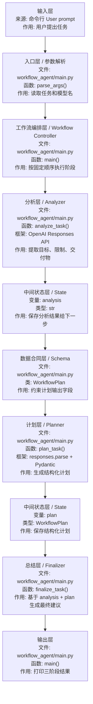

# Agent 工作流

## 1. Agent 工作流是什么

`Agent 工作流` 可以先理解成：

```text
把一个 Agent 任务拆成多个可观察、可控制、可验证的处理步骤。
```

它属于 `Agent 编排框架 / Workflow Orchestration`，重点不是让模型完全自由行动，而是把任务拆成稳定、可测试的阶段。

在项目里，`Agent 工作流` 通常属于：

| 分类 | 说明 |
| --- | --- |
| 技术类型 | Agent 编排、工作流控制、多步骤 LLM 应用 |
| 系统层次 | Workflow Controller 层 + State 层 + Planner 层 + Executor 层 |
| 常见框架或模式 | LangGraph、CrewAI、AutoGen、Planner-Executor、Reviewer |
| 日本现场说法 | `Agent ワークフロー`, `業務フロー自動化`, `タスク分解` |

日语现场可以说成：

```text
Agent ワークフローは、AI エージェントの処理を複数ステップに分けて制御する仕組みです。
```

## 2. Agent 不只是调用模型

一个真正可用的 Agent，通常至少包含这些部分：

- 输入理解
- 任务拆解
- 工具调用
- 状态记录
- 结果验证
- 结束判断

但如果按日本现场真实需求来看，Agent 工作流更像是中后阶段能力，不是第一优先级。

更贴近实际的顺序通常是：

- 先做 `RAG`
- 再做业务助手
- 再把部分动作 Agent 化

## 2.1 先用一个具体场景理解

假设用户提出这个任务：

```text
帮我规划一个社内搜索 Agent 的实现方案。
```

如果只做一次模型调用，模型可能直接写一段建议。但你很难看出：

- 它是否理解了目标
- 它是否考虑了限制
- 它的计划是否结构稳定
- 它最后的建议是基于什么中间结果

所以本章的 `workflow_agent` 把任务拆成 3 个阶段：

```text
分析任务 -> 生成结构化计划 -> 输出最终建议
```

对应到代码：

| 阶段 | 函数 | 做什么 |
| --- | --- | --- |
| 分析 | `analyze_task()` | 提取目标、限制、交付物 |
| 计划 | `plan_task()` | 用 `WorkflowPlan` 生成结构化计划 |
| 总结 | `finalize_task()` | 基于分析和计划输出最终建议 |

本章对应的 demo 是：

| 文件 | 看什么 |
| --- | --- |
| [projects/workflow_agent/README.md](./projects/workflow_agent/README.md) | 怎么运行工作流 Agent |
| [projects/workflow_agent/main.py](./projects/workflow_agent/main.py) | 三阶段模型调用和中间状态传递 |

## 3. 单 Agent 的基础结构

可以先把最小结构理解成：

1. 读取用户目标
2. 判断下一步
3. 调用工具
4. 读取结果
5. 再决定下一步
6. 达到目标后结束

在当前 `workflow_agent` demo 中，它还不是“完全自主循环型 Agent”，而是更适合初学者的固定工作流：

```text
用户任务
  -> analyze_task()
  -> plan_task()
  -> finalize_task()
  -> 打印三阶段结果
```

这种写法更容易调试，也更贴近日本现场早期 PoC：先把流程固定清楚，再逐步增加工具调用和自动判断。

## 4. 先把工作流里的角色分清楚

`Agent 工作流` 不一定等于“模型自己无限循环”。更稳的做法，是把任务拆成几个明确阶段。

| 角色 / 名词 | 日语现场说法 | 是什么 | 核心作用 | 在示例中的位置 |
| --- | --- | --- | --- | --- |
| Workflow | ワークフロー | 固定步骤组成的处理流程 | 把复杂任务拆成几个稳定步骤 | `main()` 中的三阶段执行 |
| Analyzer | 分析担当 / 解析処理 | 负责理解输入任务的阶段 | 先理解用户目标、限制、交付物 | `analyze_task()` |
| Planner | プランナー / 計画担当 | 负责生成计划的阶段 | 把分析结果转成结构化计划 | `plan_task()` |
| Schema | スキーマ / データ定義 | 输出数据结构的约束 | 限定计划必须有哪些字段 | `WorkflowPlan` |
| Executor | 実行担当 / 実行器 | 负责执行动作的模块 | 在完整系统中调用工具或 API | 当前示例暂未展开 |
| Finalizer | 最終出力生成 / まとめ処理 | 负责生成最终结果的阶段 | 把分析和计划合并成最终建议 | `finalize_task()` |
| State | 状態 / 中間状態 | 每一步产生并传递的数据 | 让下一步基于前一步结果继续处理 | `analysis`、`plan` |
| Termination | 終了条件 | 判断流程何时结束的规则 | 防止流程无限继续 | 三阶段完成后结束 |

核心理解：

- 工作流是“受控的多步骤处理”。
- Agent loop 是“模型根据状态多次决定下一步”。
- 初学阶段先掌握工作流，比直接做完全自主 Agent 更稳。

## 5. workflow_agent 的数据流



对应到 `agent-lab/projects/workflow_agent/main.py`：

| 顺序 | 框架层 | 文件 / 类 / 函数 | 输入是什么 | 输出是什么 | 作用 |
| --- | --- | --- | --- | --- | --- |
| 1 | 输入层 | `parse_args()` | 命令行任务和模型名 | `args.prompt`、`args.model` | 接收用户任务 |
| 2 | 基础设施层 | `build_client()` | `OPENAI_API_KEY` | OpenAI client | 创建模型客户端 |
| 3 | Workflow Controller 层 | `main()` | 用户任务、client、model | 每个阶段的中间状态 | 编排三个固定阶段 |
| 4 | Analyzer 层 | `analyze_task()` | 原始用户任务 | `analysis: str` | 分析目标、限制、交付物 |
| 5 | Schema 层 | `WorkflowPlan` 类 | 计划字段定义 | Pydantic schema | 规定计划必须有哪些字段 |
| 6 | Planner 层 | `plan_task()` | `analysis` | `plan: WorkflowPlan` | 生成结构化执行计划 |
| 7 | State 层 | `analysis` / `plan` 变量 | 每阶段输出 | 下一阶段输入 | 保存并传递中间结果 |
| 8 | Finalizer 层 | `finalize_task()` | `analysis` + `plan` | 最终建议文本 | 汇总前两步结果 |
| 9 | 输出层 | `main()` | 三阶段结果 | 控制台输出 | 展示工作流全过程 |

## 6. 这一阶段要补的能力

这一阶段学的是 `可控 Agent 工作流的核心功能`。

核心功能先看“是什么”：

| 核心功能 | 这是什么知识 | 在系统里的位置 |
| --- | --- | --- |
| 计划和执行分离 | Planner-Executor Pattern | 工作流设计层 |
| 重试机制 | Retry / Recovery | 稳定性层 |
| 中间状态记录 | State Management | 状态层 |
| 终止条件 | Termination Condition | 流程控制层 |
| 失败处理 | Error Handling | 运维与安全层 |

- 计划和执行分离
- 重试机制
- 中间状态记录
- 终止条件
- 失败处理

## 7. 推荐模式

### Planner + Executor

- Planner 负责拆任务
- Executor 负责做动作

### Planner + Worker + Reviewer

- Planner 拆任务
- Worker 执行
- Reviewer 检查结果

### Analyzer + Planner + Finalizer

这是当前 `workflow_agent` 使用的模式：

- Analyzer 先把用户需求整理清楚
- Planner 把分析结果变成结构化计划
- Finalizer 基于前两步输出最终建议

初学阶段推荐先掌握这个模式，因为它最容易看清楚“每一步输入是什么、输出是什么”。

## 8. Workflow 和 Agent 的区别

| 对比点 | Workflow | Agent |
| --- | --- | --- |
| 下一步由谁决定 | 程序预先写好 | 模型根据当前状态判断 |
| 稳定性 | 更高 | 取决于工具、提示词、终止条件 |
| 可解释性 | 比较容易解释 | 需要记录每一步工具调用和观察结果 |
| 适合场景 | 固定业务流程、审批、报告生成 | 信息不足、路径不固定、多工具探索 |
| 初学建议 | 先学 | 后学 |

可以先把 `workflow_agent` 理解成：

- 不追求“模型完全自主”
- 先把多阶段 LLM 应用写得清楚、可控、可测试

## 9. 什么时候需要多 Agent

只有当任务明显复杂、职责明显不同的时候再考虑多 Agent。

如果只是简单任务，单 Agent 往往更稳。

按案件导向也一样：

- 单 Agent 比多 Agent 更容易落地
- 半自动 Agent 比全自动 Agent 更容易上线

## 10. 中文 / 日语对照

| 中文 | 日语 | 日本项目现场常见表达 |
| --- | --- | --- |
| Agent 工作流 | Agent ワークフロー | Agent の処理をワークフロー化します |
| 任务分析 | タスク分析 | ユーザー依頼の目的と制約を整理します |
| 计划生成 | 計画生成 | 実行計画を構造化して生成します |
| 中间状态 | 中間状態 | 前ステップの結果を次ステップに渡します |
| 终止条件 | 終了条件 | 処理を終了する条件を明確にします |
| 固定流程 | 固定フロー | まずは固定フローで安定させます |
| 多 Agent | マルチエージェント | 役割ごとに複数の Agent を分けます |

## 11. 完成标志

- 能完成一个多步任务
- 失败后能重试
- 结果不合理时能发现问题
- 能解释 `Analyzer`、`Planner`、`Finalizer` 各自职责
- 能说明中间状态为什么要保留下来

另外，还要能根据输出反推流程：

| 输出区块 | 来自哪里 | 说明 |
| --- | --- | --- |
| `Step 1: Analysis` | `analyze_task()` | 模型对用户任务的理解 |
| `Step 2: Plan` | `plan_task()` + `WorkflowPlan` | 结构化计划，适合后续程序处理 |
| `Step 3: Final Summary` | `finalize_task()` | 给用户看的最终建议 |

## 12. 常见坑

- 没有终止条件，死循环
- 工具调用过多，成本失控
- 状态太乱，前后矛盾
- 多 Agent 之间重复工作
- 在还没有稳定业务场景时，过度设计多 Agent 架构
- 把所有事情都交给一次模型调用，导致过程不可观察、不可调试
