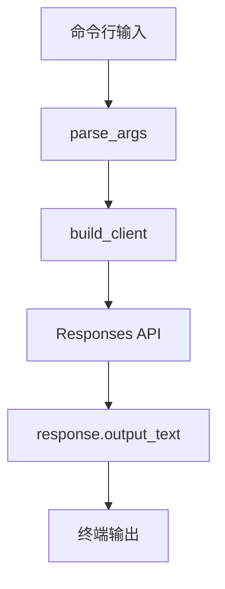

# chat_cli

最小可运行的大模型命令行对话示例。

这个样例只做一件事：

- 从命令行读取用户输入
- 调用模型
- 把回答打印到终端

它故意保持简单，目的是给后面的：

- 结构化输出
- Tool Calling
- RAG
- Agent 工作流

做基础。

如果按日本现场和派遣案件来看，这个样例对应的是最基础的“会调模型 API”能力，本身还不构成项目交付物，但它是后面做 `RAG` 和业务接口整合的起点。

## 1. 前置条件

- Python 3.10+
- 已安装依赖
- 已配置 `OPENAI_API_KEY`

## 2. 安装依赖

```bash
pip install -r requirements.txt
```

## 3. 配置环境变量

Windows PowerShell:

```powershell
$env:OPENAI_API_KEY="your_api_key"
```

Windows CMD:

```cmd
set OPENAI_API_KEY=your_api_key
```

macOS / Linux:

```bash
export OPENAI_API_KEY="your_api_key"
```

## 4. 运行方式

直接传入一句话：

```bash
python main.py "用一句话解释什么是 agent"
```

进入交互模式：

```bash
python main.py
```

指定模型：

```bash
python main.py --model gpt-5 "给我一个三步学习计划"
```

## 5. 代码说明

- 使用官方 `openai` Python SDK
- 使用官方推荐的 `Responses API`
- 默认从 `OPENAI_API_KEY` 读取密钥
- 默认模型为 `gpt-5`

## 6. 代码分层导读

| 文件 / 函数 | 层次 | 作用 | 学习重点 |
| --- | --- | --- | --- |
| `main.py` | 程序入口 | 把命令行参数、模型调用和输出串起来 | 先从这里理解整体流程 |
| `parse_args()` | 输入层 | 读取用户问题、模型名和交互模式 | 命令行工具如何接收输入 |
| `build_client()` | 基础设施层 | 读取 `OPENAI_API_KEY` 并创建客户端 | 密钥不要写死在代码里 |
| `ask_once()` | 模型调用层 | 调用 `client.responses.create(...)` | `model`、`instructions`、`input` 的关系 |
| `run_interactive()` | 控制层 | 支持用户连续提问 | 多轮程序控制和退出条件 |

这个 demo 的学习目标不是“做一个完整聊天产品”，而是先看懂最小闭环：



## 7. 关键名词理解

| 名词 | 概念理解 | 在本 demo 中的作用 |
| --- | --- | --- |
| API Key | 调用模型服务的身份凭证 | 程序启动时从环境变量读取 |
| Client | API 调用代理对象 | 负责把请求发给模型服务 |
| Model | 生成回答的模型 | 由 `--model` 或默认值指定 |
| Instructions | 给模型的行为规则 | 控制回答风格和边界 |
| Input | 用户这次真正的问题 | 从命令行或交互模式读取 |
| Output | 模型返回的结果 | 打印到终端 |

## 8. 建议你怎么读这个项目

1. 先运行一次固定问题，确认环境没问题。
2. 再改 `instructions`，观察回答风格变化。
3. 再改默认模型名，理解配置项不要写死。
4. 最后读交互模式，理解为什么程序需要退出条件。

## 9. 下一步建议

这个样例跑通后，下一步最适合继续做：

1. 增加 JSON 结构化输出
2. 做需求整理或摘要输出
3. 再进入 `RAG` 或本地资料问答
