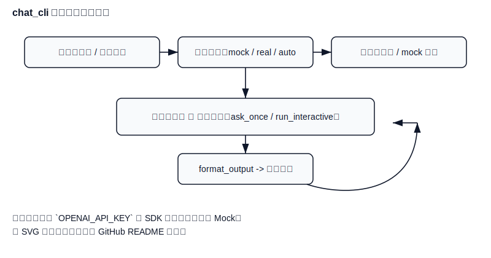

# chat_cli 处理流程图

下面是 `main.py` 的处理流程图（Mermaid 格式），可在支持 Mermaid 的渲染器中直接预览。

为了在仓库页面上像 `README` 一样直接看到流程图，文档顶部先展示静态 SVG（优先渲染），下方保留原始 Mermaid 源以便编辑维护：


---

## 学习闭环（简化）

下面是与 `README` 中相同的简化学习闭环图，放在详细流程图下方以便快速理解整体流程：



说明：简化图展示参数解析 → 模式决策 → 一次性/交互调用 → 输出 的核心闭环，适合快速浏览。

下面是 `main.py` 的处理流程（Mermaid 源，供可编辑预览用）：

```mermaid
flowchart TD
	Start([命令行启动]) --> Parse[parse_args()]
	Parse --> Decide{模式决策 ( --mock / --real / 自动 )}

	Decide -->|强制 mock| UseMockTrue[use_mock = true]
	Decide -->|强制 real| UseMockFalse[use_mock = false]
	Decide -->|自动| AutoCheck[检测 OPENAI_API_KEY 与 SDK]

	AutoCheck -->|无 KEY 或 无 SDK| UseMockTrue
	AutoCheck -->|有 KEY 且 有 SDK| UseMockFalse

	UseMockTrue --> BuildMock[生成 mock 回答]
	UseMockFalse --> BuildClient[构建客户端并读取 OPENAI_API_KEY]

	Parse --> HasPrompt{提供一次性 prompt?}
	HasPrompt -->|是| OneShot[一次性调用流程]
	HasPrompt -->|否| Interactive[交互模式 run_interactive]

	OneShot -->|mock| BuildMock
	OneShot -->|real| AskOnceReal[ask_once 调用]

	Interactive --> LoopStart[(交互循环)]
	LoopStart -->|每次输入| AskOnceLoop[ask_once 调用]
	AskOnceLoop -->|mock| BuildMock
	AskOnceLoop -->|real| AskOnceReal

	BuildMock --> FormatMock[format_output -> 终端输出]
	AskOnceReal --> FormatReal[format_output -> 终端输出]

	FormatMock --> Output[输出到终端]
	FormatReal --> Output

	%% 错误处理路径
	AskOnceReal -.->|请求异常| ErrorHandler[打印错误; 一次性退出 | 交互继续]
	AskOnceLoop -.->|请求异常| LoopContinue[打印错误并返回循环]

	%% 终止
	Output --> End([结束或等待下一次输入])
```

说明：若平台不支持 SVG 渲染，仓库 CI 会生成 `docs/flowchart.png`（回退），文档中也会显示该 PNG（若存在）。

如何在本地渲染此 Mermaid 图：

- 推荐（VS Code）：安装 `Markdown Preview Mermaid Support` 或 使用内置的 Mermaid 渲染扩展，在打开此文件或项目的 README 时即可看到图形。
- 使用 `mmdc` (mermaid-cli) 渲染为图片：

```bash
# 安装（需要 Node.js + npm）
npm install -g @mermaid-js/mermaid-cli

# 从文件渲染为 PNG
mmdc -i docs/flowchart.md -o docs/flowchart.png

# 或直接渲染内嵌的 Mermaid 片段（用临时 mermaid 文件）
```

注意：CI 或 GitHub 的 README 渲染页面在某些地方不直接渲染 Mermaid，建议同时保留一个 PNG/SVG 版本以便在不支持 Mermaid 的平台也能查看。

如果你希望我现在生成并添加 PNG/SVG（需要在 runner 或你本地安装 `mmdc`），我可以继续执行；否则我会把这个文档作为独立说明提交。 
