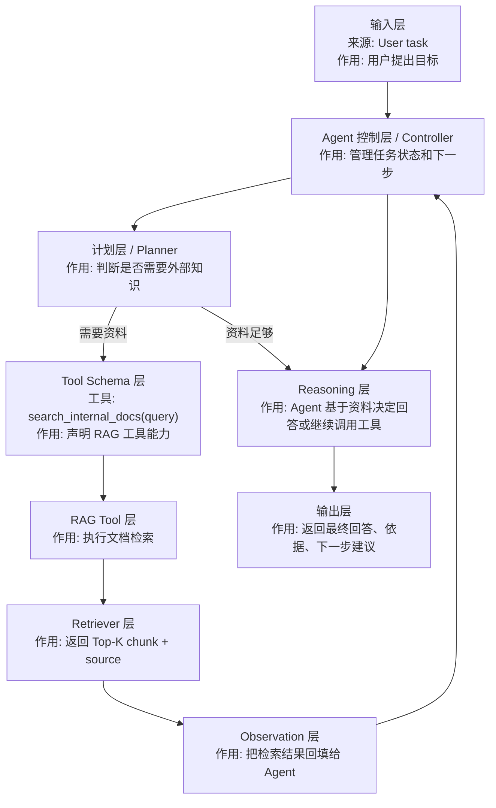

# Agent 中的 RAG

> 归位说明：RAG 的基础概念、文档读取、切分、检索、引用和最小代码教程，统一看 [llm-lab/04-RAG.md](../llm-lab/04-RAG.md)。本文件只讲 `Agent` 视角下的 RAG：Agent 为什么需要 RAG、RAG 在 Agent 里扮演什么角色、怎么和 Tool Calling / Workflow 组合。

## 1. Agent 中的 RAG 是什么

`Agent 中的 RAG` 不是重新学习一遍 RAG 基础，而是把 RAG 当成 Agent 的一个 `知识工具 / Knowledge Tool`。

可以先这样理解：

```text
普通 RAG：用户提问 -> 系统检索资料 -> 模型基于资料回答
Agent 中的 RAG：Agent 判断需要资料 -> 调用 RAG 工具检索 -> 根据检索结果决定下一步
```

在 Agent 系统里，RAG 通常属于：

| 分类 | 说明 |
| --- | --- |
| 技术类型 | Agent 知识工具、社内资料检索能力 |
| 系统层次 | Tool 层 / Knowledge Retrieval 层 |
| 连接对象 | Tool Calling、Agent Workflow、Planner、Executor |
| 日本现场说法 | `RAG ツール`, `社内検索ツール`, `ナレッジ検索`, `情報取得処理` |

一句话先记住：

- `llm-lab/04-RAG.md` 学“怎么做 RAG”，本文件学“Agent 怎么使用 RAG”。

## 2. 为什么 Agent 需要 RAG

很多 Agent 失败，不是因为模型不会推理，而是因为它没有可靠资料。

Agent 如果只靠模型已有知识，容易出现：

- 不知道公司内部规则
- 不知道项目最新资料
- 不知道 API 规格和限制
- 看起来回答流畅，但没有依据

RAG 给 Agent 补的是 `可查询的外部知识`。

在日本现场，最常见的关系通常是：

```text
社内文書 / 規程 / 手順書
  -> RAG / 社内検索
  -> 業務補助 Agent
  -> 人が確認して実行
```

所以学习顺序上，先会做 RAG，再把 RAG 接成 Agent 工具，会比一开始做复杂多 Agent 更稳。

## 3. 和 llm-lab/04-RAG.md 的分工

| 文件 | 负责什么 | 不负责什么 |
| --- | --- | --- |
| [llm-lab/04-RAG.md](../llm-lab/04-RAG.md) | RAG 基础、最小流程、代码示例、文档读取、切分、检索、引用 | 不重点讲 Agent 决策循环 |
| 本文件 | RAG 在 Agent 中的角色、何时调用 RAG、如何作为 Tool、如何进入 Workflow | 不重复讲完整 RAG 基础教程 |

如果你还不清楚：

- `Chunk` 是什么
- `Retriever` 是什么
- `Top-K` 是什么
- 为什么答案要带来源

先回到 [llm-lab/04-RAG.md](../llm-lab/04-RAG.md)。

## 4. Agent + RAG 的角色分工

先看“是什么”，再看“作用”：

| 角色 / 名词 | 日本語 / 现场说法 | 是什么 | 在 Agent 中的作用 | 对应位置 |
| --- | --- | --- | --- | --- |
| User | 利用者 / 依頼者 | 提出任务的人 | 给 Agent 一个目标或问题 | 命令行 prompt / Web 请求 |
| Agent Controller | エージェント制御 | 管理任务推进的控制层 | 判断下一步是否需要查资料、调用工具或输出答案 | `run_agent()` / workflow controller |
| Planner | 計画担当 | 任务拆解角色 | 判断“先查资料再回答”还是“直接回答” | `plan_task()` |
| RAG Tool | RAG ツール / 社内検索ツール | 被 Agent 调用的知识检索工具 | 根据 query 返回相关片段和来源 | `search_internal_docs()` |
| Retriever | 検索器 | RAG 内部检索模块 | 从文档库找 Top-K 片段 | `retrieve()` |
| Observation | 観測結果 / ツール結果 | 工具返回给 Agent 的结果 | 让 Agent 看见真实资料后继续判断 | `function_call_output` |
| Final Answer | 最終回答 | Agent 给用户的最终输出 | 基于资料和任务目标输出回答 | 控制台 / API response |

核心区别：

- 普通 RAG 的主角是 `检索 + 回答`。
- Agent + RAG 的主角是 `判断是否需要检索 + 调用检索工具 + 基于结果继续行动`。

## 5. Agent + RAG 数据流



## 6. 和 Tool Calling 的关系

RAG 在 Agent 里通常会包装成一个 Tool。

例如工具可以设计成：

```python
def search_internal_docs(query: str, top_k: int = 5) -> dict:
    """Search internal documents and return relevant chunks with sources."""
```

它的输入输出要尽量稳定：

| 项目 | 说明 |
| --- | --- |
| 输入 | 用户问题、检索关键词、Top-K |
| 输出 | 命中的文档片段、来源文件、相似度或得分 |
| 失败时 | 返回空结果或错误原因，不要让 Agent 猜 |
| 安全边界 | 限制只能查允许访问的文档目录或索引 |

Tool Calling 负责：

- 让模型提出“我要查资料”
- 把 query 参数传给 RAG 工具
- 把 RAG 工具结果回填给模型

RAG 负责：

- 真实检索资料
- 返回相关片段
- 提供来源依据

## 7. 和 Agent Workflow 的关系

在可控 Agent 里，不建议让模型随便无限调用 RAG。

更稳的方式是固定工作流：

```text
分析任务 -> 判断需要哪些资料 -> 调用 RAG -> 整理证据 -> 生成回答 -> 人工确认
```

对应到工作流角色：

| 工作流阶段 | RAG 的位置 | 说明 |
| --- | --- | --- |
| Analyzer | 判断是否需要资料 | 如果问题涉及社内规则、设计书、FAQ，就需要 RAG |
| Planner | 生成检索计划 | 决定查哪些关键词、查几次、Top-K 多少 |
| Executor | 调用 RAG 工具 | 执行检索并拿到 source |
| Reviewer | 检查依据 | 判断答案是否真的基于检索结果 |
| Finalizer | 输出最终结果 | 给用户回答，同时标注来源和不足 |

## 8. 推荐练习

不要在这里重新做 RAG 基础，而是把已有 RAG 能力接进 Agent。

练习顺序：

1. 跑通 [ai-lab/agent-lab/projects/doc_qa_agent](./projects/doc_qa_agent/README.md)。
2. 跑通 [ai-lab/agent-lab/projects/tool_agent_demo](./projects/tool_agent_demo/README.md)。
3. 把 `retrieve()` 包装成一个只读工具，例如 `search_docs`。
4. 让 Agent 在回答前先判断是否需要调用 `search_docs`。
5. 最终回答必须包含 `Sources`，没有资料时明确说资料不足。

最小目标：

```text
用户问一个项目资料问题
  -> Agent 判断需要查文档
  -> 调用 search_docs
  -> 得到 chunk + source
  -> 基于资料回答
  -> 输出来源
```

## 9. 日本现场表达

| 中文 | 日本語 | 现场表达 |
| --- | --- | --- |
| RAG 工具 | RAG ツール | Agent から RAG ツールを呼び出します |
| 社内搜索工具 | 社内検索ツール | 社内文書を検索するツールとして利用します |
| 检索结果 | 検索結果 | 検索結果を Agent の判断材料にします |
| 工具结果回填 | ツール結果の返却 | RAG の結果をモデルに返します |
| 基于依据回答 | 根拠に基づく回答 | 出典に基づいて回答します |
| 人工确认 | 人手確認 | 最終実行前に人が確認します |

面试或现场可以这样说：

```text
RAG 自体は社内文書検索の仕組みですが、Agent ではそれを外部ツールとして扱います。Agent が必要に応じて RAG ツールを呼び出し、検索結果と引用元を使って次の判断や最終回答を行います。
```

## 10. 完成标志

学完本文件，不是看你会不会解释 RAG 基础，而是看你能不能说明：

- Agent 为什么需要 RAG
- RAG 在 Agent 里是 Tool 还是主流程
- Agent 什么时候该调用 RAG
- RAG 工具应该返回什么结果
- 为什么最终回答必须保留来源
- 为什么没有资料时不能让 Agent 猜

## 11. 常见坑

- 在 Agent 文档里重复学习 RAG 基础，却没有理解“RAG 作为工具”的位置。
- 让 Agent 每一步都查资料，导致成本和延迟上升。
- RAG 工具只返回文本，不返回来源。
- 检索结果不足时，Agent 仍然强行回答。
- 没有权限边界，Agent 可以查不该查的资料。
- 没有人工确认，把检索结果直接用于高风险业务动作。
