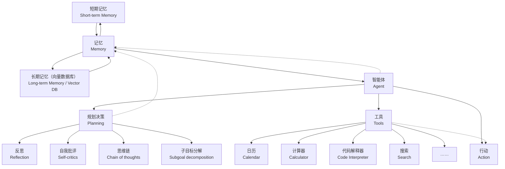
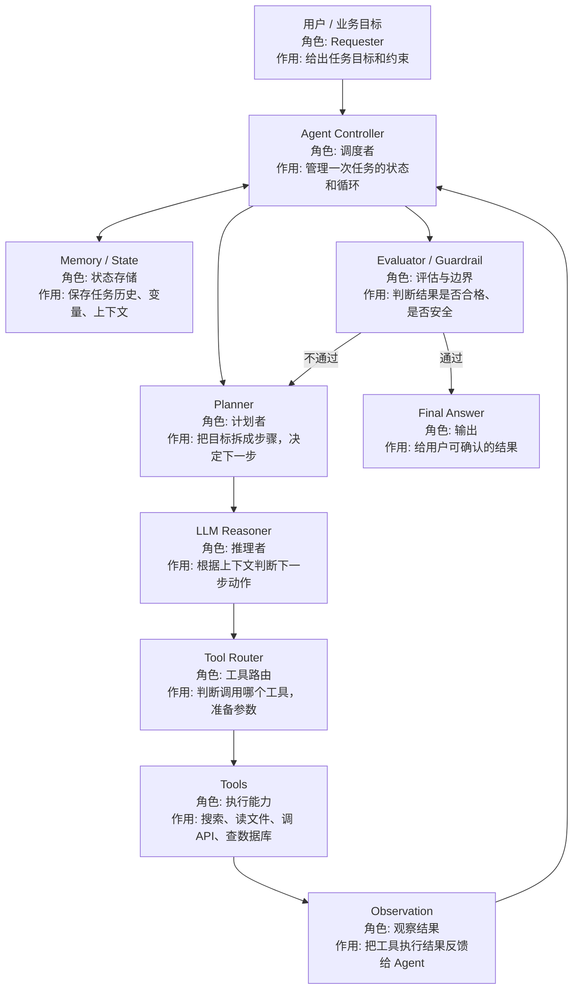
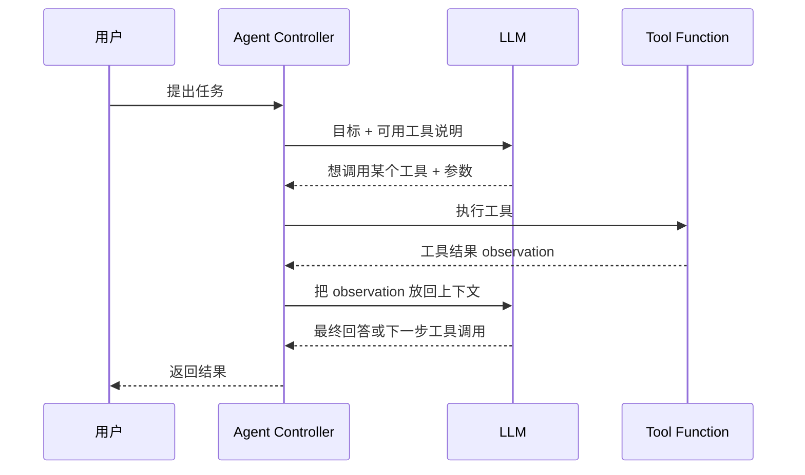

# Agent 系统框架与术语

这份文档用于补齐 `agent-lab` 的系统知识。它回答的是：

> Agent 到底是什么？Agent 里“角色、工具、记忆、计划、工作流、执行器”分别是什么，负责什么？

## 1. Agent 是什么

Agent 可以先理解成：

```text
一个会根据目标，自主决定下一步，并可能调用工具完成任务的 LLM 应用系统
```

它和普通聊天机器人的区别不是“用了更高级模型”，而是多了：

- 目标
- 状态
- 工具
- 步骤
- 观察结果
- 重试和终止条件

## 1.1 用一个业务场景理解 Agent

假设日本现场有一个需求：

```text
用户输入“帮我确认 API 失败时的处理流程，并整理成任务清单”。
```

普通聊天模型可能直接回答一段说明。

Agent 更像这样工作：

```text
1. 理解用户目标：确认 API 失败处理流程
2. 判断需要资料：需要查设计书或手顺书
3. 调用工具：搜索文档、读取文件
4. 观察结果：拿到相关文档片段
5. 生成计划：整理处理步骤和注意点
6. 输出结果：回答 + 来源 + 后续任务清单
```

所以 Agent 不是“更会聊天的模型”，而是一个把模型、工具、状态和流程组合起来的应用系统。

如果你想先看一张把 RAG 讲清楚的图，直接看 [04-RAG.md](./04-RAG.md) 里的流程图；它把 `知识更新` 和 `知识检索` 分成了两条线，适合先建立整体印象。

## 1.2 经典 Agent 架构图

下面这张图可以直接用来理解一个典型 Agent 的组成。它表达的不是某一个固定框架，而是一种常见的学习视角：

```text
Agent = LLM + Memory + Tools + Planning + Action
```

其中：

- `LLM` 是核心推理引擎
- `Memory` 负责保存短期上下文和长期知识
- `Tools` 负责连接日历、搜索、计算器、代码执行器等外部能力
- `Planning` 负责拆解任务、决定下一步
- `Action` 负责把决定真正执行出去
- `Reflection`、`Self-critics`、`Chain of thoughts`、`Subgoal decomposition` 是常见的增强思路，不是所有 Agent 都必须同时具备



原图也放在仓库里，方便直接对照：


读这张图时，建议按下面的顺序理解：

1. `Agent` 先接收任务。
2. `Planning` 决定下一步要做什么。
3. `Tools` 把计划变成真实动作，例如搜索、计算、查日历。
4. `Action` 执行动作后得到结果。
5. `Memory` 把结果保存下来，供后续步骤继续使用。
6. `Reflection` 负责检查结果是否合理，必要时重新规划。

如果用“去北京旅游”来理解，可以这样对应：

| 图里的部分 | 旅游场景里的作用 | 例子 |
| --- | --- | --- |
| `Agent` | 总协调者 | 你让系统帮你安排一次北京旅行 |
| `Planning` | 先排路线和预算 | 先决定住哪、先去哪个景点、怎么省时间 |
| `Memory` | 记住已确认信息 | 记住“3 天、预算 3000、想看故宫” |
| `Tools` | 调用外部能力 | 查天气、查车次、查地图、订酒店 |
| `Action` | 真的执行动作 | 把查到的信息写进计划，或者去下单 |
| `Reflection` | 检查是否合理 | 发现景点安排太赶，就重新调整顺序 |

如果把整个流程按顺序跑一遍，可以理解成：

```text
1. 你说“帮我安排北京旅行”
2. Agent 先判断你要什么、有什么限制
3. Memory 记录预算、天数、偏好
4. Planning 生成旅行路线和执行顺序
5. Tools 去查天气、地图、车次、酒店
6. Action 根据工具结果更新计划或执行下单
7. Reflection 检查是否太赶、是否超预算
8. 如果有问题，就回到 Planning 重新调整
```

这张图和本目录的 demo 对应关系很直接：

| 图中的能力 | 对应 demo / 文档 | 说明 |
| --- | --- | --- |
| `Tools` | [03-Tool Calling.md](./03-Tool%20Calling.md)、`projects/tool_agent_demo` | 让模型请求外部动作 |
| `Planning` | [05-Agent工作流.md](./05-Agent工作流.md)、`projects/workflow_agent` | 把任务拆成可控步骤 |
| `Memory` | [04-RAG.md](./04-RAG.md)、`projects/doc_qa_agent` | 用资料检索和上下文保存增强回答 |
| `Action` | `projects/tool_agent_demo`、`projects/workflow_agent` | 让系统真正执行一步 |
| `Reflection` | [05-Agent工作流.md](./05-Agent工作流.md) | 通过校验、重试、总结来修正过程 |

对应到本目录：

| 学习内容 | 对应文件 / demo |
| --- | --- |
| 会调用模型 | [02-模型调用基础.md](./02-模型调用基础.md)、`projects/chat_cli` |
| 会查资料 | [../llm-lab/04-RAG.md](../llm-lab/04-RAG.md)、`projects/doc_qa_agent` |
| 会使用工具 | [03-Tool Calling.md](./03-Tool%20Calling.md)、`projects/tool_agent_demo` |
| 会分阶段处理任务 | [05-Agent工作流.md](./05-Agent工作流.md)、`projects/workflow_agent` |

## 2. Agent 系统分层



## 3. 角色是什么

Agent 文档里的“角色”通常不是权限，而是系统职责。

| 角色 | 日语现场说法 | 是什么 | 核心作用 |
| --- | --- | --- | --- |
| User / Requester | 利用者 / 依頼者 | 发起任务的人或系统 | 给目标、输入和限制条件 |
| Agent | エージェント / AI エージェント | 围绕目标自动推进任务的 LLM 应用系统 | 思考下一步、调用工具、产出结果 |
| Planner | プランナー / 計画担当 | 负责拆解任务的模块或角色 | 把大任务拆成可执行的小步骤 |
| Executor | 実行担当 / 実行器 | 负责执行具体动作的模块 | 执行某一步，可能是调用工具或模型 |
| Tool | ツール / 外部ツール | Agent 可以使用的外部能力 | 搜索、读文件、调 API、查数据库 |
| Tool Router | ツール選択 / ルーティング | 工具调用分发模块 | 根据模型输出决定调用哪个工具 |
| Memory | メモリ / 状態管理 | 保存上下文或任务状态的数据区域 | 保存历史、变量、步骤、工具结果 |
| Observation | 観測結果 / 実行結果 | 工具执行后返回给 Agent 的结果 | 让 Agent 根据真实结果继续判断 |
| Evaluator | 評価器 / 評価担当 | 判断结果质量的模块或角色 | 判断结果是否正确、完整、安全 |
| Guardrail | ガードレール / 安全制御 | 限制风险行为的规则或机制 | 防止危险操作、越权访问、隐私泄露 |
| Human-in-the-loop | 人間確認 / 人手確認 | 人参与确认的控制点 | 高风险步骤由人确认后再执行 |

## 4. 核心术语解释

下面这张表先写“是什么”，再写“核心作用”。读的时候先看第三列，不要一上来背功能。

| 术语 | 日语现场说法 | 是什么 | 核心作用 | 在 agent-lab 的位置 |
| --- | --- | --- | --- | --- |
| Tool Calling | ツール呼び出し | 模型输出结构化工具调用请求，由程序执行工具的机制 | 让模型从“只回答”变成“能请求外部动作” | `03-Tool Calling.md` |
| Function Calling | 関数呼び出し | Tool Calling 的一种实现形式，工具被定义成函数名和参数 | 让工具调用像调用函数一样清晰可验证 | `tool_agent_demo` |
| Agent Loop | エージェントループ | 观察、思考、行动、再观察的循环流程 | 让 Agent 根据中间结果持续推进任务 | `05-Agent工作流.md` |
| Plan | 計画 / 実行計画 | 描述任务分几步做的计划数据 | 降低复杂任务的一次性处理难度 | `workflow_agent` |
| Step | ステップ / 処理ステップ | 工作流中的一个具体处理步骤 | 让任务可以被拆分、记录、检查 | `workflow_agent` |
| State | 状態 / ステート | 当前任务执行过程中的数据状态 | 保存已完成步骤、工具结果、错误次数 | `workflow_agent` |
| Memory | メモリ / 記憶 | 保存短期上下文或长期资料的机制 | 让 Agent 不只依赖当前一句输入 | Agent 工作流 |
| Observation | 観測結果 / ツール実行結果 | 工具返回的真实执行结果 | 让模型基于工具结果继续判断 | Tool Calling |
| Termination | 終了条件 | 判断 Agent 什么时候停止的规则 | 防止无限循环和成本失控 | `05-Agent工作流.md` |
| Retry | リトライ / 再試行 | 失败后重新尝试的处理机制 | 提高工具失败或结果不合格时的稳定性 | 工作流设计 |
| Guardrail | ガードレール / 安全制御 | 限制 Agent 行为边界的规则 | 控制权限、隐私、危险操作 | 评估与上线 |
| Multi-Agent | マルチエージェント | 多个 Agent 分工协作的架构 | 让复杂任务由不同角色分别处理 | 进阶主题 |

## 4.1 中文 / 日语现场词汇对照

| 中文 | 日语 | 日本项目现场常见表达 |
| --- | --- | --- |
| 智能体 | エージェント | AI エージェントを使った業務支援 |
| 工具调用 | ツール呼び出し | 外部 API をツールとして呼び出す |
| 函数调用 | 関数呼び出し | 関数定義に基づいてパラメータを生成する |
| 工作流 | ワークフロー | 固定ワークフローで段階的に処理する |
| 状态管理 | 状態管理 | 実行状態を保持して次の処理に渡す |
| 终止条件 | 終了条件 | 無限ループを防ぐため終了条件を設ける |
| 人工确认 | 人手確認 | 重要操作は人手確認を入れる |
| 安全边界 | 安全制御 / ガードレール | 権限外アクセスを防止する |
| 检索增强生成 | 検索拡張生成 / RAG | 社内文書を検索して回答を生成する |
| 来源引用 | 出典 / 参照元 | 回答に参照元を付ける |

## 5. Tool Calling 的基本流程



## 6. Agent 工作流和普通 LLM 调用的区别

| 对比点 | 普通 LLM 调用 | Agent 工作流 |
| --- | --- | --- |
| 输入 | 一次问题 | 一个目标或任务 |
| 输出 | 一次回答 | 多步执行后的结果 |
| 工具 | 通常没有 | 可以调用工具 |
| 状态 | 通常很少 | 需要保存步骤、观察、错误 |
| 控制 | 人直接问模型 | 程序控制循环和终止 |
| 风险 | 主要是回答质量 | 还包括工具误用和越权操作 |

## 7. Agent 的一次完整执行流程

```text
1. 用户给目标
2. Agent 保存任务状态
3. Planner 拆步骤
4. LLM 判断下一步
5. 如果需要工具，生成 tool call
6. 程序执行工具
7. 工具结果作为 observation 回到上下文
8. Agent 判断是否完成
9. 未完成则继续循环
10. 完成后输出 final answer
```

## 8. `agent-lab` 各教程在系统里的位置

| 教程 | 属于哪一层 | 学到什么 |
| --- | --- | --- |
| `02-模型调用基础.md` | LLM Reasoner 基础 | Agent 仍然依赖模型调用 |
| `../llm-lab/04-RAG.md` | RAG 基础层 | 学会文档读取、切分、检索和引用 |
| `04-RAG.md` | Agent 知识工具层 | 学会 Agent 如何把 RAG 当作工具 |
| `03-Tool Calling.md` | 工具调用层 | 让模型选择工具并给参数 |
| `05-Agent工作流.md` | Agent Controller / Workflow | 多步骤执行、状态、终止条件 |
| `tool_agent_demo` | Tool Calling 示例 | 一个能调用工具的最小 Agent |
| `workflow_agent` | 工作流示例 | 把任务拆成步骤并执行 |
| `doc_qa_agent` | RAG Agent 雏形 | 用资料检索辅助回答 |

## 9. 什么时候不该用 Agent

不是所有 LLM 应用都应该做成 Agent。

更适合普通 LLM / RAG 的场景：

- 只是摘要
- 只是翻译
- 只是问答
- 只是固定格式抽取
- 只是社内搜索

更适合 Agent 的场景：

- 任务有多个步骤
- 需要根据中间结果决定下一步
- 需要调用多个工具
- 可能失败并需要重试
- 最终结果需要综合多个来源

判断句：

```text
如果流程固定，用 workflow。
如果需要模型决定下一步，才考虑 Agent。
如果只是查资料回答，优先 RAG。
```

## 10. 学习 Agent 时最重要的工程意识

Agent 难点不在“让模型想一想”，而在：

- 工具参数是否可靠
- 工具结果如何回填
- 循环什么时候停止
- 失败如何重试
- 成本是否可控
- 高风险动作是否需要人工确认
- 日志能否复盘每一步
- 结果如何评估

这也是 `agent-lab` 要在 `llm-lab` 之后学习的原因。
