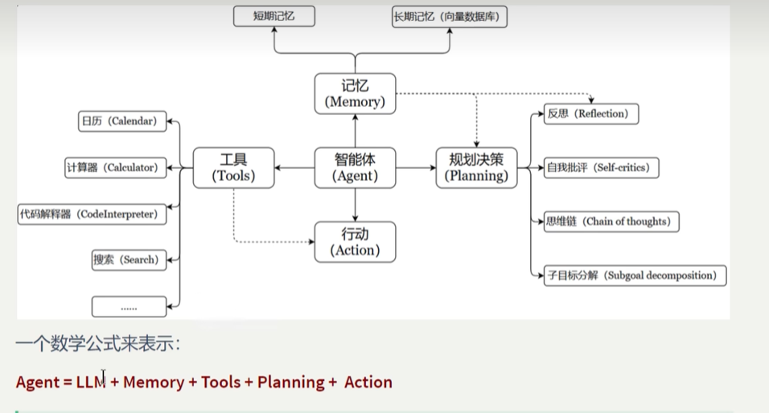
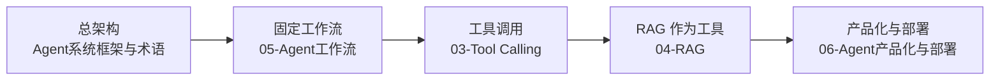

# Agent Lab

`agent-lab/` 是生成 AI 学习线里的 Agent 进阶目录，建立在 [../llm-lab](../llm-lab/README.md) 之后。

这里重点不是从零学习 LLM，而是继续练：

- Tool Calling
- 本地工具封装
- Agent Loop
- 固定工作流
- RAG 作为工具
- 可运行 demo 的设计、测试和说明

如果你想先建立整体印象，可以直接看 [04-RAG.md](./04-RAG.md) 里的 RAG 流程图，它把 `知识更新` 和 `知识检索` 两条线拆开了。

如果你想先看 Agent 的经典组成，也可以先看这张图：



配合下面两份文档一起读最顺：

- [Agent系统框架与术语.md](./Agent系统框架与术语.md)
- [05-Agent工作流.md](./05-Agent工作流.md)

学习时可以先记住这一句：

```text
Agent 不是一次性回答，而是先想、再查、再做、再检查。
```

## 一页索引

如果你想先抓住整个 `agent-lab` 的结构，可以按下面这条线看：

| 你先学什么 | 看哪份文档 | 你会学到什么 |
| --- | --- | --- |
| 总架构 | [Agent系统框架与术语.md](./Agent系统框架与术语.md) | Agent 的组成、角色、记忆、规划、行动 |
| 固定工作流 | [05-Agent工作流.md](./05-Agent工作流.md) | Analyze -> Plan -> Finalize 的受控流程 |
| 工具调用 | [03-Tool Calling.md](./03-Tool%20Calling.md) 和 `projects/tool_agent_demo` | 模型如何决定调用工具，程序如何执行 |
| RAG 作为工具 | [04-RAG.md](./04-RAG.md) 和 `projects/doc_qa_agent` | 如何先检索资料，再生成回答 |

如果你更喜欢记一句话，可以直接用这个顺序：

```text
总架构 -> 工作流 -> 工具调用 -> RAG -> 产品化
```

也可以直接看这张学习路径图：



这张图的意思很简单：

- 先知道 Agent 由什么组成
- 再学固定流程怎么控
- 再学模型怎么调工具
- 再学如何把资料检索接进来
- 最后再看怎么做成可部署的系统

## 建议前置

进入本目录前，建议先完成：

1. [../llm-lab/02-模型调用基础.md](../llm-lab/02-模型调用基础.md)
2. [../llm-lab/03-结构化输出.md](../llm-lab/03-结构化输出.md)
3. [../llm-lab/04-RAG.md](../llm-lab/04-RAG.md)
4. [../llm-lab/05-FastAPI与企业集成.md](../llm-lab/05-FastAPI与企业集成.md)

## 推荐学习顺序

1. [Agent系统框架与术语.md](./Agent系统框架与术语.md)
2. [01-学习路线.md](./01-学习路线.md)
3. [02-模型调用基础.md](./02-模型调用基础.md)
4. [04-RAG.md](./04-RAG.md)
5. [03-Tool Calling.md](./03-Tool%20Calling.md)
6. [05-Agent工作流.md](./05-Agent工作流.md)
7. [06-Agent产品化与部署.md](./06-Agent产品化与部署.md)
8. [LLM-Agent学习路径与计划.md](./LLM-Agent学习路径与计划.md)

辅助资料：

- [../术语速查表.md](../术语速查表.md)
- [06-Agent产品化与部署.md](./06-Agent产品化与部署.md)
- [API配置与兼容策略.md](./API配置与兼容策略.md)
- [projects/LEARNING_MAP.md](./projects/LEARNING_MAP.md)

## 可运行 Demo

| 顺序 | Demo | 学习重点 |
| --- | --- | --- |
| 1 | [chat_cli](./projects/chat_cli/README.md) | 命令行输入、模式决策、单次调用和交互循环 |
| 2 | [structured_output_demo](./projects/structured_output_demo/README.md) | Pydantic schema 与结构化输出 |
| 3 | [doc_qa_agent](./projects/doc_qa_agent/README.md) | 本地文档读取、切分、检索和来源输出 |
| 4 | [rag_api_demo](./projects/rag_api_demo/README.md) | FastAPI 包装 RAG 能力 |
| 5 | [tool_agent_demo](./projects/tool_agent_demo/README.md) | 工具 schema、工具调用循环和工作目录安全边界 |
| 6 | [workflow_agent](./projects/workflow_agent/README.md) | Analyze -> Plan -> Finalize 固定工作流 |

## 常用命令

从工作区根目录运行：

```bash
python3 ai-lab/agent-lab/projects/chat_cli/main.py --mock "用一句话解释 Tool Calling"
python3 ai-lab/agent-lab/projects/tool_agent_demo/main.py --mock --workdir ai-lab "概览这个目录"
python3 ai-lab/agent-lab/projects/workflow_agent/main.py --mock "规划一个 RAG PoC"
```

进入 demo 目录运行：

```bash
cd ai-lab/agent-lab/projects/tool_agent_demo
python3 main.py --mock --workdir ../../.. "列出 AI Lab 的结构"
```

## 和 LLM Lab 的分工

| 目录 | 重点 |
| --- | --- |
| [../llm-lab](../llm-lab/README.md) | 模型调用、结构化输出、RAG、FastAPI、评估、日本现场对照 |
| `agent-lab` | Tool Calling、Agent Loop、Workflow、Agent 产品化、自动化执行和进阶项目 |

日本现场通常先落地 `RAG / 社内検索 / FastAPI API`，再逐步加入工具调用和 Agent 工作流。因此建议先完成 `llm-lab` 主线，再把本目录作为进阶展示。

## 目录结构

```text
agent-lab/
|-- README.md
|-- 01-学习路线.md
|-- 02-模型调用基础.md
|-- 03-Tool Calling.md
|-- 04-RAG.md
|-- 05-Agent工作流.md
|-- 06-Agent产品化与部署.md
|-- Agent系统框架与术语.md
|-- LLM-Agent学习路径与计划.md
`-- projects/
    |-- chat_cli/
    |-- structured_output_demo/
    |-- doc_qa_agent/
    |-- rag_api_demo/
    |-- tool_agent_demo/
    `-- workflow_agent/
```
