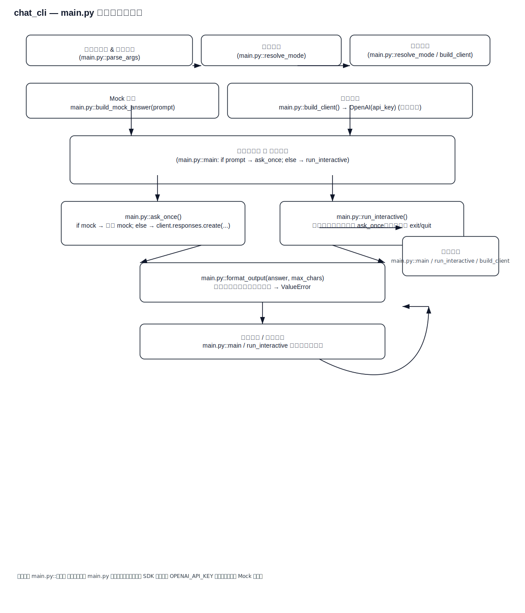

# chat_cli

最小可运行的大模型命令行对话示例。

这个样例支持自动模式 + 两种手动模式：

- 自动模式（默认）：
    - 有 `OPENAI_API_KEY` 时走真实 API
    - 没有 `OPENAI_API_KEY` 时自动走 Mock
- `--mock`：强制 Mock
- `--real`：强制真实 API

如果你暂时没有 API Key，建议先用 Mock 模式把工程结构练熟，再切到真实 API。

## 1. 学习目标

这个项目不是要直接做产品，而是训练最小闭环能力：

1. 命令行参数解析
2. 程序入口与控制流
3. 交互循环与退出条件
4. 错误处理与基础分层

## 2. 前置条件

- Python 3.10+
- 安装依赖（Mock 模式也建议安装，避免环境差异）

```bash
pip install -r requirements.txt
```

## 3. 零成本练习（推荐先做）

### 3.1 一次性提问（自动模式）

```bash
python3 main.py "用一句话解释什么是 agent"
```

如果你没有配置 `OPENAI_API_KEY`，程序会自动切到 Mock。

### 3.2 一次性提问（强制 Mock）

```bash
python3 main.py --mock "用一句话解释什么是 agent"
```

### 3.3 交互模式（自动或强制 Mock）

```bash
python3 main.py
python3 main.py --mock
```

### 3.3 你会看到什么

- 程序正常启动，不读取 API Key
- 每次输入都会返回固定风格的 mock 响应
- 可以完整练习 `parse_args()`、`main()`、`run_interactive()` 的控制流

### 3.4 三条常用练习命令

- 日常练习：python3 main.py 或 python3 main.py "问题"
- 明确练 mock：python3 main.py --mock "问题"
- 有 key 后练真调用：python3 main.py --real "问题"

## 4. 真实 API 模式（以后再切）

当你后续有 API Key 时，再用以下方式切换：

Windows PowerShell:

```powershell
$env:OPENAI_API_KEY="your_api_key"
```

Windows CMD:

```cmd
set OPENAI_API_KEY=your_api_key
```

macOS / Linux:

```bash
export OPENAI_API_KEY="your_api_key"
```

运行：

```bash
python3 main.py "给我一个三步学习计划"
python3 main.py --real "给我一个三步学习计划"
python3 main.py --model gpt-5 "解释一下 Tool Calling"
```

## 5. 代码分层导读

| 文件 / 函数 | 层次 | 作用 | 学习重点 |
| --- | --- | --- | --- |
| `main.py` | 程序入口 | 串起参数、调用与输出 | 看整体流程 |
| `parse_args()` | 输入层 | 读取 `prompt` / `--model` / `--mock` | 命令行参数设计 |
| `format_output()` | 业务逻辑层 | 根据 `--max-chars` 截断输出 | 参数到业务规则的映射 |
| `build_client()` | 基础设施层 | 真实模式读取 Key，Mock 模式跳过客户端构建 | 模式切换与环境依赖 |
| `build_mock_answer()` | 练习辅助层 | 生成固定风格响应 | 无外部依赖时如何保留训练闭环 |
| `ask_once()` | 调用层 | 按模式走 mock 或真实 API 调用 | 分支控制与单次请求封装 |
| `run_interactive()` | 控制层 | 连续提问、退出、异常处理 | 程序鲁棒性基础 |

学习闭环如下（静态图，兼容 GitHub）：


## Python 处理流程（main.py 详细）

下面是 `main.py` 的详细处理流程图（静态 SVG，兼容 GitHub），展示从参数解析、模式决策、客户端构建，到一次性调用 / 交互循环、输出格式化和异常处理的完整顺序：



说明：此图比学习闭环更详细地展示 `parse_args()`、`resolve_mode()`、`build_client()`、`ask_once()` / `run_interactive()`、`format_output()` 与错误处理逻辑。图中使用 `main.py::方法名()` 标注源码入口，方便你直接对应阅读 `main.py`。


如果你的平台不支持直接显示 SVG，可以后续把 `assets/flowchart_simple.svg` 渲染成 PNG 后再追加图片引用。

---

## 6. 建议练习顺序

1. 跑通 `python3 main.py --mock`，确认循环与退出逻辑。
2. 修改 `build_mock_answer()` 输出格式，练习可维护改动。
3. 使用 `--max-chars`，观察参数如何影响输出。
4. 最后再切到真实 API 模式，验证同一控制流可以复用。

## 7. 第 2 阶段实战（参数 -> 业务逻辑 -> 输出）

已提供独立教程：`STAGE2_MAX_CHARS_GUIDE.md`

快速体验命令：

```bash
python3 main.py --mock --max-chars 80 "请用较长内容解释 agent、tool calling 和 rag 的区别，并举例说明"
```

你将看到输出被截断，并附带 `...[truncated N chars]` 标记。

## 8. 下一步建议

这个样例跑通后，下一步最合适的是：

1. 增加 JSON 结构化输出
2. 把 mock 分支改成可插拔策略（函数或类）
3. 再进入 Tool Calling / RAG
