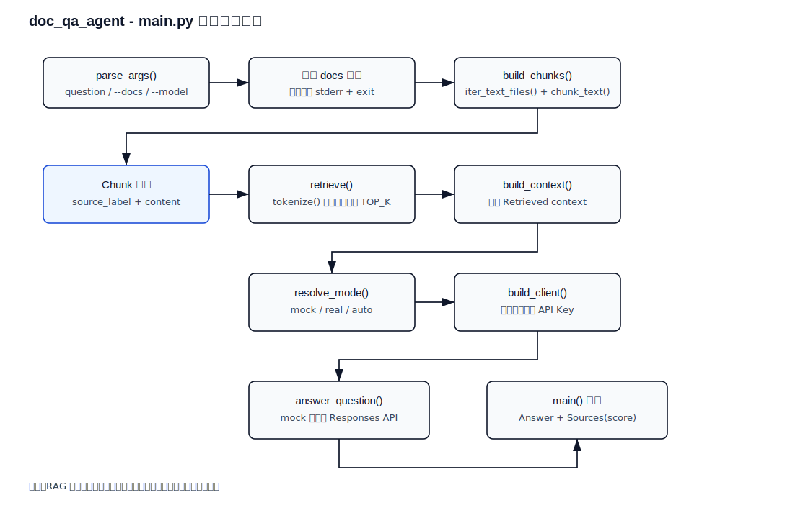
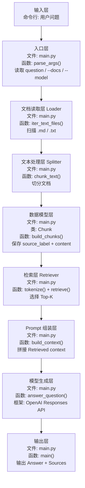

# doc_qa_agent

最小可运行的本地文档问答 `RAG` 示例。

这个 demo 是什么：

```text
一个先检索本地文档，再让模型基于检索结果回答问题的最小 RAG 示例。
```

日语现场可以说成：

```text
ローカル文書を検索し、その検索結果に基づいて回答を生成する最小構成の RAG デモです。
```

这个样例解决的问题是：

- 扫描本地文档目录
- 对文档做简单切分
- 按用户问题做关键词检索
- 把检索结果交给模型生成回答
- 在回答里附带引用来源

它是这条学习线里很关键的一个样例，因为按日本 IT 现场和派遣案件来看，`RAG / 社内検索` 往往比复杂 Agent 更优先落地。

## 1. 前置条件

- Python 3.10+
- 已安装依赖
- 已配置 `OPENAI_API_KEY`

## 2. 安装依赖

```bash
pip install -r requirements.txt
```

## 3. 配置环境变量

Windows PowerShell:

```powershell
$env:OPENAI_API_KEY="your_api_key"
```

Windows CMD:

```cmd
set OPENAI_API_KEY=your_api_key
```

macOS / Linux:

```bash
export OPENAI_API_KEY="your_api_key"
```

## 4. 运行方式

默认会读取当前目录下的 `md` / `txt` 文件：

```bash
python main.py "这个目录里数据库相关内容主要讲了什么？"
```

指定文档目录：

```bash
python main.py --docs d:/dev/source_code/vscode_study/java-lab "对日项目里的 RDS 和 Aurora 有什么区别？"
```

指定模型：

```bash
python main.py --model gpt-5 --docs d:/dev/source_code/vscode_study/java-lab "总结数据库移行的重点"
```

## 5. 这个 demo 的实现范围

这是一个“最小 RAG”：

- 文档类型：`md`、`txt`
- 检索方式：本地关键词检索
- 切分方式：按固定大小切分文本
- 结果生成：把 Top-K 片段交给模型总结

它还不是完整企业版 `RAG`，但足够先把这条主线跑通。

## 6. 输出内容

程序会输出：

1. 最终回答
2. 命中的引用片段列表

## 7. 代码说明

- 不依赖向量库
- 不依赖外部检索服务
- 先用最简单的本地检索跑通链路
- 方便后面再升级成向量检索、数据库检索或 API 检索

## 8. 代码分层导读

| 文件 / 类 / 函数 | 层次 | 作用 | 学习重点 |
| --- | --- | --- | --- |
| `Chunk` | 数据模型层 | 表示一个可检索的文档片段 | 片段内容、来源、分数 |
| `iter_text_files()` | 文档读取层 | 找到目录下的 `.md` / `.txt` 文件 | 资料入口在哪里 |
| `chunk_text()` | 文本处理层 | 把长文档切成带重叠的小块 | 为什么不能整篇塞给模型 |
| `build_chunks()` | 数据准备层 | 给每个片段附加来源标签 | 来源追踪 |
| `tokenize()` | 检索准备层 | 把问题和片段转成可比较的词 | 最小关键词检索 |
| `retrieve()` | 检索层 | 计算重合度并选出 Top-K | 检索质量决定回答质量 |
| `build_context()` | Prompt 组装层 | 把命中的片段拼成上下文 | 模型只能看到你送进去的资料 |
| `answer_question()` | 生成层 | 调模型生成最终回答 | 约束模型只基于上下文回答 |

## Python 处理流程（main.py 详细）

下面是 `main.py` 的详细处理流程图（静态 SVG，兼容 GitHub），展示从参数解析、文档读取、切分、检索，到上下文拼接、模型回答和来源输出的完整顺序：



说明：此图比数据流更详细地展示 `parse_args()`、`build_chunks()`、`retrieve()`、`build_context()`、`resolve_mode()`、`build_client()`、`answer_question()` 与输出处理逻辑。

## 9. 数据流



把这个 demo 放到框架分层里，可以这样理解：

| 顺序 | 框架层 | 文件 / 类 / 函数 | 作用 |
| --- | --- | --- | --- |
| 1 | Controller / 输入层 | `main.py` -> `parse_args()` | 接收问题和文档目录 |
| 2 | Document Loader 层 | `main.py` -> `iter_text_files()` | 扫描可读取文件 |
| 3 | Text Splitter 层 | `main.py` -> `chunk_text()` | 把文档切成片段 |
| 4 | Data Model 层 | `Chunk` + `build_chunks()` | 保存片段内容和来源 |
| 5 | Retrieval 层 | `tokenize()` + `retrieve()` | 检索相关片段 |
| 6 | Prompt / Context 层 | `build_context()` | 组织模型输入上下文 |
| 7 | LLM Service 层 | `answer_question()` | 调用模型生成回答 |
| 8 | View / 输出层 | `main()` | 打印答案和来源 |

## 10. 关键名词理解

| 名词 | 日语 | 是什么 | 核心作用 |
| --- | --- | --- | --- |
| RAG | 検索拡張生成 / RAG | 先检索再生成的问答技术 | 避免模型只靠记忆回答 |
| Chunk | チャンク / 分割片 | 文档切分后的小片段 | 作为检索和引用的基本单位 |
| Top-K | 上位 K 件 | 检索排名前 K 个结果 | 控制给模型多少资料 |
| Context | コンテキスト | 拼给模型的资料上下文 | 直接影响最终回答 |
| Source | 出典 / 参照元 | 答案依据的来源标签 | 让答案可以追溯到文件和片段 |
| Score | スコア | 简单相关度分数 | 用关键词重合度表示相关性 |

## 10.1 中文 / 日语现场对照

| 中文 | 日语 | 日本项目现场常见表达 |
| --- | --- | --- |
| 本地文档问答 | ローカル文書 QA | ローカル文書を対象に質問応答を行います |
| 社内搜索 | 社内検索 | 社内文書を検索対象にします |
| 引用来源 | 出典表示 | 回答に参照元を付けます |
| 检索结果 | 検索結果 | 検索結果をコンテキストとしてモデルに渡します |
| 资料不足 | 情報不足 | 情報が不足している場合は回答できないと返します |

## 11. 建议你怎么读这个项目

1. 先看输出里的 `Sources`，不要只看最终回答。
2. 再修改 `TOP_K`，观察给模型的资料变多或变少后有什么变化。
3. 再修改 `CHUNK_SIZE`，观察片段太大或太小时的影响。
4. 最后再考虑把关键词检索换成向量检索。

## 12. 下一步建议

这个样例跑通后，下一步最适合继续做：

1. 增加 `FastAPI` 包装
2. 增加向量检索
3. 增加 PDF 解析
4. 增加检索评估
