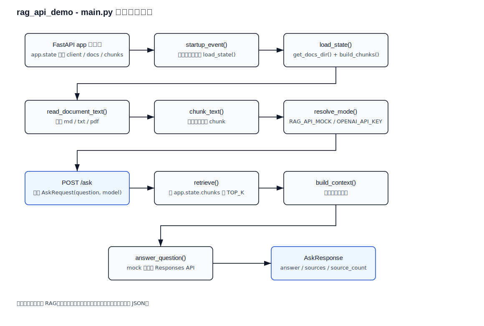

# RAG API Demo - 运行说明

`rag_api_demo` 是一个最小可运行的 `FastAPI` 版 `RAG` 后端示例，支持文档检索、`/health`、`/ask` 和 `/reload`。

## 1. 最推荐的启动方式

在项目目录里直接运行开发脚本：

```bash
cd ai-lab/agent-lab/projects/rag_api_demo
./run-dev.sh
```

`run-dev.sh` 会自动：

1. 创建 `.venv`
2. 安装 `requirements.txt`
3. 设置 `RAG_API_MOCK=1`
4. 启动 `uvicorn main:app --reload --port 8000 --host 127.0.0.1`

这意味着它默认以 mock 模式启动，不需要 `OPENAI_API_KEY`。

## 2. 快速验证

如果你只想先看 mock 输出，可以直接运行：

```bash
cd ai-lab/agent-lab/projects/rag_api_demo
python3 mock_test.py
```

这个脚本不依赖 `FastAPI` / `uvicorn`，适合先检查返回格式。

## 3. 手动启动

### 3.1 Mock 模式

如果你想手动启动服务，但仍然不接真实模型，可以这样跑：

```bash
cd ai-lab/agent-lab/projects/rag_api_demo
RAG_API_MOCK=1 uvicorn main:app --reload --port 8000 --host 127.0.0.1
```

### 3.2 Real 模式

如果你要接真实的 OpenAI 调用，请先配置环境变量，再启动：

```bash
cd ai-lab/agent-lab/projects/rag_api_demo
export OPENAI_API_KEY="your_api_key"
export RAG_API_DOCS_DIR="./docs"
uvicorn main:app --reload --port 8000 --host 127.0.0.1
```

Windows PowerShell:

```powershell
cd ai-lab/agent-lab/projects/rag_api_demo
$env:OPENAI_API_KEY="your_api_key"
$env:RAG_API_DOCS_DIR="./docs"
uvicorn main:app --reload --port 8000 --host 127.0.0.1
```

Windows CMD:

```cmd
cd ai-lab\agent-lab\projects\rag_api_demo
set OPENAI_API_KEY=your_api_key
set RAG_API_DOCS_DIR=.\docs
uvicorn main:app --reload --port 8000 --host 127.0.0.1
```

说明：

- `RAG_API_DOCS_DIR` 不设置时默认是当前目录 `.`。
- 建议在项目目录下启动，这样文档扫描范围更可控。

## 4. Docker 启动

Docker 镜像默认已经设置了 `RAG_API_MOCK=1`，所以直接运行即可：

```bash
cd ai-lab/agent-lab/projects/rag_api_demo
docker build -t rag_api_demo:dev .
docker run -p 8000:8000 rag_api_demo:dev
```

启动后可以访问：

- `GET http://127.0.0.1:8000/health`
- `POST http://127.0.0.1:8000/ask`

## 5. 常见问题

- 如果 `python3 -m venv` 失败，请先安装系统的 `python3-venv`。
- 如果 `uvicorn` 找不到，先激活虚拟环境，或者重新运行 `./run-dev.sh`。
- 如果 real 模式下启动失败，请确认 `OPENAI_API_KEY` 和 `RAG_API_DOCS_DIR` 都已正确设置。

## 6. 接口

### `GET /health`

健康检查。

### `POST /ask`

请求示例：

```json
{
  "question": "对日项目里的 RAG 和 Tool Calling 哪个优先学？",
  "model": "gpt-5"
}
```

### `POST /reload`

重新加载本地文档并重建内存中的检索数据。

## 7. 说明

这个 demo 的定位是一个“案件导向”的最小后端版本：

- 有 API
- 有请求结构
- 有返回结构
- 有健康检查
- 有重载动作
- 支持 `md / txt / pdf`

它还不是正式企业版，但已经足够作为 `FastAPI + RAG` 的学习样例。

## Python 处理流程

下面是 `main.py` 的详细处理流程图：



说明：此图展示 `startup_event()`、`load_state()`、`read_document_text()`、`chunk_text()`、`resolve_mode()`、`ask()`、`retrieve()`、`build_context()`、`answer_question()` 与 `AskResponse` 的返回逻辑。

## 8. 下一步建议

这个样例跑通后，下一步最适合继续做：

1. 增加向量检索
2. 增加认证
3. 增加日志和评估
4. 增加检索质量测试
