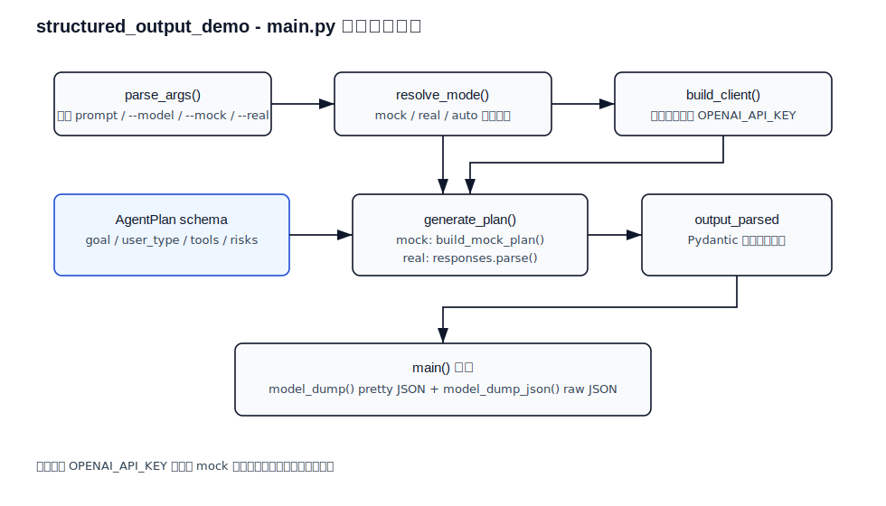
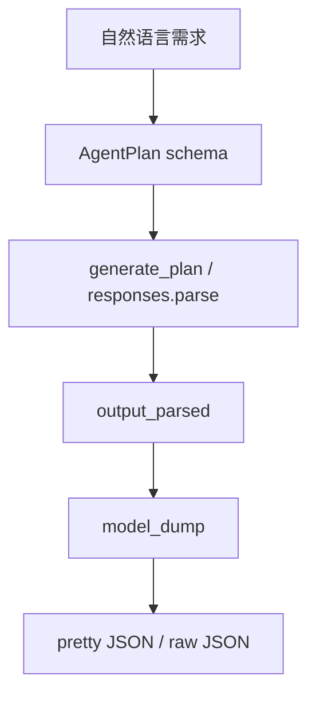

# structured_output_demo

最小可运行的结构化输出示例。

这个样例解决的问题是：

- 输入一句自然语言需求
- 调用模型
- 稳定输出结构化 JSON

它适合作为 `chat_cli` 之后的第二个样例，因为这一阶段要重点学会：

- 让模型按固定结构返回结果
- 用代码校验结果
- 为后面的 Tool Calling 和 Agent 工作流打基础

如果按日本现场和案件要求来看，这个样例也很关键，因为很多企业应用真正需要的不是“聊天”，而是：

- 稳定 JSON 输出
- 稳定分类结果
- 稳定任务清单
- 能接后端 API 的结构化数据

## 1. 前置条件

- Python 3.10+
- 已安装依赖
- 已配置 `OPENAI_API_KEY`

## 2. 安装依赖

```bash
pip install -r requirements.txt
```

## 3. 配置环境变量

Windows PowerShell:

```powershell
$env:OPENAI_API_KEY="your_api_key"
```

Windows CMD:

```cmd
set OPENAI_API_KEY=your_api_key
```

macOS / Linux:

```bash
export OPENAI_API_KEY="your_api_key"
```

## 4. 运行方式

```bash
python main.py "做一个读取本地 Markdown 并输出摘要的 agent"
```

指定模型：

```bash
python main.py --model gpt-4o "帮我做一个带搜索功能的知识库 agent"
```

## 5. 输出内容

程序会输出两部分：

1. pretty JSON
2. 原始 JSON 字符串

结构包括：

- `goal`
- `user_type`
- `core_capabilities`
- `tools`
- `deliverables`
- `risks`

## 6. 代码说明

- 使用官方 `openai` Python SDK
- 使用 `Responses API`
- 使用 `responses.parse`
- 使用 `Pydantic` 做结构定义和结果校验

## 7. 代码分层导读

| 文件 / 类 / 函数 | 层次 | 作用 | 学习重点 |
| --- | --- | --- | --- |
| `AgentPlan` | 数据合同层 | 定义模型必须返回哪些字段 | `BaseModel`、`Field`、`Literal` |
| `parse_args()` | 输入层 | 读取自然语言需求和模型名 | 用户输入如何进入程序 |
| `build_client()` | 基础设施层 | 创建 OpenAI 客户端 | API Key 管理 |
| `generate_plan()` | 模型调用层 | 使用 `responses.parse` 获取结构化结果 | 模型输出如何被解析和校验 |
| `main()` | 编排层 | 串联输入、调用、输出 | 程序主流程 |

## Python 处理流程（main.py 详细）

下面是 `main.py` 的详细处理流程图（静态 SVG，兼容 GitHub），展示从参数解析、模式决策、客户端构建，到结构化输出解析和 JSON 打印的完整顺序：



说明：此图比数据流更详细地展示 `parse_args()`、`resolve_mode()`、`build_client()`、`AgentPlan`、`generate_plan()` 与输出处理逻辑。

## 8. 数据流



这里的关键点是：

- `AgentPlan` 不是普通注释，而是输出结构的合同。
- `responses.parse` 不只是“调用模型”，还负责按 schema 解析。
- `output_parsed` 是后端更容易继续处理的 Python 对象。

## 9. 关键名词理解

| 名词 | 概念理解 | 在本 demo 中的作用 |
| --- | --- | --- |
| Schema | 数据结构约定 | 规定结果必须包含哪些字段 |
| Pydantic | Python 数据校验库 | 检查模型输出是否符合结构 |
| Literal | 固定可选值 | 限制 `user_type` 只能是几个枚举值 |
| Parsed JSON | 已校验结果 | 可读性更强，适合学习和调试 |
| Raw JSON | 压缩 JSON | 更接近系统间传输格式 |

## 10. 下一步建议

这个样例跑通后，下一步最适合继续做：

1. 把输出结果写入文件
2. 把输出结果接到 `RAG` 或 API
3. 再把结构化结果接到 Tool Calling

## 11. Python 处理流程（速查）

1. **parse_args**：处理命令行输入（prompt、--model、--mock/--real）。
2. **resolve_mode**：判断运行模式（自动 / mock / real）。
3. **build_client**：准备外部服务（真实模式创建 OpenAI 客户端）。
4. **build_mock_plan**：生成 mock 数据（结构化计划）。
5. **generate_plan**：核心业务（`responses.parse` 解析为 `AgentPlan`）。
6. **main**：总流程入口，串起参数、模式、调用与 JSON 输出。
