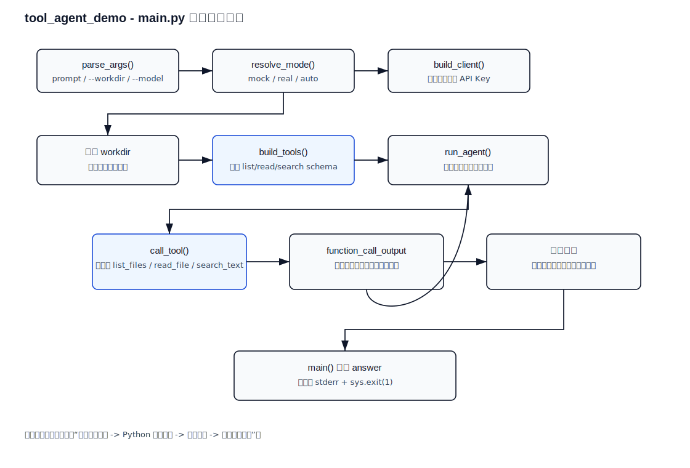

# tool_agent_demo

最小可运行的工具调用 Agent 示例。

这个 demo 是什么：

```text
一个让模型通过 Tool Calling 使用本地文件工具的最小 Agent 示例。
```

日语现场可以说成：

```text
モデルがローカルファイル操作ツールを呼び出す最小構成の AI エージェントです。
```

这个样例让模型具备 3 个最基础的本地工具能力：

- 列目录
- 读文件
- 搜索文本

它适合作为 `structured_output_demo` 之后的第三个样例，因为这一阶段的重点是：

- 定义工具 schema
- 让模型决定何时调用工具
- 执行工具后把结果再交回模型
- 让模型基于工具结果给出最终回答

如果按日本现场和派遣案件来看，这个样例更适合作为 `RAG` 之后的进阶练习，而不是最开始就优先做的东西。

因为企业现场更常见的是：

- 先做知识检索
- 再做有限工具调用
- 最后才逐步走向 Agent 化

## 业务场景说明

- 谁会用：需要让模型读取真实项目文件的开发人员，例如代码调查、文档搜索和项目交接场景。
- 现实中的问题：新成员接手一个项目，想知道“登录功能写在哪个文件里”。模型本身看不到电脑里的最新代码，如果只凭已有知识回答，很可能猜错。
- 这个例子怎么解决：给模型提供列出文件、读取文件和搜索文字三个工具。模型先判断需要哪个工具，程序执行工具，再把真实结果交回模型继续回答。
- 现实例子：用户问“请找出项目中提到 `OPENAI_API_KEY` 的文件并说明用途”，模型会先调用搜索工具找到文件，再读取相关内容，最后根据实际代码给出说明。
- 初学者重点：模型只负责决定“调用什么工具和传什么参数”，真正读取文件的是 Python 函数；工作目录限制可以避免读取范围失控。

## 1. 前置条件

- Python 3.10+
- 已安装依赖
- 已配置 `OPENAI_API_KEY`

## 2. 安装依赖

```bash
pip install -r requirements.txt
```

## 3. 配置环境变量

Windows PowerShell:

```powershell
$env:OPENAI_API_KEY="your_api_key"
```

Windows CMD:

```cmd
set OPENAI_API_KEY=your_api_key
```

macOS / Linux:

```bash
export OPENAI_API_KEY="your_api_key"
```

## 4. 运行方式

在当前目录工作练习：
```练习列目录：
python3 main.py "帮我列出当前目录的文件"
```
```练习读文件： 
python3 main.py "读取 README 内容"
```
```练习搜索： 
python3 main.py "搜索包含 README 的地方"
```

默认会在当前目录工作：
```bash
python3 main.py "帮我看看这个目录里有哪些 markdown 文件，并总结 README 重点"
```

指定工作目录：

```bash
python3 main.py --workdir ~/workspace/vscode_study/ai-lab/agent-lab "列出文件并读取 README"
```

指定模型：

```bash
python3 main.py --model gpt-5 --workdir ~/workspace/vscode_study/java-lab "帮我找数据库相关文档"
```

## 5. 内置工具

### `list_files`

- 输入：相对路径
- 输出：目录下的文件与子目录列表

### `read_file`

- 输入：相对文件路径
- 输出：文件内容

### `search_text`

- 输入：关键字、相对路径
- 输出：匹配到的文件和行号

## 6. 安全边界

- 所有工具只能访问 `--workdir` 指定目录内的文件
- 不支持写文件
- 不支持执行命令

## 7. 代码说明

- 使用官方 `Responses API`
- 使用自定义 `function tools`
- 用一个最小循环处理工具调用
- 工具输出统一回填给模型，直到拿到最终文本答案

## Python 处理流程（main.py 详细）

下面是 `main.py` 的详细处理流程图（静态 SVG，兼容 GitHub），展示从参数解析、工作目录校验、工具 schema 构建，到模型工具调用循环、工具结果回填和最终回答输出的完整顺序：



说明：此图详细展示 `parse_args()`、`resolve_mode()`、`build_client()`、`build_tools()`、`run_agent()`、`call_tool()` 与工具执行闭环。

## 8. 关键名词理解

| 名词 | 日语 | 是什么 | 核心作用 |
| --- | --- | --- | --- |
| Tool Agent | ツール利用エージェント | 可以调用外部工具的 Agent | 让模型能基于真实工具结果完成任务 |
| Tool Schema | ツールスキーマ | 工具名称、参数、说明的结构定义 | 告诉模型工具能做什么、参数怎么传 |
| Tool Call | ツール呼び出し要求 | 模型发出的工具调用请求 | 表示模型选择了某个工具 |
| Tool Result | ツール実行結果 | Python 工具执行后的真实结果 | 回填给模型继续推理 |
| Workdir | 作業ディレクトリ | 工具允许访问的工作目录 | 限制文件操作范围，保证安全 |

## 9. 中文 / 日语现场对照

| 中文 | 日语 | 日本项目现场常见表达 |
| --- | --- | --- |
| 工具调用 Agent | ツール利用エージェント | 外部ツールを利用する Agent を作成します |
| 列出文件 | ファイル一覧取得 | 指定ディレクトリのファイル一覧を取得します |
| 读取文件 | ファイル読み込み | テキストファイルの内容を読み込みます |
| 搜索文本 | テキスト検索 | 指定キーワードでファイル内を検索します |
| 安全边界 | 安全制御 | 作業ディレクトリ外へのアクセスを禁止します |

## 10. 下一步建议

这个样例跑通后，下一步最适合继续做：

1. 增加内部文档搜索工具
2. 增加数据库查询或 API 工具
3. 增加任务计划和步骤日志

## 11. Python 处理流程（速查）

1. **parse_args**：处理命令行输入（任务、--model、--workdir、--mock/--real）。
2. **resolve_mode**：判断运行模式（自动 / mock / real）。
3. **build_client**：准备外部服务（真实模式创建 OpenAI 客户端）。
4. **build_mock_agent_response**：生成 mock 数据（本地返回固定风格答案）。
5. **核心业务**：`build_tools()` 暴露工具 schema，`run_agent()` 驱动工具调用闭环，`call_tool()` 调度 `list_files/read_file/search_text`。
6. **main**：总流程入口，校验工作目录 -> 启动 agent 循环 -> 输出最终回答。
