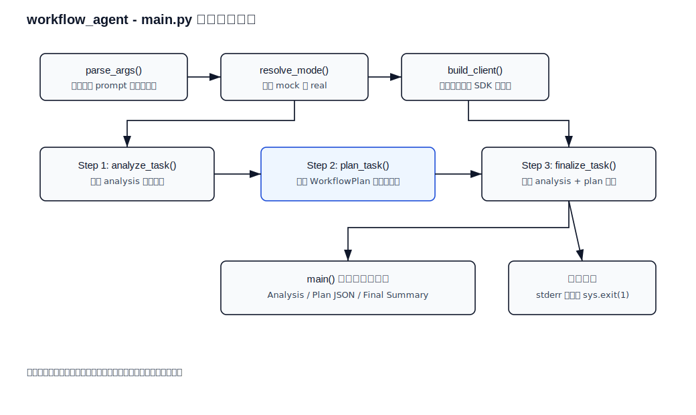
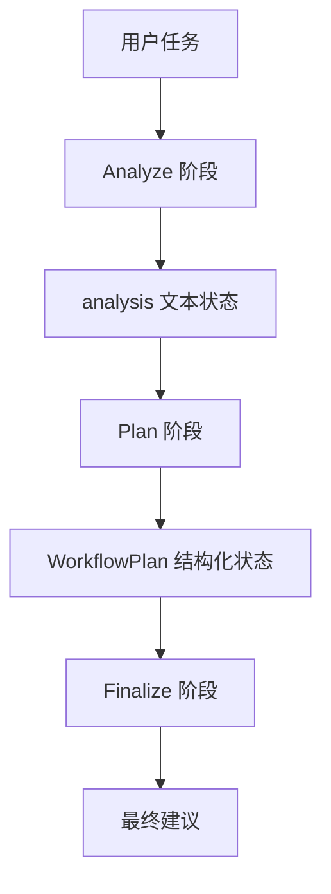

# workflow_agent

最小可运行的工作流 Agent 示例。

这个 demo 是什么：

```text
一个把 Agent 任务拆成“分析 -> 计划 -> 总结”三个固定阶段的工作流示例。
```

日语现场可以说成：

```text
Agent の処理を「分析 -> 計画 -> 最終出力」の固定ワークフローに分けるデモです。
```

这个样例不是多 Agent，也不是复杂自治系统，而是把任务拆成固定的几个阶段：

1. 分析任务
2. 生成执行计划
3. 输出最终结果

它适合作为 `tool_agent_demo` 之后的下一步，因为这一阶段要重点学习的是：

- 工作流状态如何设计
- 多阶段模型调用如何串起来
- 为什么很多现场 Agent 实际上先是“固定工作流”

## 1. 前置条件

- Python 3.10+
- 已安装依赖
- 已配置 `OPENAI_API_KEY`

## 2. 安装依赖

```bash
pip install -r requirements.txt
```

## 3. 运行方式

```bash
python main.py "做一个社内文档问答 PoC"
```

指定模型：

```bash
python main.py --model gpt-5 "帮我规划一个带 RAG 的知识库助手"
```

## 4. 工作流步骤

### Step 1. Analyze

- 分析用户任务
- 提取目标、约束和输出物

### Step 2. Plan

- 生成结构化执行计划
- 输出步骤、风险和优先级

### Step 3. Finalize

- 基于前两步结果输出简洁结论

## 5. 代码说明

- 使用官方 `Responses API`
- 用固定阶段代替复杂自治
- 用状态对象保存中间结果
- 用结构化 schema 保证计划阶段结果稳定

## 6. 代码分层导读

| 文件 / 类 / 函数 | 层次 | 作用 | 学习重点 |
| --- | --- | --- | --- |
| `WorkflowPlan` | 数据合同层 | 定义计划阶段输出结构 | 用 schema 约束中间结果 |
| `analyze_task()` | 分析层 | 提取目标、限制、交付物 | 先理解任务，再计划 |
| `plan_task()` | 计划层 | 生成结构化步骤、风险、交付物 | `responses.parse` 的工作流用法 |
| `finalize_task()` | 总结层 | 汇总分析和计划，给最终建议 | 使用中间状态继续生成 |
| `main()` | 编排层 | 按固定顺序执行三个阶段 | 工作流如何串起来 |

## Python 处理流程（main.py 详细）

下面是 `main.py` 的详细处理流程图（静态 SVG，兼容 GitHub），展示从参数解析、模式决策、客户端构建，到 Analyze / Plan / Finalize 三阶段输出的完整顺序：



说明：此图比数据流更详细地展示 `parse_args()`、`resolve_mode()`、`build_client()`、`analyze_task()`、`plan_task()`、`finalize_task()` 与异常处理逻辑。

## 7. 数据流



这个 demo 的重点是：

- 每一步只做一类事情。
- 中间结果要保留下来。
- 结构化阶段用 schema 稳定输出。

## 8. 关键名词理解

| 名词 | 日语 | 是什么 | 核心作用 |
| --- | --- | --- | --- |
| Workflow | ワークフロー | 固定步骤组成的处理流程 | 按 Analyze -> Plan -> Finalize 执行 |
| State | 状態 / 中間状態 | 步骤之间传递的数据 | `analysis` 和 `plan` 会传给下一步 |
| Planner | プランナー / 計画担当 | 负责生成执行计划的角色 | 把分析结果变成步骤和交付物 |
| Finalizer | 最終出力生成 | 负责生成最终输出的角色 | 基于前面状态给最终建议 |
| Termination | 終了条件 | 判断流程何时结束的规则 | 三个阶段执行完就结束 |

## 8.1 中文 / 日语现场对照

| 中文 | 日语 | 日本项目现场常见表达 |
| --- | --- | --- |
| 工作流 Agent | ワークフロー型 Agent | 固定ワークフローで Agent 処理を制御します |
| 任务分析 | タスク分析 | ユーザー依頼の目的と制約を整理します |
| 计划生成 | 計画生成 | 実行計画を構造化して生成します |
| 中间状态 | 中間状態 | 前ステップの結果を次ステップに渡します |
| 最终输出 | 最終出力 | 分析結果と計画に基づいて最終回答を生成します |

## 9. 日本现场里的意义

这个样例更接近现实中的“固定工作流型 Agent”，而不是一开始就做完全自治系统。

很多日本现场 PoC 的第一步其实更像：

- 流程固定
- 步骤可控
- 输出可解释

## 10. 下一步建议

这个样例跑通后，下一步最适合继续做：

1. 增加工具调用步骤
2. 增加失败重试
3. 增加步骤日志
4. 再考虑多 Agent
