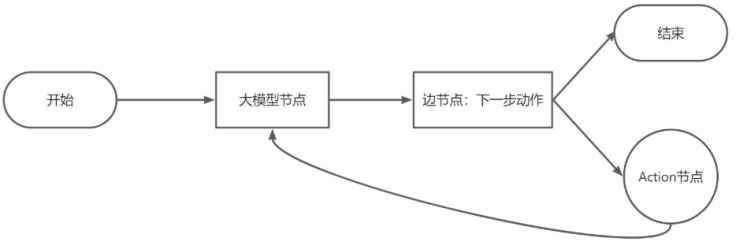
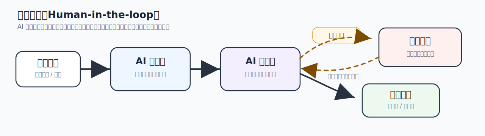
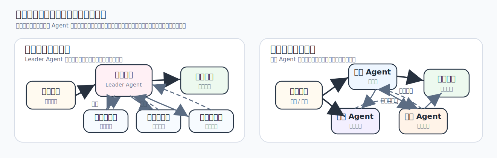
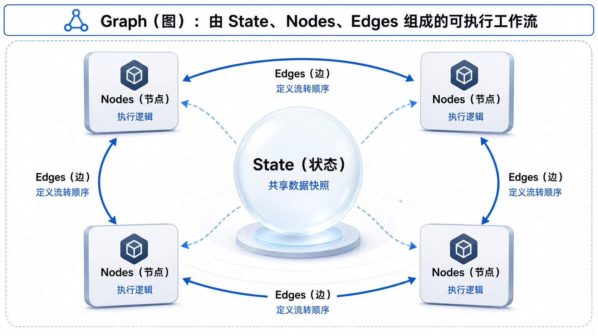
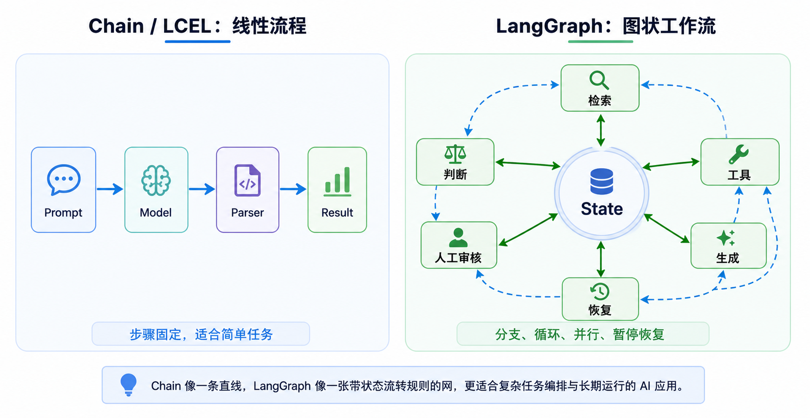
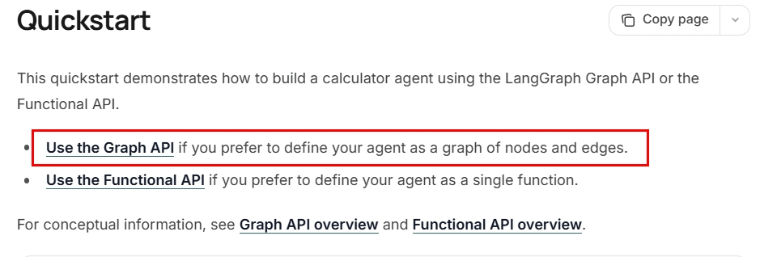
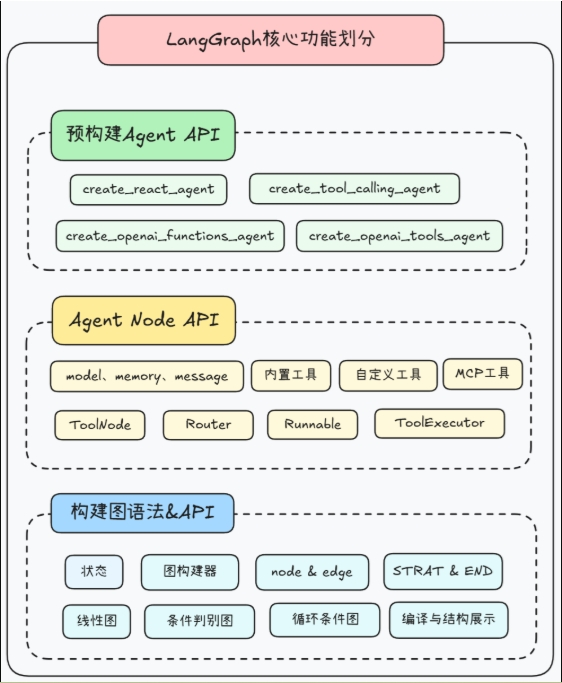
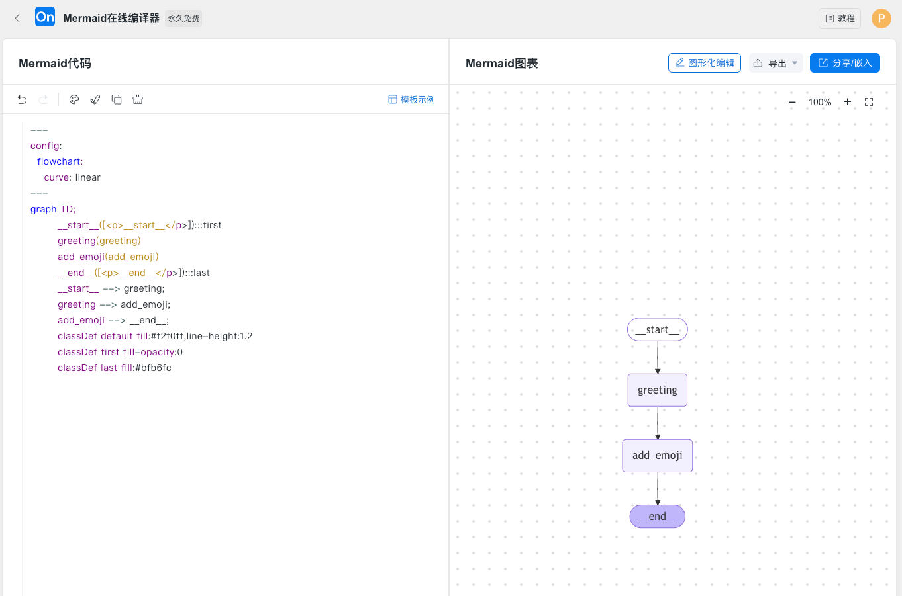
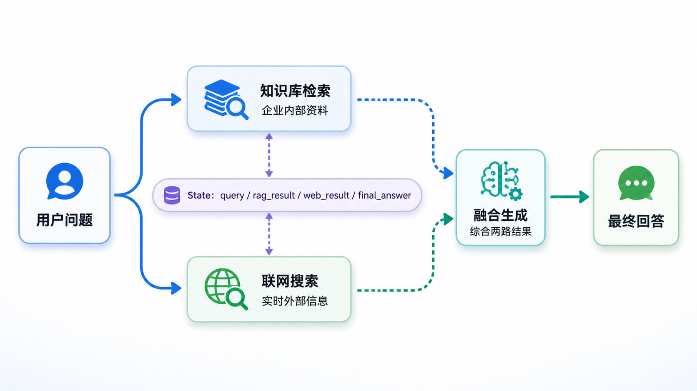

# 22 - LangGraph 概述与快速入门

---

**本章课程目标：**

- 理解 **LangGraph 是什么**，知道它为什么适合编排“有状态、可分支、可循环、可暂停、可人工介入”的复杂 LLM 工作流。
- 理清 **LangGraph、LangChain、Chain、Agent、Workflow** 之间的关系，知道什么时候该直接用 LangChain，什么时候应该上 LangGraph。
- 掌握 LangGraph 入门最核心的四个概念：**State（状态）、Nodes（节点）、Edges（边）、Graph（图）**，并能按“定义状态 → 编写节点 → 连接边 → 编译 → 执行 → 可视化”的顺序跑通本章 3 个入门案例。

**学习建议：** 这一章先跑通第一张 LangGraph 图，不急着背完所有 API。先抓住四个词：State 保存数据，Node 处理任务，Edge 决定流转，Graph 把它们编排起来。状态合并放到 [第 23 章](23-LangGraphAPI：图与状态.md)，节点和控制流放到 [第 24 章](24-LangGraphAPI：节点、边与进阶.md)，高级能力再看 [第 25 章](25-LangGraph高级特性.md) 和 [第 26 章](26-LangGraph多智能体与A2A.md)。

**官方文档与资源**：详见 [工具导航与参考资料索引 - LangGraph](工具导航与参考资料索引.md#LangGraph)。

---

## 1、LangGraph 简介

### 1.1 定义

**LangGraph** 是一个面向 **长流程、强状态、可分支、可循环、可人工介入** 场景的 **低层图编排框架和运行时（runtime）**。

你可以先用一句话记住它：**LangGraph = 用“图 + 状态”来组织和运行 LLM 工作流 / Agent 流程。**

先把两个关键词拆开看：

- **图（Graph）**：不是只画一张流程图给人看，而是把“每一步做什么”和“下一步往哪走”明确建模成一张可执行的有向图。节点负责执行动作，边负责决定流转方向，所以天然适合表达顺序执行、条件分支、循环回退、并行分发。
- **状态（State）**：不是把变量散落在一堆函数里，而是维护一份贯穿整张图的“当前工作流快照”，例如历史消息、检索结果、草稿内容、工具返回值、当前评分、是否需要人工审核。节点读取这份状态，执行后再返回要写回状态的更新。

所以，**LangGraph 不是新的大模型，也不是更神秘的 Agent 黑盒**。它解决的是流程编排问题：当 AI 应用不再是一条直线，而是需要判断、重试、保存状态、人工审核时，怎么把流程写得**可控、可维护、可恢复、可观测**。

如果再从**工程落地能力**的角度看，LangGraph 值得学，不只是因为它能把流程“画成图”，还因为它把下面这些生产项目里常见的问题也纳入了框架主线：

| 能力                   | 解决什么问题                                             | 入门理解                                            |
| ---------------------- | -------------------------------------------------------- | --------------------------------------------------- |
| **持久化执行**         | 长流程任务中途失败后，希望能从检查点恢复，而不是从头再跑 | 让工作流“跑得久、断了还能接着跑”                    |
| **人机协作（HITL）**   | 某些关键节点需要人工审核、修改状态、确认后再继续         | 让人可以在流程中间“接管一下再放回去”                |
| **记忆管理**           | 对话历史、阶段性结论、跨轮上下文需要被保存和复用         | 让 State 不只是临时变量，而是可持续维护的上下文载体 |
| **流式处理**           | 希望边执行边看到中间过程、Token 输出或自定义进度事件     | 让用户和开发者不用一直“等最后一刻”                  |
| **生产级部署与可观测** | 想把图变成可运维、可追踪、可调试的线上应用               | 不只是本地 demo，而是更接近线上工作流运行时         |

这一章先建立“**图 + 状态 + 最小运行方式**”的入门认知。上表里的持久化、流式、人机介入等能力，会在 [第 25 章](25-LangGraph高级特性.md) 展开。

### 1.2 为什么需要 LangGraph

你可以从一个真实项目场景理解。假设你让 AI 帮你写一份“**小米 SU7 市场分析报告**”，真实流程往往不是“一次生成就结束”，而更像下面这样：

1. 先上网搜索资料
2. 根据资料写第一版草稿
3. 审阅草稿，发现“数据不够支撑结论”
4. 回到“搜索资料”这一步，补充更多数据
5. 再重写或修改草稿
6. 又发现“结构有点乱”
7. 这一次不再继续搜索，而是直接调整现有内容结构
8. 如果结果还不放心，就把草稿交给人类审核
9. 最后才输出终稿

请注意，这个过程里已经出现了三类“非直线流程”：

- **条件分支**：下一步是继续搜索、重写草稿、调整结构，还是直接提交？
- **循环回退**：如果结果不够好，要不要回到前面的某个步骤再跑一轮？
- **状态驱动决策**：下一步怎么走，不是拍脑袋决定，而是要看当前草稿、检索结果、审核结论这些状态。

这就已经不是一条简单的 `prompt | model | parser` 线性链能很自然表达的流程了。



如果只用 **Chain / LCEL**，它很适合固定顺序的线性流水线，例如“先总结 → 再翻译 → 再解析输出”。但一旦流程里经常出现“根据当前状态跳到不同分支”“失败后回到前面重试”“中途暂停等待人工确认”，你就很容易写出大量 `if / while` 胶水代码，业务逻辑散在各个函数里，最后变得不好维护。

如果只用 **Agent**，模型确实可以自己决定下一步调哪个工具、要不要继续思考、要不要重新搜索，但这种自由度也会带来另一个问题：**执行路径不够稳定，开发者不容易精确约束每一步必须怎么走，也不容易在关键节点插入人工审核或状态恢复。**

这正是 LangGraph 值得学的原因：**它既保留了“流程可以分支、循环、动态决策”的表达能力，又比纯黑盒 Agent 更容易做流程约束、状态管理、调试追踪和人机协作。**

下面这两张图分别从 **人机协作（Human-in-the-loop）** 和 **多智能体协作** 的角度，补充说明真实 AI 系统为什么经常需要 LangGraph 这种“可控流程编排”能力。





### 1.3 相关概念

LangGraph 常和 LangChain、Chain、Agent、Workflow 一起出现。

| 概念             | 入门理解                                                                         | 更适合解决什么问题                                           |
| ---------------- | -------------------------------------------------------------------------------- | ------------------------------------------------------------ |
| **LangChain**    | LLM 应用开发组件库，提供模型接入、Prompt、Parser、Tools、Retriever、Agent 等能力 | 模型接入、线性链、RAG 管道、快速搭 Agent                     |
| **Chain / LCEL** | 把多个 Runnable 按固定数据流串起来的链式写法和链式流程                           | `Prompt → Model → Parser` 这种线性、声明式流程               |
| **Agent**        | 一种由模型根据上下文动态决定下一步动作的应用形态                                 | 任务路径不完全固定，需要模型自己判断是否调工具、是否继续推理 |
| **Workflow**     | 工作流 / 固定流程，整体步骤由开发者提前设计，只在部分节点做条件判断              | 流程边界明确、要求稳定可控、希望更容易复现和审计             |
| **LangGraph**    | 用“状态 + 节点 + 边”把 Workflow 或 Agent 编排成一张可执行图                      | 分支、循环、并行、持久化、人机介入、多智能体调度             |

这里有三个边界点要记住：

- **LangGraph 可以配合 LangChain 使用，但不是“必须依赖 LangChain 才能用”。** 官方文档明确说过，LangGraph 可以独立使用；只是实际项目里，图里的节点常常会调用 LangChain 的模型、工具和 Prompt，所以两者经常搭配出现。
- **LangGraph 不是 Chain 的替代品，而是更适合“非线性控制流 + 状态管理”的编排方式。** 如果你的任务本来就是一条固定直线，用 LCEL 反而更简单；如果流程开始出现循环、分支、暂停、恢复，就更适合切到 LangGraph。
- **LangChain v1 的 `create_agent` 底层就是构建在 LangGraph runtime 之上的。** 所以可以把 LangGraph 看作“更底层、更可控的 Agent / Workflow 编排层”。如果只是想快速搭一个标准工具调用 Agent，先用 `create_agent`；如果想把每一步流程拆开、显式控制状态和边，就自己写 LangGraph。

### 1.4 四个核心概念

LangGraph 入门最重要的不是先背很多 API，而是先把这四个词的边界想清楚。

| 概念      | 中文解释 | 入门理解                         | 代码里通常对应什么                                     |
| --------- | -------- | -------------------------------- | ------------------------------------------------------ |
| **State** | 状态     | 这张图当前保存了哪些数据         | `TypedDict` / `dict` / Pydantic schema                 |
| **Nodes** | 节点     | 每一步真正干活的函数             | 普通 Python 函数、异步函数、内部调用 LLM/工具的函数    |
| **Edges** | 边       | 当前节点跑完后，下一步去哪       | `add_edge`、条件边、`START`、`END`                     |
| **Graph** | 图       | 由状态、节点、边组成的完整工作流 | `StateGraph(...)` 构建器，`compile()` 后得到可执行 app |



这四个概念里，下面几处最容易误解：

- **节点不一定非得是大模型调用。** 节点本质是函数，它可以调 LLM，也可以只是做加减法、查数据库、调用 API、做格式转换。
- **边不一定只是固定顺序。** `A → B` 是最简单的普通边，后面第 24 章还会讲条件边、动态分发、`Command` 等更灵活的控制方式。
- **状态更新通常是“节点返回局部字段更新”，不是每次手动拼完整状态。** 比如节点只返回 `{"greeting": "你好,z3"}`，框架会按规则合并回全局 State。
- **如果某个字段要“追加”而不是“覆盖”，就要考虑 Reducer。** 本章会通过 `add_messages` 先建立直觉，完整的 Schema / Reducer 机制会在 [第 23 章](23-LangGraphAPI：图与状态.md) 系统讲。

### 1.5 使用场景

LangGraph 很强，但不是所有任务都应该一上来就用它。对真实项目来说，**能用更简单方案稳定解决的问题，不要为了“看起来高级”强行上图编排。**

| 更适合用 LangGraph 的场景                         | 更适合先用 LangChain / 普通代码 / Coze / Dify 的场景        |
| ------------------------------------------------- | ----------------------------------------------------------- |
| 流程里有明显的 **条件分支、循环、回退、并行**     | 只是一次模型调用，或者固定 `Prompt → Model → Parser` 线性链 |
| 需要 **长期运行、断点续跑、失败后从中间恢复**     | 只是做一个轻量验证型 Demo，不需要状态持久化                 |
| 需要 **人在环审核**，关键节点必须暂停等待人工确认 | 不需要人工干预，只是自动生成一段文本                        |
| 需要 **多智能体协作** 或多个子流程调度            | 单 Agent 或单工作流已经够用                                 |
| 需要更强的 **可观测、可调试、可追踪**             | 项目还在早期快速试错阶段，低代码平台更快                    |

可以把下面这张图当作本章的整体印象：**Chain 更像一条直线，LangGraph 更像一张带状态流转规则的网。**



---

## 2、HelloWorld 快速入门

### 2.1 先选哪套 API

LangGraph 官方现在主要有两套写法：**Graph API** 和 **Functional API**。

- **Graph API**：把流程显式写成 **State + Nodes + Edges + Graph**。优点是结构清楚、适合画图、适合教学，也更容易帮助你理解状态怎么在节点之间流动。
- **Functional API**：用 `@entrypoint` / `@task` 这类函数式写法组织流程，更接近“在一个函数里编排任务”。优点是对已有 Python 代码的改造成本可能更低，但在入门阶段，流程结构不如显式图那么直观。

**本教程第 22～26 章主线先采用 Graph API。** 先把“状态、节点、边、图”这套显式结构建立起来，后面学习条件边、子图、持久化、多智能体协作会更顺。Functional API 不是不重要，只是更适合在你已经理解 LangGraph 核心思想后，再作为另一种写法补充学习。



### 2.2 技术架构

下面这张图可以帮助你建立一个更大的架构感。你可以先粗略把 LangGraph 看成三层：

- **预构建 Agent API**：更偏“直接拿来用”，适合快速搭标准 Agent。
- **Agent Node API**：更偏“围绕 Agent 节点做一些中间层封装”。
- **构建图语法与 API**：更底层，也更适合我们系统学习 State、Node、Edge、Graph 这些核心机制。



**本章和后续第 23～25 章，主线优先学的是最底下这一层“构建图语法与 API”。** 因为只有先理解这层，后面你才知道 LangGraph 为什么能做条件跳转、状态持久化、多分支并行和人机中断。

### 2.3 Graph 最小构建流程

如果先不看复杂能力，LangGraph Graph API 的最小构建流程可以概括成这 5 步：

1. **定义 State**：说明这张图里要流转哪些字段。
2. **定义 Node**：把每一步逻辑写成函数，函数接收当前 `state`，返回要更新的字段。
3. **定义 Edge**：用 `add_edge` 把节点连起来，并用 `START` / `END` 指定入口和出口。
4. **编译 Graph**：调用 `compile()`，把图构建器编译成一个真正可运行的应用对象。
5. **执行 Graph**：调用 `invoke(initial_state)` 传入初始状态，拿到最终状态结果。

先用下面这段骨架代码建立直觉，后面的三个案例都是在这 5 步上逐渐加内容：

```python
from typing import TypedDict
from langgraph.graph import StateGraph, START, END

class MyState(TypedDict):
    value: str

def node_a(state: MyState):
    return {"value": state["value"] + " A"}

def node_b(state: MyState):
    return {"value": state["value"] + " B"}

builder = StateGraph(MyState)
builder.add_node("node_a", node_a)
builder.add_node("node_b", node_b)
builder.add_edge(START, "node_a")
builder.add_edge("node_a", "node_b")
builder.add_edge("node_b", END)

app = builder.compile()
result = app.invoke({"value": "start"})
print(result)
```

这里有一个值得提前知道的小细节：`compile()` 之后得到的 app，才是真正可运行的图应用对象。图必须先编译后才能使用；编译这一步除了生成可执行对象，还会做一些基础结构检查，并为后面的持久化、中断恢复等运行时能力留出接入位置。入门阶段先把它理解成“**先搭图，再编译，最后才能运行**”就够了。

换句话说，LangGraph 不是按你写代码的文本顺序一行行执行节点。你先写出业务逻辑图，`compile()` 再把它交给运行时调度；运行时会根据节点、边、状态通道和配置决定每一步该执行哪些节点。第 23 章讲 State 和 Reducer 时，我们会继续把这件事拆开看。

### 2.4 图结构可视化

写 LangGraph 的一个现实好处，是它比“把流程散落在一堆 `if / while` 里”更容易可视化。编译后可以通过 `app.get_graph()` 查看图结构，常见有三种方式：

- **ASCII 文本图**：适合直接在终端快速看结构。
- **Mermaid 代码**：适合复制到 [Mermaid Live Editor](https://mermaid.live/) 或 [ProcessOn Mermaid 编辑器](https://www.processon.com/mermaid) 里查看和二次编辑。
- **PNG 图片**：适合导出成文档配图，但 `draw_mermaid_png()` 可能依赖在线渲染服务或本地浏览器渲染环境，偶尔会不稳定。

示例代码如下，完整可运行版本见后面的 `LangGraphHello.py`（其中已包含 `import uuid`）：

```python
import uuid

print(app.get_graph().print_ascii())
print("=" * 50)

print(app.get_graph().draw_mermaid())
print("=" * 50)

png_bytes = app.get_graph().draw_mermaid_png(max_retries=2, retry_delay=2.0)
output_path = "langgraph_" + str(uuid.uuid4())[:8] + ".png"
with open(output_path, "wb") as f:
    f.write(png_bytes)
print(f"图片已生成：{output_path}")
```

> **说明**：如果 PNG 生成失败，优先保留 `draw_mermaid()`，把 Mermaid 代码复制到在线编辑器里看图即可。这个问题很多时候不是“图写错了”，而是渲染链路或网络访问不稳定。

### 2.5 案例一：最简 HelloWorld

第一个案例不接大模型，只做一件很简单的事：**输入一个名字，先生成一句问候语，再在末尾追加一个表情。** 它的重点不是业务逻辑，而是帮你第一次把 State、Node、Edge、Graph 四个概念连起来。

**这个案例重点看什么：**

- `HelloState(TypedDict)` 是怎么声明状态字段的。
- `greet()` 和 `add_emoji()` 这两个节点函数为什么是“接收当前 state，返回局部更新 dict”。
- `START → greeting → add_emoji → END` 这条执行路径是怎么通过 `add_edge` 连出来的。
- `compile()` 之后为什么就可以 `app.invoke({"name": "z3"})`。
- `print_ascii()`、`draw_mermaid()` 输出里的 `__start__`、`__end__` 为什么是 LangGraph 内置虚拟节点名。

【案例源码】`案例与源码-3-LangGraph框架/01-helloworld/LangGraphHello.py`

[LangGraphHello.py](案例与源码-3-LangGraph框架/01-helloworld/LangGraphHello.py ":include :type=code")

**下图说明**：这是把 `draw_mermaid()` 输出粘贴到 Mermaid 在线编辑器后的效果。左侧是 Mermaid 源码，右侧是渲染出来的流程图。你不需要一开始把 Mermaid 语法全背下来，只要能看懂 `__start__ → greeting → add_emoji → __end__` 这条执行路径即可。



### 2.6 案例二：加一点业务逻辑，但先不接大模型

第二个案例把“问候语”换成了更像业务处理的数据流：**给定初始数值 `x`，先做加法节点，再做减法节点，最后输出结果。** 它依然是一张很简单的线性图，但比案例一更适合帮助你理解“状态是怎么在多个节点之间一步步传递和改写的”。

**这个案例重点看什么：**

- 为什么这里可以直接用 `dict` 作为 State 类型，而不是先定义 `TypedDict`。
- `addition(state)` 和 `subtraction(state)` 为什么都只返回 `{"x": 新值}`，而不是手动维护一个全局变量。
- 默认状态合并规则下，同名字段 `x` 会被新值**覆盖更新**，这和后面 `messages` 字段“追加更新”正好形成对比。
- `graph.nodes` 和 `graph.edges` 可以在编译前帮助你检查“节点是否注册成功、边是否连对”。

【案例源码】`案例与源码-3-LangGraph框架/01-helloworld/LangGraphBiz.py`

[LangGraphBiz.py](案例与源码-3-LangGraph框架/01-helloworld/LangGraphBiz.py ":include :type=code")

### 2.7 案例三：接入大模型

第三个案例开始把 LangGraph 和前面学过的 LangChain 模型调用真正接起来：**用户输入一条消息 → 进入 model 节点 → 调用聊天模型 → 把 AI 回复写回状态里的 messages。**

这个案例最值得你重点理解的是：

```python
messages: Annotated[List, add_messages]
```

它的含义是：`messages` 这个字段不是简单覆盖，而是按“追加消息”的规则合并。节点里只需要返回“这一轮新增的一条 AI 回复”，LangGraph 会自动把它追加到已有消息列表后面。对于多轮对话、Agent 执行轨迹、人机修正，这种状态更新方式很关键。

**这个案例重点看什么：**

- `add_messages` 为什么适合用在对话消息列表上。
- `init_chat_model(...)` 这一段其实复用了 [第 10 章](10-LangChain快速上手与HelloWorld.md) 的“调用三件套”思维：**模型名、API Key、Base URL**。
- `model_node(state)` 为什么直接把 `state["messages"]` 交给模型，再返回 `{"messages": [reply]}`。
- 最终结果为什么从 `result["messages"][-1].content` 读取模型最新回复。
- 这张图虽然只有一个 `model` 节点，但它已经是后面“多节点对话图、工具调用图、Agent 图”的最小雏形。

【案例源码】`案例与源码-3-LangGraph框架/01-helloworld/LangGraphLLM.py`

[LangGraphLLM.py](案例与源码-3-LangGraph框架/01-helloworld/LangGraphLLM.py ":include :type=code")

### 2.8 并行检索与汇总回答

前面三个案例为了入门，都写成了“单路线顺着走”。真实项目里，LangGraph 更常见的价值，是把**多个分支并行执行，再汇总到一个后续节点**这类流程表达清楚。

比如一个企业问答助手，收到用户问题后，可以同时走两条分支：

- 一条分支做 **知识库检索（RAG Search）**，拿企业内部资料；
- 一条分支做 **联网搜索（Web Search）**，补充实时信息；
- 两路结果都回来后，再交给 **最终回答节点** 做融合总结。

这种结构写成图会更直观：



```python
from typing import TypedDict

from langgraph.constants import START, END
from langgraph.graph import StateGraph


class QAState(TypedDict):
    query: str
    rag_result: str
    web_search_result: str
    final_answer: str


def rag_search_node(state: QAState):
    return {"rag_result": f"关于 {state['query']} 的知识库检索结果"}


def web_search_node(state: QAState):
    return {"web_search_result": f"关于 {state['query']} 的联网搜索结果"}


def final_answer_node(state: QAState):
    return {
        "final_answer": (
            f"基于知识库结果：{state['rag_result']}；"
            f"结合联网结果：{state['web_search_result']}；"
            "生成最终回答"
        )
    }


builder = StateGraph(state_schema=QAState)
builder.add_node("rag_search_node", rag_search_node)
builder.add_node("web_search_node", web_search_node)
builder.add_node("final_answer_node", final_answer_node)

builder.add_edge(START, "rag_search_node")
builder.add_edge(START, "web_search_node")
builder.add_edge("rag_search_node", "final_answer_node")
builder.add_edge("web_search_node", "final_answer_node")
builder.add_edge("final_answer_node", END)

graph = builder.compile()
result = graph.invoke({"query": "如何使用 LangGraph"})
print(result["final_answer"])
print(graph.get_graph().print_ascii())
```

这段示例不要求你马上落地成完整 RAG 系统，它的作用是建立一种**项目级图思维**：LangGraph 不只是把几个节点串起来，更适合把多个信息来源、多个处理分支和一个最终汇总节点组织成可运行的工作流图。

这里从 `START` 同时发散到两个节点，已经涉及并行分支；两个上游节点汇聚到同一个下游节点，又会涉及状态合并。下一章讲 State / Reducer 时，就会专门解释这些结果为什么能安全地写回同一份状态。

---

**章节思考题：**

1. 什么样的流程值得用 LangGraph 表达，而不是普通函数顺序调用？

   **参考思路：** 当流程有共享状态、分支、循环、并行、暂停恢复或人工介入时，LangGraph 的图结构更有价值。普通线性脚本能清楚表达的任务，不必强行上图。

2. State、Node、Edge 三者如果用业务流程类比，分别是什么？

   **参考思路：** State 是流程里的共享工单或上下文，Node 是处理步骤，Edge 是流转规则。这个类比能帮助理解图不是画给人看的，而是可执行的流程模型。

3. `compile()` 的意义是什么？为什么它不是可有可无的步骤？

   **参考思路：** 它把定义好的图编译成可运行对象，并做必要准备和校验。没有 compile，前面只是描述了结构，还没有得到能执行的应用。

4. 选一个你熟悉的业务流程，把它拆成最少 3 个节点和 1 个条件边。

   **参考思路：** 例如工单处理：分类节点、知识库检索节点、人工升级节点、回复生成节点；条件边根据分类或置信度决定走自动回复还是人工处理。重点是把“怎么走”说清楚。

**本章小结：**

- **LangGraph 是低层图编排框架和运行时**，核心价值是把有状态、可分支、可循环、可人工介入的 LLM 流程写得更可控。
- **LangChain 和 LangGraph 是配合关系**：LangChain 更擅长提供模型、Prompt、Tools、RAG、Agent 等组件和高层封装；LangGraph 更擅长做流程编排、状态管理、持久化、可观测和人机协作。
- **Graph API 入门先记四个词**：State、Nodes、Edges、Graph；再记五步法：定义状态、写节点、连边、编译、执行。
- **本章三个案例是递进关系**：`LangGraphHello.py` 先理解最小图，`LangGraphBiz.py` 理解业务状态流，`LangGraphLLM.py` 再把聊天模型和 `add_messages` 接进图里。
- 学完本章后，你至少应该能做到三件事：用“**图 + 状态**”概括 LangGraph 的核心思想，而不是把它理解成“把流程画出来”；说清 **Graph API** 和 **Functional API** 的区别，并理解为什么本教程先走 Graph API 主线；记住 LangGraph 最小落地五步：**定义状态 → 写节点 → 连边 → 编译 → 执行**。

**建议下一步：** 先在本地把 `案例与源码-3-LangGraph框架/01-helloworld` 这 3 个脚本都跑一遍，然后做两个小改造：给 `LangGraphBiz.py` 再加一个乘法节点；给 `LangGraphLLM.py` 多传一轮历史消息，观察 `messages` 列表是怎么增长的。做完之后，再进入 [第 23 章 - LangGraph API：图与状态](23-LangGraphAPI：图与状态.md)，系统学习 State Schema 和 Reducer。
