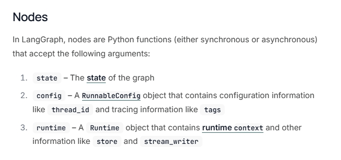
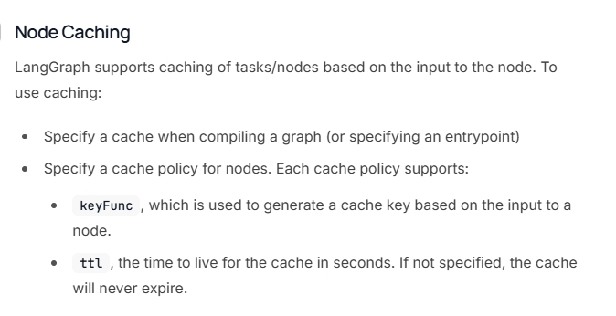
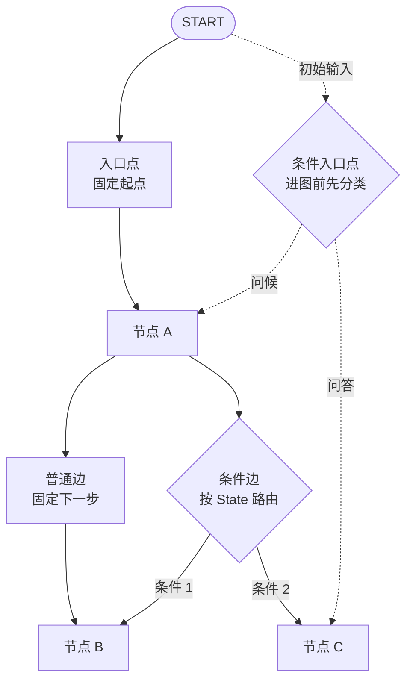
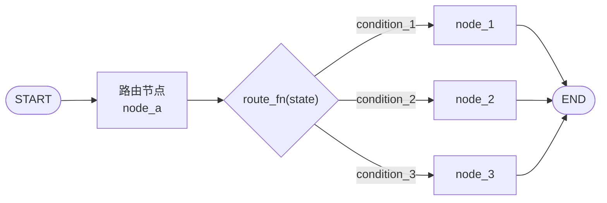
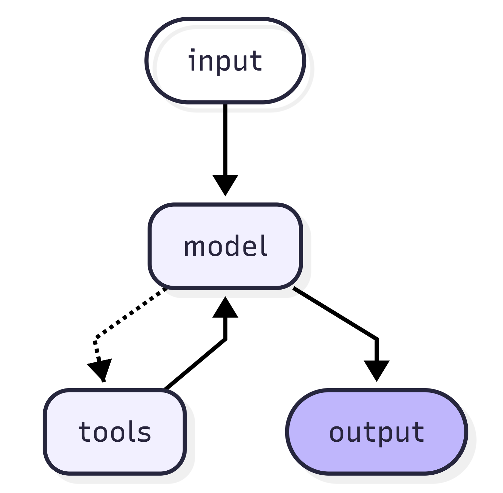
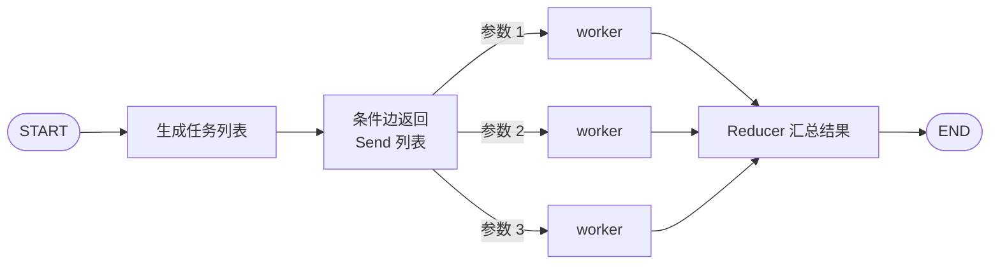
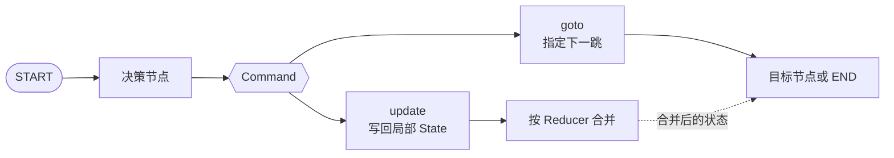
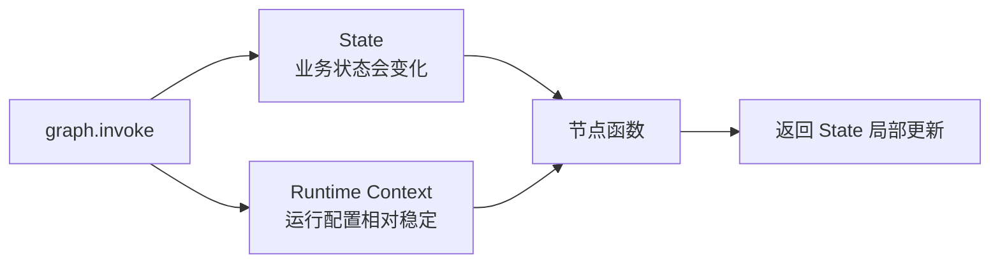
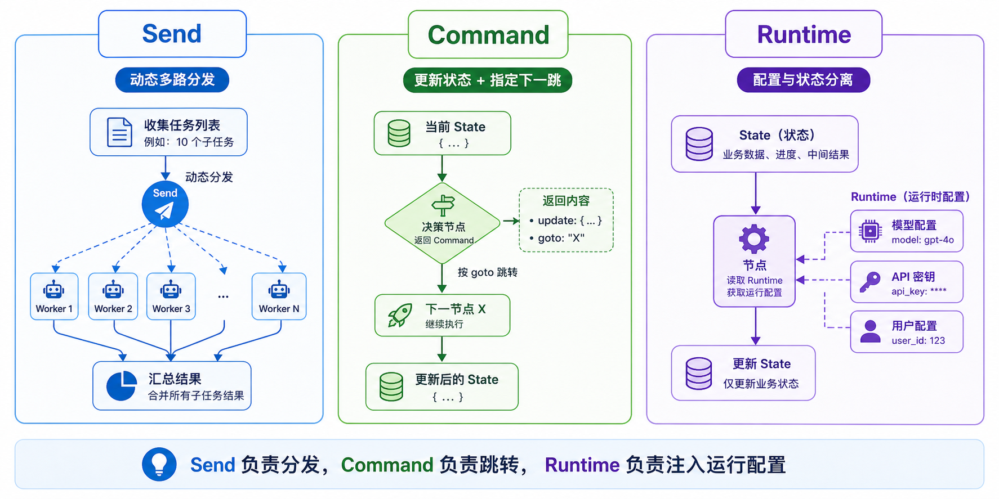

# 24 - LangGraph API：节点、边与进阶

---

**本章课程目标：**

- 理解 **Node（节点）** 的定义、职责与常见写法，知道节点为什么是 LangGraph 的最小执行单元。
- 掌握 **Edge（边）** 的核心类型：普通边、条件边、入口点、条件入口点，建立“图为什么能按规则流转”的直觉。
- 理解 **Send、Command、Runtime 上下文** 这三类进阶控制能力分别解决什么问题，知道它们和前面学过的 `Graph`、`State`、`Reducer` 是怎么接起来的。
- 能运行并理解本章全部案例，为后续更复杂的 LangGraph 工作流、多智能体和高级特性打基础。

**学习建议：** 这章可以当成 LangGraph 的“控制流”来读：Node 负责做事，Edge 负责决定去哪，Send / Command / Runtime 处理普通边不够用的场景。先跑明白普通边和条件边，再看动态分发、更新并跳转、运行时上下文。读完后能说清“这一步为什么不是固定下一跳”，就抓住了进阶 API 的用处。

**官方文档与资源**：详见 [工具导航与参考资料索引 - LangGraph](工具导航与参考资料索引.md#LangGraph)。

---

## 1、Graph API 之 Node（节点）

### 1.1 定义

在 LangGraph 里，**Node（节点）** 可以看作：**图中的一个可执行步骤**。它通常就是一个 Python 函数，可以是同步函数，也可以是异步函数。图运行时，框架会按边的连接关系，依次或并行地调度这些节点执行。

如果说 [第 23 章](23-LangGraphAPI：图与状态.md) 重点在讲“图里有哪些共享状态”，那本章开始讲的 Node，重点就在讲：**状态到了某一站之后，要做什么处理。**

Node 不是图上的装饰点，而是三件事的组合：

- 一段明确的处理逻辑
- 一次对当前 State 的读取
- 一次对 State 的局部更新

LangGraph 官方对 `StateGraph` 的定义里有一句非常核心的话：节点的签名可以写成 `State -> Partial<State>`。它的意思是：节点通常读取当前状态，然后只返回它想更新的那部分字段，而不是每次都把整份完整状态重新手写一遍。

### 1.2 节点的作用

Node 是图真正“干活”的地方。前面学过的 Graph、State、Reducer 更偏结构和机制，而节点负责承载具体业务逻辑。真实项目里，下面这些事情通常都写在节点里：

- 调用大模型
- 调用工具或外部 API
- 做检索、重排、格式化
- 做路由判断前的中间计算
- 记录某一步的结果、状态标记或错误信息

这三层关系可以这样看：

- **Graph** 负责整体流程结构
- **State** 负责共享数据
- **Node** 负责每一步具体做什么

### 1.3 节点函数一般长什么样

根据官方 Graph API 文档，LangGraph 节点常见可以接收三类参数：

- `state`：图当前这一步看到的共享状态
- `config`：本次运行的配置与元数据，类型通常是 `RunnableConfig`
- `runtime`：运行时对象，可访问 `context`、`store`、`stream_writer` 等

最常见的节点先从这一种开始记：

```python
def node(state: MyState) -> dict:
    return {"some_key": "new_value"}
```

这也是初学者最该先掌握的形态：**读 state，返回局部更新 dict。**

当你后面开始做更复杂的工作流时，再慢慢加入：

- `config`：适合放 `thread_id`、`tags`、`metadata`
- `runtime`：适合放模型名、数据库连接、API 密钥、环境配置这类不属于 State 的依赖



图里这三个词的层次建议这样记：

- `state` 是“业务数据”
- `config` 是“本次运行的配置和追踪信息”
- `runtime` 是“节点执行时可访问的运行环境能力”

`config` 和 `runtime` 这两个参数，通常由 LangGraph 运行时通过关键字方式自动注入。大多数场景里，你不需要手动组装它们；节点函数里是否声明这些参数，表达的是“这个节点需要哪些运行时信息”。

节点输出还有一条基本规则：**返回增量更新，不要把接收到的整个 State 原样或修改后整份返回出去。**

原因在于：

- LangGraph 会把节点返回值当成“本节点对状态的局部更新”
- 然后再按字段对应的 Reducer 规则，把这些更新合并回全局 State

所以更推荐的写法是：

```python
def node(state: MyState) -> dict:
    return {"result": "new_value"}
```

而不推荐把整份 `state` 直接修改后再整体 return。因为那样很容易带来两个问题：

- 没配置特殊 Reducer 的字段，会出现本不该被当前节点改动却被一起覆盖的情况
- 配置了 Reducer 的字段，如果节点把“不属于本节点职责的状态”也一并返回，后续合并结果会更难预测

节点只返回自己负责更新的字段。

从代码习惯上看，下面这种写法要尽量避免：

```python
def query_web(state: MyState) -> dict:
    state["web_result"] = "网络搜索结果"
    return state
```

它看起来省事，但问题是：调用者很难判断这个节点到底负责改哪些字段；如果 State 里有 `messages`、`retrieved_docs` 这类带 Reducer 的字段，整份返回还可能导致重复合并或覆盖误伤。

更推荐的写法是：

```python
def query_web(state: MyState) -> dict:
    return {"web_result": "网络搜索结果"}
```

**节点函数内部可以读完整 State，但离开节点时只交出自己的增量更新。** 这条规则和上一章的 Reducer 是一体的：节点负责产出更新，Reducer 负责合并更新。

### 1.4 START、END 与入口出口

在学节点时，经常会一起看到 `START` 和 `END`。它们不是你自己写的业务节点，而是 LangGraph 内置的两个**特殊虚拟节点**：

- `START` 表示图的入口
- `END` 表示图的结束

最常见的写法是：

```python
graph.add_edge(START, "node_a")
graph.add_edge("node_a", END)
```

这表示：图从 `node_a` 开始执行，`node_a` 执行完后流程结束。

如果图的入口出口很明确，也可以用：

- `set_entry_point(node_id)`
- `set_finish_point(node_id)`

它们是更简洁的语法糖，底层还是在帮你建立 `START -> node`、`node -> END` 这样的边。

### 1.5 节点设计建议

入门阶段，节点最容易被写成“什么都往里面塞”。但从真实项目角度看，节点更适合遵守下面几条原则：

- **单一职责**：一个节点尽量只做一件事
- **输入输出清楚**：看函数签名和返回值，就知道它依赖什么、更新什么
- **少依赖外部可变状态**：优先通过 State 或 Runtime 传值，而不是偷偷读全局变量
- **便于重试和缓存**：如果节点副作用太重，后面配置缓存或重试时会很难控

你可以先把节点理解成“图里的一个小服务”，而不是“图里的一大坨代码”。

### 1.6 案例：节点定义方式与 add_node

这个案例是第 24 章最基础、也最值得先跑通的 Node 例子。它主要演示三件事：

- 节点就是 Python 函数
- 节点除了最基本的 `state` 参数，还可以借助 `partial` 绑定额外参数
- `add_node(...)` 时除了传节点函数，还可以顺手挂上 `retry_policy`

【案例源码】`案例与源码-3-LangGraph框架/04-node/DefNode.py`

[DefNode.py](案例与源码-3-LangGraph框架/04-node/DefNode.py ":include :type=code")

这个案例用来建立一个基础直觉：**Node 的重点不是“函数怎么写花哨”，而是“如何被图注册、调度、配置”。**

### 1.7 节点缓存（Node Caching）

节点缓存解决的问题很实际：**某个节点很贵、很慢，但相同输入经常重复出现，能不能不要每次都重新跑？**

LangGraph 要真正命中缓存，通常要看三层：

- **节点声明缓存策略**：例如 `CachePolicy(key_func=..., ttl=...)`。
- **图编译时选择缓存后端**：例如 `compile(cache=InMemoryCache())`。
- **运行时判断是否命中**：按 `key_func` 生成缓存键，再根据 `ttl` 判断是否过期。

其中 `key_func` 决定“什么样的输入算同一次结果”，`ttl` 决定“这份结果能复用多久”。缓存后端可以是内存、Redis、SQLite 等，具体选型要看项目是否需要跨进程、跨机器或持久保存。

入门阶段先记住：**节点声明支持缓存，图编译时选择具体缓存后端。**



在真实项目里，缓存很适合这些节点：

- 纯计算节点
- 解析、格式化、清洗类节点
- 成本高但输入重复率高的外部调用节点

不太适合直接粗暴缓存的，则通常是：

- 强依赖实时数据的节点
- 带强副作用的节点
- 输入看起来一样，但实际上上下文不同的节点

### 1.8 案例：节点缓存

这个案例的学习重点不是记住 `ttl=8` 这个数字，而是看清楚两件事：

- `cache_policy=CachePolicy(...)` 是配置在节点上的
- `compile(cache=InMemoryCache())` 是在图编译时提供缓存后端

换句话说，**节点声明“我支持缓存”，图编译时再决定“实际用什么缓存”。**

【案例源码】`案例与源码-3-LangGraph框架/04-node/Node_Cache.py`

[Node_Cache.py](案例与源码-3-LangGraph框架/04-node/Node_Cache.py ":include :type=code")

### 1.9 错误处理与重试机制

重试机制解决的是另一个现实问题：**节点失败了，是不是应该立刻整个图报错，还是可以重试一下？**

LangGraph 用 `RetryPolicy` 来描述这件事。官方参考文档里，`RetryPolicy` 主要包含这些常见参数：

- `max_attempts`：最多尝试执行多少次，包含第一次正式执行。
- `initial_interval`：第一次重试前先等多久，通常以秒为单位。
- `backoff_factor`：每次重试后，等待时间按多少倍增长，用来做退避。
- `max_interval`：单次重试等待时间的上限，避免退避时间无限变长。
- `jitter`：是否在等待时间上加入一点随机扰动，降低“同时重试把服务再次打爆”的风险。
- `retry_on`：指定哪些异常值得重试；不符合条件的异常会直接抛出，而不是继续重试。

其中最关键的不是把参数全背下来，而是先分清楚两层语义：

- **时间策略**：多久重试一次，是否退避，是否加抖动
- **异常策略**：哪些异常应该重试，哪些异常不该重试

在真实项目里，建议先分清异常类型：

- **网络抖动、临时超时** 这类问题通常适合重试
- **参数错误、类型错误、业务逻辑错误** 通常不适合盲目重试

所以 `retry_on` 的价值是：**让重试更像工程策略，而不是“失败了就不加区分地再跑一遍”。**

### 1.10 案例：节点重试

这个案例适合重点观察三种情况：

- 默认重试策略是什么效果
- 自定义 `retry_on` 时，如何只对特定异常重试
- 哪些异常会直接失败，不会进入重试流程

【案例源码】`案例与源码-3-LangGraph框架/04-node/Node_ExpErrRetry.py`

[Node_ExpErrRetry.py](案例与源码-3-LangGraph框架/04-node/Node_ExpErrRetry.py ":include :type=code")

学完 Node 这一节后，你至少应该建立这个认识：**节点不只是“一个函数”，它还是图里的一个可配置执行单元，可以挂缓存、挂重试策略，也可以明确入口和出口。**

---

## 2、Graph API 之 Edge（边）

### 2.1 定义

如果说 Node 决定“这一站做什么”，那 **Edge（边）** 决定的就是：**这一站做完之后，下一步去哪里。** 边不是装饰性的连线，而是图的**流程控制规则**。

LangGraph 里最基础的两类边是：

- **普通边（Normal Edge）**：固定从 A 到 B
- **条件边（Conditional Edge）**：根据当前状态决定下一步去哪

围绕这两类边，又会延伸出：

- **入口点（Entry Point）**
- **条件入口点（Conditional Entry Point）**

它们共同回答的都是一个问题：**这张图到底怎么流转。**



**图注：** 普通边固定走向；条件边用函数选下一跳；入口点决定首次进入哪个节点；条件入口点在首跳前就做路由（适合“一进图先分类”）。

### 2.2 边的作用

很多人最开始会把注意力都放在节点函数本身，觉得“反正每个节点写好就行”。但从工作流角度看，真正决定图长什么样的，往往是边。

下面这些差别，主要由边来决定：

- 是固定顺序执行，还是动态路由
- 是单入口，还是入口就分流
- 是一条线走到底，还是中间多分支汇聚
- 是普通顺序链，还是更接近小型决策系统

所以可以说：**Node 让图有处理能力**、**Edge 让图有流程结构**。

### 2.3 普通边（Normal Edges）

普通边是最容易理解的一种：**执行完当前节点后，无条件进入下一个节点。**

最典型的写法就是：

```python
builder.add_edge("node_a", "node_b")
```

这行代码的意思很简单：`node_a` 跑完，就去 `node_b`，没有判断、没有分支。


**图注：** 左侧为课件示例代码，右侧为线性拓扑；编译时若边指向未注册的节点会报错。

普通边的学习重点不只是会写 `add_edge`，而是建立一个直觉：图最基础的形态就是一条固定路径。很多复杂图，都是先从普通边搭出来，再逐步加入条件边、Send、Command。

### 2.4 案例：普通边

这个案例演示的是最基础的线性图：`START -> node_a -> node_b -> node_c -> END`

重点不是业务逻辑，而是看清楚：**当边是固定的，图就像一条声明式的工作流链。**

【案例源码】`案例与源码-3-LangGraph框架/05-edge/Edge_Normal.py`

[Edge_Normal.py](案例与源码-3-LangGraph框架/05-edge/Edge_Normal.py ":include :type=code")

### 2.5 条件边（Conditional Edges）

当流程不是“固定从 A 到 B”，而是“做完 A 后，要根据当前状态决定下一步去哪”，就需要条件边。

LangGraph 常见写法是：

```python
graph.add_conditional_edges("node_a", route_fn, mapping)
```

这里可以拆成三部分理解：

- `"node_a"`：从哪个节点出发做路由
- `route_fn`：根据当前状态返回路由结果
- `mapping`：把路由结果映射到具体目标节点

比起 API 形式，更应该先抓住这句：

**条件边 = 节点执行完后，再根据当前状态决定下一步去哪。**



### 2.6 案例：条件边

这两个案例共同说明一件事：**条件边是在图层做路由，而不是把所有判断都塞回节点函数内部。**

你可以重点观察：

- 一个案例用布尔值或简单条件做分支
- 另一个案例用字符串 key + mapping 做多分支映射

【案例源码】`案例与源码-3-LangGraph框架/05-edge/Edge_Conditional.py`、`Edge_ConditionalV2.py`

[Edge_Conditional.py](案例与源码-3-LangGraph框架/05-edge/Edge_Conditional.py ":include :type=code")

[Edge_ConditionalV2.py](案例与源码-3-LangGraph框架/05-edge/Edge_ConditionalV2.py ":include :type=code")

### 2.7 入口点与条件入口点

前面的条件边是在“某个节点执行完之后再分支”，而入口点相关能力解决的是另一个问题：**图一开始从哪里进入。**

最常见的两种情况是：

- **入口点（Entry Point）**：图总是从同一个节点开始
- **条件入口点（Conditional Entry Point）**：图启动时，就要先判断输入，再决定从哪个节点开始

可以这样区分：

- **普通入口点**：固定起点
- **条件入口点**：动态起点

这一点在真实项目里特别有用，因为很多系统刚接到请求时，就需要先做一级路由。比如：

- 问候语走问候处理
- 告别语走结束处理
- 普通问题走问答流程

### 2.8 案例：入口点与条件入口点

这两个案例分别对应：

- 用 `set_entry_point` / `set_finish_point` 指定固定入口出口
- 从 `START` 上直接挂条件边，按初始输入决定进入哪条处理链

【案例源码】`案例与源码-3-LangGraph框架/05-edge/Edge_EntryPoint.py`、`Edge_ConditionalEntryPoint.py`

[Edge_EntryPoint.py](案例与源码-3-LangGraph框架/05-edge/Edge_EntryPoint.py ":include :type=code")

[Edge_ConditionalEntryPoint.py](案例与源码-3-LangGraph框架/05-edge/Edge_ConditionalEntryPoint.py ":include :type=code")

### 2.9 条件边还能构成循环结构

条件边不只能做分支，也能做循环。

例如：

- 某个节点先做一次判断
- 如果条件满足，就继续走下一个处理节点
- 处理完后再回到前一个判断节点
- 直到某个终止条件满足，再走向 `END`

这类结构在 LangGraph 里很常见，尤其是：

- Agent 的 ReAct 循环
- “检索不够就继续补检索”的循环
- 多步规划执行里的“继续 / 停止”判断

ReAct 就是最典型的例子：输入进入模型节点，模型可能直接输出，也可能先调用工具；工具结果再回到模型节点，由模型继续判断是否已经可以回答。



这类循环之所以适合 LangGraph，是因为它有几个天然难点：

- 下一步不是固定的，模型可能选择工具，也可能直接回答。
- 工具结果需要回写 State，下一轮模型判断要能读到。
- 循环必须有退出条件，否则会一直“模型想一想、工具查一查、再想一想”。
- 线上项目还要能观察当前跑了几轮、卡在哪一步、是否需要人工介入。

但循环结构有一个隐藏风险：**如果终止条件设计得不对，图可能一直循环下去。**

LangGraph 为此提供了 `recursion_limit` 这类保护机制。它的作用就是：**给图执行设置一个上限，防止工作流无休止地反复调度。**

这里的重点不在于死记默认值，而是把循环当成一种需要设计边界的流程结构：

- 条件边可以形成循环
- 循环结构必须认真设计终止条件，例如“没有工具调用了”“评分达标了”“重试次数达到上限了”
- 真实项目里最好配合 `recursion_limit` 这类步数保护，避免图跑飞
- 一旦触发递归限制，应当把它当成流程设计信号，而不是简单把数字调大了事

### 2.10 边的选型

学完这一节后，重点不在于背“有几种边”，而在于知道什么时候该选哪一种：

| 场景                           | 更适合的做法 | 理解方式         |
| ------------------------------ | ------------ | ---------------- |
| 步骤固定，先后顺序明确         | 普通边       | 一条声明式流水线 |
| 某一步之后要按状态分流         | 条件边       | 节点后置路由     |
| 图总是从同一个地方开始         | 入口点       | 固定起点         |
| 图一开始就要先分类再进不同流程 | 条件入口点   | 动态起点         |

常见误区是：一看到判断，就把大量 `if/else` 全写进节点里。更稳的做法是：**节点负责处理，边负责流转。** 这样图结构更清楚，也更容易可视化和调试。

---

## 3、Send、Command 与 Runtime 上下文

### 3.1 三类问题

学完 Node 和 Edge 之后，你已经能搭出很多正常的图了。但真实项目里很快会遇到三类更复杂的问题：

- 下一步不是固定一个节点，而是一批动态生成的子任务。
- 某个节点不仅要更新状态，还要决定下一跳。
- 某些配置不属于 State，但节点运行时必须拿得到。

Send、Command、Runtime 分别就是在回答这三类问题。

从这一节开始，我们看的就是普通节点、普通边、条件边之外更灵活的控制原语。

### 3.2 Send：动态分发

`Send` 主要解决的问题是：**上游节点产出了一批任务，任务数量运行时才知道，而你想把这批任务分发给同一个下游节点分别处理。**

这正是典型的 Map-Reduce 思路：

- **Map**：先把大任务拆成很多小任务
- **Reduce**：小任务各自完成后，再把结果汇总

LangGraph 里，条件边函数可以返回 `Sequence[Send]`。每个 `Send` 都包含两部分：

- 目标节点名
- 要传给该节点的那份状态

`Send` 允许图在运行时动态决定开出多少条分支，而且每条分支可以拿到不同版本的状态。并行分支写回同一状态字段时，通常要在 State 上配置合适的 [Reducer](23-LangGraphAPI：图与状态.md)（例如列表追加），否则结果难以汇总。



这和普通条件边的区别要分清楚：

- **普通条件边**：通常决定“下一步走哪一个节点”
- **Send**：决定“下一步要开出多少个任务，每个任务分别带什么状态去哪个节点”

### 3.3 案例：Send

这个案例可以用来理解 LangGraph 的并行思维：

- 上游节点先生成一批主题
- 条件边函数把这些主题映射成一组 `Send`
- 下游节点针对每个主题分别生成笑话
- 最后通过 Reducer 把多路结果合并回 State

【案例源码】`案例与源码-3-LangGraph框架/06-specialApi/SendDemo.py`

[SendDemo.py](案例与源码-3-LangGraph框架/06-specialApi/SendDemo.py ":include :type=code")

从项目角度看，Send 很适合这些场景：

- 文档分片后并行处理
- 多查询并行检索
- 一批候选任务并行评分
- 多个主题、多条记录、多段文本的批量处理

### 3.4 Command：更新并跳转

如果说条件边只负责“去哪”，那 `Command` 解决的是另一个很常见的需求：**某个节点在做完判断后，既想更新状态，又想直接决定下一步去哪。**

`Command` 可以把状态更新和控制流放到同一次返回里。

最常见的两个参数是：

- `update`：当前节点希望写回 State 的局部更新内容，仍然会按字段对应的 Reducer 规则合并。
- `goto`：当前节点执行完后，希望图下一步跳转到哪个节点；也可以直接跳到 `END` 结束流程。

一个节点可以：

- 一边返回新的状态更新
- 一边直接告诉图“下一步去哪个节点”

这和条件边的边界要分清楚：

- **条件边**：通常更适合“节点做完了，再单独根据状态决定去哪”
- **Command**：更适合“这个节点本身就是决策点，离开时把状态和去向一起交代清楚”



### 3.5 案例：Command

这个案例特别适合放在“决策节点”语境下理解。你可以重点观察：

- 为什么 `decision_agent` 返回的不是普通字典，而是 `Command(...)`
- 为什么它既能写入 `messages`、`current_agent`、`task_completed`
- 又能同时用 `goto` 把流程交给下一个节点，或者直接去 `END`

【案例源码】`案例与源码-3-LangGraph框架/06-specialApi/CommandDemo.py`

[CommandDemo.py](案例与源码-3-LangGraph框架/06-specialApi/CommandDemo.py ":include :type=code")

在真实项目里，Command 很适合：

- 决策节点
- Agent 交接节点
- 人机闭环中的“继续 / 暂停 / 转人工”节点
- 需要边写日志边转发流程的节点

这里先埋一个后续伏笔：第 25 章会讲 `interrupt`。图运行到某个节点时暂停，把待审核数据交给图外用户；用户处理完后，再用 `Command(resume=...)` 把结果送回图内继续执行。`Command` 不只表达“下一跳去哪”，也会出现在“暂停后恢复”的人机闭环里。

### 3.6 Runtime：配置与状态分开

前面我们一直在强调 State，但真实项目里并不是所有数据都该放进 State。比如下面这些东西：模型名、API Key、数据库连接、用户环境配置、当前运行的外部依赖对象。

它们通常都不属于“图在节点间流转的业务状态”，而更像是**这次运行的静态上下文**。这时就更适合放进 Runtime 上下文，而不是硬塞进 State。

官方 Graph API 和 `Use the graph API` 指南都强调了这一点：**运行时配置可以通过 `context_schema` 声明，并在调用图时通过 `context=...` 传入。**

所以可以把两者的区别记成：

- **State**：会随着图运行不断变化的共享业务数据
- **Runtime Context**：本次运行里节点可读、但不应混入业务状态的静态依赖或配置



### 3.7 Runtime 的基本用法

Runtime 上下文通常分三步：

1. 定义 `context_schema`
2. 创建图时挂到 `StateGraph(..., context_schema=...)`
3. 执行图时通过 `invoke(..., context=...)` 传入，节点里用 `runtime.context` 读取

这里的 `context_schema` 就是一份**运行时配置的结构声明**。

Runtime 的价值就是把“配置”和“状态”拆开。拆开之后，State 更干净，节点测试更轻松，不同环境、不同模型、不同依赖的切换成本也更低。

### 3.8 案例：Runtime Context

这个案例重点看三件事：

- `ContextSchema` 是怎么定义的
- `StateGraph(..., context_schema=ContextSchema)` 是怎么把运行时上下文挂到图上的
- 节点里怎么通过 `runtime.context.xxx` 读取配置

【案例源码】`案例与源码-3-LangGraph框架/06-specialApi/RuntimeContextDemo.py`

[RuntimeContextDemo.py](案例与源码-3-LangGraph框架/06-specialApi/RuntimeContextDemo.py ":include :type=code")

### 3.9 图执行时，外部能看到什么

前面讲 Runtime 时提到了 `stream_writer`。顺着这条线再往外看：图的最终结果，不一定只能等到 `invoke()` 全部结束后才能拿到。

因为 LangGraph 图本身实现了 Runnable 接口，所以也支持：`stream()`、`astream()`。

这意味着你可以在图执行过程中逐步拿到中间信息。常见模式有下面几类：

- `values`：每一步输出当前完整状态
- `updates`：每一步只输出增量更新
- `custom`：输出节点内部通过 `runtime.stream_writer(...)` 主动写出的自定义数据
- `messages`：在调用 LLM 的节点中，流式拿到消息片段或 token
- `debug`：输出更完整的调试信息

真实项目里经常会遇到这些需求：

- 前端希望边跑边展示当前步骤
- LLM 生成时希望 token 级别流式输出
- 长流程执行时，希望知道现在卡在哪个节点
- 调试复杂图时，希望观察每一步到底更新了什么

因此，`invoke()` 更像“等整张图跑完再拿结果”，`stream()` 更像“边跑边看图内部发生了什么”。

### 3.10 Send、Command、Runtime 怎么区分

Send、Command、Runtime 容易混，可以用下面这张表来记：

| 能力        | 它解决的问题                        | 理解方式               |
| ----------- | ----------------------------------- | ---------------------- |
| **Send**    | 动态开出多路子任务                  | 运行时并行分发         |
| **Command** | 节点离场时同时更新状态并指定下一跳  | 决策节点的“一次性交代” |
| **Runtime** | 给节点注入不属于 State 的配置与依赖 | 配置和状态分离         |



- **Send**：一件事拆成很多小事并行去做
- **Command**：这个节点现在就决定接下来谁来接手
- **Runtime**：这次运行需要的环境配置别塞进 State

---

**章节思考题：**

1. 一个真实工作流里，怎么判断某段逻辑该放 Node 还是 Edge？

   **参考思路：** 做业务处理、调用模型、检索、转换数据，放 Node；决定下一步去哪，放 Edge 或控制对象。把处理和流转混在一起，图会很快失去可读性。

2. 条件边和 `Command` 都能影响下一跳，它们的区别在哪里？

   **参考思路：** 条件边把路由逻辑放在图结构外侧，更适合清晰分支；`Command` 让节点返回状态更新的同时指定下一跳，更适合节点处理结果本身就决定控制流的场景。选择时看路由逻辑属于图，还是属于节点结果。

3. `Send` 适合解决什么问题？什么时候不该用？

   **参考思路：** 它适合运行时动态拆出多路子任务，比如对多个文档、多个查询并行处理。如果任务数量固定、顺序明确，用普通边或并行结构可能更清楚。

4. Runtime Context 为什么不应该塞进 State？

   **参考思路：** Runtime 放配置、依赖和执行环境，比如客户端、用户上下文、模型参数；State 放业务流转数据。混在一起会导致状态不可序列化、难恢复，也让业务数据和运行环境耦合。

5. 为什么循环图需要设计退出条件和步数保护？

   **参考思路：** Agent / ReAct / 自我修正流程天然可能反复执行，如果没有清晰退出条件，图会一直调度下去。`recursion_limit` 是最后一道保护，但真正可靠的设计还要在 State 中记录重试次数、评分结果或工具调用状态，让条件边能稳定走向 `END`。

**本章小结：**

- **Node** 是 LangGraph 的最小执行单元，可以理解为被图调度的 Python 函数；除了最常见的 `state -> dict` 形式，还可以结合缓存、重试策略、`config`、`runtime` 使用。
- **Edge** 决定流程怎么流转。普通边适合固定路径，条件边适合状态驱动分支，入口点和条件入口点则决定图从哪里开始。
- **Send、Command、Runtime** 是三种常用进阶能力：Send 适合动态并行分发，Command 适合决策节点，Runtime 适合把配置和状态拆开。
- 这一章的重点在于建立一个完整认知：**节点负责处理，边负责流转，State 负责共享数据，进阶控制原语负责让图在运行时更灵活。** 学完本章后，你应当能够分清 **Node** 和 **Edge** 的职责，知道普通边、条件边、入口点、条件入口点分别适合什么场景，并理解 `Send`、`Command`、`Runtime` 三个进阶能力各自解决什么问题。

**建议下一步：**

建议先按顺序跑一遍 `04-node`、`05-edge`、`06-specialApi` 目录下全部案例，再进入后续 LangGraph 进阶章节。如果你能自己把一个“分类 → 分流 → 并行处理 → 汇总回答”的小工作流手写出来，这一章就真正学会了。
