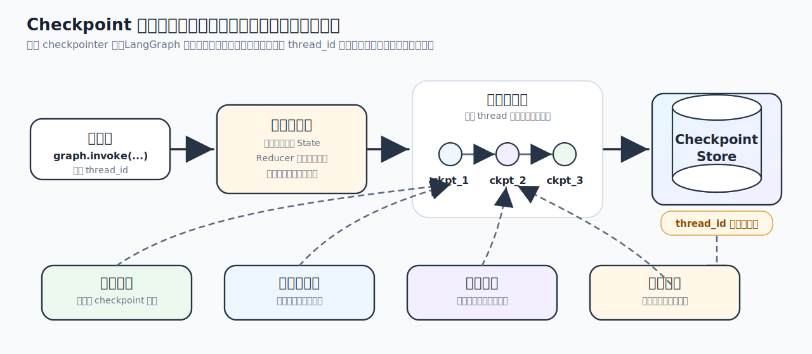
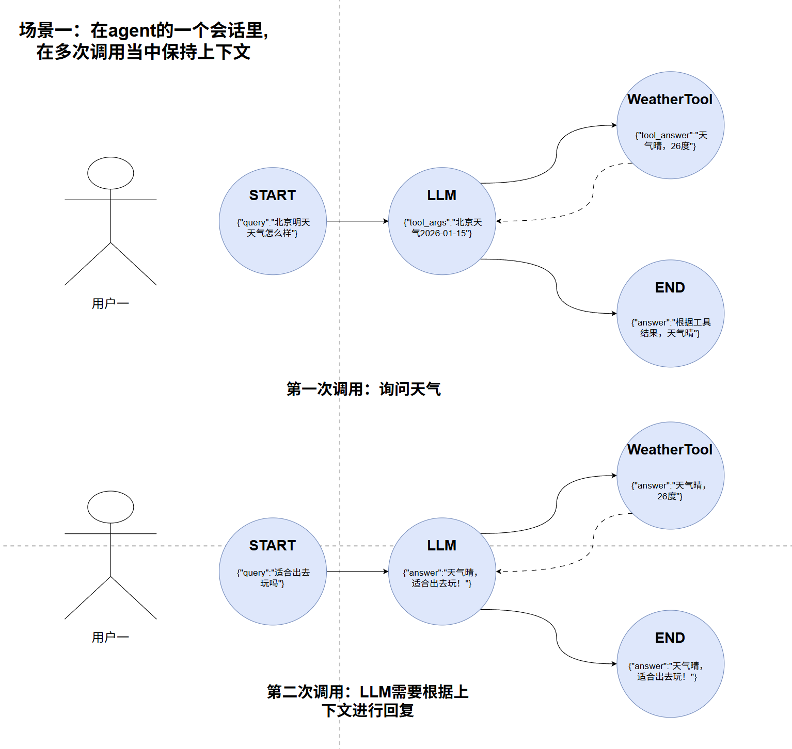
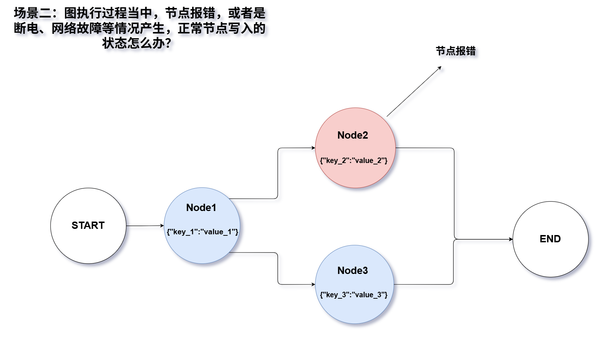
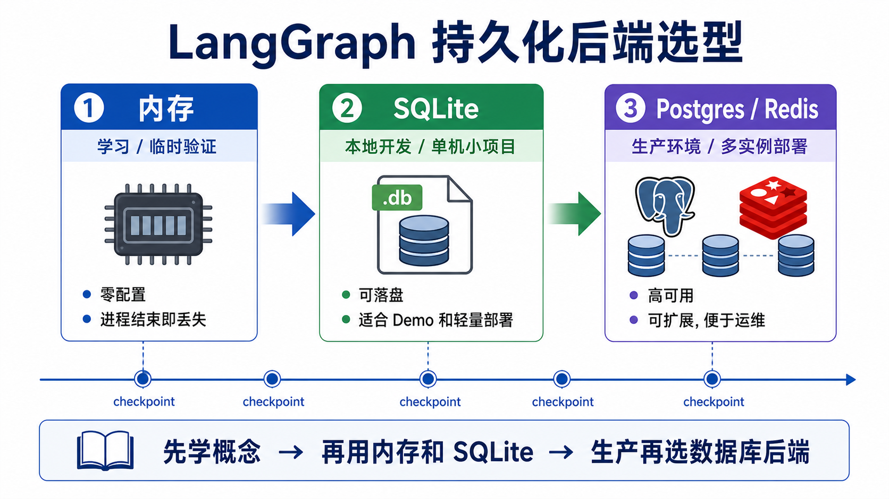
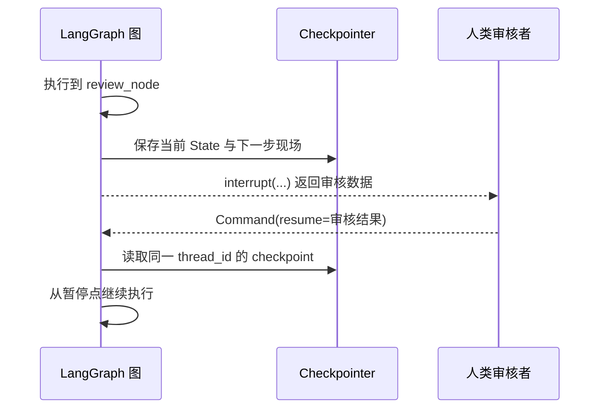
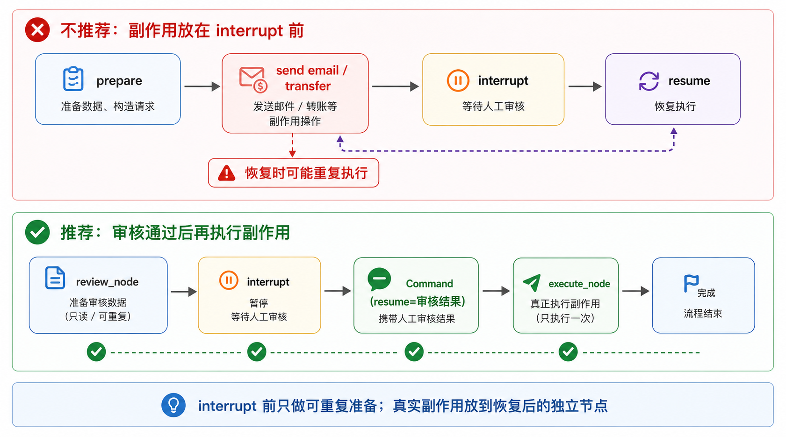
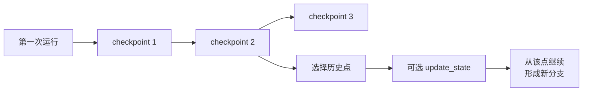
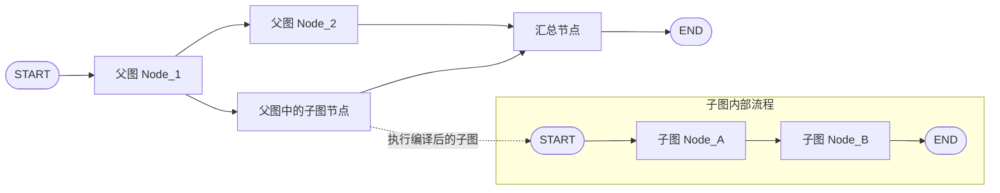

# 25 - LangGraph 高级特性

---

**本章课程目标：**

- 理解 LangGraph 的五类高级能力：**流式处理（Streaming）**、**状态持久化（Persistence）**、**人机协作与中断恢复（Interrupt / HITL）**、**时间回溯（Time-Travel）**、**子图（Subgraphs）**。
- 建立一个更工程化的认知：这些能力不是零散 API，而是 LangGraph 为真实生产场景提供的“可观测、可恢复、可复用、可扩展”的基础设施。
- 能运行并理解本章全部案例，知道这些高级特性分别解决什么问题、适合放在什么场景里使用。

**学习建议：** 这章按真实项目的优先级读：流式解决“看不见进度”，持久化解决“状态接不上、失败要重跑”，Interrupt 解决“关键动作要人审”，时间回溯偏调试复盘，子图偏复用拆分。每学一个特性，先问它解决哪类痛点，再看 API。

**官方文档与资源**：详见 [工具导航与参考资料索引 - LangGraph](工具导航与参考资料索引.md#LangGraph)。

---

## 1、流式处理（Streaming）

### 1.1 定义

在很多人的印象里，“流式输出”常常只等于“大模型逐 token 打字机式输出”。但放到 LangGraph 里，流式处理的范围更大。它不仅能输出模型生成过程，还能把**图执行过程中的状态变化、节点进度、子图过程、自定义消息**一边执行一边暴露出来。

这也是 LangGraph 流式处理和普通模型流式输出最大的区别：

- **普通 LLM 流式**：更关注“模型文字怎么一点点吐出来”
- **LangGraph 流式**：更关注“整张图现在跑到哪一步了，状态发生了什么变化”

所以你可以先把 LangGraph Streaming 理解成：**把图执行过程拆开给你看，而不是等整张图完全跑完才给最终结果。**

### 1.2 流式处理的价值

流式处理不是“锦上添花”的体验优化，而是很多 AI 应用的重要基础能力。真实项目里常见需求包括：

- 前端希望边执行边展示当前进度，而不是长时间白屏等待
- 调用大模型时，希望 token 级别实时显示
- 工作流较长时，希望知道当前执行到哪个节点
- 调试复杂图时，希望看到每一步到底更新了什么状态
- 子图或工具内部有重要中间结果，希望在最终结果出来前先看到过程

它有两层价值：**用户体验层**，让用户更早感知任务正在执行；**工程调试层**，让开发者更容易观察图内部发生了什么。

### 1.3 stream() 与 invoke()

先分清这两个入口：

- `invoke()`：等整张图跑完，再返回最终结果
- `stream()` / `astream()`：图在运行过程中，就把中间结果分批往外送

- 如果你只关心最后结果，用 `invoke()`
- 如果你想一边执行一边观察，用 `stream()` 或 `astream()`

LangGraph 图本身实现了 **Runnable** 接口，所以自然拥有这些流式能力。这也让它和 [LangChain `Runnable` / LCEL](15-LCEL与链式调用.md) 体系能够衔接起来。

这里还要补一个关键参数：`stream_mode`。`stream()` 不是只有一种固定输出格式，`stream_mode` 决定了“图在执行过程中，到底往外流什么”，比如完整状态、增量更新、模型消息片段，或自定义进度信息。

### 1.4 stream_mode 有哪些

LangGraph 通过 `stream_mode` 指定“到底想流什么”。

当前最常见、最值得你先掌握的模式有这些：

| 模式       | 含义                                  |
| ---------- | ------------------------------------- |
| `values`   | 每一步结束后输出当前完整状态快照      |
| `updates`  | 每一步结束后只输出本步的增量更新      |
| `messages` | 输出 LLM 生成过程中的消息片段 / token |
| `custom`   | 输出节点内部主动写出的自定义消息      |
| `debug`    | 输出更完整、更底层的调试信息          |

如果你想同时拿到多种流，可以直接传列表，例如：

```python
stream_mode=["updates", "custom"]
```

这时返回的流式结果通常会带上“当前是哪一种模式的数据”。

### 1.5 values 和 updates 怎么区分

这是本章里最容易混的一组概念。

- `values`：每一步都给你“当前完整 State 长什么样”
- `updates`：每一步只给你“这一小步到底改了哪些字段”

从调试体验上说：

- `values` 更像“每一步的全量快照”
- `updates` 更像“每一步的增量日志”

### 1.6 案例：流图状态（values / updates）

这个案例就是用最直接的方式，把 `values` 和 `updates` 的差别跑给你看。它的重点不是业务逻辑，而是让你建立一个流式观察状态变化的直觉。

【案例源码】`案例与源码-3-LangGraph框架/07-senior/streaming/StreamGraphState.py`

[StreamGraphState.py](案例与源码-3-LangGraph框架/07-senior/streaming/StreamGraphState.py ":include :type=code")

### 1.7 案例：多模式流与 debug

当你把 `stream_mode` 设成列表时，一次运行里就能同时拿到多种类型的流。这个案例最值得观察的是：

- 多种模式一起开时，输出长什么样
- `debug` 模式为什么更适合调试，而不是直接拿去做业务 UI

【案例源码】`案例与源码-3-LangGraph框架/07-senior/streaming/StreamMultipleModes.py`

[StreamMultipleModes.py](案例与源码-3-LangGraph框架/07-senior/streaming/StreamMultipleModes.py ":include :type=code")

### 1.8 案例：LLM 逐 token 流式输出（messages）

如果某个节点里调用了大模型，`messages` 模式就特别有价值。它可以帮助你在图运行过程中，直接拿到模型生成的消息片段，而不用等节点完全执行完。

这也是为什么 LangGraph Streaming 不只是“图状态流”，它还能把模型输出也纳入统一流式体系。

【案例源码】`案例与源码-3-LangGraph框架/07-senior/streaming/StreamLLMTokens.py`

[StreamLLMTokens.py](案例与源码-3-LangGraph框架/07-senior/streaming/StreamLLMTokens.py ":include :type=code")

### 1.9 案例：自定义数据流（custom）

有时候你想流的不是状态，也不是 token，而是业务自定义进度。例如：

- “正在检索知识库”
- “正在生成回答”
- “当前进度 60%”

这时就可以在节点内部通过流写入器主动写出自定义数据，然后用 `custom` 模式接收。

这两个案例的关系如下：

- `StreamCustomDataSimple.py`：先看最小可运行版本
- `StreamCustomData.py`：再看更贴近真实项目的进度与组合模式写法

【案例源码】`案例与源码-3-LangGraph框架/07-senior/streaming/StreamCustomDataSimple.py`

[StreamCustomDataSimple.py](案例与源码-3-LangGraph框架/07-senior/streaming/StreamCustomDataSimple.py ":include :type=code")

【案例源码】`案例与源码-3-LangGraph框架/07-senior/streaming/StreamCustomData.py`

[StreamCustomData.py](案例与源码-3-LangGraph框架/07-senior/streaming/StreamCustomData.py ":include :type=code")

### 1.10 小结：什么时候该用哪种流

| 需求                   | 更适合的模式 |
| ---------------------- | ------------ |
| 想看整张图当前完整状态 | `values`     |
| 想看每一步改了什么     | `updates`    |
| 想看 LLM token         | `messages`   |
| 想推送业务自定义进度   | `custom`     |
| 想详细调试图内部执行   | `debug`      |

---

## 2、状态持久化（Persistence）

### 2.1 定义

如果说流式处理解决的是“图在运行过程中怎么被看见”，那状态持久化解决的是另一个问题：**图跑到一半、跑完之后，状态能不能被记住，并在下次继续使用。**

LangGraph 的持久化核心围绕 **checkpoint（检查点）** 展开。给图配置 checkpointer 后，图在执行过程中会把状态保存成一个个检查点。被保存的字段与合并规则，仍由你在 [第 23 章](23-LangGraphAPI：图与状态.md) 定义的 **State / Reducer** 决定。

这些检查点会被组织到某个 **thread** 下面。入门阶段，可以先把 thread 理解成“同一条会话或同一条工作流链路”的 ID 容器，而最常见的就是通过：

```python
{"configurable": {"thread_id": "..."}}
```

来区分不同对话、不同用户或不同执行线程。



**图注：** 上图概括 **Checkpoint 在生产场景中的价值**（存档、容错、断点续跑、回溯与审计）；`thread_id` 则用于在存储侧把同一对话/任务链的检查点归并到一条「线程」下，与图中「按步落盘」互补。

### 2.2 持久化的价值

LangGraph 的很多高级能力，其实都建立在持久化之上。官方文档里明确提到，持久化是这些能力的基础：

- 人工介入（human-in-the-loop）
- 对话 / 线程级记忆
- 时间回溯（time-travel）
- 容错恢复（fault-tolerant execution）

持久化不是“额外加的一层存储”，而是 LangGraph 适合做生产级 Agent / Workflow 的关键原因之一。

### 2.3 常见场景

先不急着看 Checkpointer 后端，先把持久化最常解决的两个场景想明白。

**场景一：同一个 Agent 会话里，多次调用之间保持上下文。**

比如用户第一次问：“北京明天天气怎么样？”Agent 调用天气工具得到“晴，26 度”。第二次用户接着问：“适合出去玩吗？”如果没有持久化，第二次调用只看到当前问题，很可能不知道“出去玩”指的是北京明天；如果同一条会话共用同一个 `thread_id`，图就能从 checkpoint 里接上前面的消息和工具结果。



**场景二：图执行到一半时，某个节点报错、断电或网络故障，希望修好后从中间继续。**

比如 `Node1` 已经正常写入了 `key_1`，`Node2` 报错了。我们通常不希望修复 `Node2` 后又从 `START` 全量重跑一次，尤其是前面节点可能很慢、很贵、或者已经产生了外部副作用。只要状态已经落到持久化后端，后续就有机会从最近的 checkpoint 继续。



这两个场景分别对应两种常见价值：

- **会话连续性**：同一用户、同一任务、同一线程里的多轮调用可以共享上下文。
- **故障恢复**：长流程中途失败后，尽量从已保存的执行现场继续，而不是全部重来。

### 2.4 Checkpointer 与 thread_id

要让图保存状态，通常有三步：

1. 创建一个 checkpointer，例如 `InMemorySaver()`、`SqliteSaver(...)`。
2. 编译图时传入：`builder.compile(checkpointer=checkpointer)`。
3. 调用图时传入 `config={"configurable": {"thread_id": "..."}}`。

`thread_id` 很容易被误解。它不是 Python 线程 ID，也不表示操作系统线程；在 LangGraph 语境里，它更像是**状态空间的隔离 ID**。同一个 `thread_id` 下，图可以接上历史状态；换一个新的 `thread_id`，就是另一条独立会话或任务链。

从故障中恢复时，还会看到一个很常见的写法：

```python
graph.invoke(None, config={"configurable": {"thread_id": "user-001"}})
```

这里传 `None` 的意思不是“没有输入”，而是告诉图：**不要重新初始化一份新状态，而是沿用这个 thread 最近保存的状态继续推进。** 当然，真实项目里是否可以这样恢复，还取决于你的节点是否幂等、错误是否已修复、checkpoint 是否已经保存到了可靠后端。

### 2.5 历史状态

持久化还带来一个直接收益：你可以查看某条 thread 的状态历史。常见 API 是：

- `graph.get_state(config)`：获取最近一次状态快照。
- `graph.get_state_history(config)`：获取历史状态快照序列。

这些状态快照可以帮助你回答几个排障问题：

- 当前图最后停在什么状态？
- 下一步准备执行哪个节点？
- 中间某一步到底写入了哪些字段？
- 如果要做时间回溯，应该从哪一个 checkpoint 开始？

这和第 23 章讲过的 `StateSnapshot` 是一条线：`values` 让你看到当前状态，`next` 让你知道下一步，`config` / `parent_config` 帮你串起 checkpoint 链，`interrupts` 用来记录等待处理的人机中断。

### 2.6 短期记忆：Checkpointer

在 LangGraph 语境里，最常先接触到的是 **Checkpointer**。

这里说的 Checkpointer，主要做两件事：

- 按 `thread_id` 保存图的执行状态
- 让同一个线程下的多次调用可以继续沿用之前的状态

所以 Checkpointer 更像是：**线程内、会话内、工作流运行期的短期记忆。**

这和你前面学过“消息历史”“短期记忆”的主线，是能够串起来的。区别在于，这里不是单独记消息，而是记**整张图的状态快照**。

### 2.7 长期记忆：Store / BaseStore

只用 Checkpointer 还不够，因为它更偏“同一条线程内部的连续状态”。那如果我们想跨线程、跨会话保存长期信息呢？

这就轮到 **Store** 出场了。

官方 Persistence 文档里把它解释得很清楚：**Checkpointer 保存线程内状态，Store 用来保存跨线程共享的长期信息。**

所以两者最核心的区别可以这样记：

- **Checkpointer**：保存图在某条 thread 里的运行状态
- **Store / BaseStore**：保存跨 thread、跨会话仍然要长期保留的数据

例如：

- 用户偏好
- 长期业务事实
- 跨会话共享的知识片段

这些都更适合放 Store，而不是硬塞进单条 thread 的 checkpoint 链里。

### 2.8 持久化后端怎么选

从本地学习到真实部署，持久化后端通常会有一个很自然的演进路线：

- **内存**：适合学习和临时验证
- **SQLite**：适合本地开发、小型项目、单机轻量部署
- **Postgres / Redis / 其他数据库后端**：更适合生产环境



### 2.9 案例：内存检查点（MemoryPersistence）

这个案例用来建立“checkpoint 到底是什么”的第一层理解。因为它不需要额外数据库配置，能让你专注观察：

- 同一条 thread 下状态是怎么延续的
- 为什么图执行完后，状态还能被后续调用接上

【案例源码】`案例与源码-3-LangGraph框架/07-senior/state_persistence/MemoryPersistence.py`

[MemoryPersistence.py](案例与源码-3-LangGraph框架/07-senior/state_persistence/MemoryPersistence.py ":include :type=code")

### 2.10 案例：SQLite 检查点（SqlitePersistence）

当你已经理解内存版 checkpoint，再看 SQLite 会更顺。这个案例更像是在回答：**如果我不想让状态只存在进程内，而想把它真正保存到本地数据库里，怎么做？**

它也很适合作为“从学习版走向更接近真实部署版”的过渡。

【案例源码】`案例与源码-3-LangGraph框架/07-senior/state_persistence/SqlitePersistence.py`

[SqlitePersistence.py](案例与源码-3-LangGraph框架/07-senior/state_persistence/SqlitePersistence.py ":include :type=code")

### 2.11 案例：预构建 Agent 与持久化（AgentPersistence）

这个案例把前面 LangChain Agent 那条主线和 LangGraph 持久化连起来了。即使你用的是高层的 `create_agent`，底层依然能借助 LangGraph 的持久化能力，让同一 `thread_id` 下的多轮对话具有连续性。

这也能帮助你建立一个更完整的认知：

- LangGraph 不只是“你手写图时才会用到”
- 它的持久化能力也会支撑更高层的 Agent 体系

【案例源码】`案例与源码-3-LangGraph框架/07-senior/state_persistence/AgentPersistence.py`

[AgentPersistence.py](案例与源码-3-LangGraph框架/07-senior/state_persistence/AgentPersistence.py ":include :type=code")

---

## 3、人机协作（Interrupt / HITL）

### 3.1 定义

学完持久化之后，人机协作就很好理解了：既然图的执行现场可以保存下来，那流程就可以在关键节点停住，等人处理完再继续。

很多真实 Agent 系统不能完全自动跑到底。比如转账、删库、发邮件、提交订单、修改线上配置，这些动作一旦执行就会产生真实影响。此时最合理的设计不是让模型“自己觉得可以就执行”，而是在关键节点暂停，让人审核、修改或拒绝。

LangGraph 提供的核心原语是 `interrupt(...)`。它可以让节点运行到某个位置时暂停，把需要审核的数据带到图外；等外部用户处理完，再通过 `Command(resume=...)` 把结果送回图内继续执行。

可以把两者的关系理解成：`interrupt` 是图里主动设置的暂停点，`Command(resume=...)` 是暂停后的恢复输入。

### 3.2 interrupt 与持久化

`interrupt` 不是普通函数里的 `input()`。它要解决的是生产级图运行中的暂停与恢复，所以必须依赖 checkpoint：

1. 图运行到含有 `interrupt(...)` 的节点。
2. 当前执行现场被 checkpointer 保存下来。
3. 图把需要人工处理的数据返回到图外。
4. 人类审核、修改、批准或拒绝。
5. 外部再次调用图，用 `Command(resume=用户结果)` 恢复执行。



这里最关键的不是“暂停”本身，而是**暂停后还能接着跑**。如果没有 checkpoint，图外用户审核完以后，程序不知道要从哪里恢复，也不知道当时的 State 是什么。

### 3.3 最小代码

实际代码里，`interrupt` 常见长这样：

```python
from langgraph.types import Command, interrupt

def review_node(state: TransferState):
    user_review = interrupt({
        "title": "转账审核",
        "recipient": state["recipient"],
        "amount": state["amount"],
        "memo": state["memo"],
    })
    return {
        "approved": bool(user_review.get("approved")),
        "amount": user_review.get("amount", state["amount"]),
    }

first = graph.invoke(initial_state, config=config)
final = graph.invoke(Command(resume={"approved": True, "amount": 80}), config=config)
```

第一次 `invoke` 会停在 `interrupt`。第二次 `invoke(Command(resume=...))` 会把用户审核结果送回 `review_node`，让节点继续执行并返回状态更新。

### 3.4 恢复时节点会重新执行

使用 `interrupt` 时要记住一条规则：**恢复执行时，包含 `interrupt` 的节点会从函数开头重新执行，直到再次走到 interrupt 位置，然后拿到 resume 值继续往下。**



这意味着，下面这些操作不要放在 `interrupt` 前面，除非它们是幂等的：

- 真正发起转账
- 真正发送邮件
- 真正删除文件
- 真正写入不可重复的外部订单
- 调用会收费或有副作用的外部 API

更稳的设计是：

- 在 `review_node` 里只准备审核数据并暂停。
- 用户批准后，把真正执行动作放到下一个 `execute_node`。
- 如果必须在同一个节点里做外部调用，要用业务 ID、防重表、幂等键等机制保护。

因此，`interrupt` 前面适合做可重复的准备工作；真实副作用动作尽量放在恢复之后的独立节点里。

### 3.5 与 Time-Travel 的关系

Interrupt 和 Time-Travel 都建立在 checkpoint 之上，但目的不同：

- **Interrupt**：图主动暂停，等待外部输入后继续。
- **Time-Travel**：图已经跑过，开发者或系统选择回到某个历史 checkpoint 重放或分叉。

在复杂系统里，两者还会组合使用。比如图在审核节点暂停，用户拒绝后，可以回到更早的 checkpoint 修改状态，再从那里分出另一条执行路径。这也是 LangGraph 适合复杂 Agent 工作流的原因：它不是只“跑一遍”，而是能围绕状态历史做暂停、恢复、修改和分叉。

---

## 4、时间回溯（Time-Travel）

### 4.1 定义

时间回溯是 LangGraph 很有代表性、也很体现“生产级工作流”思路的一项能力。

它解决的问题不是“怎么正常跑一张图”，而是：**图已经跑过了，我能不能回到历史中的某一步，从那里重新继续跑，甚至改一改状态再跑。**

这类需求在普通线性脚本里很难优雅实现，但在 LangGraph 里，因为前面已经有了 checkpoint 链，所以时间回溯就变得自然了。

### 4.2 时间回溯的价值

时间回溯的价值，不是展示概念，而是处理**非确定性系统**，尤其是由 LLM 驱动的 Agent / Workflow。

真实项目里很常见的问题包括：这次为什么回答对了，我想回看中间过程；这次为什么跑偏了，我想定位到底在哪一步开始出问题；如果在某一步换一个状态、换一条分支，后面会发生什么。

所以时间回溯特别适合：调试、复盘、分支探索、人工修正后重跑。

### 4.3 操作步骤

把官方文档里的思路收敛成四步，大概就是：

1. 先跑一遍图，生成历史 checkpoint
2. 用 `get_state_history(...)` 找到你想回到的那个历史点
3. 视情况决定是原样恢复，还是先 `update_state(...)` 改状态
4. 再从那个历史点继续 `invoke(...)` 或 `stream(...)`

也可以换成更工程化的说法：

- 先生成一串历史状态快照
- 再选择要回到的 checkpoint
- 需要时先修改那一刻的状态
- 然后从这个状态继续执行，形成新的分支



### 4.4 案例：TimeTravel

这个案例的学习重点不是死记 API，而是看清楚：

- 历史 checkpoint 是怎么被拿出来的
- 目标 checkpoint 是怎么选的
- 修改状态后，为什么会形成新的执行分支

因此，时间回溯不是“抹掉过去”，而是**基于过去某个点，再分出一条新的未来路径。**

【案例源码】`案例与源码-3-LangGraph框架/07-senior/time_travel/TimeTravel.py`

[TimeTravel.py](案例与源码-3-LangGraph框架/07-senior/time_travel/TimeTravel.py ":include :type=code")

---

## 5、子图（Subgraphs）

### 5.1 定义

当图开始变复杂时，最自然的问题就是：**能不能把一整张图，当成另一张图里的一个节点来复用？**

这正是子图要解决的问题。LangGraph 里的子图，可以理解成：**把一个已经编译好的图，嵌入到另一张更大的父图里。**

所以子图的价值在于：复杂流程拆分、模块化复用、父子流程解耦。



### 5.2 为什么需要子图

当流程越来越长时，如果所有节点都堆在一张图里，会出现几个问题：图结构越来越难读；某个局部流程没法单独测试；相似流程难复用；不同业务子模块之间耦合越来越重。

这时子图就很像“工作流层面的函数抽取”。

你可以把它和普通函数封装做一个类比：

- 普通函数：把一段 Python 逻辑封起来复用
- 子图：把一段 LangGraph 工作流封起来复用

### 5.3 三种模式

子图最容易从这三种模式入手理解：

1. **最简单模式**：把编译后的子图直接当成父图里的节点
2. **共享字段模式**：父图和子图共享部分状态字段
3. **状态转换模式**：父图状态和子图状态结构不同，需要代理节点做转换

这三种模式，正好也是本章三个子图案例的递进顺序。

### 5.4 案例：子图作为节点

这是最基础的子图案例。它的重点非常单纯：

- 子图也可以像普通节点一样被挂进父图
- 当父图执行到这个“节点”时，其实就是在执行一整张子图

【案例源码】`案例与源码-3-LangGraph框架/07-senior/subgraph/SubGraphHello.py`

[SubGraphHello.py](案例与源码-3-LangGraph框架/07-senior/subgraph/SubGraphHello.py ":include :type=code")

### 5.5 案例：共享状态字段

当父图和子图共享部分字段时，理解重点就变成了：

- 哪些字段是共享的
- 哪些字段是子图内部私有的
- 父图最终能看到哪些结果

这个案例特别有价值，因为它帮助读者意识到：**子图不是完全孤立的小黑盒，它可以和父图共享部分状态空间。**

【案例源码】`案例与源码-3-LangGraph框架/07-senior/subgraph/SubGraphSimple.py`

[SubGraphSimple.py](案例与源码-3-LangGraph框架/07-senior/subgraph/SubGraphSimple.py ":include :type=code")

### 5.6 案例：代理节点与状态转换（SubGraphPro）

这是最贴近真实项目的一种子图用法。因为很多时候，父图和子图的状态结构根本不是一套：

- 父图关心用户请求和最终答案
- 子图关心分析输入、中间步骤、分析结果

这时就不能直接把子图粗暴塞进去，而更推荐用一个父图代理节点完成三件事：

1. 父状态 → 子图输入
2. 调用子图
3. 子图输出 → 父状态

这个模式是“跨图状态解耦”的关键。

【案例源码】`案例与源码-3-LangGraph框架/07-senior/subgraph/SubGraphPro.py`

[SubGraphPro.py](案例与源码-3-LangGraph框架/07-senior/subgraph/SubGraphPro.py ":include :type=code")

### 5.7 子图与持久化

子图不只是结构复用问题，它还会和持久化、线程级状态、命名空间隔离联系起来。

当前阶段不需要展开太深，先记住几条边界：

- 子图如果涉及持久化，会带来父图 / 子图状态边界问题
- 子图如果要有独立记忆，还要考虑 thread 级别与命名空间隔离
- 子图作为普通节点直接嵌入时，通常最容易理解，适合初学阶段

如果子图也需要保存自己的 checkpoint 历史，就要额外考虑持久化边界：可以给子图单独配置 checkpointer，或者在编译子图时使用 `compile(checkpointer=True)` 让子图拥有独立的检查点命名空间。实际项目里也建议给子图节点使用稳定、清晰的名称，这样后续查看 checkpoint 命名空间和状态历史时更容易定位问题。

这一层先有概念就够了。更复杂的多智能体 / 子图持久化协作，会在后续章节继续展开。

---

**章节思考题：**

1. Streaming、Persistence、Interrupt、Time-Travel、Subgraph 这几个能力分别解决哪类真实痛点？

   **参考思路：** Streaming 解决过程不可见，Persistence 解决上下文连续和故障恢复，Interrupt 解决关键动作前的人机审核，Time-Travel 解决回放调试，Subgraph 解决复杂流程拆分和复用。先从痛点理解，再看 API。

2. 为什么 `updates` 和 `values` 适合观察不同层面的信息？

   **参考思路：** `updates` 看每一步变了什么，适合调试节点行为；`values` 看某个时刻完整状态，适合理解全局。排障时经常两者结合使用。

3. Checkpointer 和 Store 的边界为什么要分清？

   **参考思路：** Checkpointer 保存线程执行状态，用于恢复和回放；Store 保存跨线程或业务级数据，用于长期复用。把业务数据全当 checkpoint，或者把执行状态全丢进 Store，都会让系统难维护。

4. 如果线上任务跑偏，Time-Travel 能帮你做什么，不能帮你做什么？

   **参考思路：** 它能帮你回到某个 checkpoint 看当时状态、复盘路径、从中间点重跑；但它不能自动判断业务对错，也不能替代日志、评测和权限控制。

5. 为什么 `interrupt` 前面的代码要尽量保持幂等？

   **参考思路：** 恢复执行时，含有 `interrupt` 的节点会从函数开头重新执行。如果暂停前已经发邮件、扣款、写订单，恢复时可能重复触发副作用。更稳的做法是暂停前只准备审核数据，真实动作放到恢复后的独立节点。

**本章小结：**

- **Streaming** 让你不必等图完全执行结束再拿结果，而是能边跑边观察状态、消息、进度与调试信息。
- **Persistence** 是 LangGraph 很核心的生产能力。Checkpointer 管线程内状态，Store 更适合跨线程长期信息。
- **Interrupt / HITL** 让图可以在关键节点暂停，把待审核数据交给人，随后通过 `Command(resume=...)` 恢复执行。
- **Time-Travel** 建立在持久化之上，可以从历史 checkpoint 恢复或修改后重跑，适合调试、复盘和分支探索。
- **Subgraphs** 让复杂工作流可以模块化拆分和复用，是从“小图”走向“大系统”的关键一步。
- 学完本章后，你至少应该：能说清 `stream()` 和 `invoke()` 的区别，以及 `values / updates / messages / custom / debug` 几种流式模式分别在看什么；知道 **Checkpointer** 和 **Store** 的边界，理解“线程内短期状态”和“跨线程长期信息”不是同一层；知道 `interrupt` 为什么必须配合 checkpoint、恢复时为什么要注意幂等；明白 **Time-Travel 依赖持久化**，以及 **Subgraph** 不只是拆文件，而是结构复用和模块边界。

**建议下一步：** 建议先完整运行 `案例与源码-3-LangGraph框架/07-senior` 下的 Streaming、Persistence、TimeTravel、Subgraph 全部案例，再把本章 `interrupt` 小节里的转账审核伪代码改写成一个可运行小 demo。做完后继续学习下一章的多智能体内容，这样你会对 LangGraph 为什么适合做复杂 Agent 系统，有一个更完整的工程化理解。
