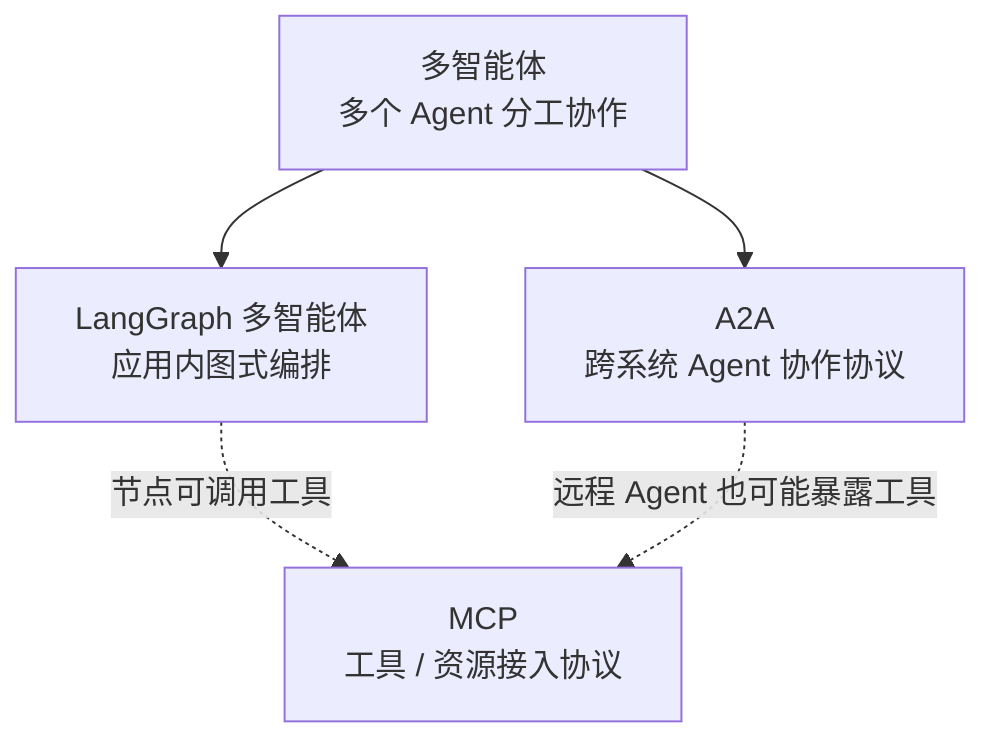
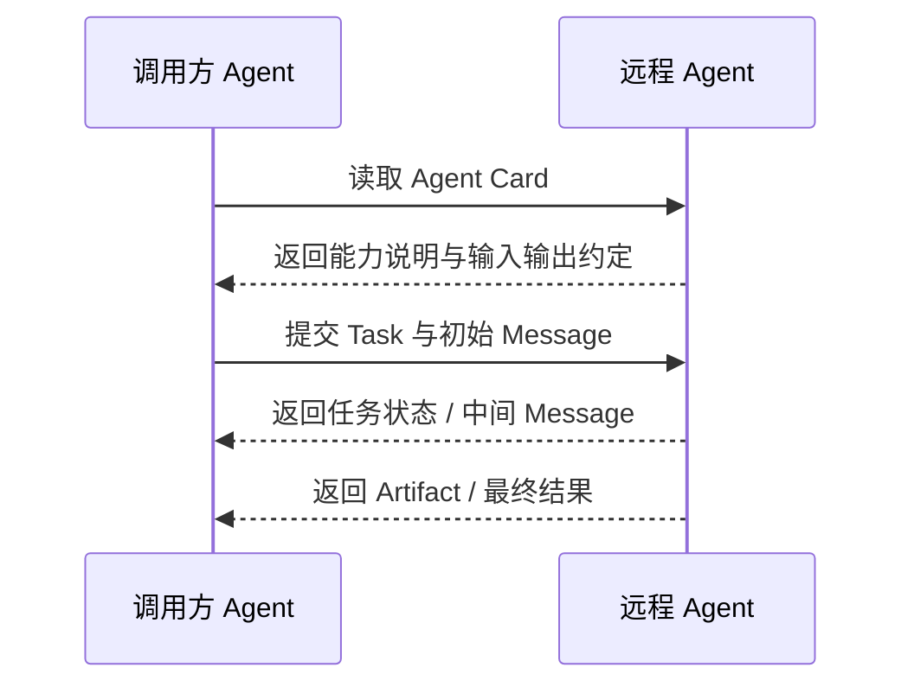
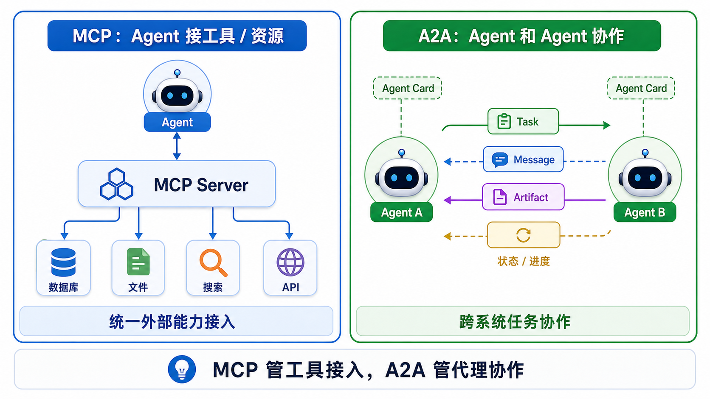
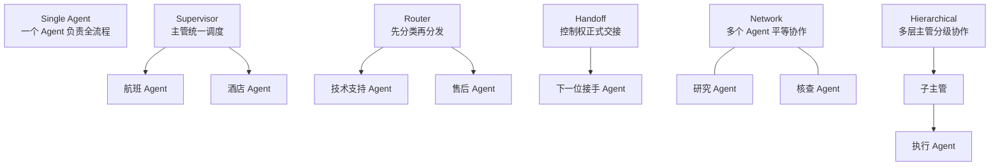
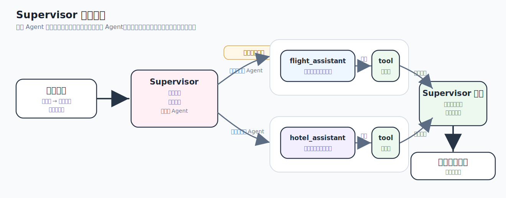
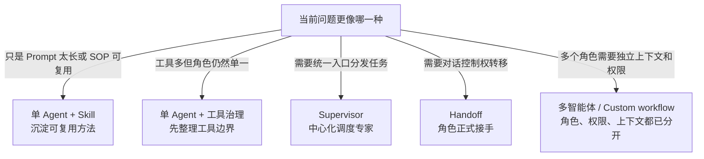

# 26 - LangGraph 多智能体与 A2A

---

**本章课程目标：**

- 理解 **多智能体（Multi-Agent）** 到底在解决什么问题，知道它和“一个强一点的单智能体”之间的边界。
- 理解 **A2A（Agent-to-Agent）** 与 **MCP（Model Context Protocol）** 的本质区别，知道为什么一个偏“代理协作”，一个偏“工具 / 资源接入”。
- 掌握多智能体常见模式：**Subagents / Handoffs / Router / Skills / Custom Workflow**，并能结合 LangGraph 的图能力做基本选型。

**学习建议：** 这章先分层，再写代码：多智能体讲应用内分工，MCP 讲外部能力接入，A2A 讲不同 Agent 系统之间的协作。第一遍不必背 A2A 规范细节，先把“谁和谁通信、传什么、边界在哪里”想清楚，再看 Supervisor、Handoff 和 Skills。

**官方文档与资源**：详见 [工具导航与参考资料索引 - LangGraph](工具导航与参考资料索引.md#LangGraph)、[工具导航与参考资料索引 - 工具调用、mcp与智能体](工具导航与参考资料索引.md#工具调用、mcp与智能体)。

---

## 1、多智能体与 A2A

### 1.1 概述

这一章表面上同时出现了 **LangGraph 多智能体**、**A2A**、**MCP**、**Supervisor**、**Handoff**、**Skills**，所以很容易让人在一开始就感觉概念混在一起。

先把它拆成三层：

| 层级          | 入门理解                                        |
| ------------- | ----------------------------------------------- |
| **多智能体**  | 一种系统设计思路：多个 Agent 分工协作完成任务   |
| **LangGraph** | 一种实现方式：在本地 / 应用内用图编排多个 Agent |
| **A2A**       | 一种通信协议：让不同 Agent 系统按统一方式对话   |

如果先把这三层分清楚，后面就不会觉得这章像在同时讲三门不同的课。



### 1.2 多智能体定义

多智能体不是“多开几个模型调用”这么简单。它指的是：**把复杂任务拆给多个专精的 Agent，让它们分工、路由、协作，再共同完成整体任务。**

和单智能体相比，多智能体的核心变化不是“数量变多”，而是：角色开始分工、上下文开始隔离、控制流开始显式编排。

举个最直白的例子：

- **单智能体**：一个 Agent 同时负责查航班、订酒店、回答用户、决定流程
- **多智能体**：一个主管 Agent 负责调度，航班 Agent 只管航班，酒店 Agent 只管酒店

所以多智能体更适合的，不是“任务听起来高级”，而是这些场景：

- 工具太多，一个 Agent 已经选不过来
- 领域太多，单个 Agent 上下文太臃肿
- 任务天然可以拆成多个角色
- 希望不同团队各自维护不同能力模块

### 1.3 不必默认上多智能体

LangChain 官方多智能体文档也强调：**不是每个复杂任务都必须上多智能体。**

很多时候，开发者说自己要“multi-agent”，实际想要的是下面几类能力：

- 更好的上下文管理
- 更清晰的模块边界
- 更高效的并行化
- 更稳定的任务分工

但如果任务本身很简单，一个单智能体加上合适的工具、提示词和工作流，往往就已经够了。

本章的判断标准很简单：**多智能体不是默认更高级，而是在单智能体已经开始吃力时，才值得引入。**

### 1.4 A2A 协议定义

A2A 的全称是 **Agent-to-Agent**。它是一种面向 Agent 系统互操作的开放协议，目标是让不同 Agent 能以更标准化的方式发现彼此、发送任务、交换消息、返回结果。

换句话说：**A2A 关心的是“Agent 和 Agent 怎么协作”。**

A2A 里面几个很核心的概念包括：

- **Agent Card**：相当于 Agent 的“名片 / 能力说明”
- **Task**：一项被发给远程 Agent 的任务
- **Message**：围绕任务交换的消息
- **Artifact**：任务过程或结果产出的内容

1. **先发现 Agent**：调用方先读取 `Agent Card`，确认对方会什么、支持什么输入输出。
2. **再提交 Task**：把任务目标、上下文消息、必要参数发给远程 Agent。
3. **过程中跟状态**：长任务通常不是一次就结束，调用方会通过轮询、流式更新或通知拿到任务进度。
4. **最后取结果**：读取最终 `Message` / `Artifact`，把它当成另一套 Agent 的产出继续接到自己的系统里。

A2A 主要回答这几个问题：

- 我怎么知道远程有个什么 Agent
- 它会什么
- 我怎么把任务交给它
- 它怎么把中间消息和结果回给我



也正因为 A2A 是一种**跨 Agent 系统的互操作协议**，所以它天然更偏：

- 远程发现与能力说明
- 跨服务任务提交与跟踪
- 长任务状态更新
- 结果产物回传

这和本章后面要看的 `Supervisor` / `Handoff` 很不一样。后者主要发生在**同一个应用内部的 LangGraph 图里**，重点是“怎么编排多个角色”，而不是“怎么让两个独立 Agent 平台按统一协议互通”。

### 1.5 A2A 和 MCP 的区别



更工程化一点看：

| 对比项   | MCP                               | A2A                                 |
| -------- | --------------------------------- | ----------------------------------- |
| 连接对象 | Agent / 模型 与工具、资源、上下文 | Agent 系统 与另一个 Agent 系统      |
| 关注重点 | 工具怎么暴露、资源怎么读取        | 任务怎么提交、状态怎么跟踪          |
| 典型问题 | 模型如何调用数据库、搜索、文件    | 一个 Agent 如何把任务交给远程 Agent |

更准确的结论是：

- **MCP 不负责代理之间的协作分工**
- **A2A 不负责具体工具怎么暴露给模型**

它们不是互斥关系，完全可能同时存在于一个系统里。

> **术语约定：** 本章里说的“**LangGraph 多智能体**”默认指**应用内编排**，说的“**A2A**”默认指**跨系统 Agent 协作协议**。把这两个语境先分开，你后面看 Supervisor、Handoff 和远程 Agent 协作时会轻松很多。

### 1.6 LangGraph 与 A2A

这里要说清楚：**LangGraph 多智能体不等于 A2A。** 你完全可以在一个应用内部，用 LangGraph 把多个 Agent 编排成一张图，让它们协作完成任务。这是多智能体，但未必用了 A2A 协议。

反过来，A2A 更适合描述：不同系统中的 Agent，跨进程、跨服务、跨平台，彼此通过协议标准化发现与协作。所以你可以把关系理解成：**LangGraph 多智能体** 更偏“应用内编排”，**A2A** 更偏“系统间互操作”。

如果换成真实项目的说法：

- 同一个团队在一个后端服务里，用 LangGraph 编排 `supervisor`、`research_agent`、`writer_agent`，这通常是**应用内多智能体**
- 你的系统要去调用另一个团队部署的远程法律顾问 Agent、报表 Agent、采购 Agent，这时更可能需要 **A2A**

这里先建立一个稳定判断：**LangGraph 解决本地编排问题，A2A 解决跨系统协作问题。**

### 1.7 多智能体常见模式

LangChain 官方多智能体文档把模式归纳得比较清楚。最值得你这章吸收的，不是性能表格，而是这 5 类模式本身：

- **Subagents（子代理）**：主 Agent 把子 Agent 当工具来调
- **Handoffs（交接）**：不同 Agent 之间可以交接控制权
- **Skills（技能）**：单 Agent 按需加载专业上下文 / 技能包
- **Route（路由）**：先做路由，再把任务交给更合适的 Agent
- **Custom workflow（自定义工作流）**：直接用 LangGraph 自定义工作流，把上述模式混合起来

从教学角度看，可以把它们分成两大类：

- **一个主控中心在调别人**：Subagents、Router
- **控制权本身会转移**：Handoffs

而 `Skills` 比较特殊，它更像：不一定非要上多智能体，而是让单 Agent 也能按需加载专业能力。

结合官方文档的典型取舍，也可以得到一个非常实用的判断：

- **Subagents / Router** 更强调上下文隔离，也更适合并行
- **Handoffs / Skills** 更偏状态连续，重复请求时往往更省调用
- **Custom workflow** 适合你已经知道标准模式不够，需要自己把路由、并行、循环、人工介入混起来

### 1.8 多智能体的常见结构形态

结合官方模式和 LangGraph 语境，可以把多智能体常见形态收敛成下面几类：

- **单智能体（Single Agent）**：一个 Agent 负责整条任务链路，适合简单任务和教程起步。
- **Supervisor（主管型）**：一个中心主管负责决定调用哪个子 Agent，适合统一入口和集中调度。
- **Handoff（交接型）**：当前 Agent 可以把控制权交给别的 Agent，更适合角色切换和会话延续。
- **Router（路由型）**：先判断任务属于哪类，再把任务交给某个专门 Agent。
- **Network / Peer-to-peer（网络型）**：多个 Agent 更平等地交换信息，没有单一主管，适合研究、协作式问题求解。
- **Hierarchical（层级型）**：多层主管和子主管分层拆任务，适合复杂组织结构。



### 1.9 使用场景

落回真实项目，判断标准不是“哪种架构听起来更酷”，而是下面这些问题：

- 上下文是不是已经太重？
- 工具是不是多到一个 Agent 容易选错？
- 任务是否天然能拆成专业角色？
- 是否需要并行？
- 是否需要直接用户交互的角色切换？

先用下面这张表帮助记忆：

| 场景                         | 更适合的模式                 |
| ---------------------------- | ---------------------------- |
| 单领域、小任务、统一控制     | 单智能体 / Skills            |
| 多工具、多专业角色、统一入口 | Supervisor / Subagents       |
| 用户与不同角色来回切换       | Handoffs                     |
| 先分类再交给不同专家         | Router                       |
| 复杂系统、强流程编排         | Custom workflow（LangGraph） |

在现代 Agent 项目里，多智能体 / A2A 更常见的落点，是把一个大任务拆给多个专业角色协作，而不是单纯为了“多几个 Agent”。例如：

- **软件工程团队式协作**：规划 Agent 负责拆需求，代码 Agent 负责实现，测试 / Review Agent 负责运行验证和指出风险，最后由协调者汇总结果。
- **研究代理团队**：检索 Agent 收集资料，阅读 / 摘要 Agent 提炼证据，事实核查 Agent 做交叉验证，报告 Agent 输出带来源的结构化结论。
- **数据分析代理团队**：数据理解 Agent 解释指标口径，SQL / Python Agent 查询和计算，图表 Agent 生成可视化，业务解释 Agent 输出结论和建议。
- **并行代码任务**：当多个改动彼此独立时，可以让不同子 Agent 分别处理不同模块，再由 Supervisor 汇总 diff、测试结果和冲突风险。

这些场景的共同点是：角色边界清楚、任务可以拆分、过程需要协调或并行。如果只是单一领域的一两个工具调用，仍然优先从单 Agent 或固定工作流开始。

### 1.10 案例：单智能体作为多智能体的起点

在正式进入多智能体之前，先保留这个案例非常有必要。因为读者需要先看见：

- 单智能体长什么样
- 一个 Agent + 工具已经能解决什么问题
- 为什么有些场景其实还不需要上多智能体

这个案例可以当作本章的“起点对照组”。更贴近项目一点地说，这个案例回答的是：如果你的系统只是一个领域、两三个工具、统一入口、没有明显角色切换，那很多时候一个 Agent 已经够用。多智能体不是默认答案，而是单 Agent 开始出现上下文膨胀、工具过多、角色边界不清时，才更值得引入。

【案例源码】`案例与源码-3-LangGraph框架/08-multi_agent/LangGraphAgent.py`

[LangGraphAgent.py](案例与源码-3-LangGraph框架/08-multi_agent/LangGraphAgent.py ":include :type=code")

---

## 2、Supervisor 与 Handoff

### 2.1 为什么先学 Supervisor

在所有多智能体结构里，Supervisor（主管型）适合作为入门起点。它有一个中心主管，结构更好理解；控制流更集中；也更接近“项目经理分配任务”的直觉。

对初学者来说，它比 Network 这种完全去中心化结构要更容易建立稳定认知。

### 2.2 Supervisor 定义

Supervisor 模式可以理解成：**一个主管 Agent 负责判断当前该让哪个子 Agent 干活，子 Agent 处理完后再把结果交回主管。**

所以 Supervisor 结构里，最核心的不是“子 Agent 有几个”，而是：

- 主管是不是唯一调度中心
- 子 Agent 是否专注自己的狭窄领域
- 用户是否主要和主管交互

这个模式特别适合：企业助手、旅行预订、客服分流、多部门协作场景。



放回 LangGraph 的 API 主线看，Supervisor 仍然属于第 24 章讲过的控制流问题，只是路由逻辑从普通条件函数升级成了一个主管 Agent：

- 主管 Agent 像一个更高级的路由节点，负责判断下一步该交给谁。
- 子 Agent 可以被当成工具，也可以被编排成图里的节点。
- 子 Agent 的结果仍然要回到统一状态里，继续被后续节点消费。

因此，Supervisor 可以理解成：**用 Agent 的推理能力做动态路由，再用 LangGraph 的图和状态保证协作过程可控。**

### 2.3 Supervisor 与 Subagents

Supervisor 和 Subagents 可以放在一起理解：很多时候，主管并不是把任务“交给另一个完全独立的系统”，而是把子 Agent 当成一个更高级的工具来调用。

如果主管把子 Agent 当工具调用，可以这样看：用户始终主要和主管交互，所有路由都由主管决定，子 Agent 更像“高级工具”。这类模式的好处是：上下文隔离更强，统一控制更强，工程边界更清楚。代价通常是：主管压力更大，有时多一层调用开销。

很多时候调用子 Agent，不是因为它和主 Agent 能力完全不同，而是因为你希望它在一个**隔离的上下文窗口**里完成完整子任务，再把精炼结果返回给主管。这样看，多智能体不只是“分工”，也是一种控制上下文规模的方法。

### 2.4 老接口案例：SupervisorV0.3

这个案例主要用来帮助你看懂历史演进：

旧版写法是什么；为什么现在更推荐迁移到新版接口；LangGraph / LangChain 在多智能体 API 上是怎么演进的。

它更适合作为“理解旧写法”和“读老资料时不迷路”的案例，而不是今天最推荐的起步方式。

【案例源码】`案例与源码-3-LangGraph框架/08-multi_agent/SupervisorV0.3.py`

[SupervisorV0.3.py](案例与源码-3-LangGraph框架/08-multi_agent/SupervisorV0.3.py ":include :type=code")

### 2.5 推荐接口案例：SupervisorV1.0

这是本章最应该重点阅读的 Supervisor 案例。它更适合帮助读者建立下面这条认知链：

- 子 Agent 是怎么定义的
- 主管是怎么创建的
- 主管如何协调不同子 Agent
- 为什么这种结构适合旅行预订这类多角色场景

如果你对照第 21 章 Agent 和第 22~25 章 LangGraph 主线来看，这个案例还有一个教学价值：它让你看到 **`create_agent` 创建的 Agent 完全可以继续被放进更大的 LangGraph 多智能体结构里**。换句话说，单 Agent 不是多智能体的对立面，而是多智能体系统里的基础部件。

【案例源码】`案例与源码-3-LangGraph框架/08-multi_agent/SupervisorV1.0.py`

[SupervisorV1.0.py](案例与源码-3-LangGraph框架/08-multi_agent/SupervisorV1.0.py ":include :type=code")

### 2.6 Handoff 定义

Handoff（交接型）和 Supervisor（主管型）很容易混在一起，但本质不同。

先看最直观的区别：**Supervisor 更像“主管一直在调度别人”，Handoff 更像“当前角色把控制权正式交给下一个角色”。**

换句话说：Supervisor 的重心是“中心调度”；Handoff 的重心是“控制权转移”。

### 2.7 Handoff 使用场景

Handoff 特别适合这些场景：

- 会话中角色真正切换
- 下一位 Agent 需要接着当前上下文继续和用户互动
- 不只是内部调用工具，而是“换一个会说话的角色接手”

例如：

- 先由总客服接待，再把问题交给技术支持
- 先由通用顾问判断，再交给航班专家
- 先由一个 Agent 完成分析，再把控制权交给执行型 Agent

这里有个很容易误解的点：**并不是所有“角色切换”都必须拆成多个独立 Agent。** 很多 handoff 场景用**单 Agent + middleware / 状态机**就能实现；只有当角色边界、上下文边界、团队维护边界都已经很清晰时，再拆成多个 Agent，收益才会更明显。

### 2.8 案例：SupervisorHandoff

这个案例展示的是：

- 不只是“主管调用子 Agent”
- 而是如何显式构造交接
- 如何把状态和任务说明一起转给下一个 Agent

从教学上说，它正好是从 Supervisor 过渡到更灵活多智能体结构的桥梁。

这里最好重点观察两件事：

- Handoff 不只是“调用另一个 Agent”，而是**明确指定下一跳**
- 交接时不仅传目标，还要思考**传什么上下文、保留哪些消息、是否构造新的任务说明**

多智能体真正难的往往不是“跳过去”，而是**上下文工程**。

从第 24 章学过的控制原语角度看，Handoff 和 `Command` 的关系更近：

- `Command` 用来表达“当前 Agent 处理完后，控制权交给哪个 Agent，并同时更新父图状态”。
- `Command.PARENT` 这类用法说明：子 Agent 或工具不只是返回文本，还可以影响父图的下一步控制流。
- `Send` 更适合动态开出多路任务。如果只是一次明确的角色交接，优先从 `Command` 理解；如果要把多个子任务分发给多个目标，再考虑 `Send`。

这也是为什么 Handoff 比“把子 Agent 当普通工具调用”更强：它改变的不只是一次函数调用，而是整张图的控制权归属。

【案例源码】`案例与源码-3-LangGraph框架/08-multi_agent/SupervisorHandoff.py`

[SupervisorHandoff.py](案例与源码-3-LangGraph框架/08-multi_agent/SupervisorHandoff.py ":include :type=code")

### 2.9 Supervisor 与 Handoff 选型

先记住两个判断标准：

- 如果你希望**始终有一个中央主管负责统筹**，优先考虑 **Supervisor**
- 如果你希望**角色之间可以正式交接控制权**，优先考虑 **Handoff**

可以用一句更口语化的话帮助记忆：

- **Supervisor**：主管一直在线
- **Handoff**：轮到别人正式接手

很多真实项目里，这两者并不是互斥的，而是会混用：

- 大结构上用 Supervisor 做统一调度
- 某些局部流程里允许 Handoff

---

## 3、Skills 与多智能体的边界

第 27 章会专门系统讲 Agent Skills。本章只保留一个和多智能体设计有关的边界问题：**Skills 能增强 Agent，但 Skills 本身不是多智能体模式。**

### 3.1 Skill 不是一个独立 Agent

Skill 是可复用能力包，通常包含提示词、流程、模板、脚本和参考资料。它回答的是：

```text
遇到这类任务时，应该按什么方法做？
```

Agent 回答的是：

```text
当前任务该怎么拆、先做什么、调用什么工具、什么时候交给谁？
```

所以，Skill 不负责自主决策，也不负责和其他 Agent 协商。它更像一个可按需加载的专业说明书。主 Agent 或子 Agent 都可以挂载 Skills，但真正决定是否使用 Skill 的，仍然是 Agent。

### 3.2 单 Agent + Skills

很多任务没有必要一上来就拆成多智能体。

如果问题只是：

- 主提示词越来越长；
- 某类任务有固定 SOP；
- 多个任务复用同一套模板或规范；
- Agent 需要按需加载一大段专业上下文；
- 还没有明确的角色分工和权限隔离。

那通常优先考虑 **单 Agent + Skills**。

例如，一个代码助手需要会代码审查、测试修复、提交信息生成和文档改写。这些能力可以先做成 Skills，不必一开始就拆成 4 个 Agent。

### 3.3 什么时候才需要多智能体

当系统出现下面这些特征时，才更值得升级成多智能体：

| 判断问题                         | 更可能的选择     | 原因                              |
| -------------------------------- | ---------------- | --------------------------------- |
| 只是复用一套流程、模板或检查清单 | Skill            | 能力复用即可，不需要独立角色      |
| 同一个 Agent 的提示词太长        | Skill            | 用按需加载减少主上下文压力        |
| 工具很多但任务角色仍然单一       | Skill + 工具治理 | 先整理能力和工具选择边界          |
| 已经有检索、分析、执行、审核分工 | 多智能体         | 角色职责不同，需要独立上下文      |
| 不同角色需要不同工具权限         | 多智能体         | 权限隔离比提示词复用更重要        |
| 需要显式交接控制权               | Handoff          | 当前对话状态要由另一个 Agent 接手 |
| 需要中心化调度多个专家           | Supervisor       | 主控 Agent 需要分发任务并汇总结果 |



三者关系可以这样概括：

```text
Supervisor 负责调度，Handoff 负责交接，Skills 负责沉淀可复用能力。
```

### 3.4 多智能体中怎么使用 Skills

Skills 和多智能体不是替代关系，而是组合关系。

一个真实项目里常见的设计是：

```text
主 Agent
├─ 通用 Skills：任务规划、报告写作、结果汇总
├─ 检索 Agent
│  └─ 检索 Skills：搜索策略、网页摘要、引用规范
├─ 数据库 Agent
│  └─ SQL Skills：表结构说明、查询规范、性能注意事项
└─ 审核 Agent
   └─ 审核 Skills：事实核查、安全检查、格式检查
```

这样做的好处是：

- 每个 Agent 的职责边界更清楚；
- 每个 Agent 只加载自己需要的 Skills；
- 通用能力可以复用，专业能力可以隔离；
- 不必把所有规则都塞进主 Agent 的 system prompt；
- 后续替换某个 Skill，通常不需要重构整个多智能体架构。

### 3.5 本章和第 27 章怎么衔接

本章只回答“Skills 和多智能体是什么关系”。

如果你想系统学习这些内容：

- `SKILL.md` 怎么写；
- `description` 怎么设计；
- 渐进式加载怎么理解；
- Skill 和 Tool、MCP、Memory、Rules 怎么区分；
- Codex、Cursor、Claude Code、DeepAgents / LangChain 里怎么使用 Skills；

请继续看 [第 27 章 Agent Skills 智能体技能与 AI 编程工具实践](27-Skills技能与AI编程工具实践.md)。

---

**章节思考题：**

1. 单 Agent 什么时候应该升级成多 Agent？

   **参考思路：** 当任务明显有不同专业角色、工具权限需要隔离、上下文太长、主提示词越来越乱，或需要不同执行策略时，再考虑多 Agent。只是为了“看起来智能”而拆分，通常会增加调试成本。

2. Supervisor 和 Handoff 的差别，可以用什么业务场景解释？

   **参考思路：** Supervisor 像总调度，统一分派任务并汇总；Handoff 像把客户转给更合适的专员，由接手者继续处理。前者适合集中控制，后者适合角色间自然交接。

3. MCP、A2A、多智能体三者最容易混在哪里？

   **参考思路：** 多智能体是应用内部角色协作，MCP 是外部能力接入协议，A2A 是不同智能体系统之间的协作协议。它们都和“连接”有关，但连接对象和层级不同。

4. 多 Agent 系统里，共享上下文应该越多越好吗？

   **参考思路：** 不一定。共享太少会重复沟通，共享太多会泄露信息、增加噪声和成本。要按角色职责决定哪些上下文共享，哪些只保留在本 Agent 内部。

**本章小结：**

- **多智能体** 不等于“多调几个模型”，而是让多个专精角色围绕一个任务进行分工与协作。
- **A2A 和 MCP 不一样**：MCP 更偏模型 / Agent 与工具、资源的接入；A2A 更偏 Agent 与 Agent 的互操作和协作。
- **LangGraph 多智能体不等于 A2A**：LangGraph 更适合做应用内多 Agent 编排，A2A 更适合跨系统代理协作协议。
- **Supervisor 和 Handoff 是两种特别值得先掌握的模式**：前者强调中央调度，后者强调控制权转移。
- **Skills** 更像能力工程化和上下文工程的补充层：它不一定等于多智能体，但能帮助单 Agent 和多 Agent 系统都变得更可复用、更可维护，也能降低把所有能力都堆进一个总 Prompt 里的混乱度。
- 学完本章后，你至少应该能判断什么时候真的需要多智能体，而不是把“任务有点复杂”直接等同于“必须 multi-agent”；能分清 **LangGraph 应用内多智能体编排**、**A2A 跨系统协作协议**、**MCP 外部能力接入协议** 三层边界；知道 `Supervisor`、`Handoff`、`Skills` 分别解决什么问题，适合放在什么位置，并理解上下文传递为什么是多智能体工程里的关键设计点。

**建议下一步：** 建议先完整运行 `案例与源码-3-LangGraph框架/08-multi_agent` 下的 4 个案例，再回头对照 [第 20 章 MCP 模型上下文协议](20-MCP模型上下文协议.md)、[第 21 章 Agent 智能体](21-Agent智能体.md)、[第 25 章 LangGraph 高级特性](25-LangGraph高级特性.md) 一起理解。这样你会更容易把“工具接入、单智能体、多智能体、协议互通”四层关系真正串起来。
