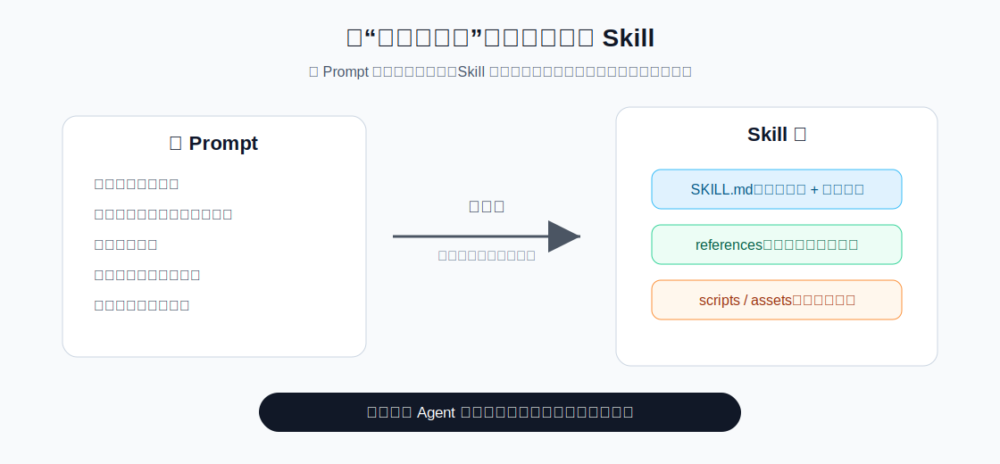
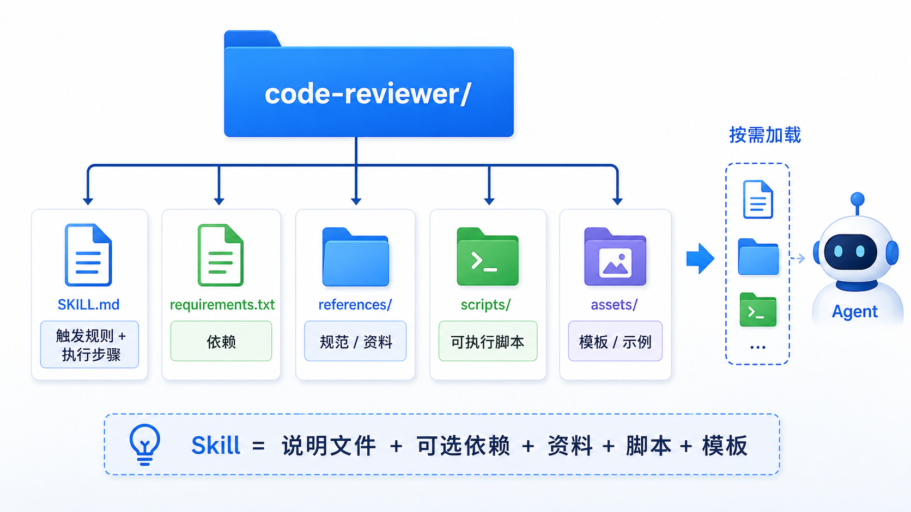
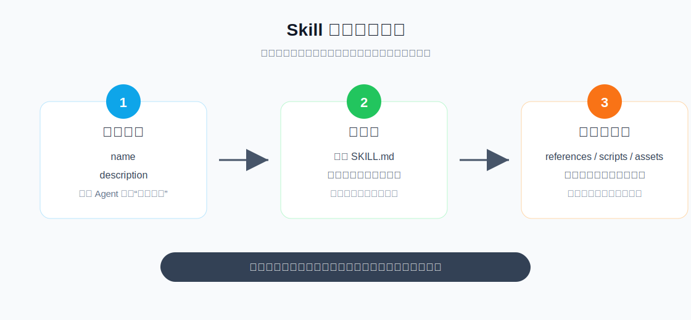
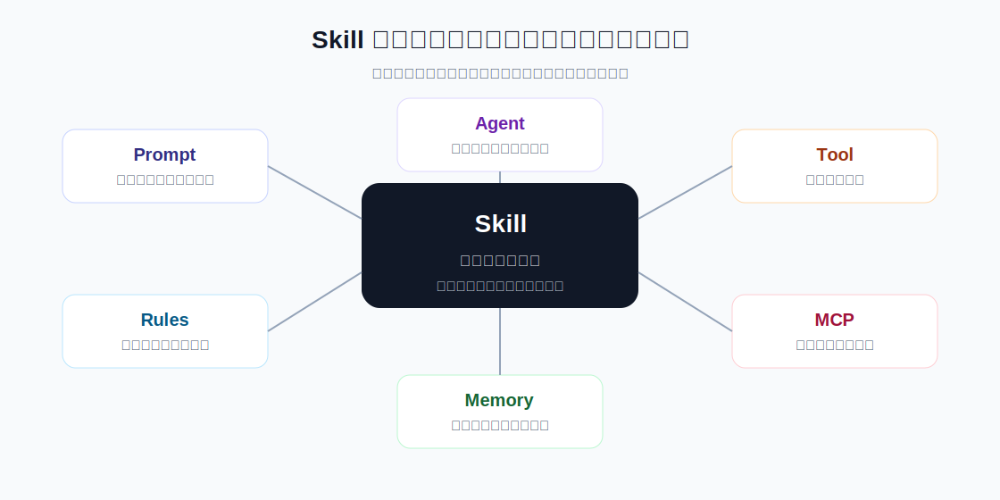
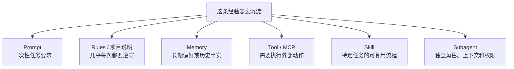

# 27 - Skills 技能与 AI 编程工具实践

---

**本章课程目标：**

- 理解 Agent Skills 的核心定位：把可复用提示词、流程、资源和脚本封装成能力包。
- 掌握 `SKILL.md` 的基本结构、元数据字段、目录组织和渐进式加载机制。
- 分清 Skill 与 Prompt、Rules、Memory、Tool、MCP、Agent、Subagent 的边界。
- 知道 Codex、Cursor、Claude Code、DeepAgents / LangChain 等 AI 编程工具中，如何沉淀和使用“技能化能力”。

**学习建议：** 可以先把 Skill 理解成“把一类任务的成熟做法外置成说明书”。读这章时别只看概念，最好跟着 `SKILL.md` 的结构想一个自己的重复任务：什么时候触发、要遵守哪些规则、需要哪些脚本或资料。读完后，应能判断一件事该写进系统提示、做成工具、放进记忆，还是沉淀成 Skill。

**官方文档与资源**：详见 [工具导航与参考资料索引 - 工具调用、MCP、Skills与智能体](工具导航与参考资料索引.md#工具调用、MCP、Skills与智能体)。

---

## 1、为什么需要 Skills

### 1.1 从“长 Prompt”开始的问题

很多人第一次做 AI 应用时，都会先把规则直接塞进 Prompt：

```text
你是代码审查专家。
你要检查安全问题。
你要检查性能问题。
你要按表格输出。
你要遵守团队规范。
你还要参考某个模板。
你还要必要时运行某个脚本。
```

刚开始这样写很快，项目一复杂就会变得难维护：

- Prompt 越来越长，每次调用都浪费上下文。
- 同一套规则到处复制，多个 Agent 很难保持一致。
- 规则、模板、脚本、示例散落在聊天记录、代码注释和文档里。
- 多智能体项目里，每个 Agent 到底掌握哪些能力不清楚。
- 团队成员很难复用彼此已经打磨好的工作流。

Skills 的价值，就是把这些反复使用的经验整理成可复用、可发现、可按需加载的能力包。

### 1.2 一张图理解 Skill 化



先记住一个简化公式：`Skill = 可复用提示词 + 专业流程 + 可选脚本 + 可选资源`

它适合沉淀那些“不是一次性问题，而是经常重复出现的一类任务”，比如代码审查规范、Git 提交信息格式、数据分析步骤、周报/研报/PRD 模板、API 调试流程、前端 UI 审查清单、SQL 生成校验规则和企业内部文档写作规范。

如果说 Tool 是“让 Agent 能做一个动作”，那 Skill 更像“告诉 Agent 做这类任务时应该按什么方法、标准和流程来做”。

### 1.3 三个关键词

理解 Skills，可以先抓三个关键词：

| 关键词   | 含义                           | 例子                                            |
| -------- | ------------------------------ | ----------------------------------------------- |
| 可复用   | 一套能力可以给多个任务使用     | 代码审查标准、报告模板、测试修复流程            |
| 可发现   | Agent 能先看到技能名和描述     | 通过 `name` 和 `description` 判断要不要用       |
| 按需加载 | 不用一开始把全部内容塞进上下文 | 任务匹配后再读完整 `SKILL.md`、模板、脚本和资源 |

这三个词合起来，就是 Skills 在工程上的核心价值。

---

## 2、Skill 到底是什么

### 2.1 基本定义

Skill 可以理解为 Agent 的外置能力包，通常把高质量提示词、任务步骤、触发条件、输出规范，以及可选脚本、依赖、模板、示例和参考资料放在一起。

把这些内容打包后，Agent 就可以在合适场景下加载并使用这项能力。

### 2.2 工程本质

从工程角度看，Skill 的核心并不复杂：

```text
Skill = 可复用提示词 + SOP + 可选脚本 + 可选资源
```

例如你写了一个“代码审查技能”，里面可以说明：

- 什么情况下触发代码审查；
- 审查哪些维度；
- 哪些问题必须重点标出；
- 输出什么格式；
- 如果需要运行脚本，脚本放在哪里；
- 如果没有发现问题，应该怎么表达剩余风险。

以后其他 Agent 想具备这项能力，就不用重新手写提示词，只要把这个 Skill 配进去。

它和普通复制粘贴提示词的区别在于：Skill 有固定目录结构和元数据，可以被支持 Skills 的工具或框架识别，并按需加载到上下文中。

### 2.3 Skill 不是 Agent 的替代品

这里容易混：

| 对象     | 回答的问题                 | 本质                                 |
| -------- | -------------------------- | ------------------------------------ |
| Skill    | “这类任务应该怎么做？”     | 可复用能力包、说明书、流程和资源     |
| Agent    | “现在该做什么、先做什么？” | 具备推理、规划、路由和执行能力的主体 |
| Subagent | “这类子任务交给谁负责？”   | 有独立上下文和职责边界的专业 Agent   |

Skill 像“标准化招式”，Agent 像“会选招、会组合招式的人”。一个 Agent 可以通过加载 Skills 变得更专业，多个 Agent 也可以复用同一个 Skill 或挂载不同 Skills；但 Skill 不负责自主决策，是否使用它仍由 Agent 判断。

### 2.4 一个 Agent 可以掌握多个 Skills

可以用一个简单类比理解：

```text
厨师（Agent）
├─ 技能 1：备菜
├─ 技能 2：炒菜
├─ 技能 3：调味
└─ 技能 4：摆盘
```

AI 编程助手也是类似的：

```text
代码助手（Agent）
├─ 技能 1：代码审查
├─ 技能 2：测试修复
├─ 技能 3：提交信息生成
└─ 技能 4：技术文档改写
```

这里要形成一个关键判断：**Skill 不是 Agent 的替代品，而是 Agent 的能力组织方式。**

---

## 3、SKILL.md 与目录结构

### 3.1 最小目录结构

一个标准 Skill 通常是一个文件夹，里面至少包含一个 `SKILL.md` 文件。

示意结构：

```text
skills/
  emoji-translator/
    SKILL.md
```

其中：

- `skills/` 是技能目录；
- `emoji-translator/` 是某个具体技能包；
- `SKILL.md` 是这个技能包的说明文件。

`SKILL.md` 通常分成两部分：

1. YAML Frontmatter：给模型或框架看的元数据。
2. Markdown 正文：给 Agent 执行任务时看的详细说明。

一个最小示例：

```markdown
---
name: emoji-translator
description: 当用户明确要求把自然语言翻译成 Emoji、把 Emoji 解释成文字，或要求“表情翻译/emoji 翻译”时使用。
---

# Emoji Translator Skill

## 角色定位

你是一个表情翻译助手，负责在自然语言和 Emoji 之间转换。

## 触发边界

- 用户明确要求“用表情翻译”“转换成 Emoji”“解释这些 Emoji”时，使用本技能。
- 用户只是普通聊天、提问或写作时，不要主动把内容转成 Emoji。
- 如果用户要求“只用表情”，最终输出只包含 Emoji，不额外解释。
```

### 3.2 元数据字段

元数据里最重要的是两个字段：

| 字段          | 作用                                     | 建议                                         |
| ------------- | ---------------------------------------- | -------------------------------------------- |
| `name`        | 技能唯一名称，通常和技能文件夹名保持一致 | 使用小写字母、数字和短横线，避免空格和中文名 |
| `description` | 告诉模型这个技能什么时候应该被使用       | 写清楚“做什么”和“什么时候用”                 |

不推荐的写法：

```yaml
description: 一个有用的技能。
```

更清晰的写法：

```yaml
description: 当用户要求将中文句子转成表情符号，或要求解释表情符号含义时使用。
```

因为模型通常会先看 `name` 和 `description`，再决定是否加载完整 Skill。如果描述太模糊，Skill 就可能触发不了；如果描述太宽泛，又可能在不该触发时被错误触发。

### 3.3 常见扩展字段

不同平台支持的字段不完全一样。通用写法以 `name` 和 `description` 为核心，其他字段要看具体工具是否支持。

常见扩展字段包括：

| 字段            | 常见用途                                             |
| --------------- | ---------------------------------------------------- |
| `license`       | 标记 Skill 的许可证                                  |
| `compatibility` | 说明依赖环境、网络访问、运行时限制                   |
| `metadata`      | 放作者、版本、团队、维护信息                         |
| `allowed-tools` | 限制 Skill 激活后可用的工具，部分平台支持            |
| `module`        | 指向可导入模块或辅助代码，部分 Agent Skills 实现支持 |

不要把所有扩展字段都当成必填项。对入门者来说，最重要的仍然是：

```yaml
---
name: your-skill-name
description: 这个技能做什么，以及什么情况下应该使用它。
---
```

### 3.4 扩展目录结构

复杂 Skill 不一定只有 `SKILL.md`，还可以带脚本、依赖和资源。

```text
code-reviewer/
  SKILL.md
  requirements.txt
  references/
    java-style-guide.md
    security-checklist.md
  scripts/
    run_static_check.py
  assets/
    review-template.md
```



各目录职责如下：

| 路径               | 作用                           |
| ------------------ | ------------------------------ |
| `SKILL.md`         | 技能说明、触发规则、执行步骤   |
| `requirements.txt` | 这个技能需要的 Python 依赖     |
| `references/`      | 技能需要参考的文档、规范和模板 |
| `scripts/`         | 技能执行时可能调用的脚本       |
| `assets/`          | 样例、图片、表格、素材文件     |

其中 `references/` 可以继续按用途拆分：

| 子目录或文件     | 适合存放的内容                         |
| ---------------- | -------------------------------------- |
| `templates/`     | 报告模板、代码模板、标准输出模板       |
| `examples/`      | 输入输出样例，帮助 Agent 理解预期格式  |
| `config/`        | 检查规则、字段映射、默认参数等配置文件 |
| `style-guide.md` | 团队编码规范、写作规范、品牌规范       |

模型并不会凭空知道怎么用这些脚本和资源。需要在 `SKILL.md` 里写清楚：

```markdown
当需要做静态检查时，运行 `scripts/run_static_check.py`。
当需要判断 Java 代码风格时，参考 `references/java-style-guide.md`。
最终输出格式参考 `assets/review-template.md`。
```

### 3.5 正文要写清楚什么

`SKILL.md` 正文不要只写愿望，要写执行路径。

| 信息     | 要回答的问题                         |
| -------- | ------------------------------------ |
| 角色定位 | 这个 Skill 让 Agent 扮演什么专业角色 |
| 触发边界 | 什么时候用，什么时候不用             |
| 执行步骤 | 按什么顺序完成任务                   |
| 资源引用 | 需要读哪些模板、规范、样例或脚本     |
| 输出格式 | 最终结果应该长什么样                 |

不推荐：

```markdown
请帮用户写出高质量报告。
```

更推荐：

```markdown
1. 先识别报告类型：调研、复盘、周报、项目总结。
2. 如果用户没有给出目标读者，默认目标读者是业务负责人。
3. 报告必须包含：背景、核心结论、证据、风险、下一步建议。
4. 如果证据不足，先列出需要补充的信息，不要强行下结论。
5. 最终输出使用 Markdown 二级标题组织。
```

---

## 4、渐进式加载机制

### 4.1 按需加载

如果项目里有很多 Skill，每个 Skill 都有一大段说明、脚本介绍和资源引用，不可能一开始就全部塞进模型上下文。

这样会带来三个问题：

- 上下文窗口被快速撑爆。
- Token 成本增加。
- 模型面对太多技能时更难选择。

所以 Skill 通常采用 **Progressive Disclosure（渐进式披露）**。

### 4.2 三层加载图解



可以把加载过程理解为三层：

| 层级       | 加载内容                             | 什么时候加载                           |
| ---------- | ------------------------------------ | -------------------------------------- |
| 元信息层   | `name`、`description` 等 Frontmatter | Agent 启动或扫描 Skills 时             |
| 指令层     | 完整 `SKILL.md` 正文                 | 模型判断当前任务需要这个 Skill 时      |
| 资源执行层 | `references/`、`scripts/`、`assets/` | 只有任务真的需要时，才进一步读取或运行 |

加载顺序可以记成：先让模型知道“我会什么”，任务匹配后再展开“具体怎么做”，真正需要时才读取脚本、模板和资料。

### 4.3 description 是触发门牌

`description` 是 Skill 的“触发门牌”。

如果它写得太泛：

```yaml
description: 用来处理文档。
```

模型很难判断：是 Word 文档、PDF 文档、Markdown 文档，还是技术文档？

更好的写法：

```yaml
description: 当用户要求审查 Markdown 技术教程的结构、标题层级、代码块说明和读者理解难度时使用。
```

这类描述同时包含了：

- 任务对象：Markdown 技术教程；
- 任务动作：审查结构、标题、代码块说明；
- 触发条件：用户要求审查文档；
- 适用边界：不是所有文档都触发。

### 4.4 怎么测试触发是否稳定

写完 Skill 后，不要只看文件是否存在，更要测试它能不能在合适场景触发。

可以准备三类测试句：

| 测试句类型 | 目的                         | 示例                                     |
| ---------- | ---------------------------- | ---------------------------------------- |
| 明确触发   | 验证模型知道应该用这个 Skill | “请用代码审查技能审查这个 diff。”        |
| 隐含触发   | 验证描述是否覆盖真实表达     | “帮我看看这个 PR 有没有安全和边界问题。” |
| 不应触发   | 验证边界是否清楚             | “解释一下这段代码在做什么。”             |

如果明确触发都不稳定，通常是路径、元数据或工具配置问题。
如果隐含触发不稳定，通常是 `description` 写得不够贴近真实用户表达。
如果不应触发时频繁触发，通常是 `description` 写得太宽。

---

## 5、Skill 与其他能力的边界

### 5.1 边界总览



> **图注：** Skill 位于“提示词工程”和“Agent 工程”之间。它不直接替代 Tool、MCP 或 Agent，而是把任务方法和上下文资源整理成可复用单元。

### 5.2 Prompt、Rules、Memory、Skill

这四个概念都和“上下文”有关，但作用不同：

| 形式              | 适合放什么                       | 典型例子                                     |
| ----------------- | -------------------------------- | -------------------------------------------- |
| Prompt            | 当前任务的一次性要求             | “把这段文字改成更口语化”                     |
| Rules / AGENTS.md | 几乎每次都相关的项目规则         | “本项目用 pnpm”“API 返回结构统一”            |
| Memory            | 历史事实、用户偏好、长期状态     | “用户喜欢简洁回答”“这个项目已经迁到 FastAPI” |
| Skill             | 特定任务才需要的流程、模板和资源 | “代码审查流程”“周报模板”“SQL 生成规范”       |

一句话速记：

```text
Prompt 是临时指令。
Rules 是常驻规矩。
Memory 是历史状态。
Skill 是可复用做法。
```

### 5.3 Tool、MCP、Skill

Tool、MCP、Skill 经常放在一起讨论，但它们解决的问题不一样：

| 形式  | 解决什么问题                   | 一句话理解                     |
| ----- | ------------------------------ | ------------------------------ |
| Tool  | 执行一个明确动作               | “我能做什么动作”               |
| MCP   | 用统一协议接入外部工具和资源   | “外部能力怎么标准化接进来”     |
| Skill | 封装任务方法、流程、规则和资源 | “遇到这类任务应该按什么方法做” |

举个例子：

```text
Tool：run_tests()
MCP：把 GitHub、数据库、文件系统按统一协议暴露给 AI 应用
Skill：测试修复流程，说明什么时候运行测试、如何定位失败、如何写回归用例、最终如何汇报
```

两者经常配合使用。Skill 可以告诉 Agent 什么时候调用哪些 Tool，Tool 负责真正执行动作。

### 5.4 Agent、Subagent、Skill

Subagent 是一个独立角色，通常有自己的上下文、工具和职责边界。

Skill 是一个能力包，可以挂在主 Agent 或 Subagent 上。

| 判断问题                              | 更适合用什么 |
| ------------------------------------- | ------------ |
| 只是多了一套可复用流程和输出格式      | Skill        |
| 一个 Agent 已经能做，只是 Prompt 太长 | Skill        |
| 需要独立上下文、独立工具、独立职责    | Subagent     |
| 需要多个角色协作、分发任务、回收结果  | 多智能体     |

一个常见误区是：任务一复杂就拆 Subagent。

更稳的判断方式是：

```text
如果只是“同一个 Agent 需要掌握一套专业做法”，优先 Skill。
如果已经出现“不同角色、不同权限、不同上下文、不同工具集合”，再考虑 Subagent。
```

---

## 6、如何写一个高质量 Skill

### 6.1 description 的写法

一个好的 `description` 最好同时回答四件事：

| 要点         | 示例                                             |
| ------------ | ------------------------------------------------ |
| 做什么       | 审查 Python / FastAPI 后端代码                   |
| 什么时候用   | 当用户要求 code review、查找 bug 或安全风险时    |
| 处理什么输入 | diff、PR、文件路径、代码片段                     |
| 不要太泛     | 不要写成“帮助写代码”这种所有场景都可能匹配的描述 |

推荐模板：

```yaml
description: 当用户要求【任务动作】，并且输入是【输入类型】，目标是【预期结果】时使用。不要用于【排除场景】。
```

例如：

```yaml
description: 当用户要求审查 React 组件的可访问性、响应式布局、状态交互和设计一致性时使用。不要用于普通业务逻辑解释。
```

### 6.2 Skill 要小而专

一个 Skill 最好只解决一类能力。

清晰的 Skill：

- `python-code-reviewer`
- `fastapi-api-debugger`
- `markdown-doc-editor`
- `sql-query-writer`
- `frontend-accessibility-reviewer`

太大的 Skill：

- `developer-helper`
- `all-in-one-agent`
- `document-tool`
- `data-everything`

Skill 写得越大，触发条件越模糊，模型越难判断什么时候该用它。

### 6.3 脚本和资源怎么放

适合放脚本的内容：

- 格式检查；
- 静态扫描；
- 数据清洗；
- 模板渲染；
- 依赖明确的转换逻辑；
- 可重复、可测试、确定性强的步骤。

不适合放脚本的内容：

- 需要大量主观判断的任务；
- 一次性临时操作；
- 依赖用户环境但没有说明的命令；
- 有高风险副作用的操作，比如删库、发邮件、扣款。

一个好经验是：

```text
能稳定自动化的部分交给脚本；
需要理解、判断和表达的部分交给模型；
两者之间的流程写在 SKILL.md 里。
```

### 6.4 不要绕开安全边界

Skill 可以说明流程，但不要让 Skill 代替权限控制。

高风险动作包括：

- 删除文件；
- 删除数据库；
- 发送邮件；
- 调用支付接口；
- 修改生产配置；
- 执行不可逆脚本。

这些动作应该由工具权限、人工审批、中间件、沙箱和业务幂等设计来控制。Skill 只能写规则，不能代替安全边界。

### 6.5 命名和维护

团队里的 Skills 应该被当成工程资产：

- 名称稳定，尽量使用小写字母、数字和短横线；
- 放进版本控制；
- 写清维护人、版本和重要变更；
- 配套示例输入和示例输出；
- 定期删除过时 Skill；
- 对脚本做最小可行测试；
- 对外部依赖和权限做安全审查。

---

## 7、AI 编程工具里的 Skills 实践

不同 AI 编程工具对 Skills 的支持方式不完全一样。学习时不要只背目录名，要理解背后的三类能力：

| 能力类型     | 代表形式                               | 解决的问题                  |
| ------------ | -------------------------------------- | --------------------------- |
| 技能包       | `SKILL.md`、`skills/` 目录             | 按任务加载专业流程和资源    |
| 常驻规则     | `.cursor/rules`、`AGENTS.md`、项目说明 | 让 Agent 持续遵守项目约定   |
| 外部工具连接 | MCP、插件、Connectors                  | 让 Agent 访问外部系统和动作 |

### 7.1 Codex 中怎么理解 Skills

OpenAI 的 Skills 资料把 Skill 定义为可复用、可分享的工作流，可以包含说明、示例，甚至代码。OpenAI Help Center 也说明 Skills 支持 ChatGPT、Codex 和 API，并遵循 Agent Skills 开放标准。

在 Codex 这类 AI 编程工具里，Skill 特别适合沉淀这些能力：

- `code-reviewer`：统一代码审查标准；
- `test-driven-development`：固定 TDD 流程；
- `systematic-debugging`：遇到 bug 时先复现、再定位、再修复；
- `frontend-design-review`：检查 UI、可访问性、响应式布局；
- `release-notes-writer`：按团队格式生成更新说明；
- `migration-planner`：框架升级或 API 迁移计划。

使用思路通常是：

1. 创建一个独立技能目录。
2. 在目录中放 `SKILL.md`。
3. 用 `name` 和 `description` 说明技能什么时候触发。
4. 把详细步骤、检查清单、输出格式写进正文。
5. 如果需要模板、脚本、示例，把它们放在技能目录下，并在 `SKILL.md` 里显式引用。
6. 直接提出匹配该 Skill 的任务，测试触发是否稳定。

Codex 中不要把所有项目规则都写成 Skill。比如“本项目使用中文回答”“不要修改锁文件”“测试命令是什么”这类几乎每次都相关的内容，更适合放在项目级说明、规则文件或仓库文档里。Skill 应该留给特定任务。

### 7.2 Cursor 中的技能化沉淀

Cursor 官方文档重点介绍的是 Rules。Rules 可以控制 Agent 和 Inline Edit 的行为，是可复用、可限定范围的系统级说明。

Cursor 常见规则目录：

```text
.cursor/
  rules/
    api-style.mdc
    frontend-components.mdc
    code-review.mdc
```

一个 `.mdc` 规则示例：

```markdown
---
description: 当修改 FastAPI 接口、Schema 或错误处理逻辑时使用。
globs: api/**/*.py
alwaysApply: false
---

- API 返回结构统一使用 `{ code, message, data }`。
- 新增接口时必须补充请求参数和错误响应说明。
- 修改数据库查询逻辑时，优先检查分页、空结果和异常处理。
```

Cursor Rules 和 Agent Skills 不完全等同：

- Rules 更偏项目常驻规则、路径规则和团队约定；
- Skills 更偏按任务触发的一整套能力包；
- Cursor 的 `Agent Requested` 规则和 Skill 的触发思想接近，都是让模型根据描述判断是否需要使用；
- 如果你想在 Cursor 中复用 Skills 思路，可以把“技能化内容”写成聚焦的 `.mdc` 规则，或者用 `AGENTS.md` 承载项目级说明。

建议这样用：

| 场景                          | Cursor 中更适合放在哪里        |
| ----------------------------- | ------------------------------ |
| 项目架构、代码风格、目录约定  | `.cursor/rules` 或 `AGENTS.md` |
| 针对某个目录的开发规范        | 嵌套 `.cursor/rules`           |
| 可被 Agent 判断是否需要的流程 | `Agent Requested` 类型的规则   |
| 一次性任务提示                | 当前对话 Prompt                |

### 7.3 Claude Code 中的 Agent Skills

Claude Code 对 Agent Skills 的支持更接近标准 `SKILL.md` 目录模型。

常见位置：

```text
# 个人 Skills，跨项目使用
~/.claude/skills/

# 项目 Skills，跟随项目一起版本管理
.claude/skills/
```

项目内示例：

```text
.claude/
  skills/
    git-commit-writer/
      SKILL.md
    api-debugger/
      SKILL.md
      scripts/
        check_openapi.py
```

Claude Code 的 Skill 是模型自动触发的。你不需要像 slash command 那样手动输入命令。关键仍然是 `description` 写得足够清楚。

团队共享时，可以把项目级 Skills 放进 `.claude/skills/` 并跟代码一起提交；每个 Skill 保持小而专，在 `SKILL.md` 里写清依赖、脚本和输出格式，修改后提醒团队成员重启或重新加载 Claude Code。

### 7.4 DeepAgents / LangChain 中的 Skills

DeepAgents 的 Skills 更偏框架能力。它会从指定目录读取 `SKILL.md`，先看元数据，再按需读取完整技能内容。

在 DeepAgents 里，常见配置思路是：

```python
from pathlib import Path

from deepagents import create_deep_agent
from deepagents.backends.filesystem import FilesystemBackend

current_dir = Path(__file__).parent

backend = FilesystemBackend(
    root_dir=str(current_dir),
    virtual_mode=True,
)

agent = create_deep_agent(
    model=llm,
    backend=backend,
    skills=[str(current_dir / "skills")],
    system_prompt="你是一个可以按需使用 Skills 的智能助手。",
)
```

这里要分清三个路径：

| 概念           | 示例                            | 说明                                         |
| -------------- | ------------------------------- | -------------------------------------------- |
| 物理路径       | `base/skills/`                  | 本地磁盘上真正存放 Skill 的目录              |
| Backend 根目录 | `base/`                         | `FilesystemBackend(root_dir=...)` 指向的位置 |
| Agent 配置路径 | `skills=[str(base / "skills")]` | 传给 `create_deep_agent` 的 Skill 目录来源   |

DeepAgents 的 Skills 还要注意三个边界：

- `SKILL.md` 不适合写得特别长。大段参考资料、模板和案例，优先放到 `references/`、`assets/` 这类目录里，再在正文中说明什么时候读取。
- 如果配置了多个 Skill 来源，名称重复时通常会出现优先级问题。团队里应尽量避免同名 Skill，或者明确覆盖关系。
- 自定义 Subagent 不一定自动继承主 Agent 的 Skills。需要子 Agent 使用的技能，要在它自己的配置里显式声明。

LangChain 里也可以用更通用的方式实现 Skills：给 Agent 一个 `load_skill` 工具，先把技能描述注入系统提示词，等模型判断需要时再调用工具加载完整内容。这和渐进式披露思想是一致的。

---

## 8、什么时候应该写 Skill

### 8.1 适合写成 Skill 的场景

适合使用 Skill 的场景：

- 一套提示词会被多个 Agent 或多次任务复用；
- 某个任务有固定步骤和输出格式；
- 某项能力需要附带脚本、模板或参考资料；
- 希望把“能力说明”从主提示词里拆出来；
- 希望减少主 Agent 的 system prompt 长度；
- 团队有一套希望复用的标准流程；
- 某类任务需要按需加载大量上下文，而不是每次都塞进 Prompt。

典型例子：

| Skill 名称                        | 适合封装的内容                             |
| --------------------------------- | ------------------------------------------ |
| `code-reviewer`                   | 审查维度、严重级别、输出格式、测试缺口判断 |
| `markdown-doc-editor`             | 文档结构、标题层级、代码块说明、读者视角   |
| `frontend-accessibility-reviewer` | 可访问性、键盘操作、语义标签、视觉层级     |
| `sql-query-writer`                | 表结构说明、查询规范、性能注意事项         |
| `incident-postmortem-writer`      | 故障复盘模板、时间线、影响范围、改进项     |

### 8.2 不适合写成 Skill 的场景

不适合使用 Skill 的场景：

- 只是一次性的小提示；
- 任务非常简单，不值得单独封装；
- 触发条件很模糊，模型难以判断什么时候用；
- 多个 Skill 描述重叠，容易抢同一个任务；
- 内容几乎每次都要加载，更适合放 Rules 或项目说明；
- 本质是外部动作，更适合做 Tool 或 MCP；
- 需要独立上下文和职责隔离，更适合做 Subagent。

### 8.3 判断口诀

可以用下面这组问题判断：

```text
这个能力会重复用吗？
它有明确触发条件吗？
它有固定步骤或输出格式吗？
它需要附带模板、资料或脚本吗？
它不适合每次都放进主提示词吗？
```

如果多数答案是“是”，就适合写成 Skill。



---

## 9、常见问题排查

| 问题现象                    | 排查方向                                                 |
| --------------------------- | -------------------------------------------------------- |
| Agent 完全不知道 Skill 存在 | 目录是否放对，工具是否支持该目录，是否需要重启或重新加载 |
| Skill 目录存在但没有触发    | `description` 是否明确写出触发场景                       |
| 触发了错误的 Skill          | 多个 Skill 描述是否过于接近，职责是否重叠                |
| 触发后输出仍不稳定          | `SKILL.md` 是否写清执行步骤、输出格式和失败处理          |
| 找不到资源或脚本            | 相对路径是否正确，是否在 `SKILL.md` 中明确引用           |
| 脚本运行失败                | 依赖是否安装，权限是否足够，脚本是否依赖不存在的环境变量 |
| Skill 越写越长              | 是否应该拆成多个小 Skill，或把大段资料移入 `references/` |
| Agent 每次都加载 Skill      | 描述是否写得太宽泛，是否应该改成 Rules 或项目级说明      |

这里要记住：Skill 不是自动插件系统，它主要靠元数据、描述和任务匹配，让模型判断什么时候该用哪项能力。

---

## 10、完整示例：代码审查 Skill

下面给一个可直接参考的 Skill 示例。

目录结构：

```text
skills/
  code-reviewer/
    SKILL.md
    references/
      severity-guide.md
```

`SKILL.md`：

```markdown
---
name: code-reviewer
description: 当用户要求进行代码审查、审查 PR、审查 diff、查找 Bug、安全风险、性能问题、并发问题或测试缺口时使用。不要用于普通代码解释。
---

# Code Reviewer Skill

## 角色定位

你是一个严谨的代码审查助手。你的目标是发现真实风险，而不是泛泛表扬或重写代码。

## 适用场景

- 用户要求 code review、代码审查、PR 审查、diff 审查。
- 用户要求查找 bug、安全风险、性能问题、并发问题或测试缺口。
- 用户提供文件路径、代码片段、提交内容或 PR 内容，并要求评估风险。

## 不适用场景

- 用户只是要求解释代码。
- 用户只是要求实现新功能。
- 用户只是要求格式化或翻译注释。

## 审查范围

优先检查这些问题：

1. 安全风险：SQL 注入、命令注入、路径遍历、硬编码密钥、敏感信息泄露。
2. 正确性问题：边界条件、空值处理、异常处理、并发问题、状态不一致。
3. 性能问题：重复计算、无效循环、过大内存占用、明显低效的 I/O。
4. 可维护性：命名不清晰、职责混乱、重复代码、关键注释缺失。
5. 测试缺口：重要分支、异常路径或高风险逻辑缺少测试。

## 输出规则

- 先列问题，再给总结。
- 只报告有依据的问题，不要为了凑数量编造风险。
- 如果没有发现明确问题，直接说明“未发现明确问题”，并补充剩余风险或测试缺口。
- 每个问题都要包含：严重级别、位置、问题说明、修改建议。
- 严重级别使用：高危、中危、低危。

## 输出格式

| 严重级别       | 位置        | 问题     | 建议     |
| -------------- | ----------- | -------- | -------- |
| 高危/中危/低危 | 文件名:行号 | 具体问题 | 修改建议 |

## 参考资料

如需判断严重级别，参考 `references/severity-guide.md`。
```

这个例子体现了 Skill 的工程意义：它沉淀的不是某一句提示词，而是一套可复用的专业 SOP。其他 Agent 或团队成员挂载这个 Skill 后，就可以复用同一套代码审查标准。

---

**章节思考题：**

1. 什么样的经验适合沉淀成 Skill，而不是继续塞进主提示词？

   **参考思路：** 反复出现、有明确触发场景、步骤相对稳定、需要配套资源或脚本的经验适合做 Skill。偶尔一次的要求，放当前 Prompt 就够了。

2. `description` 写得太泛或太窄，会分别带来什么问题？

   **参考思路：** 太泛会误触发，模型什么任务都想用；太窄会该用时不触发。好的描述要写清“做什么、什么时候用、什么时候不用”。

3. Skill、Tool、Subagent 的边界怎样判断？

   **参考思路：** Skill 是可复用方法和资料，Tool 是可执行动作，Subagent 是有独立职责的执行角色。写 Skill 不等于增加一个新智能体，也不等于让模型获得新 API。

4. 如果你要为代码审查写一个 Skill，正文里最应该写清哪些内容？

   **参考思路：** 要写清审查范围、优先级、输出格式、严重程度判断、不要做的事、需要查看的文件和可选脚本。Skill 要能指导稳定行为，而不是只写一句“请认真审查”。

**本章小结：**

本章把 Agent Skills 放在工程化语境下理解：Skill 是外置能力包，用来封装可复用提示词、执行规则、辅助脚本和资源文件。它的核心文件是 `SKILL.md`，其中 `name` 和 `description` 负责帮助模型判断是否需要加载完整技能说明。

Skill 的关键机制是渐进式加载：先看名称和描述，任务匹配后再读取完整 `SKILL.md`，真正需要时才读取资源或运行脚本。这样既节省上下文，也方便专业能力在不同 Agent 间复用。

最后要分清边界：

| 能力              | 主要解决什么问题                        |
| ----------------- | --------------------------------------- |
| Prompt            | 当前任务的一次性指令                    |
| Rules / AGENTS.md | 项目长期规则、团队偏好、常驻上下文      |
| Memory            | 历史事实、用户偏好、长期状态            |
| Tool              | 执行明确动作，如搜索、查库、写文件      |
| MCP               | 标准化接入外部工具、资源和服务          |
| Agent / Subagent  | 决策、规划、分工和执行                  |
| Skill             | 提供可复用的专业提示词、SOP、脚本和资源 |

在真实项目里，Skill 往往不是单独使用，而是和 Tool、MCP、Memory、Subagent、中间件一起组成完整智能体系统。判断是否要写 Skill 的核心标准是：这套能力是否会重复使用，是否有明确触发边界，是否有固定流程或输出格式，是否值得从主提示词里拆出来。
