# 8 - Docker 快速入门与 Dify 部署排障

第 6 章已经带你在 Windows 上跑过 Coze Studio、Dify、Coze Loop，第 7 章会继续讲企业级大模型部署。本章回头补 Docker 这层基础。后面排查 Dify、迁移服务、升级版本时，经常都要回到 Docker 层看状态、日志和数据挂载。

刚开始做 Dify 私有化部署时，问题经常被简单归成“Dify 装不上”。实际排查下来，卡住的地方往往更基础：镜像和容器分不清，宿主机端口和容器端口分不清，不知道 volume 会不会被删，也看不懂为什么一次启动会拉起一组容器。升级后如果进入初始化页面，问题通常也不在页面本身，而是数据库、挂载目录或 `.env` 没对上。

这一章只抓部署 Dify 和后续实战项目最常用的那条线：镜像怎么交付环境，容器怎么运行服务，Compose 怎么拉起多服务，volume 怎么保存数据，日志和备份怎么辅助排障。

**官方文档与资源**：详见 [工具导航与参考资料索引 - 部署与基础设施](工具导航与参考资料索引.md#部署与基础设施)。

---

## 阅读路径

| 现在遇到的问题                    | 建议先看                                           |
| --------------------------------- | -------------------------------------------------- |
| 还没安装 Docker Desktop           | 第 2.2～2.5 小节：Docker Desktop 安装与验证        |
| 想在 Ubuntu 服务器安装 Docker     | 第 2.10 小节：Ubuntu 下 Docker 安装与卸载          |
| 不知道 Docker 到底是什么          | 第 1.2 小节：Docker 是什么                         |
| 分不清 Docker 和虚拟机            | 第 1.3 小节                                        |
| 分不清镜像、容器、仓库、数据卷    | 第 1.5 小节                                        |
| 想先跑一个最小 Docker 案例        | 第 2 部分：Docker 基础命令与第一个容器             |
| 不知道 Dockerfile 和 Compose 区别 | 第 3 部分：从单容器到 Compose 多服务编排           |
| 担心数据存放位置或误删数据        | 第 4 部分：数据持久化、网络、迁移与危险边界        |
| 想把 Windows 环境迁移到 Ubuntu    | 第 4.5 小节：跨机器迁移与离线同步                  |
| 想知道 Dify 到底跑了哪些容器      | 第 5 部分：把 Docker 知识迁移到 Dify 部署结构      |
| 页面打不开，容器状态不对          | 第 6 部分：Dify 排障：状态、日志、数据与数据库连接 |
| 想用 Navicat 连接 Dify 数据库     | 第 6.5 小节                                        |
| 准备升级 Dify                     | 第 7 部分：Dify 升级、备份与源码改造               |
| 改了 Dify 前端源码但没生效        | 第 7.2 小节                                        |
| 准备清理 Docker 或重装环境        | 第 8.6 小节：危险操作清单                          |
| 只想查命令                        | 第 8 部分：Docker 常用命令速查                     |

---

## 1、为什么要学 Docker

### 1.1 环境不一致的问题

在没有 Docker 之前，部署一个项目往往不是“把代码放到服务器上”这么简单。

开发电脑上能跑，测试环境可能报错；测试环境能跑，生产服务器又缺少依赖；换一台机器，就要重新安装 Python、Node.js、数据库、系统库、驱动、配置文件。项目越多，版本越多，环境差异就越难控制。

Docker 解决的就是这个老问题：**把应用和运行环境一起打包，换一台机器也尽量按同一种方式运行**。

放到 Dify、RAG 或智能体项目里，这个问题会更具体。你在浏览器里看到的是一个页面，实际运行时还会涉及**后端接口、后台任务、数据库、Redis、向量库、Nginx、Sandbox、插件服务**等组件。它们的版本、端口、数据目录和启动顺序只要有一处没对上，排障就很容易跑偏。

Docker 的价值在这里很明确：把这些组件放进一套相对固定的部署流程里。先让环境能稳定复现，再谈迁移、升级和排障。

### 1.2 Docker 是什么

Docker 是一个开源的应用容器引擎，底层主要基于 Go 语言开发。你可以把它理解成一个“打包并运行环境”的工具：把应用、依赖、配置和运行环境放进一个轻量、可移植、相对隔离的容器里。

Docker 官方曾经用一句话概括它的目标：

```text
Build, Ship and Run Any App, Anywhere
```

它强调的是构建、分发、运行这一整条链路。一些教程里说的“一次封装，到处运行”，讲的就是这个意思。

和手工安装环境相比，Docker 的价值不只是少装几个软件，而是把应用交付从零散的安装步骤变成可复制的流程：

| 能力     | 说明                                         | 课程中的例子                                      |
| -------- | -------------------------------------------- | ------------------------------------------------- |
| 可移植性 | 同一套镜像可以在本地、测试环境、服务器上运行 | 本地跑通的 MySQL / Redis / 向量库迁到 Ubuntu      |
| 隔离性   | 不同容器有各自的进程、文件系统和依赖         | Dify 的 `api`、`worker`、`redis` 互不直接污染环境 |
| 低开销   | 容器共享宿主机内核，通常比完整虚拟机更轻     | 一台机器上同时跑多个基础服务                      |
| 可伸缩性 | 多实例服务可以更容易复制和扩展               | 后续生产部署中扩展 worker 处理后台任务            |
| 可复现性 | 环境由镜像、Compose、环境变量描述            | 新同学拉起同一套 Dify 环境，排障口径一致          |

当然，Docker 不是万能药。数据库备份、显卡驱动、网络代理、数据权限、云服务器安全组，这些还是要自己处理。但它能把“应用怎么跑”这件事先稳住，这对后面部署 Dify、本地模型和企业级项目很关键。

### 1.3 Docker 和虚拟机的区别

刚接触 Docker 时，可以暂时把它理解成“比虚拟机更轻的运行环境”。这个说法方便入门，但不够准确。

虚拟机会把操作系统也虚拟出来，每个虚拟机都有自己的完整系统；Docker 容器共享宿主机内核，只把应用运行需要的文件、依赖和隔离环境打包起来。

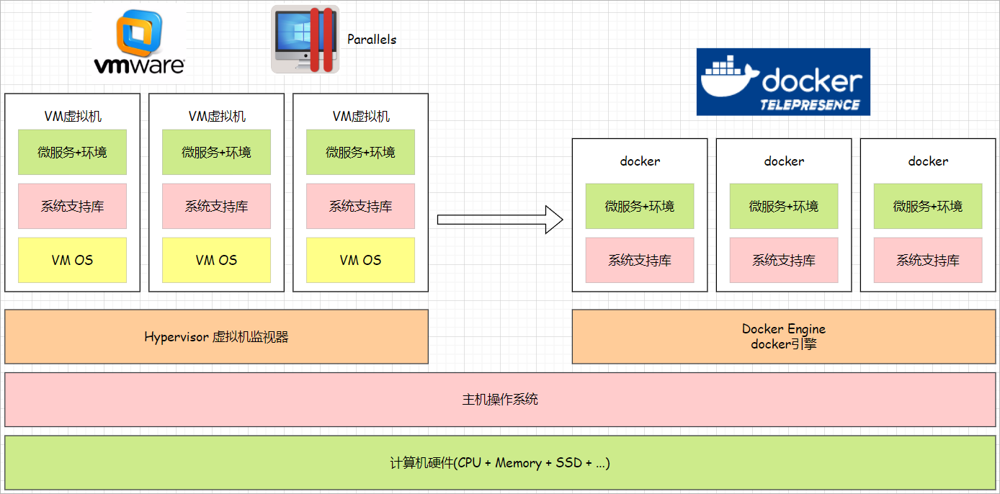

主要看三个区别：

| 对比项   | 虚拟机 VM                        | Docker 容器                        |
| -------- | -------------------------------- | ---------------------------------- |
| 隔离方式 | 虚拟化整套操作系统               | 共享宿主机内核，隔离进程和文件系统 |
| 启动速度 | 通常较慢                         | 通常更快                           |
| 资源占用 | 更高                             | 更低                               |
| 适合场景 | 强隔离、多系统环境、传统基础设施 | 应用交付、开发测试、微服务部署     |

因此，Docker 不是用来替代所有虚拟机的工具。它更适合解决应用交付、环境一致、多服务编排这类问题。

### 1.4 Docker 架构

Docker 是典型的客户端和服务端架构。

你在终端里执行的 `docker` 命令，是 Docker Client；负责创建容器、拉取镜像、管理网络和数据卷的是 Docker Daemon。镜像通常来自 Docker Hub 或其他镜像仓库。

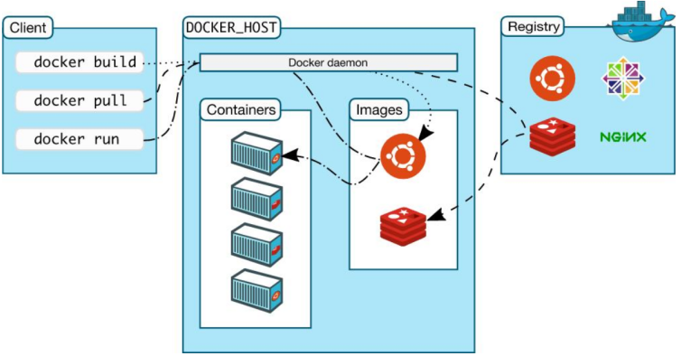

图里重点画出了四个对象：客户端、Docker 主机、镜像仓库、容器。为了后面能读懂 Dify 的 Compose 文件，这里再把 volume 和 Compose 一起补进来：

| 对象                                      | 和谁发生关系                       | 关系说明                                                     |
| ----------------------------------------- | ---------------------------------- | ------------------------------------------------------------ |
| Docker Client（Docker 客户端）            | Docker Daemon                      | 终端里的 `docker` 命令会把操作请求发送给 Docker Daemon       |
| Docker Daemon（Docker 守护进程 / 服务端） | Registry、Image、Container、Volume | 负责拉取镜像、创建容器、管理网络和数据卷                     |
| Registry（镜像仓库）                      | Image                              | 存放和分发镜像，例如 Docker Hub 或企业私有仓库               |
| Image（镜像）                             | Container                          | 容器基于镜像创建并运行；一个镜像可以启动多个容器             |
| Container（容器）                         | Image、Volume、Network             | 运行应用进程，并把需要持久化的数据写入 volume 或挂载目录     |
| Volume（数据卷）                          | Container                          | 保存数据库、上传文件、索引等数据，通常独立于容器生命周期     |
| Docker Compose（多容器编排工具）          | Image、Container、Volume、Network  | 用一份 YAML 把镜像、容器、数据卷、网络和环境变量统一描述出来 |

所以执行一条命令时，要知道它在操作谁：

- `docker pull`：从仓库拉镜像。
- `docker run`：基于镜像创建并启动容器。
- `docker ps`：查看容器。
- `docker images`：查看镜像。
- `docker volume ls`：查看数据卷。
- `docker compose up -d`：按配置启动一组服务。

### 1.5 镜像、容器、仓库、数据卷

| 词              | 可以这样理解                 | 常见例子                                     |
| --------------- | ---------------------------- | -------------------------------------------- |
| Docker Engine   | 运行容器的引擎               | Docker Desktop、服务器上的 Docker 服务       |
| 镜像 Image      | 应用的运行模板，像安装包     | `mysql:8.0.45`、`postgres:15-alpine`         |
| 容器 Container  | 镜像运行后的实例             | `mysql-db`、`docker-api-1`                   |
| 仓库 Repository | 存放和下载镜像的平台         | Docker Hub、企业私有镜像仓库                 |
| 数据卷 Volume   | 独立于容器生命周期的数据存储 | `mysql_data`、`postgres_data`                |
| Dockerfile      | 自定义镜像的构建脚本         | `FROM python:3.12`                           |
| Docker Compose  | 用一份 YAML 管理一组容器     | `docker-compose.yaml`                        |
| bind mount      | 把宿主机目录挂到容器里       | `./volumes/db/data:/var/lib/postgresql/data` |

可以这样理解：**镜像负责提供程序，容器负责把程序跑起来，仓库负责分发镜像，volume 负责保存数据，Compose 负责把一组容器编排起来。**

### 1.6 Dockerfile 和 Compose

Dockerfile 和 Compose 经常一起出现，但它们解决的问题不同。

**Dockerfile** 负责构建镜像。比如你想做一个包含 Python 3.12、依赖包和业务脚本的环境，就写 Dockerfile，让 Docker 自动构建。

**Docker Compose** 负责运行一组服务。比如一个项目需要同时启动 MySQL、Python 应用、Redis、Nginx，就用 `docker-compose.yaml` 把它们的镜像、端口、环境变量、网络和数据卷写清楚。

后面 Dify 的部署正是这个思路：官方已经帮我们准备好镜像和 Compose 文件，我们执行 `docker compose up -d`，就能把 web、api、worker、数据库、Redis、向量库、nginx 等服务一起拉起来。

---

## 2、Docker 安装：本地 Windows 与服务器 Ubuntu

### 2.1 先判断你要装在哪里

学习 Docker 时，通常会碰到两种环境：

| 环境             | 推荐安装方式                 | 适合场景                                 |
| ---------------- | ---------------------------- | ---------------------------------------- |
| Windows 本地电脑 | Docker Desktop + WSL 2       | 学习、演示、跑 Dify / Coze Studio 本地版 |
| Ubuntu 云服务器  | Docker Engine + Compose 插件 | 企业部署、远程服务、后续项目上线         |

如果只是跟着本章学习，先装 Docker Desktop 就够了；如果已经在准备云服务器部署，可以直接跳到第 2.10 小节。

两种环境里的常用命令差不多，差别主要在安装方式、文件路径、权限和镜像源配置。

### 2.2 Windows 安装前准备

Windows 本地部署 Coze Studio、Dify、Coze Loop 这类平台时，最常用的方案是 **Docker Desktop + Docker Compose**。

安装前先看几件事：

- Windows 10 / Windows 11 系统。
- 已开启虚拟化功能。大部分新电脑默认开启，如果 Docker Desktop 启动时报虚拟化错误，再进入 BIOS 检查。
- 可以正常使用 WSL 2。Docker Desktop 在 Windows 上通常依赖 WSL 2 来运行 Linux 容器。
- 本机网络能访问 Docker 官网和镜像仓库；如果镜像拉取慢，后面第 4.4 小节再处理。

本章不要求你提前安装 MySQL、Redis、Nginx。后面会直接用 Docker 镜像启动。

Windows 上可以按下面顺序检查：

| 检查项   | 怎么看                                   | 说明                                                   |
| -------- | ---------------------------------------- | ------------------------------------------------------ |
| 系统版本 | `Win + R` 输入 `winver`                  | 建议 Windows 10 2004 及以上，Windows 11 更省心         |
| 虚拟化   | 任务管理器 -> 性能 -> CPU -> 虚拟化      | 如果未启用，需要进 BIOS 开启 Virtualization Technology |
| WSL 功能 | “启用或关闭 Windows 功能”                | 勾选“适用于 Linux 的 Windows 子系统”和“虚拟机平台”     |
| WSL 内核 | Docker Desktop 启动提示或 `wsl --status` | 旧环境可能需要更新 WSL 内核                            |

虚拟化可以在任务管理器里看，确认状态显示为“已启用”：

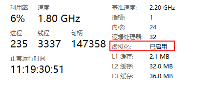

WSL 2 相关功能可以在 Windows 功能里勾选。不同 Windows 版本的显示文字可能略有差异，重点是启用 Virtual Machine Platform 和 WSL：

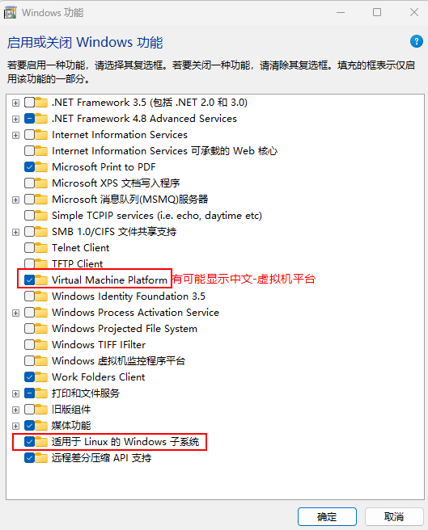

如果需要用命令启用 WSL 和虚拟机平台，可以用管理员 PowerShell 执行：

```powershell
dism.exe /online /enable-feature /featurename:Microsoft-Windows-Subsystem-Linux /all /norestart
dism.exe /online /enable-feature /featurename:VirtualMachinePlatform /all /norestart
```

执行后需要重启电脑。WSL 内核可从 Microsoft WSL 发布页下载更新包；如果是 ARM 架构设备，要选择对应架构的安装包。

### 2.3 下载 Docker Desktop

进入 Docker Desktop 官方下载页：

```text
https://www.docker.com/products/docker-desktop/
```

选择 Windows 版本下载安装包。

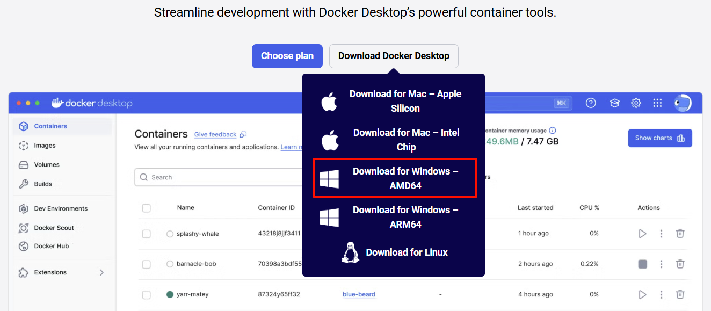

### 2.4 安装并启动 Docker Desktop

双击安装包，按提示完成安装即可。安装过程中如果看到 WSL 2、桌面快捷方式等选项，保持默认配置即可。


安装完成后打开 Docker Desktop，确认状态栏显示 **Running**。

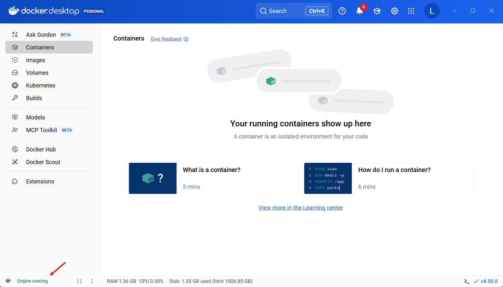

如果 Windows 提示需要安装“适用于 Linux 的 Windows 子系统”，按提示装完，再重新打开 Docker Desktop。

### 2.5 验证 Docker 环境

打开 PowerShell、CMD、Windows Terminal 或 Docker Desktop 自带终端，依次执行：

```bash
docker --version
docker compose version
docker run hello-world
```

能正常输出版本，并且 `hello-world` 能运行，说明 Docker 基础环境可用。

Windows + Docker Desktop 场景下，官方也建议把 Linux 容器使用的源码和挂载数据放在 WSL 的 Linux 文件系统里，而不是长期放在 Windows 文件系统路径下。这样通常会减少文件同步、权限和性能问题。

如果 Docker Desktop 安装失败、启动异常，或者你想彻底重装，可以按下面思路清理。注意，这会删除 Docker Desktop 管理的镜像、容器和数据，执行前先确认没有重要数据：

```powershell
# 1. 停止所有 WSL 实例
wsl --shutdown

# 2. 查看 WSL 发行版
wsl --list --verbose

# 3. 删除 Docker Desktop 相关发行版
wsl --unregister docker-desktop
wsl --unregister docker-desktop-data
```

还可以手动检查这些残留目录：

```text
C:\Users\你的用户名\.docker
C:\Users\你的用户名\AppData\Local\Docker
C:\Program Files\Docker
```

普通卸载只需要在 Windows “应用和功能”里卸载 Docker Desktop；前面这种清理更接近“彻底重装”，不要把它当成日常排障第一步。

### 2.6 启动 MySQL 容器

先拉取 MySQL 镜像：

```bash
docker pull mysql:8.0.45
```

查看本地镜像：

```bash
docker images
```

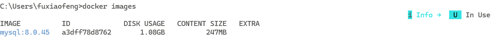

启动一个 MySQL 容器：

```bash
docker run -d --name mysql-db -p 9999:3306 -e MYSQL_ROOT_PASSWORD=123456 mysql:8.0.45
```

这条命令里最重要的是几个参数：

| 参数                            | 含义                                            |
| ------------------------------- | ----------------------------------------------- |
| `-d`                            | 后台运行，不占用当前终端                        |
| `--name mysql-db`               | 给容器起名，后续可以用这个名字 stop、logs、exec |
| `-p 9999:3306`                  | 宿主机 9999 端口映射到容器内 3306 端口          |
| `-e MYSQL_ROOT_PASSWORD=123456` | 给 MySQL 容器注入环境变量，设置 root 密码       |
| `mysql:8.0.45`                  | 要运行的镜像名和版本                            |

查看容器：

```bash
docker ps
```

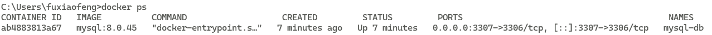

这里有两个地址容易混：

- 本机访问 MySQL：`127.0.0.1:9999`
- 容器内部 MySQL 实际监听：`3306`

也就是 `-p 9999:3306` 左边给宿主机访问，右边给容器内部服务使用。

### 2.7 Python 连接 MySQL

如果本机已经有 Python 环境，可以安装依赖：

```bash
pip install pymysql cryptography
```

新建 `test_mysql.py`：

```python
import pymysql

conn = pymysql.connect(
    host="127.0.0.1",
    port=9999,
    user="root",
    password="123456",
    database="mysql",
    charset="utf8mb4",
    cursorclass=pymysql.cursors.DictCursor,
)

with conn:
    with conn.cursor() as cursor:
        cursor.execute("SELECT VERSION() AS version")
        row = cursor.fetchone()
        print(f"MySQL 版本：{row['version']}")

print("Python 已成功连接 Docker 中的 MySQL")
```

运行：

```bash
python test_mysql.py
```

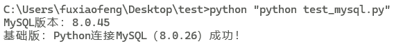

这个小案例不是为了讲 MySQL，而是先把 Docker 的基本动作串起来：

1. 镜像从仓库下载。
2. 容器基于镜像运行。
3. 宿主机通过端口映射访问容器服务。

后面访问 Dify 的 nginx、PostgreSQL、Redis，用的仍然是这套逻辑。

### 2.8 从 docker ps 区分镜像和容器

执行：

```bash
docker ps
```

命令行里看到的容器列表大致是这样的：


输出里常见两列：

| 列    | 含义   | 示例                                                  |
| ----- | ------ | ----------------------------------------------------- |
| IMAGE | 镜像名 | `postgres:15-alpine`、`langgenius/dify-api:<version>` |
| NAMES | 容器名 | `docker-db_postgres-1`、`docker-api-1`                |

看输出时可以先抓两个特征：

- 带 `:tag` 的通常是镜像，例如 `redis:6-alpine`。
- 像 `docker-api-1`、`mysql-db`、`qdrant` 这种运行中的名字通常是容器。

Docker Desktop 里也能直接区分：

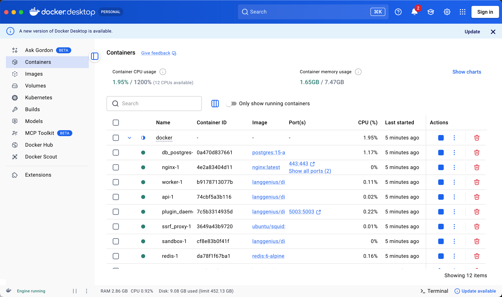


一个镜像可以启动多个容器。Dify 的 `api`、`worker`、`worker_beat` 就可能使用同一个后端镜像，只是启动模式不同。

### 2.9 基础命令速查

| 目的              | 命令                          | 说明                     |
| ----------------- | ----------------------------- | ------------------------ |
| 查看 Docker 版本  | `docker --version`            | 检查 Docker CLI 是否可用 |
| 查看 Compose 版本 | `docker compose version`      | 检查 Compose v2 是否可用 |
| 拉取镜像          | `docker pull mysql:8.0.45`    | 从镜像仓库下载镜像       |
| 查看镜像          | `docker images`               | 查看本地镜像             |
| 启动容器          | `docker run ...`              | 基于镜像创建并启动容器   |
| 查看运行中容器    | `docker ps`                   | 只看运行中的容器         |
| 查看全部容器      | `docker ps -a`                | 包括已停止容器           |
| 查看日志          | `docker logs -f mysql-db`     | 跟踪某个容器日志         |
| 进入容器          | `docker exec -it mysql-db sh` | 进入容器内部             |
| 停止容器          | `docker stop mysql-db`        | 停止运行中的容器         |
| 删除容器          | `docker rm mysql-db`          | 删除已停止的容器         |
| 删除镜像          | `docker rmi mysql:8.0.45`     | 删除本地镜像             |

日常排障时，先看 `docker ps`，再看 `docker logs`。在没确认数据位置之前，先别急着删除容器或清理 volume。

### 2.10 Ubuntu 下 Docker 安装与卸载

本地学习阶段通常用 Windows + Docker Desktop；正式上服务器时，更常见的是 Ubuntu + Docker Engine。第 7 章的云服务器部署、后面的电商问数和深度研搜项目，都会先遇到同一个前提：服务器上要有可用的 Docker 和 Compose。

Ubuntu 上安装 Docker，建议优先参考 Docker 官方文档。下面给出课程里最常用的一条路径，适合新服务器初始化：

```bash
# 1. 卸载系统里可能存在的旧版本
sudo apt remove -y docker docker-engine docker.io containerd runc

# 2. 按 Docker 官方 Ubuntu 安装文档配置仓库并安装
# 官方文档：https://docs.docker.com/engine/install/ubuntu/

# 3. 验证 Docker 和 Compose
docker --version
docker compose version
```

如果执行 `docker` 命令时提示权限不足，可以把当前用户加入 `docker` 用户组：

```bash
sudo usermod -aG docker $USER
```

这条命令执行完后，需要退出当前 SSH 会话并重新登录，权限才会生效。不要看到命令没立刻生效就反复执行。

服务器拉镜像慢时，可以配置 Docker Engine 镜像源。Ubuntu 上配置文件通常是：

```bash
sudo vim /etc/docker/daemon.json
```

示例配置：

```json
{
  "registry-mirrors": [
    "https://docker.xuanyuan.me",
    "https://docker.1ms.run",
    "https://docker.m.daocloud.io"
  ]
}
```

保存后重启 Docker：

```bash
sudo systemctl daemon-reload
sudo systemctl restart docker
docker info
```

在 `docker info` 输出中看到 `Registry Mirrors`，说明配置已经被 Docker Engine 读取。

镜像源是易变资源，今天可用不代表一直可用。生产环境更稳的方式是使用企业私有镜像仓库、云厂商容器镜像服务，或者提前做离线镜像包。

如果 Docker 安装失败、版本混乱，或你确实要彻底清理服务器上的 Docker，可以按下面方式卸载。注意，这会删除本机容器、镜像和 volume 数据，执行前先确认没有重要服务运行：

```bash
sudo systemctl stop docker
sudo apt remove -y docker-ce docker-ce-cli containerd.io docker-compose-plugin
sudo rm -rf /var/lib/docker
sudo rm -rf /var/lib/containerd
docker --version
```

如果只是普通升级或排障，不要轻易删除 `/var/lib/docker`。这个目录里可能保存着数据库 volume、向量库数据和上传文件。

---

## 3、从单容器到 Compose 多服务编排

第 2 部分的 MySQL 示例只用了 `docker run`，适合快速体验。到了真实项目里，一个容器通常不够。Dify 有 web、api、worker、数据库、Redis、向量库、nginx、sandbox、plugin_daemon 等服务；电商问数项目里也会同时依赖 MySQL、Qdrant、Elasticsearch 和后端服务。

这一部分就往前走一步：不再手动敲一长串 `docker run`，而是用文件描述一组服务。

| 阶段         | 解决的问题                 | 典型文件或命令                   |
| ------------ | -------------------------- | -------------------------------- |
| `docker run` | 快速启动一个现成镜像       | `docker run -d ... mysql:8.0.45` |
| Dockerfile   | 把自己的代码和依赖打成镜像 | `FROM python:3.12`               |
| Compose      | 一次启动多容器项目         | `docker compose up -d`           |

Dify 的 `docker/` 目录也可以按这个思路理解：它不是普通源码目录，更像一份多服务部署说明书。

### 3.1 Dockerfile

刚才的 MySQL 是直接使用官方镜像。如果我们想把自己的 Python 脚本、依赖和运行环境也打包成镜像，就需要 Dockerfile。

在项目目录里新建 `Dockerfile`：

```dockerfile
FROM python:3.12

WORKDIR /app

COPY . /app

RUN pip install pymysql cryptography

CMD ["python", "test_mysql1.py"]
```

逐行理解：

| 指令                  | 作用                          |
| --------------------- | ----------------------------- |
| `FROM python:3.12`    | 以 Python 3.12 官方镜像为基础 |
| `WORKDIR /app`        | 设置容器内工作目录            |
| `COPY . /app`         | 把当前项目文件复制进镜像      |
| `RUN pip install ...` | 构建镜像时安装依赖            |
| `CMD [...]`           | 容器启动时默认执行的命令      |

Dockerfile 解决的是“如何构建一个符合我项目需要的镜像”。它不是用来启动一组服务的，启动多服务要交给 Compose。

### 3.2 Compose

Docker Compose 用一份 YAML 文件描述多容器应用。Docker 官方文档也把 Compose 定义为管理多容器应用的工具，它可以在一个配置文件里统一管理 services、networks、volumes。

常见部署文档会让你进入 `docker` 目录，然后执行：

```bash
docker compose up -d
```

它会按 `docker-compose.yaml` 里的配置做几件事：

1. 拉取或构建镜像。
2. 创建容器。
3. 创建网络。
4. 挂载数据目录或 volume。
5. 后台启动服务。

所以这条命令不是“启动一个程序”，而是“把一组互相依赖的服务一起拉起来”。

### 3.3 MySQL + Python 的 Compose 小案例

项目目录可以这样放：

```text
docker-python-mysql/
├── docker-compose.yml
├── Dockerfile
└── test_mysql1.py
```

`docker-compose.yml` 示例：

```yaml
services:
  mysql-db:
    image: mysql:8.0.45
    restart: always
    environment:
      MYSQL_ROOT_PASSWORD: "123456"
      MYSQL_DATABASE: "test_db"
      MYSQL_INITDB_ARGS: "--character-set-server=utf8mb4 --collation-server=utf8mb4_unicode_ci"
    ports:
      - "9999:3306"
    volumes:
      - mysql_data:/var/lib/mysql
    networks:
      - app-network
    healthcheck:
      test:
        ["CMD", "mysqladmin", "ping", "-h", "localhost", "-uroot", "-p123456"]
      interval: 3s
      timeout: 3s
      retries: 10
      start_period: 5s

  python-app:
    build: .
    depends_on:
      mysql-db:
        condition: service_healthy
    environment:
      MYSQL_HOST: "mysql-db"
      MYSQL_PORT: "3306"
      MYSQL_USER: "root"
      MYSQL_PASSWORD: "123456"
      MYSQL_DB: "test_db"
    networks:
      - app-network

networks:
  app-network:
    driver: bridge

volumes:
  mysql_data:
```

这份 Compose 里有几处值得多看一眼：

- `python-app` 通过 `build: .` 使用当前目录的 Dockerfile 构建镜像。
- `mysql-db` 使用现成镜像 `mysql:8.0.45`。
- `python-app` 连接 MySQL 时，主机名写 `mysql-db`，不是 `localhost`。
- 容器之间走 Docker 网络，端口用容器内部端口 `3306`。
- `healthcheck` 用来判断 MySQL 是否已经就绪。
- `depends_on.condition: service_healthy` 让 Python 容器等 MySQL 健康后再启动。

这里特别容易误解的是：**容器启动不等于服务就绪。** MySQL 容器起来后，还需要初始化数据目录、启动数据库进程、准备账号和库。没有健康检查时，Python 可能抢先连接，结果就是 `Connection refused`。

接着新建 `test_mysql1.py`，让 Python 容器通过环境变量读取 MySQL 连接信息：

```python
import os
import sys
import time

import pymysql


def get_mysql_conn():
    max_retries = 10
    retry_delay = 2

    for i in range(max_retries):
        try:
            conn = pymysql.connect(
                host=os.getenv("MYSQL_HOST", "localhost"),
                port=int(os.getenv("MYSQL_PORT", 3306)),
                user=os.getenv("MYSQL_USER", "root"),
                password=os.getenv("MYSQL_PASSWORD", "123456"),
                database=os.getenv("MYSQL_DB", "test_db"),
                charset="utf8mb4",
                connect_timeout=3,
            )
            print(f"第 {i + 1} 次尝试：MySQL 连接成功")
            return conn
        except pymysql.err.OperationalError as e:
            print(f"第 {i + 1} 次尝试：MySQL 连接失败 - {e}")
            if i < max_retries - 1:
                time.sleep(retry_delay)
            else:
                raise RuntimeError("重试后仍无法连接 MySQL，请检查容器配置") from e


if __name__ == "__main__":
    conn = None
    cursor = None

    try:
        conn = get_mysql_conn()
        cursor = conn.cursor()
        cursor.execute("SELECT DATABASE()")
        print(f"当前连接的数据库：{cursor.fetchone()[0]}")

        cursor.execute(
            "CREATE TABLE IF NOT EXISTS test_table "
            "(id INT PRIMARY KEY AUTO_INCREMENT, name VARCHAR(50))"
        )
        cursor.execute("INSERT INTO test_table (name) VALUES ('Docker Compose test')")
        conn.commit()

        cursor.execute("SELECT * FROM test_table")
        print("test_table 中的测试数据：", cursor.fetchall())
        print(f"当前 Python 版本：{sys.version}")
    except Exception:
        if conn:
            conn.rollback()
        raise
    finally:
        if cursor:
            cursor.close()
        if conn:
            conn.close()
```

这段脚本主要看两点：

- 连接信息来自 Compose 的 `environment`，而不是写死在代码里。
- 即使已经有 `healthcheck`，代码层面保留短重试也更稳，因为数据库、网络、DNS 都可能短暂抖动。

### 3.4 运行和验证 Compose 小案例

如果前面第 2 部分已经启动过单独的 `mysql-db` 容器，需要先停掉并删除它，否则 `9999` 端口可能冲突：

```bash
docker ps
docker stop mysql-db
docker rm mysql-db
```

然后在包含 `docker-compose.yml`、`Dockerfile`、`test_mysql1.py` 的目录下启动：

```bash
docker compose up -d
docker compose ps
docker compose logs python-app
```

如果修改了 Dockerfile 或 Python 依赖，重新构建并启动：

```bash
docker compose up -d --build
```

如果只是想重新执行一次 Python 脚本，可以临时运行：

```bash
docker compose run --rm python-app
```

想进入 MySQL 容器看数据，可以执行：

```bash
docker compose exec mysql-db mysql -uroot -p123456 test_db
```

这个案例跑通后，再看 Dify 的 Compose 文件会轻松很多。Dify 部署也是同样的思路：把一组服务按正确顺序拉起来。

### 3.5 Compose 配置阅读顺序

读 compose 文件不要从第一行硬啃到最后一行。可以按这个顺序看：

1. 看 `services`：这套项目启动哪些服务。
2. 看 `image` / `build`：服务是直接用镜像，还是本地构建。
3. 看 `ports`：哪些服务暴露给宿主机或浏览器。
4. 看 `volumes`：哪些数据、配置、模型目录会持久化或挂载。
5. 看 `environment`：服务启动依赖哪些环境变量。
6. 看 `depends_on`：服务之间的大致启动依赖。
7. 看 `networks`：哪些服务能互相访问，哪些被隔离。

常见字段速查：

| 字段             | 作用                       |
| ---------------- | -------------------------- |
| `image`          | 使用现成镜像               |
| `build`          | 从 Dockerfile 构建镜像     |
| `container_name` | 指定容器名                 |
| `restart`        | 容器异常停止后的重启策略   |
| `environment`    | 注入环境变量               |
| `ports`          | 宿主机端口到容器端口的映射 |
| `volumes`        | 数据持久化或目录挂载       |
| `depends_on`     | 启动顺序依赖               |
| `networks`       | 容器网络隔离与互通         |

读 Dify 的 compose 文件时，可以先画一条线：`nginx -> web/api -> db/redis/vector store`。先知道请求和数据大概怎么流动，再看具体变量，会比直接盯着几百行 YAML 更轻松。

### 3.6 Compose 命令速查

下面命令默认在 `docker-compose.yaml` 所在目录执行。

| 目的                         | 命令                               | 说明                   |
| ---------------------------- | ---------------------------------- | ---------------------- |
| 启动整套服务                 | `docker compose up -d`             | 后台启动               |
| 查看服务状态                 | `docker compose ps`                | 看 Up、healthy、Exited |
| 查看服务日志                 | `docker compose logs -f <服务名>`  | 跟踪日志               |
| 临时停止服务                 | `docker compose stop`              | 不删除容器             |
| 启动已停止的服务             | `docker compose start`             | 不重建容器             |
| 停止并删除容器、网络         | `docker compose down`              | 默认不删 volume        |
| 停止并删除容器、网络、volume | `docker compose down -v`           | 会删除 volume，谨慎    |
| 拉取镜像                     | `docker compose pull`              | 更新镜像               |
| 重新构建镜像                 | `docker compose build <服务名>`    | 本地 build 场景使用    |
| 查看最终配置                 | `docker compose config`            | 用于确认变量展开后配置 |
| 查看服务清单                 | `docker compose config --services` | 只列 service 名        |

最容易混的是 `stop`、`down`、`down -v`：

- `stop`：只是暂停容器，容器还在。
- `down`：删除容器和网络，但默认保留 volume。
- `down -v`：连 volume 一起删，数据库、索引、向量库等数据可能随之消失。

日常排障优先用 `ps`、`logs`、`restart`、`up -d`。除非明确要清空测试环境，否则不要把 `-v` 当成习惯性参数。

---

## 4、数据持久化、网络、迁移与危险边界

刚学 Docker 时，最容易低估的是数据问题。容器可以删了重建，数据库、向量索引、上传文件、插件数据、配置文件和备份不行。

这一部分先讲端口和网络，再讲 volume、bind mount、迁移和清理。把顺序放在这里，是为了避免在“重装一下试试”的过程中误删数据。

### 4.1 端口映射

Compose 中常见配置：

```yaml
ports:
  - "8080:80"
```

左边是宿主机端口，右边是容器内端口。

也就是：

- 浏览器访问：`http://localhost:8080`
- 请求进入容器后：访问容器内部的 `80` 端口

再看一个 Redis Stack 示例：

```bash
docker run -d --name redis-stack -p 26379:6379 -p 8001:8001 redis/redis-stack
```

含义是：

- 本机 `26379` -> 容器内 Redis `6379`
- 本机 `8001` -> 容器内 RedisInsight `8001`

对 Dify 来说，浏览器访问的通常是 nginx 暴露出来的宿主机端口；而 `api` 访问 `db_postgres`、`redis` 这类依赖时，走的是 Docker 内部网络。外部访问和容器互访不是同一条路，排查时要分开看。

### 4.2 volume 和 bind mount

Compose 里最常见两种写法：

```yaml
volumes:
  - mysql_data:/var/lib/mysql
  - ./mysql:/docker-entrypoint-initdb.d
```

第一种是 **命名卷 named volume**。

```text
mysql_data:/var/lib/mysql
```

- 左边 `mysql_data` 是 Docker 管理的持久化存储。
- 右边 `/var/lib/mysql` 是容器内目录。
- 适合保存数据库这类运行后产生的数据。

第二种是 **目录挂载 bind mount**。

```text
./mysql:/docker-entrypoint-initdb.d
```

- 左边 `./mysql` 是宿主机当前目录下的真实文件夹。
- 右边 `/docker-entrypoint-initdb.d` 是容器内目录。
- 适合把项目里的配置、脚本、模型文件交给容器使用。

Windows 路径写法也遵循同一个规则：冒号左边是宿主机真实目录，右边是容器内目录。容器写入右边目录时，数据会落到左边目录。

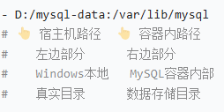

粗略判断可以这样看：

- 左边是 `./xxx`、`../xxx`、`/绝对路径/xxx`，通常是 bind mount。
- 左边只是 `mysql_data`、`qdrant_data` 这种名字，通常是 named volume。

Docker 官方文档也把 volume 定义为由容器引擎管理的持久化数据存储。理解这一点以后，才能解释“为什么容器删了还能恢复数据”，也能解释“为什么新版本启动后像新环境”。

### 4.3 容器生命周期与数据边界

容器适合随时重建，重要数据不应该只放在容器自己的临时文件系统里。

有 volume 或 bind mount 时：

```text
宿主机目录或 Docker volume
        |
        | 挂载
        v
容器内目录
```

程序看起来写入的是容器内目录，例如 `/var/lib/postgresql/data`，实际数据会落到外部 volume 或宿主机目录。

所以：

- 删除容器：通常不删除 volume 或宿主机挂载目录。
- 删除 volume：会删除 Docker 管理的数据。
- 手动删除宿主机挂载目录：也会删除数据。

这也是为什么 `docker compose down` 通常不丢数据，而 `docker compose down -v` 要特别谨慎。

不过“通常不丢”有前提：关键目录确实已经挂载到 volume 或宿主机目录。如果某个服务把数据写在容器自己的可写层里，删容器就会丢。这就是为什么排障时要用 `docker inspect` 看 Mounts，而不是只凭感觉判断。

### 4.4 网络慢或镜像拉取失败

镜像拉取失败通常不是代码问题，而是 Docker 访问镜像仓库不稳定。常见处理方式有两类：

- 在 Windows / macOS 的 Docker Desktop 里配置镜像加速或代理。
- 在 Ubuntu 服务器的 Docker Engine 里配置 `/etc/docker/daemon.json`。

这里容易误判的一点是：浏览器能访问外网，不代表 Docker 引擎一定能拉镜像。Docker 有自己的网络配置。

如果第 6 章安装 Dify 卡在拉镜像，优先回到本节；如果容器已经启动但页面报错，再进入第 6 部分看应用日志。这样能避免把网络问题误判成 Dify 配置问题。

如果你使用的是 Docker Desktop，通常可以在设置中找到 Docker Engine 的配置区域，然后为 `registry-mirrors` 增加镜像地址。Ubuntu 服务器上的配置方式见第 2.10 小节。

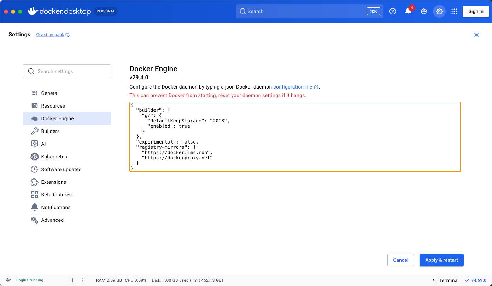

镜像源可参考 GitHub 上的汇总项目：[dongyubin/DockerHub 国内镜像加速列表](https://github.com/dongyubin/DockerHub)。

镜像源可用性会随时间变化。写文档时不要把某一个镜像源当成永久可用地址，实际环境以当时可访问为准。

### 4.5 跨机器迁移与离线同步

Docker 学到后面，很可能会遇到迁移：本地 Windows 能跑了，要搬到 Ubuntu 服务器；有网环境能跑了，要搬到不能访问外网的内网机器。

以本章的 `MySQL + Python` Compose 小案例为例，迁移时别想着“把容器复制过去”。先分清三类东西：

| 迁移对象 | 作用             | 示例                                                    |
| -------- | ---------------- | ------------------------------------------------------- |
| 配置文件 | 描述服务如何启动 | `docker-compose.yml`、`.env`                            |
| 镜像     | 提供运行环境     | `mysql:8.0.45`、`docker-python-mysql-python-app:latest` |
| 数据     | 保存业务状态     | MySQL 数据目录、Docker volume、备份 SQL                 |

#### 4.5.1 在线迁移：目标服务器可以拉镜像

如果 Ubuntu 服务器可以访问镜像仓库，这是最简单的方式。

先在 Windows 本地项目目录停止服务：

```bash
docker compose down
```

确认项目目录里至少有这些文件：

```text
docker-compose.yml
Dockerfile
test_mysql1.py
```

然后把整个项目目录上传到 Ubuntu，例如：

```bash
/home/你的用户名/docker-python-mysql
```

进入服务器目录后，重点修改数据卷路径。Windows 里常见写法可能是：

```yaml
volumes:
  - D:/mysql-data:/var/lib/mysql
```

到 Ubuntu 上应改成 Linux 路径，例如：

```yaml
volumes:
  - /home/你的用户名/mysql-data:/var/lib/mysql
```

然后启动：

```bash
cd /home/你的用户名/docker-python-mysql
docker compose up -d
docker compose ps
docker compose logs python-app
```

如果日志里能看到 Python 成功连接 MySQL，说明服务编排和容器网络已经迁移成功。

这里最容易错的是路径。Windows 的 `D:/mysql-data` 到 Ubuntu 上没有意义，必须改成 Linux 服务器上的真实目录。Dify 迁移也是同理，先看 `volumes`，再决定哪些目录或 volume 要带走。

#### 4.5.2 离线迁移：目标服务器不能拉镜像

服务器不能访问外网、镜像拉取很慢、内网环境不允许在线下载时，可以用 `docker save` 和 `docker load` 迁移镜像。

先在有网机器上确认镜像：

```bash
docker images
```

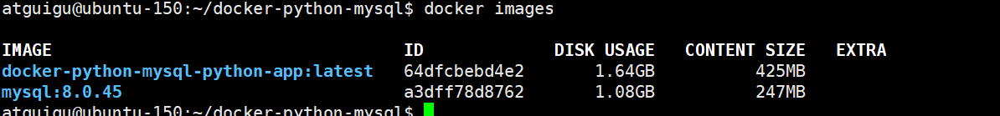

打包 MySQL 镜像和自定义 Python 镜像：

```bash
docker save mysql:8.0.45 -o ./mysql-8.0.45.tar
docker save docker-python-mysql-python-app:latest -o ./python-app.tar
```

把这些文件上传到目标服务器：

| 文件                 | 是否必需 | 说明                          |
| -------------------- | -------- | ----------------------------- |
| `mysql-8.0.45.tar`   | 必需     | MySQL 镜像包                  |
| `python-app.tar`     | 必需     | 自定义 Python 镜像包          |
| `docker-compose.yml` | 必需     | 服务编排配置                  |
| `.env`               | 有则上传 | 环境变量配置                  |
| 数据备份             | 视情况   | 数据库 SQL 备份或挂载目录备份 |

在目标服务器导入镜像：

```bash
docker load -i ./mysql-8.0.45.tar
docker load -i ./python-app.tar
docker images
```

如果原来的 Compose 里写的是：

```yaml
python-app:
  build: .
```

离线环境里没有构建上下文或依赖下载条件时，可以改成已经导入的镜像：

```yaml
python-app:
  image: docker-python-mysql-python-app:latest
```

同时把数据卷路径改成 Ubuntu 路径：

```yaml
mysql-db:
  volumes:
    - /home/你的用户名/mysql-data:/var/lib/mysql
```

最后启动并验证：

```bash
docker compose up -d
docker compose ps
docker compose logs python-app
```

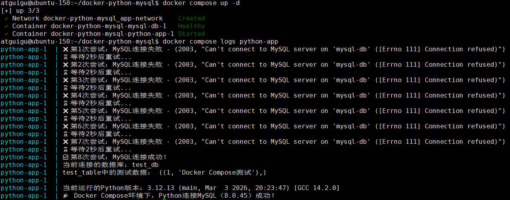

这个思路迁移到 Dify 也一样：提前准备好所需镜像、`.env`、`docker-compose.yaml`、`envs/` 目录、volume / 挂载目录和数据库备份，再到目标服务器导入和启动。

对 Dify 这类系统，还要额外注意两点：

- 只迁移镜像不等于迁移数据。账号、应用、工作流、知识库、上传文件都在数据库、向量库和挂载目录里。
- 只复制 `docker-compose.yaml` 不等于配置一致。新旧版本的 `.env.example`、`envs/*.env.example` 可能新增变量，升级或迁移时要逐项对照。

### 4.6 危险操作清单

Docker 里有些命令看起来像“清理环境”，实际是在删数据。Dify、RAG、问数项目要格外小心：数据库或向量库没了，页面也许还能重新初始化，但旧账号、应用、工作流和知识库已经不在了。

这些命令执行前，先停几秒确认：

| 操作                          | 影响                                    | 风险等级 |
| ----------------------------- | --------------------------------------- | -------- |
| `docker compose stop`         | 停止服务，容器仍保留                    | 低       |
| `docker compose down`         | 删除当前项目容器和网络，默认保留 volume | 中       |
| `docker compose down -v`      | 删除当前项目容器、网络和 volume         | 高       |
| `docker volume rm <volume>`   | 删除指定 volume                         | 高       |
| `docker volume prune`         | 删除所有未使用 volume                   | 高       |
| `rm -rf ./volumes`            | 删除当前目录下的挂载数据                | 高       |
| `sudo rm -rf /var/lib/docker` | 删除 Docker 管理的全部数据              | 极高     |

本地练习时，清空数据有时只是重来一遍；服务器上就不能这么随意了。动手前先问三个问题：

1. 当前服务是否已经停止写入？
2. 数据库、上传文件、向量库和插件目录是否已经备份？
3. 我删的是测试环境，还是有人正在使用的真实环境？

如果答案不确定，先执行查看命令，不要执行删除命令：

```bash
docker compose ps
docker volume ls
docker inspect <容器名> --format '{{json .Mounts}}'
ls -lah ./volumes
```

### 4.7 Docker 基础常见报错

进入 Dify 排障前，先把 Docker 自身的问题排掉。有些“平台启动失败”，实际还没到平台层。

| 报错或现象                        | 常见原因                               | 处理方式                                                      |
| --------------------------------- | -------------------------------------- | ------------------------------------------------------------- |
| Docker Desktop 提示 WSL 2 未配置  | WSL、虚拟机平台或 WSL 内核缺失         | 回到第 2.2 小节检查虚拟化、WSL 功能和内核                     |
| `Connection refused`              | 目标服务没启动、端口写错、服务还没就绪 | 先看 `docker ps`，再看 `docker logs` 或 `docker compose logs` |
| Compose 提示 YAML 格式错误        | 缩进、冒号、引号或 Tab 问题            | YAML 使用空格缩进，冒号后保留空格，避免中文引号               |
| Ubuntu 执行 `docker` 提示权限不足 | 当前用户不在 `docker` 用户组           | 执行 `sudo usermod -aG docker $USER` 后重新登录               |
| `port is already allocated`       | 宿主机端口被其他进程或容器占用         | 换宿主机端口，或停掉占用端口的容器                            |
| 镜像拉取超时                      | Docker Engine 网络或镜像源不可用       | 配置镜像源、代理，或走离线 `docker save/load`                 |

排错时按这个顺序来：

```text
Docker 是否正常 -> 容器是否启动 -> 应用日志
```

---

## 5、把 Docker 知识迁移到 Dify 部署结构

Dify 不是一个单进程应用。用 Compose 启动后，你看到的是一组容器在一起工作。

Dify 使用 Docker Compose 启动时，通常会包含 `api`、`worker`、`worker_beat`、`web`、`plugin_daemon` 这些服务，也会启动 `weaviate`、`db_postgres`、`redis`、`nginx`、`ssrf_proxy`、`sandbox` 等依赖组件。不同版本的 service 名、镜像 tag、可选组件可能变化，实际排查时以你本机的 `docker-compose.yaml`、`.env` 和 `docker compose ps` 输出为准。

前面讲过的 Docker 概念，放到 Dify 里大概是这样：

| Docker 概念         | 在 Dify 里的对应物                                                   | 排障时看什么                           |
| ------------------- | -------------------------------------------------------------------- | -------------------------------------- |
| 镜像                | `langgenius/dify-api`、`langgenius/dify-web`、`postgres`、`redis` 等 | `docker images`、`docker compose pull` |
| 容器 / 服务         | `api`、`worker`、`web`、`nginx`、`db_postgres` 等                    | `docker compose ps`、`docker ps`       |
| 端口映射            | `EXPOSE_NGINX_PORT`、`EXPOSE_NGINX_SSL_PORT`                         | `docker compose ps`、`.env`            |
| volume / bind mount | `./volumes/db/data`、`./volumes/app/storage` 等                      | `docker inspect ... Mounts`            |
| 网络                | Compose 自动创建的项目网络、`ssrf_proxy_network` 等                  | 服务名互访、日志里的连接失败           |
| 环境变量            | `.env`、`envs/*.env`                                                 | 数据库、Redis、URL、向量库、密钥配置   |

读 Dify 的 compose 文件，不用从第一行硬读到最后一行。先抓四类信息：

1. **服务**：这套部署启动了哪些容器。
2. **镜像**：哪些服务使用官方镜像，哪些服务可能需要本地构建。
3. **挂载**：数据库、Redis、上传文件、插件、向量库数据保存在哪里。
4. **入口**：浏览器请求从哪个服务和端口进入。

### 5.1 访问链路

先用一张图建立整体印象：

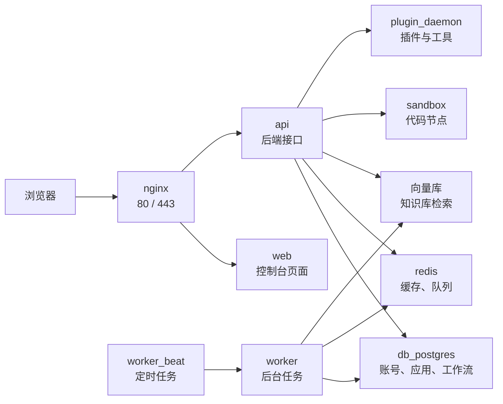

浏览器先访问 `nginx`，再由 `nginx` 转给 `web` 或 `api`。`api` 和 `worker` 再去访问 PostgreSQL、Redis、向量库、sandbox、plugin_daemon。

排障时也按这条链路看：

- 页面完全打不开：先看 `nginx` 和端口映射。
- 页面能打开但接口报错：看 `api`。
- 知识库索引、异步任务不动：看 `worker`。
- 登录、应用、工作流数据异常：看 `db_postgres`。
- 队列、缓存、任务状态异常：看 `redis`。
- 知识库检索异常：看当前启用的向量库。

### 5.2 典型容器分工

| 层次   | 常见服务                                | 主要职责                             |
| ------ | --------------------------------------- | ------------------------------------ |
| 入口层 | `nginx`                                 | 对外提供 80/443 入口，转发到 web/api |
| 应用层 | `web`                                   | Dify 控制台和应用页面                |
| 应用层 | `api`                                   | 后端接口、鉴权、工作流、应用配置等   |
| 应用层 | `api_websocket`                         | 协作、实时通信等可选能力             |
| 任务层 | `worker`                                | 异步任务、知识库索引、队列消费       |
| 任务层 | `worker_beat`                           | 定时任务调度                         |
| 数据层 | `db_postgres` 或其他数据库服务          | 主业务数据库                         |
| 数据层 | `redis`                                 | 缓存、队列、任务中间状态             |
| 向量层 | `weaviate` / `milvus` / `opensearch` 等 | 知识库向量检索，取决于配置           |
| 安全层 | `sandbox`                               | 安全执行代码节点                     |
| 安全层 | `ssrf_proxy`                            | 代理外部访问，降低 SSRF 风险         |
| 插件层 | `plugin_daemon`                         | 插件、工具、模型供应商等扩展能力支撑 |
| 初始化 | `init_permissions`                      | 初始化挂载目录权限，通常执行后退出   |

实际环境中可以用：

```bash
docker compose config --services
docker compose ps
docker ps
```

确认当前版本到底启动了哪些服务。

读官方 compose 时，可以先按这几类服务来理解：

| 服务                                   | 镜像或来源                                | 主要作用                       | 关键挂载 / 端口                                             |
| -------------------------------------- | ----------------------------------------- | ------------------------------ | ----------------------------------------------------------- |
| `nginx`                                | `nginx:latest`                            | 对外入口，转发到 web / api     | `${EXPOSE_NGINX_PORT:-80}`、`${EXPOSE_NGINX_SSL_PORT:-443}` |
| `web`                                  | `langgenius/dify-web:<version>`           | 前端页面                       | 主要依赖环境变量                                            |
| `api`                                  | `langgenius/dify-api:<version>`           | 后端接口                       | `./volumes/app/storage:/app/api/storage`                    |
| `api_websocket`                        | `langgenius/dify-api:<version>`           | WebSocket / 协作能力，可选启用 | 取决于 `COMPOSE_PROFILES` 和当前版本                        |
| `worker`                               | `langgenius/dify-api:<version>`           | 后台任务、知识库索引、队列消费 | `./volumes/app/storage:/app/api/storage`                    |
| `worker_beat`                          | `langgenius/dify-api:<version>`           | 定时任务调度                   | 主要依赖数据库和 Redis                                      |
| `db_postgres`                          | `postgres:15-alpine`                      | 主业务数据库                   | `./volumes/db/data:/var/lib/postgresql/data`                |
| `db_mysql` / `oceanbase` / `seekdb` 等 | 数据库镜像或外部数据库配置                | 可选数据库后端                 | 取决于当前版本和 `.env` / `envs/` 配置                      |
| `redis`                                | `redis:6-alpine`                          | 缓存、队列、中间状态           | `./volumes/redis/data:/data`                                |
| `sandbox`                              | `langgenius/dify-sandbox:<version>`       | 代码节点隔离执行               | `./volumes/sandbox/...`                                     |
| `plugin_daemon`                        | `langgenius/dify-plugin-daemon:<version>` | 插件服务                       | `./volumes/plugin_daemon:/app/storage`                      |
| `ssrf_proxy`                           | `ubuntu/squid:latest`                     | 外部访问代理与 SSRF 防护       | `ssrf_proxy_network`                                        |
| `weaviate` / `qdrant` / `pgvector` 等  | 向量库镜像                                | 知识库向量检索                 | 对应 `./volumes/<向量库>` 目录                              |

读 compose 文件不是为了记住每一行，而是为了回答三个问题：启动了哪些服务，数据挂载在哪里，外部请求从哪个端口进入。

### 5.3 同一个镜像为什么会起多个容器

Dify 后端常见的 `api`、`worker`、`worker_beat` 可能使用同一个后端镜像，只是启动模式不同：

- `api`：对外提供后端接口。
- `worker`：消费队列并执行后台任务。
- `worker_beat`：负责定时调度。

在官方 compose 里，这几个服务都可能使用 `langgenius/dify-api:<version>`，但通过不同的启动命令或环境变量区分角色。

示意配置：

```yaml
api:
  image: langgenius/dify-api:<version>
  environment:
    MODE: api

worker:
  image: langgenius/dify-api:<version>
  environment:
    MODE: worker

worker_beat:
  image: langgenius/dify-api:<version>
  environment:
    MODE: beat
```

所以看到多个容器对应同一个镜像，不代表哪里配错了。判断职责时，要看 service 名、容器名、日志和环境变量，而不是只看镜像名。

### 5.4 docker 目录

Dify 仓库里的 `docker/` 目录主要是部署配置，不是业务源码本身。常见内容包括：

- `docker-compose.yaml`：服务清单。
- `.env`：部署参数、端口、密钥、数据库连接等。
- `envs/`：按核心服务、数据库、向量库、安全配置等拆分的环境变量文件。
- `nginx/`：入口代理配置模板。
- `volumes/`：部分部署方式下的运行数据和挂载目录。

官方 `docker-compose.yaml` 开头也明确提示：该文件由生成脚本生成，不建议直接手动大改。日常部署优先调整 `.env`；确实需要改 compose 行为时，再考虑 override 或模板层面的改造。

如果 Compose 里使用的是 `image: langgenius/dify-web:<version>` 或 `image: langgenius/dify-api:<version>`，实际运行的是官方已经构建好的镜像，不会自动读取你本地的 `web/` 或 `api/` 源码目录。

只有某个服务配置了 `build:`，例如：

```yaml
services:
  web:
    build:
      context: ../web
```

才表示 Compose 会从本地源码构建镜像。

因此，`docker/` 目录更像部署说明书，不是源码目录。后面第 7.2 小节讲“改前端不生效”，原因也在这里：你改了本地源码，但容器可能仍在运行官方镜像。

### 5.5 数据存储位置

看到这里，重点已经从“容器怎么启动”变成了“数据在哪里”。Dify 的容器可以重建，数据库、向量库、上传文件不能随便丢。

确认 Dify 数据位置时，优先看 Compose 中的挂载配置，而不是直接进容器翻文件。

Dify 的关键数据通常包括：

| 数据类型                   | 常见服务                          | 常见位置                                                   |
| -------------------------- | --------------------------------- | ---------------------------------------------------------- |
| 账号、应用、工作流、配置   | PostgreSQL                        | `./volumes/db/data` 或 named volume                        |
| 缓存、队列状态             | Redis                             | `./volumes/redis/data` 或 named volume                     |
| 知识库向量数据             | Weaviate / Milvus / OpenSearch 等 | `./volumes/weaviate` 或对应 volume                         |
| 用户上传文件、应用运行文件 | API / Worker                      | `./volumes/app/storage`                                    |
| 插件数据                   | plugin_daemon                     | `./volumes/plugin_daemon`                                  |
| 代码节点依赖和配置         | sandbox                           | `./volumes/sandbox/dependencies`、`./volumes/sandbox/conf` |
| Nginx 运行配置或证书       | nginx                             | `./nginx`、`./volumes/nginx`                               |
| HTTPS 证书申请数据         | certbot                           | `./volumes/certbot/...`                                    |

具体路径以当前版本的 `docker-compose.yaml` 为准。要确认一个容器实际挂了什么目录，可以执行：

```bash
docker inspect <容器名> --format '{{json .Mounts}}'
```

例如查看 PostgreSQL：

```bash
docker inspect docker-db_postgres-1 --format '{{json .Mounts}}'
```

如果容器名不一致，先用 `docker ps` 看 NAMES 列，再替换命令里的容器名。

判断数据位置时，优先相信 `docker-compose.yaml` 和 `docker inspect`，不要只看文件夹名字。有些版本使用 `./volumes/...`，有些环境使用 Docker named volume，路径表现会不同。

### 5.6 删除容器会不会丢数据

通常不会。前提是数据已经通过 volume 或宿主机目录挂载出来。

危险操作主要是这些：

```bash
docker compose down -v
docker volume rm <volume名>
docker volume prune
rm -rf ./volumes
```

这些操作可能删除真实数据。升级、迁移和清理环境前，先确认 volume 和挂载目录，再备份。

本地测试环境里，清空 volume 有时是为了重新来一遍；服务器或生产环境里，它通常就是高风险操作。看到 `-v`、`volume rm`、`prune`、`rm -rf`，都应该先停一下确认。

`docker compose down` 默认不删数据，但升级过程可能执行数据库 migration，改表结构或写入新数据。升级中途失败时，volume 可能还在，但里面的数据已经处于半升级状态。

所以升级前必须做逻辑备份，例如用 `pg_dump` 导出 PostgreSQL 数据。备份文件和 volume 不是一回事：

- Volume：数据库原始数据目录。
- `pg_dump`：可恢复、可迁移的 SQL 备份。

建议保留 volume，但不要只依赖 volume；先导出 SQL 备份，再启动新版本。这样即使 migration 失败，也还有一条可恢复路径。

---

## 6、Dify 排障：状态、日志、数据与数据库连接

Dify 排障别一上来就改 `.env`，也别一上来就重装。先判断问题发生在哪一层，再看对应日志。

| 现象                 | 优先检查                                        | 常用命令                                            |
| -------------------- | ----------------------------------------------- | --------------------------------------------------- |
| 浏览器完全打不开     | Docker 是否运行、`nginx` 是否启动、端口是否映射 | `docker compose ps`、`docker compose logs -f nginx` |
| 页面能打开但接口报错 | `api` 日志、数据库和 Redis 连接                 | `docker compose logs -f api`                        |
| 知识库索引卡住       | `worker`、向量库、Redis                         | `docker compose logs -f worker`                     |
| 升级后进入初始化页   | PostgreSQL 是否读到旧数据、volume 是否变了      | `psql` 查询、`docker inspect ... Mounts`            |
| 数据库工具连不上     | 端口映射、SSH 隧道、数据库账号密码              | `docker ps`、`ssh -L ...`                           |

### 6.1 常见排障路径

遇到 Dify 无法访问时，建议按下面的链路排查：

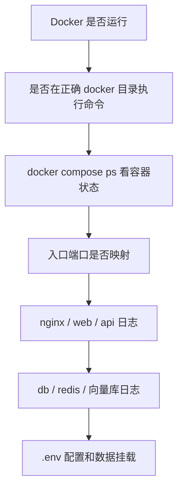

这个顺序是为了把问题分层定位：先排 Docker 和目录问题，再看容器、网络、日志，最后再进入 Dify 配置和数据。

### 6.2 页面无法访问

先执行：

```bash
docker compose ps
docker ps
docker compose logs -f nginx
docker compose logs -f web
docker compose logs -f api
```

重点看：

- `nginx` 是否运行。
- `web` 和 `api` 是否运行。
- `nginx` 是否映射了你访问的端口，例如 `80:80`、`8080:80`。
- `.env` 中端口、域名、URL 配置是否和访问地址一致。
- 本机防火墙、代理、端口占用是否影响访问。

如果 `nginx` 没起来，先看入口层；如果 `nginx` 正常但接口报错，继续看 `api`；如果 `api` 连不上依赖，再看数据库、Redis、向量库。`.env` 建议在日志已经指向配置问题时再修改。

### 6.3 容器启动失败或重启循环

先找具体失败服务：

```bash
docker compose ps
```

再看日志：

```bash
docker compose logs -f <服务名>
```

例如：

```bash
docker compose logs -f api
docker compose logs -f worker
docker compose logs -f db_postgres
docker compose logs -f redis
```

常见原因：

- `.env` 缺少变量或变量不兼容当前版本。
- 数据库、Redis、向量库还没准备好。
- 端口被占用。
- 镜像没拉完整。
- 旧版本数据和新版本 migration 不兼容。

日志里先找第一条关键错误，不要只看最后一行。有些容器会因为前面的配置或连接错误反复重启，最后一行只是“进程退出”。

### 6.4 升级后进入初始化页面

如果升级后页面进入初始化安装页，通常说明新环境没有读到旧数据库。

这类页面不是“正常升级完成”，而是新环境像第一次安装一样重新进入了初始化流程：

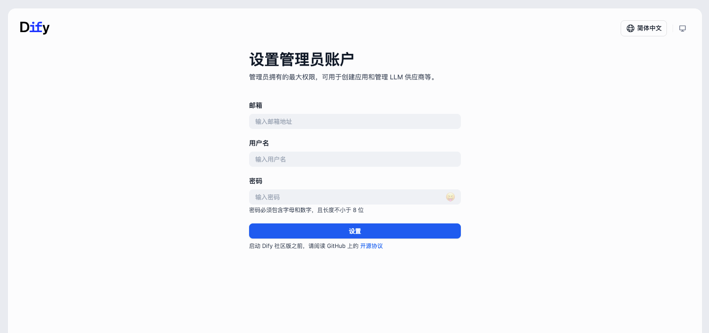

也可能在浏览器里看到安装/初始化入口。出现这种情况时，不要急着重新初始化，先检查旧数据库是否还在：


先查 PostgreSQL 里是否有用户表数据：

```bash
docker exec -it docker-db_postgres-1 psql -U postgres -d dify -c "select count(*) as users_count from account;"
```

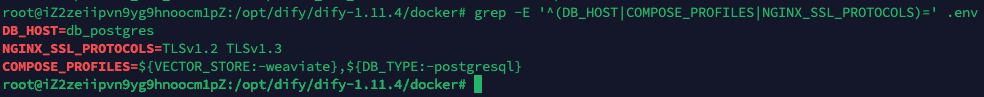

如果用户表有记录，说明数据库里仍有旧数据；如果为 0 或表不存在，需要继续查库名和挂载。

如果容器名或数据库名不同，以你的 `docker ps` 和 `\l` 输出为准。

继续查当前数据库容器挂载了哪个 volume：

```bash
docker inspect docker-db_postgres-1 --format '{{json .Mounts}}'
docker volume ls
```

`docker volume ls` 可以帮助确认当前环境里有哪些 Docker 管理的数据卷：


`docker inspect` 的 Mounts 字段能看到数据库容器实际挂载到了哪里：


常见原因：

- 新版本 Compose 创建了新的 volume。
- `.env` 中数据库 service 名或 profile 没同步。
- 旧数据还在旧目录或旧 volume，但新容器没有挂载到那里。
- 需要从升级前备份的 SQL 文件导入。

这一类问题通常不在页面，而在于“新容器没有读到旧数据库”。排查时重点看数据库库名、volume 名、挂载路径和 `.env` 的数据库配置。

### 6.5 用 Navicat 连接 Dify 数据库

不要直接修改数据库文件目录。`docker/volumes/db/data` 这类目录是 PostgreSQL 的底层数据文件，不是给 Navicat 直接打开的。

要管理数据库，应该通过 PostgreSQL 协议连接。

本节只讨论如何通过 PostgreSQL 协议安全连接数据库。生产环境中，改表、删数据、批量更新前都应先备份，并确认影响范围。

**本地开发环境：暴露端口**

如果只是本地学习，可以在 Compose 中给 PostgreSQL 暴露端口，例如：

```yaml
services:
  db_postgres:
    ports:
      - "5432:5432"
```

然后重启数据库服务：

```bash
docker compose up -d db_postgres
```

Navicat 连接参数通常类似：

| 参数     | 示例                  |
| -------- | --------------------- |
| Host     | `127.0.0.1`           |
| Port     | `5432`                |
| User     | `.env` 中的数据库用户 |
| Password | `.env` 中的数据库密码 |
| Database | `dify`                |

注意：生产环境不要把 5432 直接暴露到公网。

本地学习时暴露 `5432:5432` 没问题，因为访问范围通常只在你自己的电脑上。服务器环境要多考虑安全组、防火墙、数据库弱口令和公网扫描。

**服务器环境：优先用 SSH 隧道**

服务器环境里，更推荐让数据库只在服务器内部访问，然后用 SSH 隧道把本机端口转发过去。

思路是：

```text
Navicat 本机端口
  -> SSH 隧道
  -> 服务器
  -> PostgreSQL 容器或宿主机映射端口
```

示例：

```bash
ssh -L 15432:127.0.0.1:5432 user@your-server
```

然后 Navicat 连：

| 参数     | 示例                  |
| -------- | --------------------- |
| Host     | `127.0.0.1`           |
| Port     | `15432`               |
| User     | `.env` 中的数据库用户 |
| Password | `.env` 中的数据库密码 |
| Database | `dify`                |

如果数据库端口没有映射到宿主机，而只在容器网络里可见，需要先确认容器 IP 或临时使用跳板方式。生产环境建议由运维统一配置安全访问方式。

有些团队会用堡垒机、VPN、内网跳板或云厂商数据库访问策略来做这件事。课程里给的是通用思路，实际生产环境要服从团队的安全规范。

**Mac + SSH 隧道连接服务器 PostgreSQL**

下面是一条更贴近实操的路径：本机用 Navicat，数据库仍留在服务器 Docker 内部网络里，不把 5432 暴露到公网。

先在服务器上确认 Postgres 容器 IP：

```bash
docker inspect -f '{{range .NetworkSettings.Networks}}{{.IPAddress}}{{end}}' docker-db_postgres-1
```

假设输出为 `172.20.0.4`，后面 SSH 隧道就转发到这个容器 IP。

在 Mac 本地保存服务器私钥，例如：

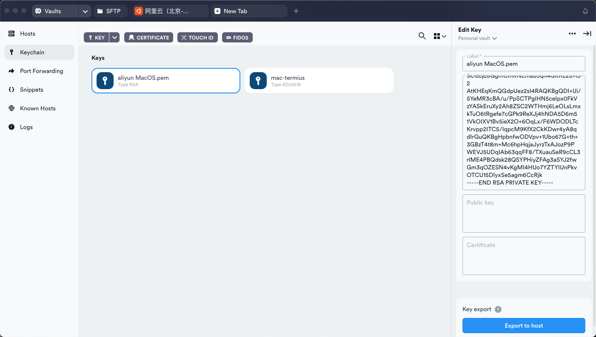

```bash
nano ~/.ssh/aliyun_navicat.pem
chmod 600 ~/.ssh/aliyun_navicat.pem
```

然后建立隧道：

```bash
ssh -i ~/.ssh/aliyun_navicat.pem \
  -N \
  -L 15432:172.20.0.4:5432 \
  root@your-server-ip
```

这个终端窗口需要保持打开。关闭窗口，隧道就断开。


Navicat 里不要再勾选 SSH 选项，因为隧道已经由命令行建好了。它只需要连接本机端口：


常见填写方式：

| 参数     | 示例                  |
| -------- | --------------------- |
| Host     | `127.0.0.1`           |
| Port     | `15432`               |
| User     | `.env` 中的数据库用户 |
| Password | `.env` 中的数据库密码 |
| Database | `dify`                |

连接成功后，就可以像普通 PostgreSQL 一样查看 Dify 表结构和数据：


生产环境里，查看表结构通常没问题；如果要改数据、删数据或批量更新，先备份，再确认影响范围。

---

## 7、Dify 升级、备份与源码改造

Dify 升级不是简单执行 `docker compose pull && docker compose up -d`。它同时牵涉镜像、`.env`、数据库 migration、volume 挂载、插件目录、向量库和前后端版本兼容。

升级前先按这个清单确认一遍：

| 检查项                    | 为什么重要                   | 推荐动作                                    |
| ------------------------- | ---------------------------- | ------------------------------------------- |
| 旧环境是否健康            | 带着旧问题升级，会让排障更乱 | 先看 `docker compose ps` 和 `api` 日志      |
| 数据库是否已备份          | migration 可能改表结构       | 用 `pg_dump` 导出 SQL                       |
| volume / 挂载目录是否确认 | 新版本可能挂到新目录         | 用 `docker inspect` 看 Mounts               |
| `.env` 是否对照新版本     | 新版本可能新增或废弃变量     | 对比 `.env.example` 和 `envs/*.env.example` |
| 是否需要回滚              | 升级失败时要能退回           | 保留旧目录、旧 `.env`、备份文件             |

### 7.1 升级流程

升级前的原则：**先备份，后停服务；先确认数据位置，再启动新版本。**

下面用“旧版本 -> 新版本”的通用流程说明。命令里的容器名、路径和版本号都要按你的环境替换。

Dify 升级不仅是拉取新镜像，还涉及镜像版本、`.env` 配置、数据库 migration、volume 挂载和前后端兼容。任何一个环节没对上，都可能表现为页面打不开、进入 `/install` 或后台任务异常。

**第 1 步：升级前检查**

在旧版本 `docker` 目录执行：

```bash
docker compose ps
docker ps
docker compose logs --tail=100 api
```

先确认旧环境本身是可用的。不要在旧环境已经异常、数据状态不明时直接升级。

如果旧环境已经有报错，先记录当前状态和日志。否则升级失败后，很难判断问题是升级引入的，还是旧环境本来就已经异常。

**第 2 步：确认数据库名**

```bash
docker exec -it docker-db_postgres-1 psql -U postgres -c "\l"
```

常见业务库名是 `dify`。如果你的数据库容器叫 `docker-db-1` 或其他名字，按 `docker ps` 结果替换。

**第 3 步：备份数据库**

```bash
docker exec -t docker-db_postgres-1 pg_dump -U postgres dify > dify_backup.sql
```

建议把备份文件复制到安全位置，不要只放在即将改动的部署目录里。

备份完成后，最好至少确认文件不是 0 字节；重要环境还可以在测试库里试导入一次。没有验证过的备份，只能算“可能有用”。

**第 4 步：停旧版本**

```bash
docker compose down
```

这一步会删除当前 Compose 项目创建的容器和网络，但默认不删除 volume。除非你明确要清空数据，否则不要使用 `docker compose down -v`。

这里用 `down` 是为了让旧容器退出，避免新旧版本同时占用端口或写同一份数据。它不是清库操作，也不应该顺手加 `-v`。

执行后，终端里通常会看到容器和网络被移除：

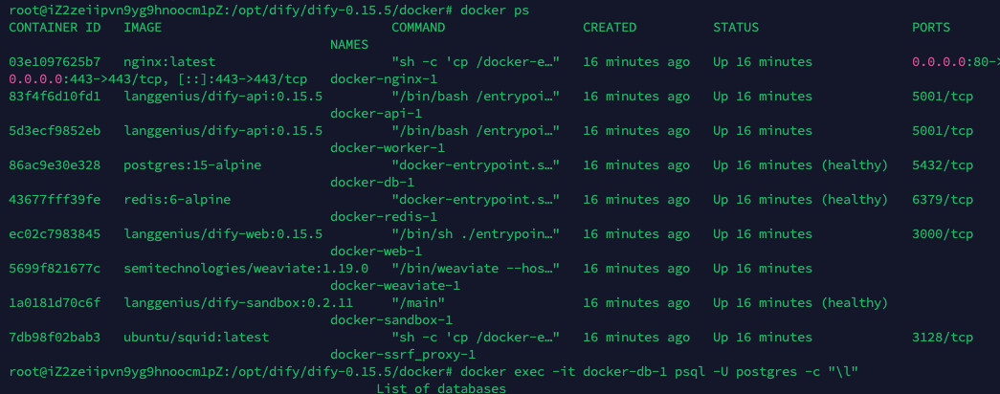

可以再看一眼 volume 是否仍然存在：

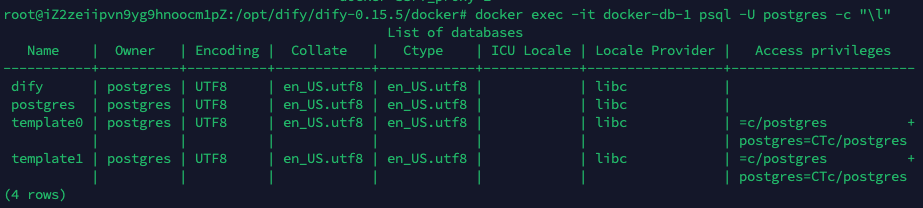

**第 5 步：准备新版本**

常见方式是拉取或解压新版本 Dify，然后进入新版本的 `docker` 目录：

```bash
cd /opt/dify/dify-<new-version>/docker
```

如果使用 `git clone` 拉取新版本，网络不稳定时可能会中断，失败后可以重试或先处理代理/镜像源问题：

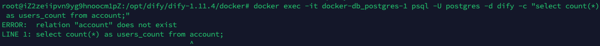

把旧版本 `.env` 复制过来，再按新版本 `.env.example` 补齐新增变量。若项目提供同步脚本，可以使用官方推荐脚本；如果没有，就逐项对照新旧 `.env`。

同步脚本或配置对比工具通常会提示哪些变量需要保留、补齐或调整：

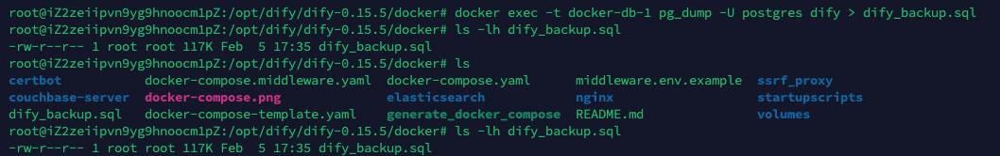

实际改配置时，建议一项一项确认，不要整段盲贴：

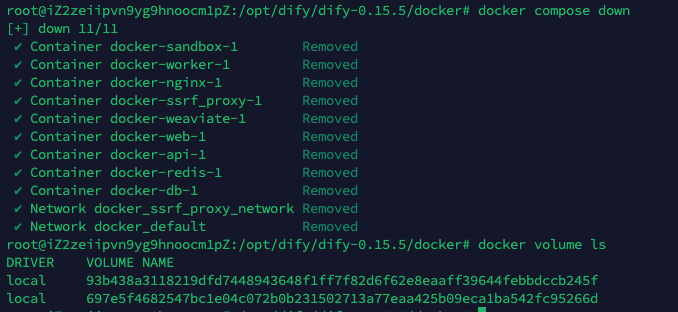

重点检查：

- 数据库服务名，例如 `DB_HOST`。
- `COMPOSE_PROFILES`。
- 端口和域名。
- 密钥类配置。
- 向量库类型和对应连接配置。

`.env` 是升级里最容易被忽略的文件。旧版本能跑，不代表旧 `.env` 能完整满足新版本。新增变量可以用默认值起步，但数据库、密钥、URL、向量库类型这几类不能随便变。

改完后用 `grep` 之类的命令确认关键变量已经生效：

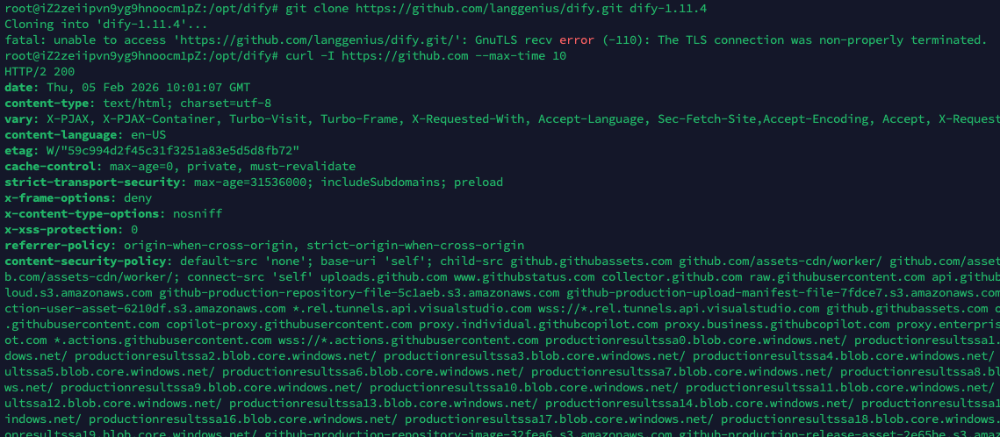

**第 6 步：拉取并启动新版本**

```bash
docker compose pull
docker compose up -d
```

镜像拉取阶段会逐个下载服务镜像：


启动后可以用 `docker ps` 或 `docker compose ps` 查看容器状态：


启动后查看：

```bash
docker compose ps
docker compose logs -f api
docker compose logs -f worker
```

如果进入 `/install` 或没有旧数据，回到第 6.4 小节检查 volume 和数据库数据。

启动后先不要急着清理旧目录和旧备份。等登录、应用列表、知识库、工作流、文件上传、后台任务都确认正常后，再考虑归档旧版本。

**第 7 步：必要时导入旧备份**

如果确认新环境是空库，且你已经决定用备份恢复，可以导入：

```bash
cat /path/to/dify_backup.sql | docker exec -i docker-db_postgres-1 psql -U postgres -d dify
```

如果新库已经初始化过，直接导入可能出现重复索引、重复约束等错误。更稳妥的做法是：确认没有新业务数据后，重建空库再导入。

这里的“确认没有新业务数据”很重要。如果新环境已经有人注册、创建应用或上传文件，直接重建数据库会覆盖这些新数据。生产环境恢复前应先停服务并保留当前状态备份。

如果看到大量 `already exists` 之类的错误，通常说明目标库不是干净空库：

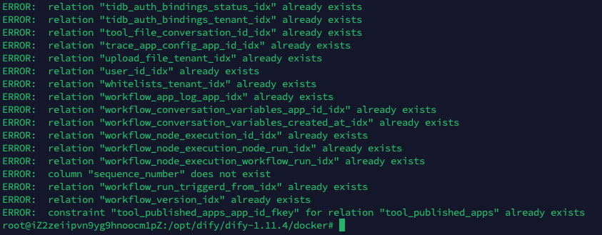

确认可以清空目标库后，再执行：

```bash
docker exec -it docker-db_postgres-1 psql -U postgres -c "SELECT pg_terminate_backend(pid) FROM pg_stat_activity WHERE datname='dify' AND pid <> pg_backend_pid();"
docker exec -it docker-db_postgres-1 psql -U postgres -c "DROP DATABASE IF EXISTS dify;"
docker exec -it docker-db_postgres-1 psql -U postgres -c "CREATE DATABASE dify OWNER postgres;"
cat /path/to/dify_backup.sql | docker exec -i docker-db_postgres-1 psql -U postgres -d dify
```

重建空库并重新导入时，先确认你手里已经有可用备份：

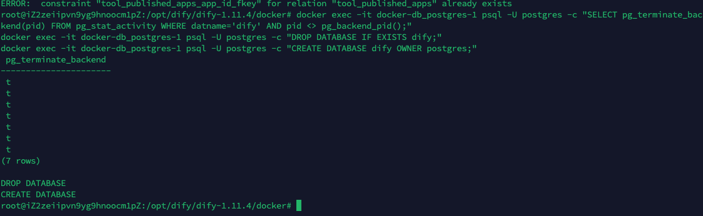

完成后重启关键服务：

```bash
docker restart docker-api-1 docker-worker-1 docker-worker_beat-1 docker-web-1
```

### 7.2 修改 Dify 前端源码并让改动生效

如果 Compose 使用的是官方镜像：

```yaml
services:
  web:
    image: langgenius/dify-web:<version>
```

那么你修改本地 `web/` 目录不会自动生效。因为实际运行的是镜像里已经构建好的前端产物。

要让本地源码生效，需要改为构建自己的 web 镜像。

这一节解决的是开发改造问题，不是普通部署问题。如果只是安装或升级 Dify，不需要改这里；只有你真的要改前端代码、换交互、加页面，才需要走本地 build。

**推荐用 override**

在 `docker` 目录新增 `docker-compose.override.yaml`：

```yaml
services:
  web:
    build:
      context: ../web
      dockerfile: Dockerfile
    image: my-dify-web:local
```

这样升级时更容易对比官方文件，不会把本地改动混进官方 `docker-compose.yaml`。

官方 compose 文件本身是生成文件，升级时也最容易变化。override 的好处是把“官方部署文件”和“本地改造”分开。以后升级 Dify 时，可以先更新官方 compose，再单独检查自己的 override 是否还适配。

**构建并重启 web**

在 `docker` 目录执行：

```bash
docker compose build web
docker compose up -d web
```

如果前端依赖环境变量或构建参数，还要按当前 Dify 版本的 `web/Dockerfile` 和官方说明补齐。

**源码构建场景下是否需要 pull**

- 改前端源码时：`web` 使用本地 build，不靠 `docker compose pull` 获取官方 web 镜像。
- 其他服务：`api`、`postgres`、`redis`、`weaviate` 等仍可按升级流程拉取官方镜像。

如果同时改了后端 `api/`，也要为 api 服务配置对应的 build 和镜像；只改 web，不会让后端代码变化生效。

---

## 8、Docker 常用命令速查

### 8.1 镜像管理

| 目的             | 命令                                    |
| ---------------- | --------------------------------------- |
| 查看本地镜像     | `docker images`                         |
| 拉取镜像         | `docker pull mysql:8.0.45`              |
| 搜索镜像         | `docker search mysql`                   |
| 删除镜像         | `docker rmi mysql:8.0.45`               |
| 查看镜像详细信息 | `docker inspect mysql:8.0.45`           |
| 构建自定义镜像   | `docker build -t my-app:1.0 .`          |
| 打包镜像         | `docker save mysql:8.0.45 -o mysql.tar` |
| 导入镜像         | `docker load -i mysql.tar`              |

### 8.2 容器管理

| 目的           | 命令                                                  |
| -------------- | ----------------------------------------------------- |
| 查看运行中容器 | `docker ps`                                           |
| 查看全部容器   | `docker ps -a`                                        |
| 查看容器日志   | `docker logs -f <容器名>`                             |
| 进入容器       | `docker exec -it <容器名> sh`                         |
| 停止容器       | `docker stop <容器名>`                                |
| 启动容器       | `docker start <容器名>`                               |
| 重启容器       | `docker restart <容器名>`                             |
| 删除已停止容器 | `docker rm <容器名>`                                  |
| 查看容器挂载   | `docker inspect <容器名> --format '{{json .Mounts}}'` |

### 8.3 Compose 项目管理

| 目的                         | 命令                               |
| ---------------------------- | ---------------------------------- |
| 启动整套服务                 | `docker compose up -d`             |
| 启动并重新构建               | `docker compose up -d --build`     |
| 查看服务状态                 | `docker compose ps`                |
| 查看全部服务容器             | `docker compose ps -a`             |
| 查看服务清单                 | `docker compose config --services` |
| 查看某个服务日志             | `docker compose logs -f <服务名>`  |
| 临时运行一个服务             | `docker compose run --rm <服务名>` |
| 进入服务容器执行命令         | `docker compose exec <服务名> sh`  |
| 拉取镜像                     | `docker compose pull`              |
| 构建服务镜像                 | `docker compose build <服务名>`    |
| 停止服务                     | `docker compose stop`              |
| 停止并删除容器、网络         | `docker compose down`              |
| 停止并删除容器、网络、volume | `docker compose down -v`           |
| 停止并删除项目关联镜像       | `docker compose down --rmi all`    |
| 查看最终配置                 | `docker compose config`            |

### 8.4 Dify 常用命令

下面命令默认在 Dify 的 `docker` 目录执行。

| 目的             | 命令                                                                             |
| ---------------- | -------------------------------------------------------------------------------- |
| 查看服务清单     | `docker compose config --services`                                               |
| 查看全部容器     | `docker ps -a`                                                                   |
| 查看 API 日志    | `docker compose logs -f api`                                                     |
| 查看 worker 日志 | `docker compose logs -f worker`                                                  |
| 查看 nginx 日志  | `docker compose logs -f nginx`                                                   |
| 查看数据库日志   | `docker compose logs -f db_postgres`                                             |
| 进入数据库容器   | `docker exec -it docker-db_postgres-1 sh`                                        |
| 连接 PostgreSQL  | `docker exec -it docker-db_postgres-1 psql -U postgres -d dify`                  |
| 查看容器挂载     | `docker inspect <容器名> --format '{{json .Mounts}}'`                            |
| 查看 volume      | `docker volume ls`                                                               |
| 备份数据库       | `docker exec -t docker-db_postgres-1 pg_dump -U postgres dify > dify_backup.sql` |

容器名和服务名可能因 Dify 版本或 Compose 项目名不同而变化。命令执行失败时，先用 `docker compose ps` 或 `docker ps` 确认当前环境里的真实名称。

### 8.5 Ubuntu 服务器常用命令

| 目的                     | 命令                                                                             |
| ------------------------ | -------------------------------------------------------------------------------- |
| 查看 Docker 服务状态     | `sudo systemctl status docker`                                                   |
| 重启 Docker 服务         | `sudo systemctl restart docker`                                                  |
| 配置当前用户免 sudo 使用 | `sudo usermod -aG docker $USER`                                                  |
| 查看 Docker Engine 配置  | `docker info`                                                                    |
| 编辑镜像源配置           | `sudo vim /etc/docker/daemon.json`                                               |
| 重新加载 systemd 配置    | `sudo systemctl daemon-reload`                                                   |
| 停止 Docker 服务         | `sudo systemctl stop docker`                                                     |
| 卸载 Docker 软件包       | `sudo apt remove -y docker-ce docker-ce-cli containerd.io docker-compose-plugin` |
| 删除 Docker 数据目录     | `sudo rm -rf /var/lib/docker /var/lib/containerd`                                |

最后一条是高风险清理命令，会删除本机 Docker 管理的数据。只在确认没有重要容器、镜像、volume 后使用。

### 8.6 危险操作清单

这些命令不是不能用，而是不能在没备份、没确认环境的情况下随手用：

| 命令                          | 可能后果                              | 使用前必须确认                         |
| ----------------------------- | ------------------------------------- | -------------------------------------- |
| `docker compose down -v`      | 删除当前 Compose 项目的 volume        | 数据库、向量库、上传文件是否已备份     |
| `docker volume rm <volume名>` | 删除指定 volume                       | 这个 volume 是否真的是废弃数据         |
| `docker volume prune`         | 删除所有未被容器使用的 volume         | 是否有停掉但还要保留数据的项目         |
| `docker system prune -af`     | 清理未使用容器、网络、镜像、构建缓存  | 是否能接受重新拉镜像和重建缓存         |
| `rm -rf ./volumes`            | 删除当前部署目录下的挂载数据          | 是否已经确认是测试环境或有备份         |
| `sudo rm -rf /var/lib/docker` | 删除 Docker Engine 管理的全部本地数据 | 是否是在重装机器，且已迁出所有数据     |
| `DROP DATABASE dify;`         | 删除 Dify 业务数据库                  | 是否已经停服务、备份、确认目标库可清空 |

确实要清空测试环境时，建议先把“查看命令”和“删除命令”分开执行：

```bash
docker compose ps
docker volume ls
docker inspect <容器名> --format '{{json .Mounts}}'
```

确认之后，再执行清理命令。这个习惯在本地看起来慢一点，到了服务器上能少很多麻烦。

**本章小结：**

- 镜像是模板，容器是运行实例。
- Dockerfile 负责构建镜像，Compose 负责编排多服务。
- `ports` 左边是宿主机端口，右边是容器端口。
- `volumes` 决定数据和文件从哪里来、落到哪里去。
- Windows 本地和 Ubuntu 服务器的 Docker 使用方式相通，但路径、权限、镜像源配置不同。
- Dify 的 Docker 部署是一组服务协同，不是单个容器。
- 排障时先看容器状态和日志，再看端口、`.env`、数据库和向量库。
- 升级前先备份数据库，避免 migration 或误操作带来不可逆损失。
