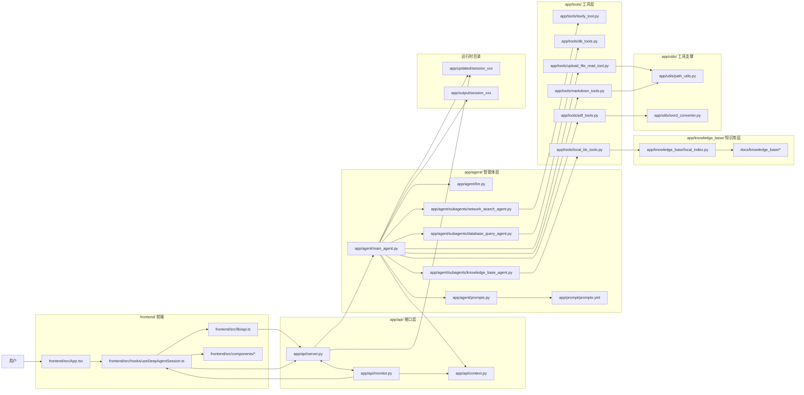
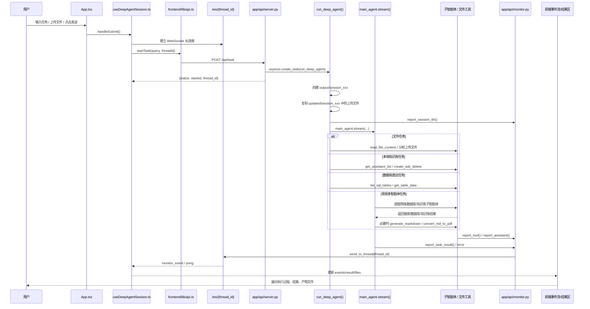

# DeepSearch 目录结构调用流程图

这份文档是给“顺着代码学项目”的导航图，不是运行指南。

目标只有一个：

- 让你能从 `前端发任务` 一路追到 `FastAPI`、`主智能体`、`子智能体`、`工具`、`知识库/数据库/文件输出`

这份图和说明主要对应教程目录里的这些资料：

- `实战项目-深度研搜/8-项目总览与工程初始化.md`
- `实战项目-深度研搜/13-主智能体搭建与异步执行.md`
- `实战项目-深度研搜/14-FastAPI接口与项目闭环.md`

---

## 1. 先记住项目主线

```text
前端输入任务
  -> useDeepAgentSession 建立 WebSocket、发 HTTP 请求
  -> FastAPI /api/task 创建后台任务
  -> run_deep_agent 准备会话目录和上下文
  -> main_agent 调度子智能体或文件工具
  -> monitor 通过 WebSocket 推送事件
  -> 前端展示过程、结果、输出文件
```

---

## 2. 目录结构调用图



---

## 3. 一次任务的真实时序图



---

## 4. 按代码阅读的推荐顺序

如果你是为了“跟调用过程学代码”，推荐按这个顺序打开。

### 第 1 层：前端入口

1. `frontend/src/App.tsx`
2. `frontend/src/hooks/useDeepAgentSession.ts`
3. `frontend/src/lib/api.ts`

这一层重点看：

- 页面什么时候建立 WebSocket
- 页面什么时候调用 `POST /api/task`
- `events`、`result`、`files` 是怎么从 hook 回流到界面的

### 第 2 层：后端接口入口

1. `app/api/server.py`
2. `app/api/monitor.py`
3. `app/api/context.py`

这一层重点看：

- `/api/task` 只负责启动后台任务，不等待最终结果
- `/ws/{thread_id}` 如何把前端连接和 `thread_id` 绑定
- `monitor` 如何按 `thread_id` 把事件推回前端
- `ContextVar` 如何保存 `session_dir` 和 `thread_id`

### 第 3 层：主智能体执行入口

1. `app/agent/main_agent.py`
2. `app/agent/llm.py`
3. `app/agent/prompts.py`
4. `app/prompt/prompts.yml`

这一层重点看：

- `build_main_agent()` 如何把模型、文件工具、子智能体组装成主智能体
- `run_deep_agent()` 如何创建工作目录、复制上传文件、设置上下文
- `_stream_agent_sync()` 如何解析 `agent.stream()` 返回的 chunk
- 为什么有“文件直达 / 知识库直达 / 数据库直达 / 常规多智能体”这几条分支

### 第 4 层：子智能体层

1. `app/agent/subagents/network_search_agent.py`
2. `app/agent/subagents/database_query_agent.py`
3. `app/agent/subagents/knowledge_base_agent.py`

这一层重点看：

- 子智能体本质上是字典配置，不是复杂类
- 每个子智能体都由 `name + description + system_prompt + tools` 组成
- 真正干活的不是子智能体文件本身，而是它挂载的工具

### 第 5 层：工具层

按信息来源分开读最清楚。

#### 5.1 网络搜索

- `app/tools/tavily_tool.py`

重点看：

- `internet_search()`
- `monitor.report_tool()`

#### 5.2 数据库

- `app/tools/db_tools.py`

重点看：

- `list_sql_tables()`
- `get_table_data()`
- `execute_sql_query()`

#### 5.3 本地知识库

- `app/tools/local_kb_tools.py`
- `app/knowledge_base/local_index.py`

重点看：

- `get_assistant_list()`
- `create_ask_delete()`
- `search_knowledge_base()`
- `load_knowledge_docs()`

#### 5.4 文件处理

- `app/tools/upload_file_read_tool.py`
- `app/tools/markdown_tools.py`
- `app/tools/pdf_tools.py`
- `app/utils/path_utils.py`
- `app/utils/word_converter.py`

重点看：

- 上传文件如何读取
- Markdown 如何落盘到当前 `session_dir`
- PDF 如何从 Markdown 转换而来
- 为什么所有路径都要先经过 `resolve_path()`

---

## 5. 每个目录在整条链路里的职责

| 目录 | 作用 | 学习时关注什么 |
| --- | --- | --- |
| `frontend/src/` | 页面、状态、请求入口 | 用户动作如何变成 HTTP/WebSocket |
| `app/api/` | FastAPI 接口、WebSocket、监控 | 如何启动任务、如何推送事件 |
| `app/agent/` | 主智能体与子智能体组装 | 谁负责调度，谁负责执行 |
| `app/tools/` | 外部能力接入层 | 搜索、数据库、知识库、文件工具 |
| `app/knowledge_base/` | 本地知识库检索实现 | 文档如何被索引和召回 |
| `app/utils/` | 路径和文档转换支撑 | 工具底层辅助逻辑 |
| `app/output/` | 每次任务的最终产物 | Markdown、PDF、复制后的文件 |
| `app/updated/` | 上传文件暂存区 | 用户附件先落这里，再复制进 output |
| `docs/knowledge_base/` | 本地知识库原始资料 | 给知识库工具提供可检索文档 |

---

## 6. 最适合“跟调用链看代码”的三条路径

### 路径 A：从页面发任务开始

```text
App.tsx
  -> useDeepAgentSession.ts
  -> frontend/lib/api.ts
  -> app/api/server.py: run_task()
  -> app/agent/main_agent.py: run_deep_agent()
```

适合先搞清楚“请求是怎么发出去的”。

### 路径 B：从主智能体调度开始

```text
app/agent/main_agent.py: build_main_agent()
  -> app/agent/llm.py
  -> app/agent/prompts.py
  -> app/prompt/prompts.yml
  -> app/agent/subagents/*
  -> app/tools/*
```

适合先搞清楚“主智能体到底拿了哪些能力”。

### 路径 C：从事件回流开始

```text
app/tools/*.py / app/agent/main_agent.py
  -> app/api/monitor.py
  -> app/api/server.py: /ws/{thread_id}
  -> useDeepAgentSession.ts
  -> ConversationThread.tsx / ResultPanel.tsx
```

适合先搞清楚“为什么前端能实时看到过程”。

---

## 7. 学习建议

如果你要高效读这个项目，建议不要一上来就把所有文件从头看到尾。

更好的方式是：

1. 先按“路径 A”走一遍，知道请求怎么进入后端。
2. 再按“路径 B”走一遍，知道主智能体如何组装。
3. 最后按“路径 C”走一遍，知道事件怎么回到前端。

这样你会把项目看成一条完整调用链，而不是一堆分散文件。
