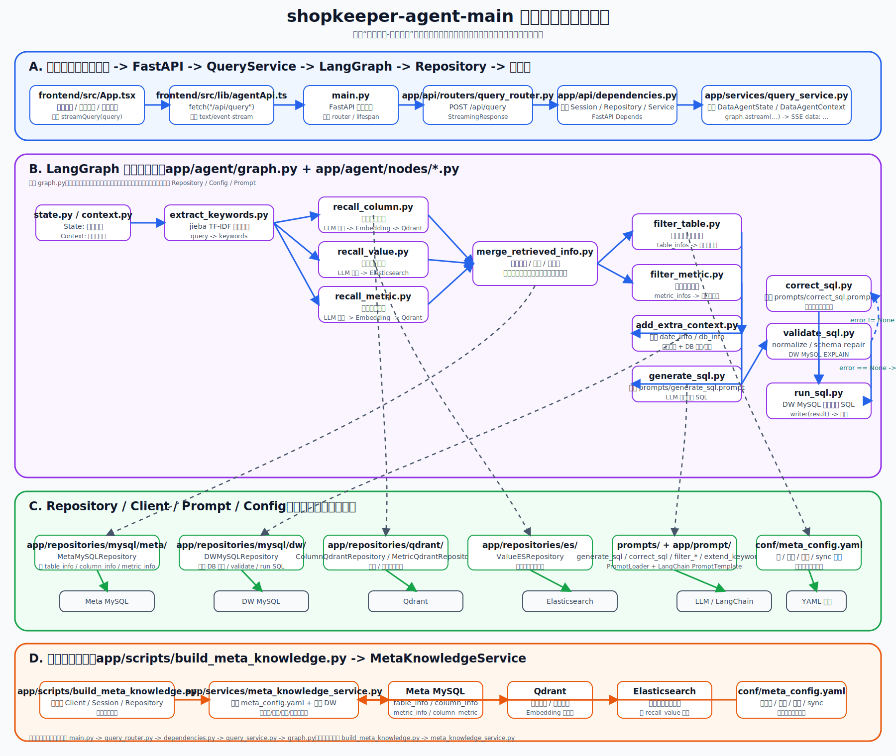

# shopkeeper-agent 目录结构调用流程图

> 这份文档不是泛泛讲架构，而是按 `shopkeeper-agent-main` 当前代码真实调用关系整理的“找代码地图”。  
> 它结合了 `实战项目-电商问数` 目录里的整体架构说明，以及当前仓库里的实际入口、节点、服务、仓储实现。

## 1. 先看哪张图

- 独立可放大图片：[`docs/images/shopkeeper-agent-code-call-flow.svg`](images/shopkeeper-agent-code-call-flow.svg)

直接在浏览器单独打开这个 `SVG`，可以自由缩放，适合一边看图一边点代码。



## 2. 这张图怎么用

如果你是第一次读这个项目，推荐用下面顺序：

1. 先看 `main.py`
2. 再看 `app/api/routers/query_router.py`
3. 再看 `app/api/dependencies.py`
4. 再看 `app/services/query_service.py`
5. 再看 `app/agent/graph.py`
6. 然后按节点顺序读 `app/agent/nodes/*.py`
7. 遇到节点里访问外部数据时，再跳到 `app/repositories/*`
8. 最后再回看 `conf/meta_config.yaml`、`prompts/*`、`frontend/src/*`

这样不容易陷进细节里迷路。

## 3. 在线查询链路：从前端到 SQL 结果

### 3.1 前端入口

- `frontend/src/App.tsx`
  - 管理聊天消息、步骤状态、停止查询、样例问题
  - 收到后端 SSE 事件后，更新“抽取关键词 / 召回 / 生成 SQL / 执行 SQL”等步骤 UI
- `frontend/src/lib/agentApi.ts`
  - 通过 `fetch("/api/query")` 发起请求
  - 按 `text/event-stream` 解析 SSE 数据块

### 3.2 FastAPI 入口

- `main.py`
  - 创建 `FastAPI`
  - 注册 `lifespan`
  - 在真实模式下挂载 `query_router`
- `app/api/lifespan.py`
  - 启动时初始化 MySQL / Qdrant / ES / Embedding 等客户端
  - 关闭时统一释放连接

### 3.3 路由与依赖注入

- `app/api/routers/query_router.py`
  - 定义 `/api/query`
  - 把请求交给 `QueryService`
  - 用 `StreamingResponse` 把 SSE 持续返回给前端
- `app/api/dependencies.py`
  - 组装 `AsyncSession`
  - 组装 `Repository`
  - 组装 `QueryService`

### 3.4 服务层

- `app/services/query_service.py`
  - 创建 `DataAgentState`
  - 创建 `DataAgentContext`
  - 调用 `graph.astream(...)`
  - 把 LangGraph 自定义流式事件包装成 SSE `data: ...`

### 3.5 LangGraph 主流程

- `app/agent/graph.py`
  - 注册所有节点
  - 定义并行边、汇合边、条件边
  - `validate_sql` 成功时走 `run_sql`
  - `validate_sql` 失败时走 `correct_sql -> run_sql`

节点顺序：

```text
extract_keywords
-> recall_column / recall_value / recall_metric
-> merge_retrieved_info
-> filter_table / filter_metric
-> add_extra_context
-> generate_sql
-> validate_sql
-> correct_sql(按需)
-> run_sql
```

### 3.6 节点和它们最该看的代码点

- `extract_keywords.py`
  - 用 `jieba.analyse.extract_tags` 抽关键词
- `recall_column.py`
  - LLM 扩展字段语义词
  - Embedding 向量化
  - `ColumnQdrantRepository.search(...)`
- `recall_metric.py`
  - LLM 扩展指标词
  - `MetricQdrantRepository.search(...)`
- `recall_value.py`
  - LLM 扩展字段值词
  - `ValueESRepository.search(...)`
- `merge_retrieved_info.py`
  - 从 `MetaMySQLRepository` 补齐字段、主外键、表信息
  - 这里是“召回结果转 SQL 上下文”的关键桥梁
- `filter_table.py`
  - LLM 决定保留哪些表和字段
- `filter_metric.py`
  - LLM 决定保留哪些指标
- `add_extra_context.py`
  - 注入日期、数据库方言、数据库版本
- `generate_sql.py`
  - 读取 `prompts/generate_sql.prompt`
  - 让 LLM 生成候选 SQL
- `validate_sql.py`
  - 用真实 DW MySQL `EXPLAIN`
  - 现在还会先做 `normalize_sql` / `repair_sql_with_schema`
- `correct_sql.py`
  - 读取 `prompts/correct_sql.prompt`
  - 根据 SQL 错误二次纠正
- `run_sql.py`
  - 执行最终 SQL
  - 把结果通过 `writer({"type":"result"})` 推回前端

## 4. 在线查询链路里，各目录分别扮演什么角色

### `app/agent`

问数智能体核心。

- `graph.py`：流程编排
- `state.py`：节点共享状态
- `context.py`：运行时依赖容器
- `llm.py`：统一 LLM 入口
- `nodes/`：每个工作流步骤
- `sql_utils.py`：SQL 清洗、补 JOIN、按 schema 修复

### `app/repositories`

数据访问层。你可以把它理解成“节点真正去查谁”的地方。

- `mysql/meta/`
  - 查元数据库里的表信息、字段信息、指标信息
- `mysql/dw/`
  - 查真实数仓
  - 获取字段类型、字段值、数据库信息
  - 执行与校验 SQL
- `qdrant/`
  - 查字段向量
  - 查指标向量
- `es/`
  - 查字段真实取值

### `app/services`

应用服务层。

- `query_service.py`：在线查询入口
- `meta_knowledge_service.py`：离线知识库构建入口

### `app/api`

HTTP 适配层。

- 路由
- 生命周期
- 依赖注入
- 请求 Schema

### `prompts`

提示词层。  
如果你想理解“为什么 LLM 会做这一步”，就要配合节点一起看这里。

### `conf`

配置层。

- `meta_config.yaml` 非常关键
- 它定义了表、字段、指标、字段值是否同步

### `frontend`

前端展示层。  
如果你想理解“为什么页面会显示某一步正在运行”，直接看 `App.tsx` 和 `agentApi.ts`

## 5. 离线构建链路：元数据知识库怎么建出来

这条线和在线问数是另一半。

入口：

- `app/scripts/build_meta_knowledge.py`

核心服务：

- `app/services/meta_knowledge_service.py`

真实流程：

1. 读取 `conf/meta_config.yaml`
2. 调用 `DWMySQLRepository`
   - 取字段类型
   - 取字段示例值
   - 取字段真实值
3. 写入 `MetaMySQLRepository`
   - `table_info`
   - `column_info`
   - `metric_info`
   - `column_metric`
4. 调用 Embedding 服务做向量化
5. 写入 `ColumnQdrantRepository` / `MetricQdrantRepository`
6. 写入 `ValueESRepository`

你可以把它理解成：

```text
meta_config.yaml
  + DW MySQL 原始结构/样例值
  -> MetaKnowledgeService
  -> Meta MySQL / Qdrant / Elasticsearch
  -> 供 QueryService + LangGraph 查询时使用
```

## 6. 结合教程目录，最值得对照看的章节

`实战项目-电商问数` 目录里，和这张图最强相关的是这些：

- `2-项目整体架构与智能体流程.md`
- `4-项目结构与基础服务配置管理.md`
- `7-元数据知识库总览与构建入口.md`
- `10-问数智能体总览与工作流骨架.md`
- `11-关键词抽取与多路召回.md`
- `12-召回信息合并与上下文构建.md`
- `13-SQL生成前的信息过滤与补全.md`
- `14-SQL生成与执行闭环.md`
- `16-查询接口实现与依赖组装.md`
- `17-前后端联调与日志追踪.md`

一个很好用的办法是：

- 先看本仓库代码
- 遇到“不明白这个节点为什么这么设计”
- 再回到对应章节补理论

这样学习速度会快很多。

## 7. 最后给你一个“按问题找代码”的索引

想看“页面为什么能流式显示步骤”：

- `frontend/src/App.tsx`
- `frontend/src/lib/agentApi.ts`
- `app/services/query_service.py`
- `app/agent/nodes/*.py` 里的 `runtime.stream_writer`

想看“为什么能从自然语言找到字段/指标/取值”：

- `recall_column.py`
- `recall_metric.py`
- `recall_value.py`
- `app/repositories/qdrant/*`
- `app/repositories/es/value_es_repository.py`

想看“为什么模型知道哪些表和字段能用”：

- `merge_retrieved_info.py`
- `filter_table.py`
- `filter_metric.py`
- `conf/meta_config.yaml`

想看“SQL 为什么生成成这样”：

- `generate_sql.py`
- `correct_sql.py`
- `prompts/generate_sql.prompt`
- `prompts/correct_sql.prompt`

想看“SQL 到底在哪里校验和执行”：

- `validate_sql.py`
- `run_sql.py`
- `app/repositories/mysql/dw/dw_mysql_repository.py`

想看“元数据知识库到底怎么建出来的”：

- `app/scripts/build_meta_knowledge.py`
- `app/services/meta_knowledge_service.py`
- `app/repositories/mysql/meta/meta_mysql_repository.py`
- `app/repositories/qdrant/*`
- `app/repositories/es/value_es_repository.py`
