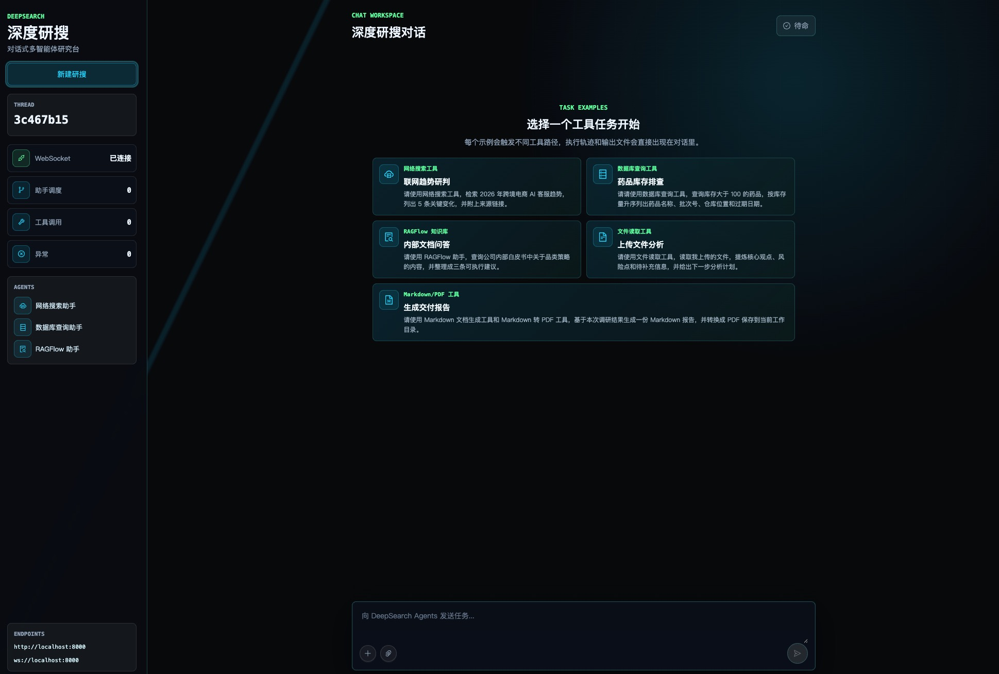
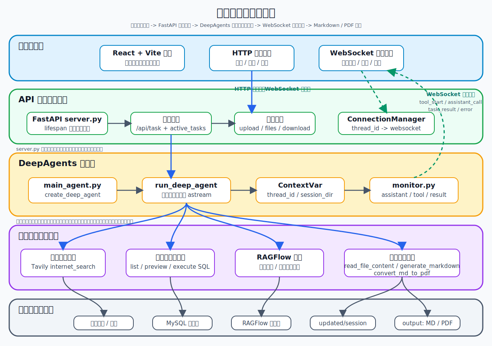
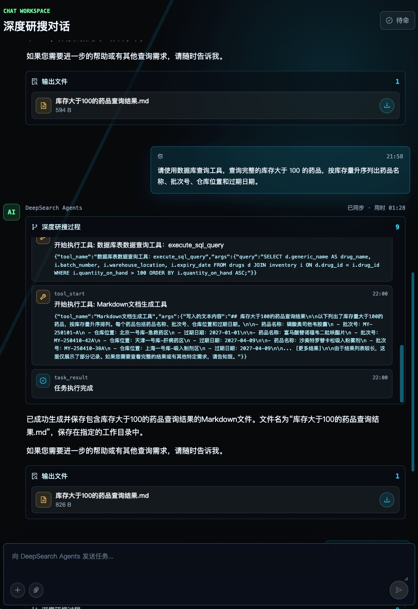

# 深度研搜：前言

---

欢迎来到「深度研搜」项目，正式进入「AI 智能体实战速成指南」里更偏多智能体、长任务和工程闭环的一套实战项目。

如果你已经学过大模型接口调用、`Prompt`、`RAG`、`LangChain` 或 `LangGraph`，下一步通常会遇到一个更实际的问题：**复杂任务到底怎么组织成一个能跑、能看、能交付的项目？**

「深度研搜」就是围绕这个问题设计的。它不是再写一个聊天框，也不是只接一个搜索 `API`，而是用 `DeepAgents` 搭一个对话式多智能体研究台：用户输入研究任务或上传附件，主智能体判断任务需要哪些信息，再调度网络搜索、数据库查询、`RAGFlow` 知识库等能力，最后整理回答，或生成 `Markdown` / `PDF` 文件。



**「深度研搜」不是一个只让大模型回答问题的 `Demo`，而是一套围绕“主智能体规划调度、子智能体分工执行、多来源资料检索、文件生成交付、前后端实时联动”展开的 `DeepAgents` 多智能体实战项目。**

它可能还不是一个完整的企业级生产系统，但非常适合作为入门到进阶阶段的项目实战课程。你可以在这里系统学习一个多智能体应用如何从概念、示例、子智能体、长期记忆、中间件，一步步走到真实的 `FastAPI` 接口和前端页面。

**配套源码仓库地址**：https://github.com/didilili/deepsearch-agents

---

## 1、这套项目重点学什么

很多入门项目只做到“模型能回答”。这当然重要，但离一个可交付的智能体应用还差几步。

在「深度研搜」里，重点不是让模型说得更长，而是解决这些更具体的问题：

- 一个任务什么时候该查网络，什么时候该查数据库，什么时候该查知识库；
- 子智能体的 `description`、`system_prompt`、`tools` 应该怎样分工；
- 上传文件和生成文件怎样按会话隔离，避免不同任务互相覆盖；
- 长任务为什么不能让 `HTTP` 请求一直等，为什么要用 `WebSocket` 回传进度；
- 工具在深层调用中怎样拿到当前 `thread_id` 和 `session_dir`；
- 最终结果怎样从命令行示例走到前端页面、输出文件和下载入口。

所以，这套项目更像一条工程练习线：从 `DeepAgents` 的基本能力开始，逐步把子智能体、记忆、中间件、文件工具、后端接口和前端联调串起来。

学完之后，你应该能明白三件事：

1. `DeepAgents` 适合处理哪类长任务，和普通工具型 `Agent` 有什么区别。
2. 主智能体、子智能体、工具、上下文、文件系统之间应该怎样分层。
3. 一个多智能体能力怎样通过 `FastAPI`、`WebSocket` 和前端页面真正交付出去。

---

## 2、这个项目最终做成什么样

从用户视角看，它是一个“深度研究助手”。

用户可以提出这样的任务：

```text
结合公开资料、数据库信息和我上传的文档，整理一份电商行业研究报告，并生成 PDF。
```

系统背后会按需做这些事：

1. 判断任务需要哪些信息来源；
2. 用 `Tavily` 查询公开网络资料；
3. 用 `MySQL` 查询结构化数据；
4. 用 `RAGFlow` 查询内部知识库；
5. 读取用户本次上传的 `PDF`、`Word`、`Excel` 或 `Markdown` 文件；
6. 汇总资料，判断信息是否足够；
7. 生成 `Markdown`，必要时再转换成 `PDF`；
8. 把执行过程、最终结果和输出文件展示给前端。



执行过程中，前端不会只显示“等待中”。它会展示 `WebSocket` 状态、助手调度次数、工具调用次数，以及每一次 `tool_start`、`assistant_call`、`task_result` 等事件。


如果任务生成了文件，页面还会展示输出文件列表。下面这个例子里，数据库查询助手执行 `SQL` 后，主智能体继续调用 `Markdown` 文档生成工具，最后把 `.md` 文件放到当前会话的输出区域，用户可以直接下载。



---

## 3、章节怎么安排

这套项目分成两段。

第一段是 `DeepAgents` 能力铺垫，主要对应第 1 到 7 章：

| 章节    | 重点                                                          |
| ------- | ------------------------------------------------------------- |
| 第 1 章 | 建立 `DeepAgents` 的定位：长任务、上下文、子智能体、长期记忆  |
| 第 2 章 | 跑通最小示例，理解 `invoke()`、`stream()` 和流式 `chunk`      |
| 第 3 章 | 学会字典式子智能体，以及主智能体如何调度它们                  |
| 第 4 章 | 接入已有 `LangGraph` 图、`LangChain` 的 `Agent` 或 `Runnable` |
| 第 5 章 | 理解人机协作、中断、审批、编辑和恢复执行                      |
| 第 6 章 | 理解 `Backend`、文件系统、`Store` 和长期记忆                  |
| 第 7 章 | 理解中间件和 `Skills`，给 `Agent` 执行链路加治理能力          |

第二段是「深度研搜」项目主线，主要对应第 8 到 14 章：

| 章节     | 重点                                                                    |
| -------- | ----------------------------------------------------------------------- |
| 第 8 章  | 看清最终项目目标、整体架构和工程目录                                    |
| 第 9 章  | 搭好 `.env`、`context.py`、`monitor.py`、`llm.py`、`prompts.yml` 等底座 |
| 第 10 章 | 实现网络搜索子智能体，接入 `Tavily`                                     |
| 第 11 章 | 实现数据库查询子智能体，接入 `MySQL`                                    |
| 第 12 章 | 准备 `RAGFlow` 知识库，并封装知识库助手                                 |
| 第 13 章 | 组装主智能体，接入上传文件读取、`Markdown` 生成、`PDF` 转换             |
| 第 14 章 | 用 `FastAPI`、`WebSocket` 和前端页面完成闭环                            |

这样安排的好处是，前面先把 `DeepAgents` 的核心能力拆开讲，后面再把这些能力放回一个真实项目里。你不会一开始就被完整项目淹没，也不会只停留在零散示例。

---

## 4、技术栈和学习重点

当前项目用到的技术并不多，但每个技术都有明确位置。

| 模块       | 技术栈                                     | 在项目里的作用                                              |
| ---------- | ------------------------------------------ | ----------------------------------------------------------- |
| 智能体框架 | `DeepAgents`                               | 创建主智能体和子智能体，承接长任务和分工调度                |
| 底层运行时 | `LangGraph`                                | 提供检查点、状态恢复和与图工作流的兼容能力                  |
| 模型与工具 | `LangChain`                                | 提供模型封装、工具声明和 `Runnable` / `Agent` 兼容方式      |
| 网络搜索   | `Tavily`                                   | 给网络搜索助手提供公开资料检索能力                          |
| 结构化数据 | `MySQL`                                    | 给数据库查询助手提供表名、样例数据和 `SQL` 查询能力         |
| 私有知识库 | `RAGFlow`                                  | 给知识库助手提供内部文档问答能力                            |
| 文件交付   | `Markdown` / `PDF` / `Word` / `Excel` 解析 | 读取上传附件，生成 `Markdown`，并转换成 `PDF`               |
| 后端接口   | `FastAPI`                                  | 提供任务启动、取消、上传、文件列表、下载和 `WebSocket` 接口 |
| 实时通信   | `WebSocket`                                | 把执行进度、结果和异常实时推给前端                          |
| 前端页面   | `React` + `Vite` + `Ant Design`            | 展示会话、任务事件、输出文件和下载入口                      |
| 环境管理   | `uv`                                       | 管理 `Python` 环境和依赖                                    |

你不需要把每个技术都学到很深才开始。更好的方式是先看它在链路里解决什么问题，再回到对应章节看实现细节。

---

## 5、这套项目不刻意覆盖什么

「深度研搜」适合入门到进阶阶段学习，但它不是完整企业级生产系统。

当前版本重点覆盖的是主链路：

```text
多智能体分工
  -> 多来源工具接入
  -> 会话上下文隔离
  -> 文件生成交付
  -> FastAPI 接口
  -> WebSocket 实时进度
  -> 前端闭环展示
```

有些生产级能力没有展开，比如：

- 用户登录和数据权限；
- 多租户隔离；
- 文件上传安全扫描；
- 分布式任务队列；
- 大规模并发与限流；
- 全量事件持久化；
- 系统评测与回归测试集；
- 监控告警和链路追踪；
- 在线报告编辑与协作。

这些能力都重要，但不适合一开始全部放进来。第一版先把主链路讲清楚，后面再逐层扩展，会更容易学，也更容易改。

---

## 6、项目目录结构

配套源码仓库是 [deepsearch-agents](https://github.com/didilili/deepsearch-agents)。最终项目的主要结构如下：

```text
deepsearch-agents/
├── app/                         # 后端源码主目录
│   ├── agent/                   # 主智能体、模型配置、提示词加载和子智能体配置
│   │   ├── subagents/           # 网络搜索助手、数据库查询助手、RAGFlow 知识库助手
│   │   ├── llm.py               # 大模型初始化
│   │   ├── main_agent.py        # 主智能体组装与 run_deep_agent 执行入口
│   │   └── prompts.py           # 读取 prompts.yml 中的主智能体和子智能体配置
│   ├── api/                     # FastAPI 接口层、上下文和实时进度推送
│   │   ├── context.py           # ContextVar 保存 thread_id 和 session_dir
│   │   ├── monitor.py           # 统一封装工具调用、助手调用和任务结果事件
│   │   └── server.py            # 任务、取消、上传、文件列表、下载和 WebSocket 接口
│   ├── prompt/                  # prompts.yml，集中管理主智能体和子智能体提示词
│   ├── ragflow/                 # RAGFlow 连接配置和基础调用示例
│   ├── tools/                   # Tavily、MySQL、RAGFlow、文件读取、Markdown、PDF 工具
│   ├── utils/                   # 路径解析、Word/PDF 转换等通用工具
│   ├── output/                  # 每个会话生成的 Markdown、PDF 和输出文件
│   └── updated/                 # 用户上传文件的会话暂存目录
├── docker/                      # 本地 MySQL 等服务的 Docker Compose 配置
├── examples/                    # 1 到 15 章对应的 DeepAgents 示例脚本
├── frontend/                    # React + Vite 前端项目
├── tests/                       # 工具、连接管理、取消任务等测试
├── pyproject.toml               # Python 项目配置
├── requirements.txt             # 依赖清单
└── uv.lock                      # uv 锁定文件
```

---

## 7、建议怎么学

如果你是第一次接触 `DeepAgents`，不建议直接从最终版的主智能体 `main_agent.py` 开始看。它背后依赖了子智能体、检查点、`ContextVar`、`monitor`、文件工具、异步流式执行和 `WebSocket` 推送。

更稳的顺序是：

```text
先看第 1 章，知道 DeepAgents 解决什么问题
  -> 跑第 2 章，熟悉 invoke / stream / chunk
  -> 看第 3 章，掌握子智能体配置和调度
  -> 看第 5 到 7 章，理解中断、记忆、中间件和 Skills
  -> 从第 8 章进入真实项目
  -> 第 9 章看懂 context、monitor、path_utils、llm、prompts
  -> 第 10 到 12 章完成三个专家助手
  -> 第 13 章组装主智能体和文件交付工具
  -> 第 14 章接上 FastAPI、WebSocket 和前端页面
```

---

如果你已经准备好了，就从下一章开始，正式进入「深度研搜」的项目学习。

后面的内容会按照 **“DeepAgents 核心概念 -> 快速入门与流式解析 -> 子智能体与兼容接入 -> 人机协作、记忆、中间件 -> 项目工程初始化 -> 三个专家助手 -> 主智能体 -> FastAPI 与前端闭环”** 这条主线，逐步把整套项目拆开讲清楚。

学完之后，你收获的不只是“跑通了一个 AI Demo”，而是能说清楚：一个 `DeepAgents` 多智能体系统为什么要这样设计，代码为什么要这样拆，`DeepAgents`、`WebSocket`、`Tavily`、`MySQL` 和 `RAGFlow` 在一条完整业务链路里分别解决什么问题。
