# 12 - 深度研搜：RAGFlow 子智能体与知识库准备

---

**本章课程目标：**

- 理清 RAGFlow 的四层结构：服务、知识库、聊天助手、会话。
- 掌握课程环境中 RAGFlow 的部署思路和页面准备流程。
- 完成模型供应商配置、知识库创建、文件上传与解析。
- 创建 RAGFlow 聊天助手，并通过页面测试知识库问答效果。
- 理解为什么 RAGFlow 子智能体需要两个工具：先查助手列表，再向指定助手提问。

**学习建议：** RAGFlow 这章先别急着封装 API。它自己有页面、模型配置、知识库、助手和会话，第一遍先把这些对象之间的关系捋清楚。等你能说清“文件进知识库、助手绑定知识库、会话用助手回答”之后，再看工具封装和子智能体配置，会顺很多。

**对应代码分支：** `12-deepsearch-ragflow-subagent`

---

## 1、RAGFlow 解决哪类问题

前两章已经完成了两个子智能体，本章补上第三个子智能体：

| 子智能体       | 底层能力           | 特点                     |
| -------------- | ------------------ | ------------------------ |
| 网络搜索助手   | Tavily API         | 直接调用搜索 API         |
| 数据库查询助手 | MySQL Connector    | 直接连接数据库执行查询   |
| RAGFlow 助手   | RAGFlow 知识库服务 | 需要先部署和配置外部服务 |

本章会按四步走：

```text
先理解 RAGFlow 适合查什么
  -> 再部署服务、准备知识库和聊天助手
  -> 然后封装两个 RAGFlow 工具
  -> 最后组装成 knowledge_base_agent
```

RAGFlow 助手和前两个不太一样。Tavily 只要有 API Key 就能查网络，MySQL 只要有账号密码就能查表；RAGFlow 更像一套完整的 RAG 服务，它会负责文档解析、切片、向量化、检索、引用来源和问答生成。

---

### 1.1 它查询的是内部非结构化文档

在企业项目里，很多知识不是结构化表格，也不是公开网页，而是内部文档：

- 公司制度；
- 产品说明书；
- 操作手册；
- 行业白皮书；
- 金融研报、PDF、Word、Excel；
- 业务培训材料。

这些资料适合放进 RAGFlow。

用户问：`根据 2026 数字人电商直播白皮书，数字人在电商直播里主要解决什么问题？`

这种问题不应该查互联网，也不应该查 MySQL 表，而应该交给 RAGFlow 助手。

### 1.2 为什么不自己手写一套 RAG

如果完全自己写 RAG，需要处理很多环节：

```text
文档读取
  -> 文本清洗
  -> 文档切片
  -> 向量化
  -> 存入向量数据库
  -> 查询时向量检索
  -> 重排序
  -> 拼上下文
  -> 调模型回答
```

这当然可以做，而且后续深入 RAG 项目时会继续拆这些细节。但在「深度研搜」项目里，我们先用 RAGFlow 提供一套现成的企业知识库能力。

可以先把 RAGFlow 理解成：`一个已经集成好文档解析、向量库、检索和问答能力的 RAG 服务。`

### 1.3 它把多格式资料变成统一知识入口

企业知识库最麻烦的地方，不只是“有没有向量数据库”，而是资料来源很杂。

同一个企业里，可能同时存在：

- PDF 版制度文件；
- Word 版操作说明；
- Excel 版业务清单；
- PPT 版培训材料；
- 图片较多的产品说明书；
- 扫描版或排版复杂的历史文档。

如果全部自己处理，就要为不同文件类型分别写读取、清洗、切分和解析逻辑。文档越多，维护成本越高。

RAGFlow 的价值就在这里：**它把“上传文件、解析文件、建立知识库、绑定助手、页面测试、API 查询”放在同一套服务里。**对 DeepAgents 项目来说，我们不用在子智能体里重复实现文档解析和向量检索，只需要把 RAGFlow 当成一个外部知识库服务，通过 API 向合适的聊天助手提问。

---

## 2、理解 RAGFlow 的四层结构

| 层级           | 可以怎么理解                   | 在项目中的作用                         |
| -------------- | ------------------------------ | -------------------------------------- |
| RAGFlow 服务   | 一整套运行中的知识库系统       | 提供页面、API、文档解析和问答能力      |
| 知识库 Dataset | 存放一类文档的空间             | 例如电商行业知识库、金融行业知识库     |
| 聊天助手 Chat  | 绑定一个或多个知识库的问答入口 | 对外表现为“电商行业助手”“金融行业助手” |
| 会话 Session   | 某一次具体提问或对话           | 代码里临时创建，用完后删除             |

它们的关系可以这样看：

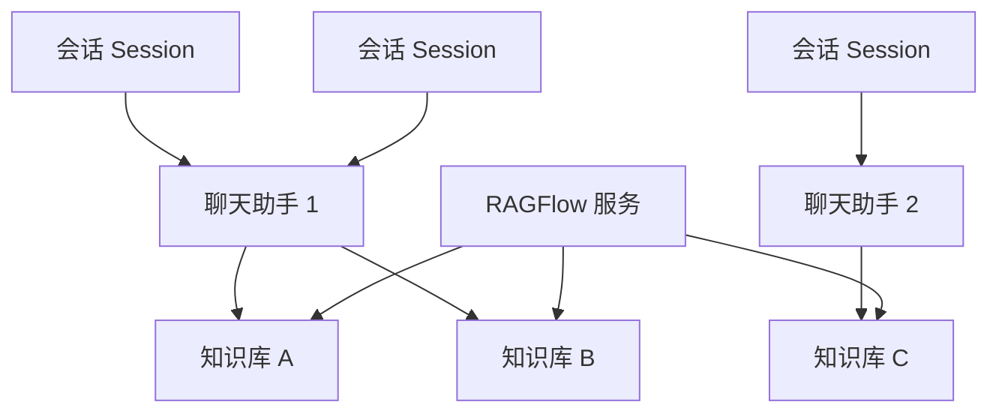

在真实使用时，通常是：

```text
先创建知识库
  -> 上传内部文档
  -> 等待文档解析完成
  -> 创建聊天助手
  -> 给聊天助手绑定知识库
  -> 用户提问时创建临时会话
  -> 向会话提问
  -> 拿到答案后删除会话
```

这里要记住一句话：**代码最终不是直接问知识库，而是问某个聊天助手下的会话。**

---

## 3、部署 RAGFlow 服务

### 3.1 机器配置建议

RAGFlow 服务比较重，建议使用云服务器部署。它不是一个只启动 Python 进程的小工具，底层还会拉起 Elasticsearch、MinIO、MySQL、Valkey 等组件。

课程环境建议：

| 配置项  | 建议值              |
| ------- | ------------------- |
| CPU     | 至少 4 核，8 核更稳 |
| 内存    | 至少 16 GB          |
| 系统    | Ubuntu 24.04        |
| 磁盘    | 至少 50 GB          |
| 公网 IP | 需要                |

如果本地虚拟机内存不足，后续解析 PDF、启动 Elasticsearch、MinIO、MySQL 等组件时会比较吃力。

### 3.2 购买腾讯云服务器

腾讯云竞价实例购买：[购买地址](https://buy.cloud.tencent.com/cvm?tab=custom&step=1&devPayMode=spotpaid&regionId=4&zoneId=0&supportConfidentiality=false&isBackup=false&backupDiskType=ALL&backupDiskCustomizeValue=&backupQuotaSegment=1&backupQuota=1&wanIp=0&tags=null&templateCreateMode=createLt)

进入腾讯云 CVM 购买页后，可以选择竞价实例或按量计费实例。竞价实例价格低，但有被释放的风险，适合短期课堂练习；如果你要持续使用，建议选择更稳定的计费方式。

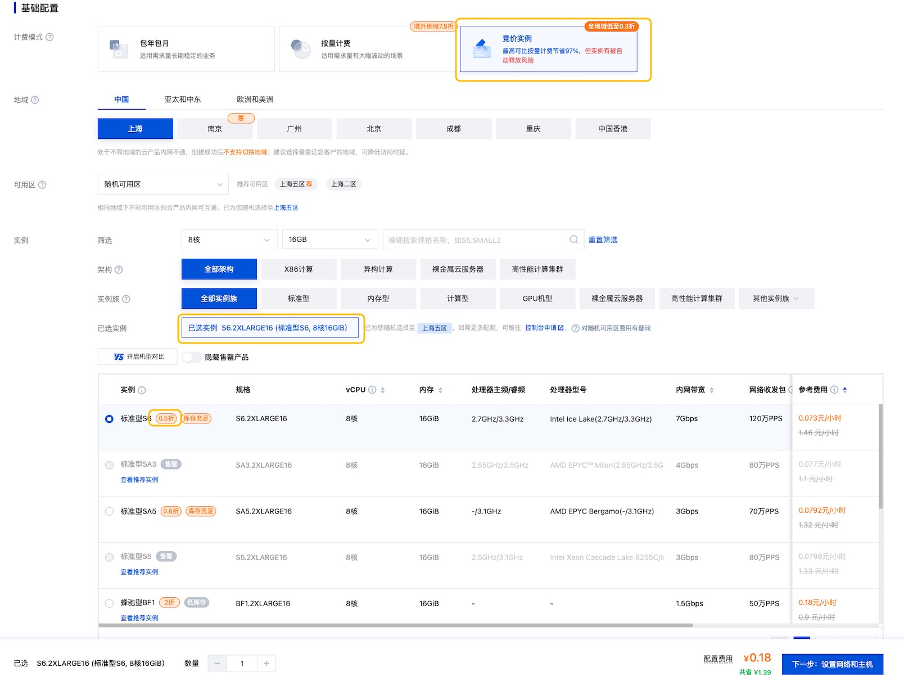

这里先确认计费方式、服务器规格和系统镜像。课程练习可以优先选便宜的短期实例；如果要长期保存知识库，建议使用更稳定的计费方式。

在测试环境，可以放开所有的安全组规则。但是真实项目不要这样做，公网只开放必要端口，管理后台尽量走内网、VPN 或反向代理。

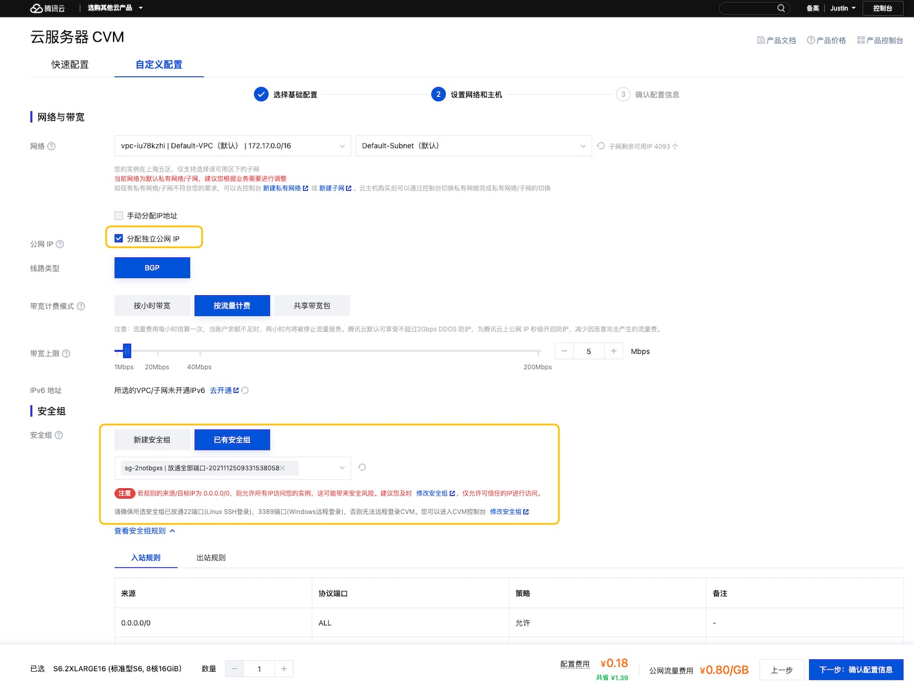

截图里的安全组配置只适合课堂临时测试。真实项目里，RAGFlow 页面、数据库、对象存储和向量检索服务都不要直接暴露给公网。

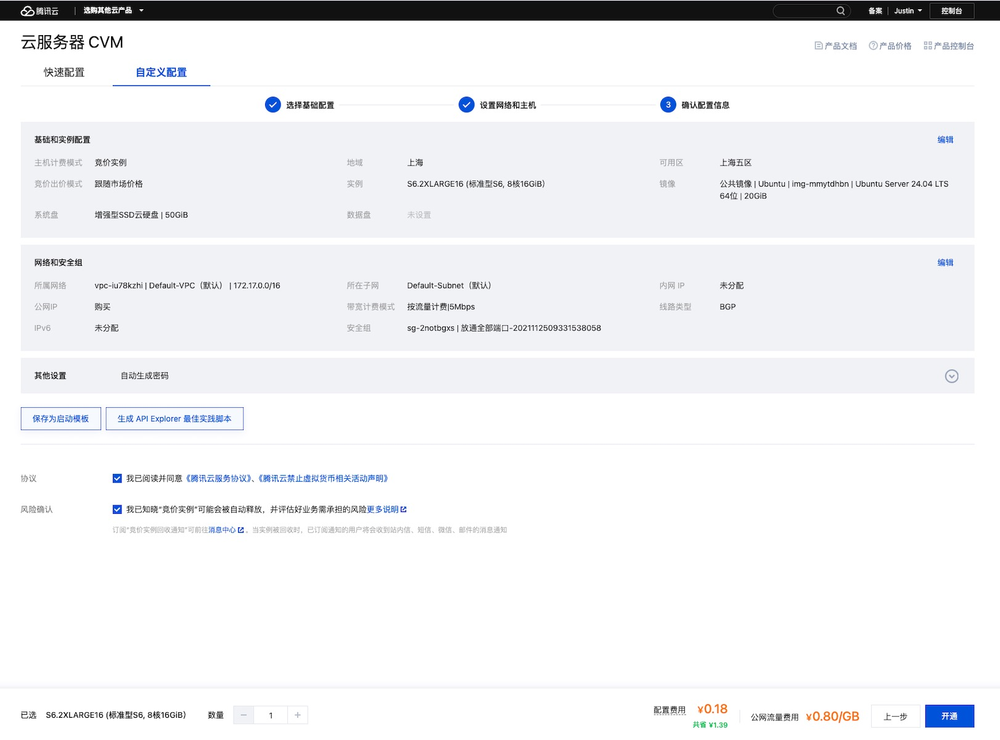

实例创建完成后，先记录公网 IP、登录方式和安全组信息。后面浏览器访问、SSH 登录和 API 地址都会用到这里的公网 IP。

实例创建完成后，在控制台找到公网 IP 和密码，准备远程连接服务器。

### 3.3 安装 Docker 和 Docker Compose

以下命令适用于 Ubuntu 22.04/24.04。

```bash
# 更新系统软件包索引
sudo apt-get update

# 安装 Docker 仓库所需的基础工具
sudo apt-get install -y ca-certificates curl git openssl

# 创建 apt keyrings 目录，用于存放 Docker 源的 GPG key
sudo install -m 0755 -d /etc/apt/keyrings

# 使用腾讯云 Docker CE 镜像源的 GPG key，国内服务器下载更稳定
sudo curl -fsSL https://mirrors.cloud.tencent.com/docker-ce/linux/ubuntu/gpg -o /etc/apt/keyrings/docker.asc

# 允许 apt 读取该 GPG key
sudo chmod a+r /etc/apt/keyrings/docker.asc

# 添加 Docker CE 的 apt 软件源
echo "deb [arch=$(dpkg --print-architecture) signed-by=/etc/apt/keyrings/docker.asc] https://mirrors.cloud.tencent.com/docker-ce/linux/ubuntu/ $(. /etc/os-release && echo "$VERSION_CODENAME") stable" | sudo tee /etc/apt/sources.list.d/docker.list >/dev/null

# 重新更新软件包索引，让 apt 识别 Docker 软件源
sudo apt-get update

# 安装 Docker Engine、Docker CLI、Buildx 和 Compose 插件
sudo apt-get install -y docker-ce docker-ce-cli containerd.io docker-buildx-plugin docker-compose-plugin

# 设置 Docker 开机自启动，并立即启动 Docker
sudo systemctl enable --now docker

# 查看 Docker 版本
sudo docker --version

# 查看 Docker Compose 版本，注意这里是 docker compose，中间有空格
sudo docker compose version
```

### 3.4 调整系统参数

RAGFlow 默认使用 Elasticsearch 作为文档检索和向量存储引擎。Elasticsearch 要求 `vm.max_map_count` 至少为 `262144`。

```bash
# 查看当前 vm.max_map_count
sysctl vm.max_map_count

# 写入持久化配置，重启后仍然生效
echo 'vm.max_map_count=262144' | sudo tee /etc/sysctl.d/99-ragflow.conf

# 立即加载 sysctl 配置
sudo sysctl --system

# 再次确认结果应为 262144 或更大
sysctl vm.max_map_count
```

### 3.5 下载 RAGFlow 源码

课程中使用 RAGFlow 的`v0.25.4` 版本，建议与课程版本保持一致。

#### 3.5.1 方式一：GitHub 浅克隆

如果 GitHub 可以访问，但速度比较慢，优先使用浅克隆。浅克隆只下载指定版本需要的内容，不下载完整提交历史，通常会快很多。

```bash
# 进入 /opt，常用于放置服务器应用
cd /opt

# 只克隆 v0.25.4 这个版本，减少下载体积
sudo git clone --depth 1 --branch v0.25.4 https://github.com/infiniflow/ragflow.git

# 将目录归属给当前用户，避免后续每一步都需要 sudo 编辑文件
sudo chown -R "$USER":"$USER" /opt/ragflow

# 进入 RAGFlow 目录
cd /opt/ragflow

# 进入 Docker Compose 配置目录
cd /opt/ragflow/docker
```

#### 3.5.2 方式二：使用 Gitee 镜像

如果 GitHub 克隆仍然很慢，可以使用 InfiniFlow 在 Gitee 上的镜像仓库。

```bash
# 进入 /opt，常用于放置服务器应用
cd /opt

# 从 Gitee 镜像克隆指定版本，适合国内服务器
sudo git clone --depth 1 --branch v0.25.4 https://gitee.com/infiniflow/ragflow.git

# 将目录归属给当前用户
sudo chown -R "$USER":"$USER" /opt/ragflow

# 进入 Docker Compose 配置目录
cd /opt/ragflow/docker
```

### 3.6 修改 RAGFlow 环境配置

如果你只是短期测试，并且不要求密码安全性，可以跳过本节，直接进入“3.7 启动 RAGFlow”。

先备份 `.env`：

```bash
# 备份原始配置，后续改错可以对照恢复
cp .env .env.bak
```

生成强密码：

```bash
# 分别生成几个强随机密码，用于替换 .env 里的默认密码
openssl rand -hex 24
openssl rand -hex 24
openssl rand -hex 24
openssl rand -hex 24
```

编辑 `.env`：

```bash
# 打开 RAGFlow Docker 环境变量配置
nano .env
```

至少修改以下字段，不要使用默认密码：

```env
# Elasticsearch 密码
ELASTIC_PASSWORD=换成强密码

# MySQL 密码
MYSQL_PASSWORD=换成强密码

# MinIO 密码
MINIO_PASSWORD=换成强密码

# Redis 密码
REDIS_PASSWORD=换成强密码

# 时区，上海服务器建议保持 Asia/Shanghai
TZ=Asia/Shanghai

# 首次部署建议先允许注册，创建完管理员账号后再改成 0
REGISTER_ENABLED=1
```

保存 `nano` 文件：

```text
Ctrl + O
Enter
Ctrl + X
```

### 3.7 启动 RAGFlow

在 `/opt/ragflow/docker` 目录执行：

```bash
# 确认当前目录正确
pwd

# 预先拉取所有镜像。第一次会比较慢
sudo docker compose -f docker-compose.yml pull

# 后台启动 RAGFlow 及其依赖服务
sudo docker compose -f docker-compose.yml up -d

# 查看所有容器状态
sudo docker compose -f docker-compose.yml ps
```

如果这一步镜像拉取太慢，可以先给 Docker 配置腾讯云镜像加速源。这个配置会影响 `mysql`、`elasticsearch`、`minio`、`valkey` 等所有从 Docker Hub 拉取的基础镜像。

```bash
# 打开 Docker daemon 配置文件
sudo nano /etc/docker/daemon.json
```

写入以下内容：

```json
{
  "registry-mirrors": ["https://mirror.ccs.tencentyun.com"]
}
```

保存 `nano` 文件：

```text
Ctrl + O
Enter
Ctrl + X
```

重启 Docker，让镜像加速配置生效：

```bash
# 重新加载 systemd 配置
sudo systemctl daemon-reload

# 重启 Docker
sudo systemctl restart docker

# 查看 Docker 是否正常运行
sudo systemctl status docker
```

确认镜像加速源是否生效：

```bash
# 输出中应能看到 Registry Mirrors
sudo docker info
```

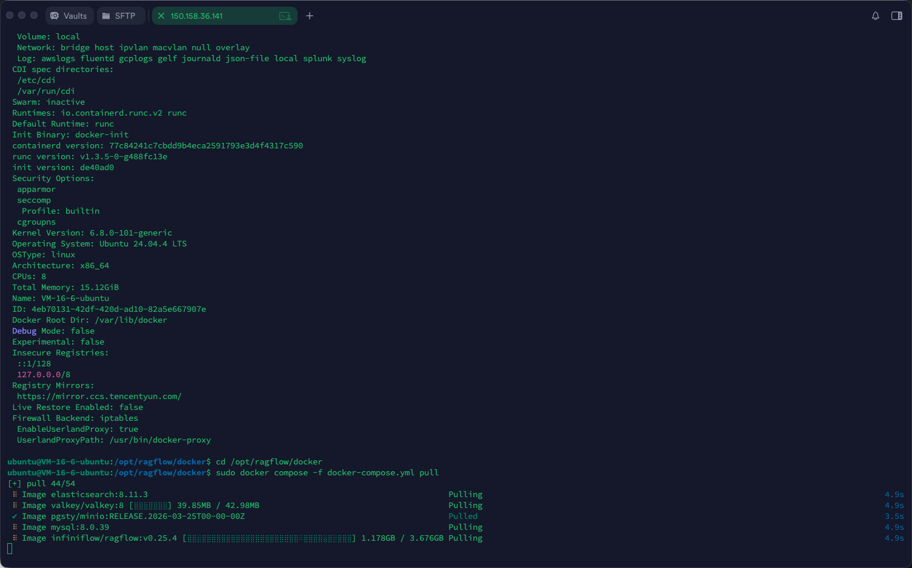

如果输出里能看到 `Registry Mirrors`，并且后续 `docker compose pull` 开始拉取 Elasticsearch、MySQL、Valkey、RAGFlow 等镜像，说明镜像加速配置已经生效。第一次拉镜像体积比较大，耐心等它完成即可。

查看 RAGFlow 主服务日志：

```bash
# 持续查看 RAGFlow 日志
sudo docker compose -f docker-compose.yml logs -f ragflow-cpu
```

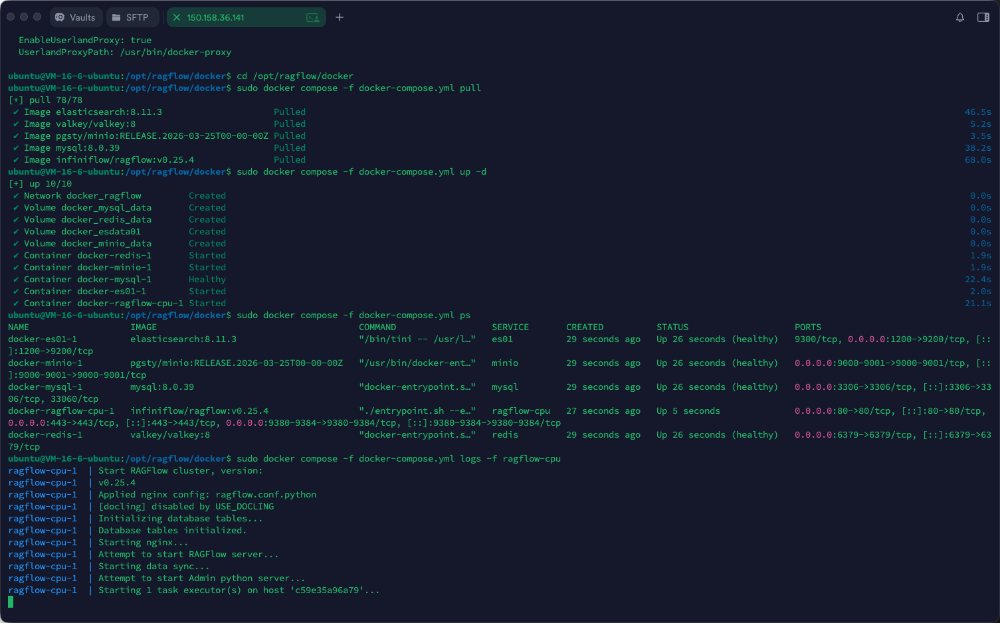

日志里看到服务已经监听地址，再去浏览器访问会更稳。第一次启动时依赖服务较多，页面没立刻打开不一定是失败，先看日志更准确。

当日志中出现类似内容，说明服务启动成功：

```text
Running on all addresses (0.0.0.0)
```

退出日志查看：

```text
Ctrl + C
```

### 3.8 浏览器访问

打开浏览器访问：

```text
http://你的服务器公网IP
```

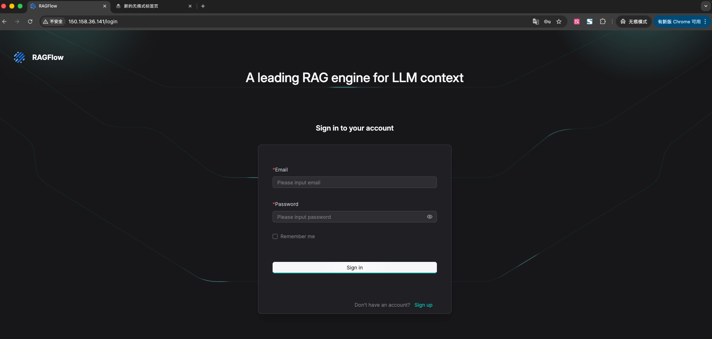

能打开登录或注册页面，说明公网访问、端口映射和主服务启动基本正常。首次创建账号后，记得回到 `.env` 关闭公开注册。

如果安全组和服务都正常，你会看到 RAGFlow 登录或注册页面。

首次注册完成后，建议关闭公网注册：

```bash
# 回到 Docker 配置目录
cd /opt/ragflow/docker

# 编辑 .env
nano .env
```

修改：

```env
REGISTER_ENABLED=0
```

然后重启服务使配置生效：

```bash
# 重新创建受影响容器，使 .env 配置生效
sudo docker compose -f docker-compose.yml up -d
```

如果页面打不开，优先检查服务器防火墙、安全组、RAGFlow 容器状态和端口映射。

### 3.9 安全提示

课程演示中为了快速学习，可能会临时放开较宽的安全组规则。真实项目不要这样处理。

生产环境至少要注意：

- 只开放必要端口；
- 后台管理页不要直接暴露在公网；
- API Key 不要写入公开文档；
- 数据库、对象存储、向量库服务不要裸露；
- 尽量通过内网、VPN 或反向代理访问。

---

## 4、在页面准备模型、知识库和聊天助手

RAGFlow 服务启动之后，此刻还没有开始写代码。页面里的模型、知识库、文档解析和聊天助手都准备好，后面的 API 调用才有东西可问。

### 4.1 添加通义千问模型供应商

至少会涉及几类模型：

| 模型类型   | 作用                             |
| ---------- | -------------------------------- |
| 大语言模型 | 根据检索到的内容生成回答         |
| 向量化模型 | 把文档切片和用户问题转成向量     |
| 重排序模型 | 对召回片段做二次排序，提高相关性 |
| 多模态模型 | 解析图片或 PDF 中的复杂视觉内容  |

课程里选择通义千问系列，是因为它覆盖模型比较完整。进入 RAGFlow 后，可以在模型供应商里添加 `Tongyi-Qianwen`，填入自己的百炼 API Key。

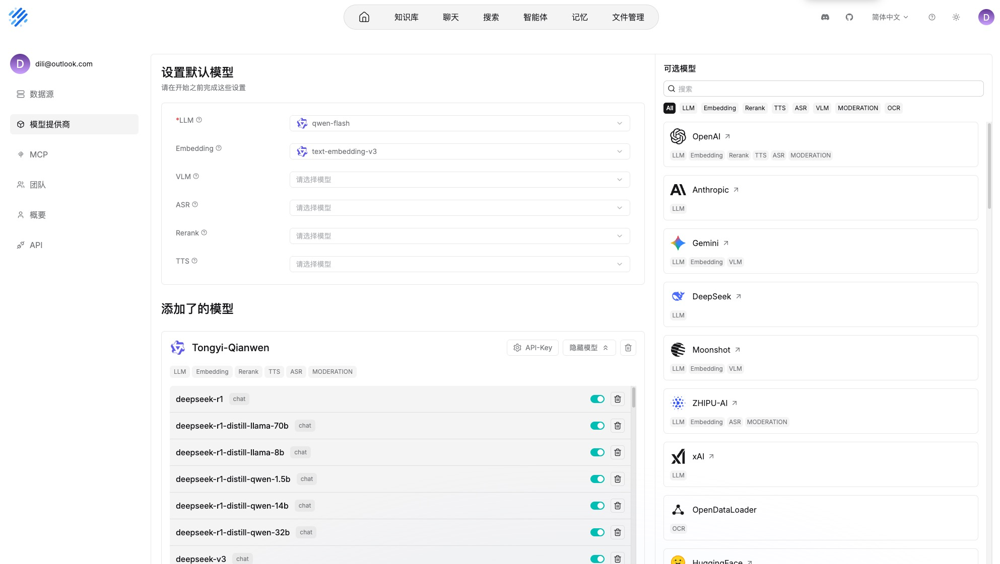

这一步是在 RAGFlow 里配置模型供应商，不是在项目 `.env` 里配置。RAGFlow 需要自己知道用哪个 LLM、Embedding 或 Rerank 模型。

模型供应商配置完成后，再进入默认模型设置。这里不要一次性把所有模型都配满，先保证 `LLM` 和 `Embedding` 可用即可。

### 4.2 默认模型怎么选

RAGFlow 的默认模型配置页里会出现 `LLM`、`Embedding`、`VLM`、`ASR`、`Rerank`、`TTS` 等选项。它们不是都必须配置，而是分别对应不同能力。

| 配置项      | 作用                                                         | 本课程是否必须 |
| ----------- | ------------------------------------------------------------ | -------------- |
| `LLM`       | 大语言模型，负责对话、总结、问答生成和智能体推理             | 必须           |
| `Embedding` | 向量模型，把文档切片和用户问题转成向量，用于知识库检索       | 必须           |
| `Rerank`    | 重排序模型，对召回片段做二次排序，提高相关内容排在前面的概率 | 可选           |
| `VLM`       | 视觉语言模型，用于理解图片、截图、图文混排页面等视觉内容     | 暂时不需要     |
| `ASR`       | 语音转文字模型，用于处理录音、语音文件等输入                 | 暂时不需要     |
| `TTS`       | 文字转语音模型，用于把回答转换成语音播放                     | 暂时不需要     |

所以当前课程阶段，只需要先配置两项：

```text
LLM: qwen-flash
Embedding: text-embedding-v3
```

这两项刚好对应 RAG 的核心流程：文档解析后要用 `Embedding` 写入向量库，用户提问时也要用同一个向量模型做检索；检索到相关片段后，再交给 `LLM` 生成最终回答。

`Rerank` 可以先不配置。等后面发现“能检索到内容，但排序不够准”时，再补一个重排序模型。`VLM`、`ASR`、`TTS` 属于图片、语音相关能力，本章主要处理文档知识库问答，不需要先配置。

---

### 4.3 创建知识库

模型配置完成后，就可以创建知识库。知识库名称和描述要认真写，因为后面创建聊天助手、让 Agent 选择助手时，都依赖这些描述帮助模型判断“这里面有什么资料”。

截图里的重点不是按钮位置，而是名称和描述。后面 Agent 会根据这些文字判断“这个知识库适合回答什么问题”。

本章演示创建两个知识库：

| 知识库名称 | 描述建议                                                 |
| ---------- | -------------------------------------------------------- |
| 电商行业   | 存放电商行业、AI 应用、数字人直播、直播带货相关研究资料  |
| 金融行业   | 存放货币政策、全球投资展望、投资者情绪等金融行业研究报告 |

不要写成“测试库”“知识库 1”这种没信息量的名字，否则后续模型很难判断应该使用哪个助手。

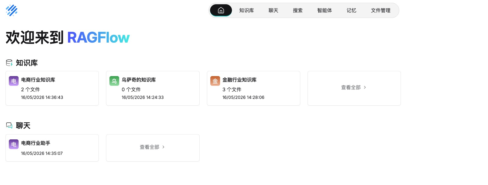

### 4.4 上传文件并解析

知识库创建后，可以上传 PDF、Word、TXT、Excel 等文件。

可以将项目提供的 PDF 文件上传到对应知识库中，文件路径是 `deepsearch-agents/docs/knowledge_base/`。电商相关 PDF 上传到 `电商行业` 知识库，金融相关 PDF 上传到 `金融行业` 知识库，不要混在同一个库里。

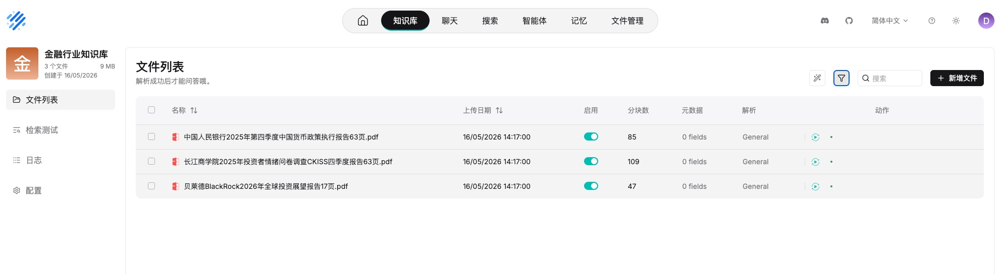

上传文件不等于知识库可用了。只有解析完成后，文档才会经过切片、向量化并写入检索引擎，后续聊天助手才能查到内容。

上传后一定要点击解析。解析过程大致会做这些事：

```text
读取文件
  -> 提取文本或多模态内容
  -> 文档切片
  -> 向量化
  -> 写入底层向量数据库
```

---

### 4.5 创建聊天助手并绑定知识库

知识库只是存资料的地方，真正对外提问的是聊天助手。一个聊天助手可以绑定一个或多个知识库。

本章建议先采用“一类知识库对应一个助手”的方式：

| 聊天助手     | 绑定知识库 |
| ------------ | ---------- |
| 电商行业助手 | 电商行业   |
| 金融行业助手 | 金融行业   |

也可以创建一个综合行业研究助手，同时绑定 `电商行业` 和 `金融行业`。但在课程演示阶段，先拆成两个助手更清楚，后续 Agent 也更容易根据问题选择正确助手。

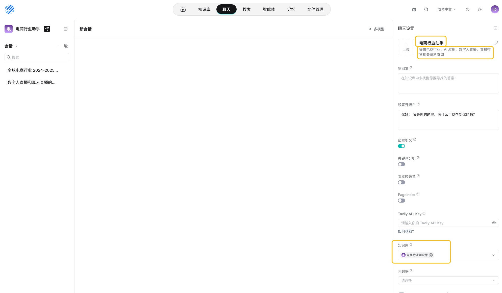

聊天助手才是 API 问答入口。知识库存资料，聊天助手负责绑定知识库并对外回答问题。

### 4.6 助手描述一定要写清楚

创建助手时，助手描述非常重要。

这里建议一开始就把助手名称写得像“业务入口”，例如 `电商行业助手`、`金融行业助手`。不要只写“助手 A”，后面代码虽然能拿到它，但模型不知道它该负责什么。

后续代码里会通过 API 获取所有助手，并把下面这类信息交给模型：

```text
助手名称：电商行业助手；功能介绍：提供电商行业、AI 应用、数字人直播、直播带货相关资料查询；关联知识库：电商行业
助手名称：金融行业助手；功能介绍：提供货币政策、全球投资展望、投资者情绪等金融行业资料查询；关联知识库：金融行业
```

如果助手描述写得太泛，例如“这是一个助手”，模型就无法判断该问谁。

所以建议写成：

```text
提供电商行业、AI 应用、数字人直播、直播带货相关资料查询，
适合回答电商行业趋势、数字人直播应用、AI 电商场景等问题。
```

金融行业助手可以写成：

```text
提供货币政策、全球投资展望、投资者情绪等金融行业资料查询，
适合回答宏观金融、投资展望、政策报告和市场情绪相关问题。
```

而不是：

```text
知识助手
```

### 4.7 页面中先做一次问答测试

如果回答中能看到引用来源，说明它不是凭模型常识回答，而是基于知识库检索出来的内容回答。

可以先用这类问题测试：

```text
全球电商行业 2024-2025 年的市场规模、主要国家排名和增长趋势是什么？
2026 年全球投资展望里提到了哪些主要趋势？
```

这一步很重要。因为如果页面里都问不出来，后面代码调用 API 也很难成功。

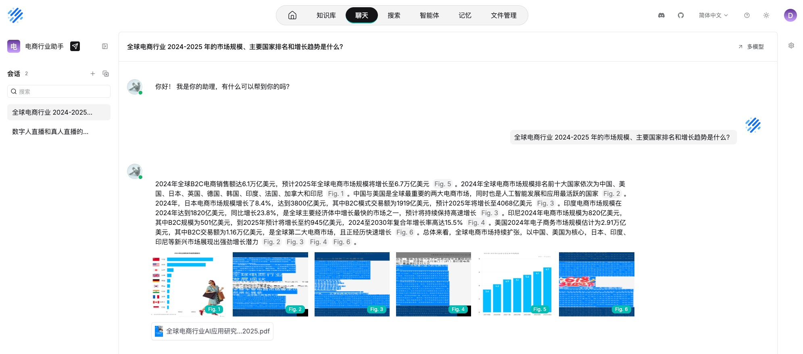

页面测试是代码接入前的第一道验收。如果页面里已经能返回答案和引用来源，后面排查代码问题时就能把重点放到 API Key、地址和助手名称上。

### 4.8 生成 API Key

在右上角点击头像，进入个人中心，点击 `API`，生成 API Key，随后填入项目环境变量中。

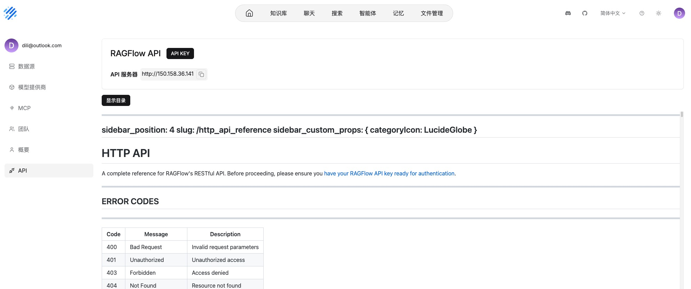

这里生成的是后端调用 RAGFlow API 的访问密钥。不要把真实 API Key 写进公开文档或提交到仓库里。

项目对应文件路径：`deepsearch-agents/.env`

后端代码要访问 RAGFlow，需要两个配置：

| 配置              | 说明                         |
| ----------------- | ---------------------------- |
| `RAGFLOW_API_URL` | RAGFlow 服务地址             |
| `RAGFLOW_API_KEY` | RAGFlow 页面中生成的 API Key |

---

## 5、页面配置和代码调用的分工

RAGFlow 的使用可以分成两部分：

| 工作               | 更推荐在哪里做    | 原因                             |
| ------------------ | ----------------- | -------------------------------- |
| 配模型             | 页面              | 配置项多，页面更直观             |
| 建知识库           | 页面或 API 都可以 | 学习阶段页面更清楚               |
| 上传文件和解析     | 页面更常见        | 便于观察解析状态和失败原因       |
| 创建聊天助手       | 页面更常见        | 需要写描述、绑定知识库、测试效果 |
| 获取助手列表       | 代码              | Agent 需要动态知道有哪些助手     |
| 创建临时会话并提问 | 代码              | 用户每次提问都需要自动完成       |
| 删除临时会话       | 代码              | 防止会话堆积                     |

本项目采用的思路是：

```text
服务部署、模型、知识库、助手：主要在 RAGFlow 页面准备好
Agent 查询知识库：通过 Python API 创建会话、提问、删除会话
```

下面就会把这套“代码调用 RAGFlow”的流程封装成两个工具。

---

## 6、RAGFlow 子智能体的接入思路

前面已经完成了 RAGFlow 服务侧准备：

```text
部署 RAGFlow
  -> 配置模型
  -> 创建知识库
  -> 上传并解析文件
  -> 创建聊天助手并绑定知识库
  -> 页面测试问答
  -> 生成 API Key
```

接下来要做的是把这些能力接入 DeepAgents 项目。

最终我们会得到第三个子智能体：

| 子智能体     | 负责内容                                                   |
| ------------ | ---------------------------------------------------------- |
| RAGFlow 助手 | 查询非结构化行业资料，例如白皮书、研报、政策报告、行业报告 |

它底层会使用两个工具：

| 工具名               | 作用                                       |
| -------------------- | ------------------------------------------ |
| `get_assistant_list` | 获取 RAGFlow 中有哪些聊天助手和关联知识库  |
| `create_ask_delete`  | 创建临时会话，向指定助手提问，用完删除会话 |

这里要抓住一个核心：**RAGFlow 子智能体不是直接把问题扔给某个固定知识库，而是先动态发现有哪些助手，再选择合适助手创建临时会话提问。** 这样后续知识库和助手增加时，Agent 不需要改代码，也能先查看当前 RAGFlow 里有什么。

---

### 6.1 为什么要先查助手列表

RAGFlow 是一个独立服务。今天可能只有“电商行业助手”和“金融行业助手”，明天可能新增“医药行业助手”“企业制度助手”。

如果我们在代码里写死：

```python
chat_name = "电商行业助手"
```

那系统只能问一个固定助手，扩展性很差。

更合理的做法是：

```text
先查询当前有哪些助手
  -> 看每个助手的名称、描述、关联知识库
  -> 再决定向哪个助手提问
```

### 6.2 描述写得准，模型才选得准

`get_assistant_list` 返回的信息大概长这样：

```text
助手名称：电商行业助手；功能介绍：提供电商行业、AI 应用、数字人直播、直播带货相关资料查询；关联知识库：电商行业
助手名称：金融行业助手；功能介绍：提供货币政策、全球投资展望、投资者情绪等金融行业资料查询；关联知识库：金融行业
```

模型会根据这些信息判断应该使用哪个助手。

所以前面反复强调：知识库名称、知识库描述、聊天助手描述，都要认真写。

```text
用户问数字人直播应用场景 -> 应该找电商行业助手
用户问全球投资展望或货币政策 -> 应该找金融行业助手
```

---

## 7、准备 RAGFlow 工具代码

### 7.1 读取 RAGFlow 环境变量

项目对应文件路径：`deepsearch-agents/app/ragflow/rag_config.py`。

```python
"""
RAGFlow 连接配置加载模块

集中读取 RAGFlow SDK 需要的 API Key 和服务地址，供原始调用示例与
LangChain 工具共用。这样后续如果 .env 字段或读取规则调整，只需要改这一处。
"""

import os
from typing import Optional, Tuple

from dotenv import find_dotenv, load_dotenv


def _load_ragflow_env() -> Tuple[Optional[str], Optional[str]]:
    """
    加载 RAGFlow 环境变量

    使用 python-dotenv 自动向上查找 .env，保持和项目其他配置加载方式一致。
    :return: (api_key, base_url)，缺失配置时对应位置返回 None
    """
    load_dotenv(find_dotenv())

    # RAGFlow SDK 初始化只需要这两个核心字段：认证 API Key 和服务基础地址
    api_key = os.getenv("RAGFLOW_API_KEY")
    base_url = os.getenv("RAGFLOW_API_URL")
    return api_key, base_url
```

### 7.2 可选扩展：用代码创建知识库

项目对应文件路径：`deepsearch-agents/app/ragflow/knowledge_demo.py`

前面主要通过 RAGFlow 页面创建知识库，这是学习阶段最直观的方式。但 RAGFlow SDK 也支持通过代码创建知识库。

这类能力适合后续做自动化后台，例如“用户上传一批企业资料后，系统自动创建知识库并导入文件”。在当前 DeepAgents 子智能体主线里，暂时不把它注册成 Agent 工具，避免模型在不需要的时候乱创建知识库。

核心代码可以这样理解：

```python
from app.ragflow.rag_config import _load_ragflow_env
from ragflow_sdk import RAGFlow


# RAGFlow SDK 的入口客户端，后续 Dataset、Chat、Session 操作都从这里发起
api_key, base_url = _load_ragflow_env()
ragflow_client = RAGFlow(api_key=api_key, base_url=base_url)


def create_knowledge_base(knowledge_base_name, description):
    """
    通过代码创建 RAGFlow 知识库

    知识库名称和描述要写准确：后续聊天助手会绑定知识库，
    Agent 又会根据助手描述和关联知识库来判断该问哪个助手。
    :param knowledge_base_name: 知识库名称
    :param description: 知识库描述
    """
    # RAGFlow SDK 中知识库通常对应 Dataset；Chat 会再绑定一个或多个 Dataset 对外提供问答
    # embedding_model 需要和 RAGFlow 页面中可用的模型供应商配置保持一致
    ds = ragflow_client.create_dataset(
        name=knowledge_base_name,
        description=description,
        embedding_model="text-embedding-v3@Tongyi-Qianwen",
    )
    print(f"创建知识库成功：{ds},{ds.id}")
```

### 7.3 可选扩展：用代码上传文档

创建好知识库后，也可以用代码批量上传文档。

精简版流程如下：

```python
import os.path


def upload_file_to_knowledge_base(kb_id, file_paths):
    """
    向指定知识库上传一个或多个本地文件

    注意：此函数只负责把文件送进 Dataset。上传后仍需要在 RAGFlow 页面或任务中完成解析，
    否则文档还没有切片、向量化，后续聊天助手可能检索不到内容。
    :param kb_id: RAGFlow 知识库 ID，也就是 Dataset ID
    :param file_paths: 本地文件路径列表
    """
    # 先根据知识库 ID 查询 Dataset 对象，确认文件会上传到目标知识库
    datasets = ragflow_client.list_datasets(id=kb_id, page=1, page_size=10)
    dataset = datasets[0]

    # RAGFlow upload_documents 接收的是文档字典列表：
    # display_name/name 用于页面展示，blob 存放文件二进制内容
    document_list = []
    for file_path in file_paths:
        file_name = os.path.basename(file_path)
        with open(file_path, "rb") as f:
            blob = f.read()
            document_list.append(
                {"display_name": file_name, "name": file_name, "blob": blob}
            )

    # 上传完成后，RAGFlow 侧还要执行解析流程，解析成功后才能被 Chat 检索
    dataset.upload_documents(document_list)
```

这个函数只负责“把文件送进 RAGFlow”。上传后仍然要关注解析状态：如果文档没有完成解析，后面的 `create_ask_delete` 即使能连上助手，也可能检索不到有效内容。

学习阶段建议先用页面上传和解析，因为页面能清楚看到每个文件的状态；等流程跑通后，再考虑把创建知识库、上传文件做成后台管理功能。

---

## 8、工具一：get_assistant_list

项目对应文件路径：`deepsearch-agents/app/tools/ragflow_tools.py`

### 8.1 工具作用

`get_assistant_list` 用来获取 RAGFlow 当前所有聊天助手，以及每个助手关联的知识库。

它解决的是“我应该问谁”的问题。

流程如下：

```text
连接 RAGFlow
  -> ragflow_client.list_chats() 查询所有聊天助手
  -> 遍历每个 Chat 对象
  -> 读取 chat.kb_names
  -> 拼接成模型容易理解的字符串
```

### 8.2 核心代码

```python
from langchain_core.tools import tool
from ragflow_sdk import RAGFlow

from app.api.monitor import monitor
from app.ragflow.rag_config import _load_ragflow_env

# 模块级复用 RAGFlow 客户端，避免每次工具调用都重新初始化 SDK 对象
api_key, base_url = _load_ragflow_env()
ragflow_client = RAGFlow(api_key=api_key, base_url=base_url)


# @tool 会把函数签名和 docstring 暴露给 DeepAgents，模型据此决定是否调用以及如何填参
@tool
def get_assistant_list() -> str:
    """
    查询 RAGFlow 中有哪些聊天助手，以及每个助手关联了哪些知识库

    作用：让模型先了解“哪个助手能回答哪类内部文档问题”，再决定后续要向哪个助手提问。
    调用 create_ask_delete 之前，应先调用本工具确认助手名称。
    :return: 有助手时返回助手名称、功能介绍、关联知识库；无助手或异常时返回中文提示
    """
    # 埋点：工具被调用后，前端可以展示当前正在查询 RAGFlow 助手列表
    monitor.report_tool(tool_name="ragflow聊天助手列表查询工具：get_assistant_list")

    try:
        # list_chats 查询的是 RAGFlow 的 Chat 层，不是 Dataset 层
        # Chat 负责对外问答，Dataset 只负责承载文档
        chat_list = ragflow_client.list_chats()
        if not chat_list:
            return "没有任何可用助手"

        # 把每个助手的名称、描述和绑定知识库拼成模型容易阅读的路由信息
        count_chat_info = ""
        for chat in chat_list:
            # 不同版本 SDK 字段可能为空，这里用 getattr 兼容没有绑定知识库的助手
            dataset_names = getattr(chat, "kb_names", []) or []

            count_chat_info += f"助手名称:{chat.name};功能介绍：{chat.description}; 关联的知识库：{'、'.join(dataset_names)} \n"
        return count_chat_info
    except Exception as e:
        return f"查询助手信息异常，无可用助手,异常信息:{str(e)}"
```

### 8.3 为什么返回字符串

工具返回给 Agent 的内容越清楚越好。

这里返回字符串，而不是复杂对象，是因为模型最容易直接阅读这种格式：

```text
助手名称:电商行业助手;功能介绍：提供电商行业、AI 应用、数字人直播、直播带货相关资料查询; 关联的知识库：电商行业
```

这样模型能直接判断：

```text
用户问数字人直播应用场景 -> 应该找电商行业助手
用户问全球投资展望或货币政策 -> 应该找金融行业助手
```

---

## 9、工具二：create_ask_delete

项目对应文件路径：`deepsearch-agents/app/tools/ragflow_tools.py`

### 9.1 工具作用

`create_ask_delete` 完成一次临时问答。

它的名字可以拆开看：

```text
create  创建会话
ask     提问
delete  删除会话
```

为什么要删除会话？

因为代码调用通常只是为了完成当前用户的一次知识库查询，不需要在 RAGFlow 页面里堆积大量临时会话。问完就删，服务会更干净。

### 9.2 执行流程

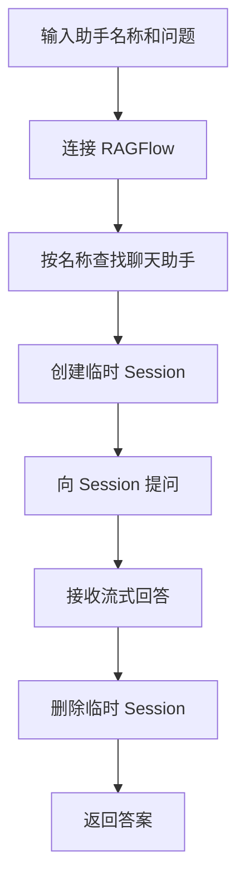

### 9.3 核心代码

下面代码沿用前面定义好的 `ragflow_client`、`monitor` 和 `@tool`。

```python
import json


@tool
def create_ask_delete(chat_name, question) -> str:
    """
    向某个 RAGFlow 聊天助手创建临时会话并完成一次提问

    注意：调用此工具之前，必须先调用 get_assistant_list，明确可用助手名称和助手能力边界。
    :param chat_name: 助手名称，必须来自 get_assistant_list 返回结果
    :param question: 本次提问的问题
    :return: RAGFlow 返回的回答文本；异常时返回中文错误提示
    """
    # 埋点：记录目标助手和问题，便于前端展示当前知识库检索动作
    monitor.report_tool(
        tool_name="ragflow提问助手工具：create_ask_delete",
        args={"chat_name": chat_name, "question": question},
    )

    try:
        # 先按名称找到 Chat 对象；真正提问时还需要在 Chat 下创建 Session
        chats = ragflow_client.list_chats(name=chat_name)
        use_chat = chats[0]

        # 每次工具调用只创建一个临时会话，避免多轮上下文污染当前问题
        session = use_chat.create_session(name="temp_session_ask")

        # SDK 暂未直接封装当前流式接口，这里通过底层 post 调用 Chat completions API
        response = ragflow_client.post(
            f"/chats/{use_chat.id}/completions",
            {
                "messages": [{"role": "user", "content": question}],
                "stream": True,
                "session_id": session.id,
            },
            stream=True,
        )
        result = ""
        for line in response.iter_lines(decode_unicode=True):
            if not line:
                continue

            # RAGFlow 流式返回遵循 SSE 风格：每行以 data: 开头，[DONE] 表示结束
            line = line.removeprefix("data:").strip()
            if line == "[DONE]":
                break
            data = json.loads(line)
            chunk_data = data.get("data")
            if not isinstance(chunk_data, dict):
                continue
            answer = chunk_data.get("answer")
            if answer:
                # 部分流式片段会返回“截至当前的完整答案”，部分会返回增量内容
                # 这里兼容两种情况，尽量避免重复拼接
                if answer.startswith(result):
                    result = answer
                elif not result.startswith(answer):
                    result += answer

        # 临时会话只用于本次工具调用，查询结束后删除，避免 RAGFlow 页面堆积无用会话
        use_chat.delete_sessions(ids=[session.id])
        return result
    except Exception as e:
        return f"提问失败，错误原因：{str(e)}"
```

### 9.4 流式结果为什么要做去重兼容

普通流式输出经常是这样：

```text
第 1 段：你
第 2 段：好
第 3 段：啊
```

这种情况下要用 `+=` 累加。

但 RAGFlow 的流式片段在不同接口或版本下可能有两种形态。一种是“覆盖型完整内容”：

```text
第 1 段：根据
第 2 段：根据文档
第 3 段：根据文档内容
```

另一种是“增量型片段”：

```text
第 1 段：根据
第 2 段：文档
第 3 段：内容
```

所以实际代码用了一个兼容写法：

```python
if answer.startswith(result):
    result = answer
elif not result.startswith(answer):
    result += answer
```

如果新片段已经包含旧结果，就用新片段覆盖；如果新片段是增量内容，就继续拼接。这样可以尽量避免把“根据”“根据文档”“根据文档内容”重复拼成一长串。

### 9.5 删除会话放在哪里更稳

上面的代码在拿到回答后删除会话。

如果后续做生产级增强，可以把删除逻辑放进 `finally`，这样即使提问过程中发生异常，也尽量清理临时会话。

课程阶段先保留当前写法，重点是理解这条链路：

```text
查助手 -> 建会话 -> 问问题 -> 收回答 -> 删会话
```

---

## 10、完善 RAGFlow 助手提示词

项目对应文件路径：`deepsearch-agents/app/prompt/prompts.yml`

RAGFlow 助手配置可以这样写：

```yaml
sub_agents:
  ragflow:
    # RAGFlow 负责企业内部非结构化文档：PDF、白皮书、研报、制度文件等
    # description 主要给主智能体做路由判断，system_prompt 约束子智能体先查助手再提问
    name: "RAGFlow助手"
    description: |
      负责查询 RAGFlow 内部知识库中的非结构化文档信息，例如 PDF、白皮书、研报、制度文件、产品资料等。
      当任务需要查询企业内部私有文档，而不是互联网公开信息或 MySQL 结构化数据时，使用此助手。
    system_prompt: |
      你是一个专业的 RAGFlow 知识库助手，负责从企业内部非结构化文档中检索信息。

      你掌握的工具包括：
       1. get_assistant_list: 查询当前可用的 RAGFlow 聊天助手，以及每个助手关联的知识库信息。
       2. create_ask_delete: 向指定 RAGFlow 聊天助手创建临时会话并提问。

      工作流程：
       1. 必须先调用 get_assistant_list，确认有哪些可用助手、助手描述和关联知识库。
       2. 根据用户问题选择最匹配的助手；如果没有合适助手，不要强行提问，应说明 RAGFlow 当前没有可用知识库能回答该问题。
       3. 向助手提问时，问题必须围绕用户原始需求，不要发散到无关主题。
       4. 对复杂、开放性问题，应采用“先宽后窄”的方式提问：先询问总体结论，再追问关键依据、细节、出处或适用场景。
       5. 复杂问题至少提问 3 个不同角度的问题；简单事实型问题可以只提问 1 次。
       6. 返回时不要做最终综合结论，但需要按提问轮次保留原始回答、使用的助手名称、问题和重要来源信息，交给后续主智能体汇总。
```

这里的提示词有三个重点。

### 10.1 先列表，再提问

RAGFlow 助手必须先知道有哪些聊天助手。

所以提示词里明确要求：

```text
必须先调用 get_assistant_list
```

### 10.2 不要乱问

如果助手描述里写的是“电商行业助手”，就不要拿它问货币政策问题；如果助手描述里写的是“金融行业助手”，就不要拿它问数字人直播问题。

提示词里强调：

```text
如果没有合适助手，不要强行提问
```

这可以减少无效检索。

### 10.3 不要过早总结

RAGFlow 子智能体查到的是内部资料。它应该按提问轮次保留原始回答、使用的助手名称、问题和重要来源信息，而不是自己先过度总结。

否则可能出现“传话效应”：子智能体总结时丢掉了细节，主智能体后面就拿不到完整依据。

---

## 11、组装 knowledge_base_agent

项目对应文件路径：`deepsearch-agents/app/agent/subagents/knowledge_base_agent.py`

代码如下：

```python
"""
RAGFlow 知识库子智能体配置模块

将 app/prompt/prompts.yml 中的 ragflow 配置与 RAGFlow 工具组装成
DeepAgents 可识别的字典式子智能体。主智能体后续会根据 description
决定是否把企业内部非结构化文档查询任务分派给它。
"""

from app.agent.prompts import sub_agents_content
from app.tools.ragflow_tools import create_ask_delete, get_assistant_list


# RAGFlow 子智能体处理内部非结构化文档，与网络搜索助手、数据库查询助手形成互补
# 它遵循“先查助手列表 -> 再向指定助手提问”的工作顺序
# tools 列表声明该子智能体可以发现知识库助手，并发起一次性临时会话查询
knowledge_base_agent = {
    "name": sub_agents_content["ragflow"]["name"],
    "description": sub_agents_content["ragflow"]["description"],
    "system_prompt": sub_agents_content["ragflow"]["system_prompt"],
    "tools": [get_assistant_list, create_ask_delete],
}
```

到这里，三个子智能体就都准备好了：

| 子智能体变量名         | 对应助手       | 工具数量 |
| ---------------------- | -------------- | -------- |
| `network_search_agent` | 网络搜索助手   | 1 个     |
| `database_query_agent` | 数据库查询助手 | 3 个     |
| `knowledge_base_agent` | RAGFlow 助手   | 2 个     |

---

### 11.1 本章代码文件关系

本章涉及的代码关系可以这样看：

```text
app/prompt/prompts.yml
  -> app/agent/prompts.py
      -> sub_agents_content

app/ragflow/rag_config.py
  -> _load_ragflow_env

app/ragflow/knowledge_demo.py
  -> create_knowledge_base
  -> upload_file_to_knowledge_base

app/tools/ragflow_tools.py
  -> get_assistant_list
  -> create_ask_delete

app/agent/subagents/knowledge_base_agent.py
  -> name / description / system_prompt
  -> tools=[get_assistant_list, create_ask_delete]
```

`prompts.yml` 管提示词和描述，`rag_config.py` 管连接配置，`knowledge_demo.py` 演示知识库和文件操作，`ragflow_tools.py` 管真正注册给 Agent 的工具，`knowledge_base_agent.py` 只负责把配置和工具组装起来。

这也是本项目一直保持的写法：

```text
配置归配置
工具归工具
智能体组装归智能体组装
```

---

## 12、测试与排查

在主智能体接入前，可以先单独测试两个工具。

### 12.1 测试助手列表

```python
if __name__ == "__main__":
    print(get_assistant_list.invoke({}))
```

期望看到类似结果：

```text
助手名称:电商行业助手;功能介绍：提供电商行业、AI 应用、数字人直播、直播带货相关资料查询; 关联的知识库：电商行业
助手名称:金融行业助手;功能介绍：提供货币政策、全球投资展望、投资者情绪等金融行业资料查询; 关联的知识库：金融行业
```

如果返回“没有任何可用助手”，优先回到 RAGFlow 页面检查：

- 是否真的创建了聊天助手；
- 聊天助手是否绑定了知识库；
- `.env` 中的 `RAGFLOW_API_URL` 和 `RAGFLOW_API_KEY` 是否正确。

### 12.2 测试临时会话提问

```python
if __name__ == "__main__":
    result = create_ask_delete.invoke(
        {
            "chat_name": "电商行业助手",
            "question": "如果我是一个电商平台运营负责人，应该怎样制定 2026 年 AI 应用路线图？",
        }
    )
    print(result)
```

如果页面里能回答，但代码里回答失败，重点检查：

- API Key 是否属于当前 RAGFlow 服务；
- `chat_name` 是否和页面里助手名称完全一致；
- RAGFlow 服务地址是否可以从当前运行代码的机器访问；
- 文档是否已经解析完成。

### 12.3 实际运行输出怎么看

运行知识库示例：

```bash
uv run -m app.ragflow.knowledge_demo
```

如果创建成功，终端会打印类似下面的内容。实际字段很多，不需要逐个背下来，先看几个关键字段就够了：

```text
创建知识库成功：{
  'document_count': 0,
  'chunk_count': 0,
  'embedding_model': 'text-embedding-v3@Tongyi-Qianwen',
  'llm_id': 'qwen-flash@Tongyi-Qianwen',
  'id': 'ab8e7870510c11f18369b59a2b1324d3',
  'name': '乌萨奇的知识库',
  ...
},ab8e7870510c11f18369b59a2b1324d3
```

这段输出重点看四件事：

| 输出字段                               | 说明                                                               |
| -------------------------------------- | ------------------------------------------------------------------ |
| `创建知识库成功`                       | 说明 API Key、服务地址和 RAGFlow SDK 初始化都已经跑通              |
| `id`                                   | 这是 RAGFlow 知识库的 Dataset ID，后续上传文件、查询知识库时会用到 |
| `embedding_model` / `llm_id`           | 说明本次知识库使用了哪个 Embedding 和 LLM，要和页面模型配置一致    |
| `document_count: 0` / `chunk_count: 0` | 说明知识库刚创建，还没有上传和解析文档；这不是报错                 |

再运行 RAGFlow 工具测试：

```bash
uv run -m app.tools.ragflow_tools
```

如果终端先出现下面这行，说明工具埋点已经触发：

```text
[Monitor:tool_start] 开始执行工具: ragflow提问助手工具：create_ask_delete
```

随后如果能返回一段带编号、带引用标记的回答，例如：

```text
作为电商平台运营负责人，制定 2026 年 AI 应用路线图需结合平台战略定位、技术成熟度、合规要求及商家生态需求。

1. 明确平台战略定位与开放模式 ... [ID:0]
2. 构建技术驱动的 AI 能力矩阵 ... [ID:3][ID:4]
3. 强化合规管理与风险控制机制 ... [ID:6]
...
```

就说明这条链路已经跑通：

```text
读取 .env
  -> 连接 RAGFlow
  -> 找到指定聊天助手
  -> 创建临时会话
  -> 基于知识库生成回答
  -> 返回引用来源
```

这里最重要的不是答案写得多漂亮，而是看到三个信号：

| 信号                                   | 代表什么                                                   |
| -------------------------------------- | ---------------------------------------------------------- |
| 出现 `[Monitor:tool_start]`            | `monitor.report_tool()` 正常执行，后续前端可以展示工具进度 |
| 回答里有 `[ID:0]`、`[ID:3]` 等引用     | RAGFlow 检索到了知识库片段，不只是模型凭常识回答           |
| 回答能围绕“电商平台 AI 应用路线图”展开 | `chat_name` 选对了，电商行业助手和知识库绑定基本正常       |

如果这一步能成功，说明 RAGFlow 服务、API Key、助手名称、文档解析和流式读取大体都没问题。后续接入主智能体时，主要就看主智能体是否能把内部文档查询任务正确分派给 `knowledge_base_agent`。

---

## 13、执行过程与分工回顾

### 13.1 RAGFlow 子智能体的执行过程

把本章内容串起来，RAGFlow 子智能体的完整执行过程是：

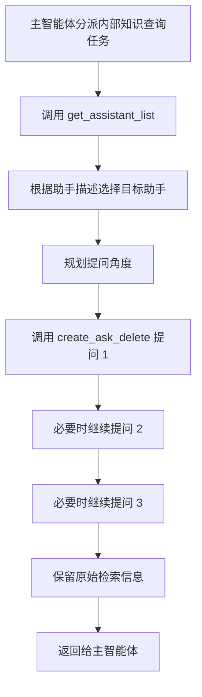

这里的“至少三个问题”不是硬写在工具里，而是写在子智能体提示词里，让模型根据任务主动多角度查询。

---

### 13.2 三个子智能体的分工回顾

到本章为止，项目的三个专家助手已经完整了。

| 用户需求类型               | 应该调用的助手 | 原因                 |
| -------------------------- | -------------- | -------------------- |
| 最新公开信息、外部资料     | 网络搜索助手   | 需要查互联网         |
| 药品库存、销售、结构化数据 | 数据库查询助手 | 需要查 MySQL         |
| 内部制度、说明书、年报文档 | RAGFlow 助手   | 需要查企业私有知识库 |

主智能体后续要做的，就是根据用户任务在这三个助手之间调度，并把返回的信息整理成最终答案或文件。

---

**本章小结：**

本章把 RAGFlow 的服务侧准备和 DeepAgents 接入放在了一起。

请重点记住四层结构：

```text
RAGFlow 服务
  -> 知识库 Dataset
  -> 聊天助手 Chat
  -> 会话 Session
```

以及一条完整使用链路：

```text
配模型
  -> 建知识库
  -> 上传并解析文件
  -> 创建聊天助手并绑定知识库
  -> 页面测试
  -> 生成 API Key
  -> 后端代码调用
```

代码侧重点记住两个工具：

```text
get_assistant_list
  -> 让模型知道当前 RAGFlow 有哪些助手

create_ask_delete
  -> 让模型向指定助手创建临时会话、提问、删除会话
```

到这里，「深度研搜」项目的三个子智能体都已经具备。后续主智能体会把它们统一注册进去，根据任务自动选择网络搜索、数据库查询或 RAGFlow 知识库查询。
