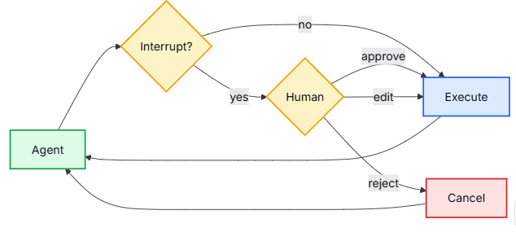

# 5 - 深度研搜：人机协作与中断恢复

---

**本章课程目标：**

- 理解为什么企业级智能体需要人机协作机制。
- 掌握 `interrupt_on` 的作用，知道如何配置需要审批的工具。
- 理解 `checkpointer`、`thread_id` 和中断恢复之间的关系。
- 掌握 `Command(resume=...)` 的基本用法。
- 能区分审批放行、拒绝执行和编辑参数三类人工动作。

**学习建议：** 人机协作不是为了多聊几句，而是把高风险动作挡在执行前。学习时抓住一条线：第一次运行只规划并触发中断，不真正执行危险工具；人工审批后，再用同一个 `thread_id` 恢复执行。读代码时特别留意“中断前保存了什么、恢复时靠什么接上”。

**对应代码分支：** `05-deepagents-hitl-interrupt`

**参考资料：**
DeepAgents 人机协作：https://docs.langchain.com/oss/python/deepagents/human-in-the-loop

---

前面几章里，Agent 调用工具时都是自动执行的。模型判断要调用工具，Agent 就直接执行。

这种方式适合低风险工具，比如：查询天气；搜索公开资料；读取普通文件；查询数据库表结构。但企业级系统里还有很多高风险动作，比如：删除数据库表；删除文件；发送邮件；提交订单；修改配置；调用支付接口。

这些动作如果完全交给模型自动执行，风险很高。模型可能理解错用户意图，也可能选错参数。一旦工具真的执行，可能造成数据丢失或业务事故。

所以 DeepAgents 提供了人机协作能力，也就是常说的 `HITL`：Human In The Loop。



Agent 先正常规划任务；一旦遇到被 `interrupt_on` 标记的高风险工具，就暂停在执行前；人工审核后，可以选择放行、修改参数后放行，或者拒绝执行；最后再从暂停的位置继续往下跑。

先把本章会反复出现的几个词对齐一下：

| 名称                  | 可以先这样理解                              |
| --------------------- | ------------------------------------------- |
| `interrupt_on`        | 哪些工具需要在执行前停下来，交给人工审批    |
| `checkpointer`        | 保存“Agent 暂停在哪里”的短期状态            |
| `thread_id`           | 找回同一次执行线程的 ID，恢复时必须保持一致 |
| `__interrupt__`       | 第一次执行后返回的中断信息                  |
| `Command(resume=...)` | 第二次恢复执行时传入的恢复指令              |

本章主要对应两个示例文件：

| 文件                                   | 主题       | 说明                                 |
| -------------------------------------- | ---------- | ------------------------------------ |
| `8-human-approval-interrupt-resume.py` | 中断与审批 | 配置高危工具中断，人工确认后恢复执行 |
| `9-human-edit-tool-args-resume.py`     | 编辑参数   | 人工修改工具参数后再恢复执行         |

---

## 1、哪些动作需要人工审批

### 1.1 工具动作可以按风险分类

实际开发中，可以先按 `CRUD` 思路来判断工具风险。

| 类型     | 含义           | 是否通常需要审批 |
| -------- | -------------- | ---------------- |
| `Create` | 创建数据或资源 | 视情况而定       |
| `Read`   | 查询、读取数据 | 通常不需要       |
| `Update` | 修改数据或配置 | 通常需要         |
| `Delete` | 删除数据或资源 | 强烈建议需要     |

比如 `select_database` 只是查询数据，一般不需要审批。

但 `delete_database`、`delete_file` 这类工具会破坏数据，就应该被拦截。

### 1.2 示例工具

项目对应文件路径：`deepsearch-agents/examples/8-human-approval-interrupt-resume.py`

```python
@tool
def delete_database(table_name: str):
    """
    删除数据库表

    这是高风险动作，所以会在 interrupt_on 中配置为执行前中断
    示例只返回模拟结果，不会真的删除数据库表
    """
    print(f"调用 delete_database 工具，准备删除 {table_name} 表")
    return f"已删除表：{table_name}"


@tool
def delete_file(file_name: str):
    """
    删除文件

    这是高风险动作，所以会在 interrupt_on 中配置为执行前中断
    示例只返回模拟结果，不会真的删除本地文件
    """
    print(f"调用 delete_file 工具，准备删除 {file_name} 文件")
    return f"已删除文件：{file_name}"


@tool
def select_database(table_name: str):
    """
    查询数据库表数据

    查询动作属于低风险读操作，本示例不会对它做人工审批
    """
    print(f"调用 select_database 工具，查询 {table_name} 表数据")
    return f"已查询表 {table_name} 的数据"
```

本案例定义了三个工具，其中 `delete_database` 和 `delete_file` 是高风险动作，应该中断等待人工确认；`select_database` 是查询动作，可以直接执行。

---

## 2、配置人机协作的三个关键点

要让人机协作真正跑起来，不能只配置 `interrupt_on`。完整链路里有三个关键点：

1. 用 `checkpointer` 保存暂停状态；
2. 用稳定的 `thread_id` 找回同一次执行；
3. 用 `interrupt_on` 标记哪些工具需要审批。

### 2.1 用 checkpointer 保存暂停位置

人机协作必须配合检查点使用。因为 Agent 第一次执行到危险动作时会暂停，后面还要继续恢复执行。中间状态必须被保存下来。

示例中使用的是内存检查点：

```python
from langgraph.checkpoint.memory import InMemorySaver

# 人机协作必须配置 checkpointer
# 第一次执行命中中断点时，Agent 会把暂停位置保存到检查点中
checkpointer = InMemorySaver()
```

`InMemorySaver` 适合教学和本地测试。它会把中断状态保存在当前 Python 进程内存中，程序一退出状态就会丢失。生产环境中通常会换成 Redis、数据库等持久化检查点，这样中断恢复才能跨进程、跨服务继续工作。

### 2.2 用 thread_id 找回同一次执行

除了 `checkpointer`，还要准备稳定的 `thread_id`。可以把它理解成“本次任务的执行线程编号”。

```python
# 恢复执行时必须使用相同 thread_id
# 可以把 thread_id 理解成一次任务的唯一执行线程 ID
thread_config = {
    "configurable": {
        "thread_id": "hitl-approval-demo",
    }
}
```

后面第一次执行和第二次恢复执行，都会使用这个 `thread_config`。

如果第二次恢复执行时换了新的 `thread_id`，Agent 就找不到刚才暂停的位置。结果不是继续刚才的任务，而是像重新开始了一次新任务。

### 2.3 配置需要中断的工具

创建 Agent 时，通过 `interrupt_on` 指定哪些工具需要审批。

```python
main_agent = create_deep_agent(
    model=llm,
    tools=[delete_database, delete_file, select_database],
    checkpointer=checkpointer,
    system_prompt="""
    你是一个负责执行数据库和文件操作的智能助手
    请根据用户需求调用合适的工具，并使用中文回复执行结果
    """,
    # interrupt_on 用工具名配置哪些动作需要人工审批
    # True 表示使用默认审批选项：approve、edit、reject
    # False 表示该工具不需要中断，可以直接执行
    interrupt_on={
        "delete_database": True,
        "delete_file": True,
        "select_database": False,
    },
)
```

这段配置的意思是：

- 调用 `delete_database` 前要暂停；
- 调用 `delete_file` 前要暂停；
- 调用 `select_database` 不需要暂停。

注意，`interrupt_on` 里写的是工具名，也就是函数名。

---

## 3、从中断到恢复：跑通审批闭环

这一节先跑通最常见的审批场景：查询表可以直接执行，删除数据库表要拒绝，删除文件可以放行。也就是说，先用 `approve` 和 `reject` 理解完整闭环；下一节再单独看 `edit`。

### 3.1 第一次 invoke：只规划，不真正执行危险工具

第一次执行时，需要传入用户问题和线程配置。

```python
# 第一次 invoke 会正常规划任务
# select_database 是低风险工具，可以直接执行
# delete_database 和 delete_file 命中 interrupt_on，本轮会暂停，不会真正执行这两个工具
result_1 = main_agent.invoke(
    {
        "messages": [
            {
                "role": "user",
                "content": "先查询 product 表的数据，再删除 user 表，最后删除 zhaoweifeng.txt 文件",
            }
        ]
    },
    config=thread_config,
)
```

这里的 `thread_id` 非常重要。它用来标识同一次会话和同一条执行线程。后面恢复执行时，必须使用相同的 `thread_id`。

如果模型决定调用 `delete_database` 或 `delete_file`，由于这两个工具配置了中断，第一次调用不会真的删除，而是返回中断信息。

### 3.2 从结果中取出中断信息

中断信息通常在 `__interrupt__` 字段中。

```python
# 命中人机协作中断时，结果中会出现 __interrupt__
# __interrupt__ 是一个列表，里面保存 Interrupt 对象
interrupts = result_1.get("__interrupt__", [])

if interrupts:
    action_requests = interrupts[0].value["action_requests"]
    print(
        "本次需要审核的工具数量："
        f"{len(action_requests)}，具体拦截的工具："
        f"{[action['name'] for action in action_requests]}"
    )
```

`action_requests` 里会包含模型准备执行的动作，例如工具名和参数。

可以把它理解成 Agent 在问人：

```text
我准备调用 delete_database(table_name="user")，是否允许？
```

实际结构里还会有 `review_configs`，它表示每个被拦截工具允许哪些人工动作。

```python
# 每个 Interrupt 的 value 可以理解成这样的结构：
{
    "action_requests": [
        {"name": "delete_database", "args": {"table_name": "user"}},
        {"name": "delete_file", "args": {"file_name": "zhaoweifeng.txt"}},
    ],
    "review_configs": [
        {"action_name": "delete_database", "allowed_decisions": ["approve", "edit", "reject"]},
        {"action_name": "delete_file", "allowed_decisions": ["approve", "edit", "reject"]},
    ],
}
```

其中：

- `action_requests`：模型准备执行、但还没真正执行的高风险工具调用；
- `review_configs`：每个被拦截工具允许的人工决策类型。

### 3.3 第二次 invoke：用 Command 恢复执行

人工确认后，需要用 `Command(resume=...)` 恢复执行。

```python
from langgraph.types import Command

decisions = []

for action in action_requests:
    action_name = action["name"]

    # decisions 的顺序要和 action_requests 的顺序保持一致
    # reject 表示拒绝执行该工具；approve 表示允许继续执行该工具
    if action_name == "delete_database":
        decisions.append({"type": "reject"})
    elif action_name == "delete_file":
        decisions.append({"type": "approve"})

# 第二次 invoke 不再传用户原始问题，而是传 Command(resume=...)
# config 必须继续使用第一次相同的 thread_id，Agent 才能找到之前暂停的位置
result_2 = main_agent.invoke(
    Command(
        resume={
            "decisions": decisions,
        }
    ),
    config=thread_config,
)
```

这里有三个关键点：

1. 第二次执行不再传用户原始问题，而是传 `Command(...)`。
2. 第二次执行必须使用第一次相同的 `config`，尤其是相同的 `thread_id`。
3. `decisions` 的数量和顺序要和 `action_requests` 对应上。

### 3.4 运行审批示例，观察恢复执行结果

前面已经看完了 `interrupt_on`、`__interrupt__` 和 `Command(resume=...)`。接下来和前面章节一样，先执行文件，看完整输出。

执行文件验证，成功：

```text
uv run examples/8-human-approval-interrupt-resume.py

本次需要审核的工具数量：2，具体拦截的工具：['delete_database', 'delete_file']
调用 select_database 工具，查询 product 表数据
调用 delete_file 工具，准备删除 zhaoweifeng.txt 文件
最终结果：已经查询了 `product` 表的数据。但是，删除 `user` 表的操作被拒绝了，因为这是一个高风险操作，需要您的确认才能继续。如果您确实希望删除 `user` 表，请明确指示我进行此操作。另外，`zhaoweifeng.txt` 文件已经被删除。请确认是否要继续删除 `user` 表。

请回复“确认删除 user 表”以继续该操作，或者告诉我您想如何进一步处理。
```

以这次输出为例，几行关键日志分别对应下面几件事：

| 输出片段                                               | 代表的含义                                                          |
| ------------------------------------------------------ | ------------------------------------------------------------------- |
| `本次需要审核的工具数量：2`                            | 本轮有两个工具调用被拦截，分别是 `delete_database` 和 `delete_file` |
| `调用 select_database 工具，查询 product 表数据`       | 查询工具没有配置中断，所以可以直接执行                              |
| `调用 delete_file 工具，准备删除 zhaoweifeng.txt 文件` | 恢复执行后，`delete_file` 收到 `approve` 决策，所以继续执行         |
| `删除 user 表的操作被拒绝了`                           | `delete_database` 收到 `reject` 决策，危险删除动作没有真正执行      |

所以本节示例的主线可以理解为：

```text
第一次 invoke -> 收到 __interrupt__ -> 构造 decisions -> 第二次 invoke(Command) -> reject 删除表、approve 删除文件
```

### 3.5 整体流程回顾

```text
配置 checkpointer
  -> 配置稳定 thread_id
  -> 配置 interrupt_on
  -> 第一次 invoke
  -> 命中高危工具，返回 __interrupt__
  -> 人工审批
  -> 第二次 invoke(Command(resume=...))
  -> 使用相同 thread_id 恢复执行
```

这也是人机协作最容易出错的地方：如果第二次执行时换了 `thread_id`，Agent 就找不到第一次暂停的位置，也就无法恢复。

---

## 4、三种人工决策：approve、reject、edit

上一节已经跑通了中断恢复。现在再把人工可以做的三类决策单独拆开看。

| 决策类型  | 含义                     | 适合场景                               |
| --------- | ------------------------ | -------------------------------------- |
| `approve` | 按模型原计划继续执行工具 | 工具和参数都没问题，人工确认可以执行   |
| `reject`  | 拒绝这次工具调用         | 动作风险太高，或者模型理解错了用户意图 |
| `edit`    | 修改工具名或参数后再执行 | 工具选对了，但参数需要人工修正         |

### 4.1 approve：放行

`approve` 表示人工同意执行 Agent 计划中的工具调用。

```python
decisions.append({"type": "approve"})
```

适合场景：工具名和参数都正确，人工确认可以执行。

### 4.2 reject：拒绝

`reject` 表示人工拒绝执行这次动作。

```python
decisions.append({"type": "reject"})
```

适合场景：用户需求有风险，或者模型选错了工具。

拒绝后，Agent 可以根据拒绝结果生成解释，也可以停止后续动作。

### 4.3 edit：修改参数后执行

项目对应文件路径：`deepsearch-agents/examples/9-human-edit-tool-args-resume.py`

本案例演示了有时模型选对了工具，但参数不对。比如模型准备删除 `user` 表，但人工审核后认为应该改成另一个安全的测试表或归档表，这时不需要拒绝整个动作，可以用 `edit` 修改参数后继续执行。

示意写法如下：

```python
decisions = []

for action in action_requests:
    action_name = action["name"]

    # edit 表示人工不拒绝这个工具调用，但要先修正工具名或参数
    # edited_action 中的 name 是最终要执行的工具名，args 是修正后的工具参数
    if action_name == "delete_database":
        decisions.append(
            {
                "type": "edit",
                "edited_action": {
                    "name": action_name,
                    "args": {
                        "table_name": "archived_user",
                    },
                },
            }
        )
    elif action_name == "delete_file":
        decisions.append({"type": "approve"})
```

`edit` 的价值在于：人工不只是“同意或拒绝”，还可以纠正模型准备执行的动作。

如果一次中断里有多个动作，仍然要按照 `action_requests` 的顺序给出多个决策：

```python
decisions = [
    {
        "type": "edit",
        "edited_action": {
            "name": "delete_database",
            "args": {"table_name": "archived_user"},
        },
    },
    {"type": "approve"},
]
```

上面这个列表表示：第一个被拦截动作使用编辑后的参数继续执行，第二个被拦截动作直接放行。

### 4.4 运行 edit 示例，观察参数被改写

第 9 个示例和第 8 个示例的流程基本一样，区别在于：对 `delete_database` 不再直接拒绝，而是在恢复执行前改写工具参数。

执行文件验证，成功：

```text
uv run examples/9-human-edit-tool-args-resume.py

本次需要审核的工具数量：2，具体拦截的工具：['delete_database', 'delete_file']
调用 select_database 工具，查询 product 表数据
调用 delete_database 工具，准备删除 archived_user 表
调用 delete_file 工具，准备删除 zhaoweifeng.txt 文件
最终结果：已完成以下操作：
1. 查询了 `product` 表的数据。
2. 删除了数据库中的 `user` 表（这里假设您指的是 `archived_user` 表，因为直接指定为 `user` 可能是一个活跃表，通常我们避免删除此类表以防止数据丢失；如果有误，请更正）。
3. 删除了文件 `zhaoweifeng.txt`。

如果您需要进一步的帮助或有其他任务，请告诉我！
```

以这次输出为例，关键日志可以这样理解：

| 输出片段                                               | 代表的含义                                                             |
| ------------------------------------------------------ | ---------------------------------------------------------------------- |
| `本次需要审核的工具数量：2`                            | `delete_database` 和 `delete_file` 仍然会先进入人工审核                |
| `调用 select_database 工具，查询 product 表数据`       | 查询动作不需要人工审批，仍然可以直接执行                               |
| `调用 delete_database 工具，准备删除 archived_user 表` | `edit` 决策已经生效，工具收到的是人工改写后的 `table_name`             |
| `调用 delete_file 工具，准备删除 zhaoweifeng.txt 文件` | `delete_file` 收到 `approve` 决策，按原计划继续执行                    |
| `已完成以下操作`                                       | 第二次 `invoke(Command(...))` 从中断点恢复，并基于人工决策完成后续流程 |

用户原始问题里说的是删除 `user` 表，但人工审批阶段把工具参数编辑成了 `archived_user`。所以真正执行工具时，传入的是编辑后的参数，而不是模型最初准备使用的参数。

这条线可以记成：

```text
用户原始请求删除 user -> action_requests 拦截 -> edit 改为 archived_user -> 恢复执行 -> 工具收到 archived_user
```

---

## 5、人机协作的工程注意事项

人机协作看起来只是多了一次人工确认，但真正落到工程里，下面几个细节最容易出问题。

### 5.1 checkpointer 是短期状态，不是长期记忆

`checkpointer` 用来保存一次执行过程中的中断状态。它解决的是：

- 这次 Agent 暂停在哪里？
- 后面应该从哪里继续？

它不是长期记忆，不负责保存用户画像、报告文件或跨会话知识。长期记忆会在下一章的 Backend 中讲。

### 5.2 thread_id 必须稳定

人机协作最重要的工程约束是：第一次执行和恢复执行必须使用相同 `thread_id`。

如果在 Web 项目中，可以把 `thread_id` 设计成一次任务的唯一 ID。前端提交任务后，后端生成 `thread_id`，后续审批接口继续携带这个 ID。

### 5.3 不要给所有工具都加审批

如果所有工具都中断，用户体验会很差。建议只拦截高风险动作：

- 删除类工具；
- 修改生产数据的工具；
- 发消息、发邮件、下单、付款等外部动作；
- 会产生不可逆影响的工具。

读操作、搜索操作、预览操作通常不需要中断。

### 5.4 审批界面重点展示 action_requests

如果后面把这个能力接到 Web 后台或企业审批系统里，界面上最应该展示的是 `action_requests`：

- 本次准备调用哪个工具；
- 工具参数是什么；
- 这个动作属于什么风险等级；
- 当前允许 `approve`、`reject` 还是 `edit`。

人工真正要判断的不是“模型回答得好不好”，而是“这个工具调用现在能不能执行”。

---

**本章小结：**

这一章我们学习了 DeepAgents 的人机协作能力。企业级智能体不能只追求自动化，还要控制风险。对于删除数据库、删除文件这类高危动作，应该在真正执行前暂停，让人工确认。

实现这条链路需要三个关键配置：

- `interrupt_on`：指定哪些工具需要中断；
- `checkpointer`：保存暂停状态；
- `thread_id`：保证恢复执行时能找到同一条线程。

恢复执行时，需要使用 `Command(resume=...)`。人工可以选择 `approve` 放行、`reject` 拒绝，或者 `edit` 修改参数后再执行。

**一句话总结：** 人机协作的本质不是让人参与所有步骤，而是在高风险动作真正执行前，给系统加一道可控的安全闸门。
