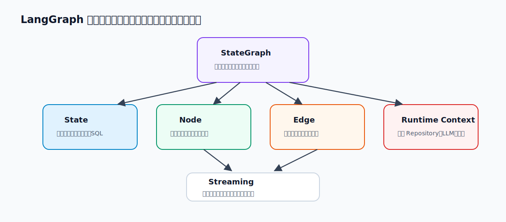

# 10 - 电商问数：问数智能体总览与工作流骨架

---

**本章课程目标：**

- 理解元数据知识库和问数智能体之间的关系。
- 看清问数智能体为什么不是“一个提示词直接生成 SQL”，而是一条多节点工作流。
- 理解 `StateGraph`、`State`、`Node`、`Edge`、`Runtime Context`、`stream_writer` 在本项目中的作用。
- 先不实现节点内部业务逻辑，只把整张工作流图搭起来，并用流式输出验证它能正常执行。

**学习建议：** 这一章只搭工作流骨架，不解决每个节点的业务细节。读的时候从一个用户问题出发，看它被拆成哪些节点，哪些节点可以并行，哪些地方需要条件分支，状态如何在节点之间传递，进度如何流式输出。后面几章会填节点内部逻辑，这里先把图的形状看稳。

**对应代码分支：** `10-agent-overview-workflow`

---

前面几章，我们已经把「电商问数」的元数据知识库基本搭好了。系统现在知道有哪些表、有哪些字段、字段是什么意思、字段里有哪些真实取值，也知道业务指标如何定义。具体能力如下：

- 表信息和字段信息已经保存到 `Meta MySQL`
- 字段语义信息已经写入 `Qdrant`
- 字段真实取值已经写入 `Elasticsearch`
- 指标定义和指标字段关系已经保存到 `Meta MySQL`
- 指标语义信息也已经写入 `Qdrant`

但这些知识不会自动回答用户问题。用户输入的是自然语言，比如：`统计华北地区的销售总额`

要把这句话变成一条能执行的 SQL，中间至少要判断：

- “华北地区”是不是某个字段的真实取值；
- “销售总额”更像字段，还是更像业务指标；
- 应该查询事实表，还是需要关联维度表；
- 如果要按地区过滤，应该使用哪个字段和哪个 `join` 条件；
- 如果用户提到“去年”“本月”，当前日期应该如何补进上下文；
- 最终生成的 SQL 能不能被数据库解释执行。

所以问数智能体不是简单地把问题丢给大模型，让它直接生成 SQL。更稳妥的做法是：**先检索上下文，再整理上下文，再生成 SQL，最后校验和执行 SQL。**本章要做的，就是先把这条工作流的骨架搭起来。

---

## 1、问数智能体的整体工作流

先从最高层看，问数智能体的完整流程大致如下。


如果把每一步对应到代码里的节点名，可以先记成下面这条线：

```text
START
  -> extract_keywords
  -> recall_column / recall_metric / recall_value
  -> merge_retrieved_info
  -> filter_table / filter_metric
  -> add_extra_context
  -> generate_sql
  -> validate_sql
  -> correct_sql 或 run_sql
  -> END
```

这里有三处设计需要先看懂。

**第一**，关键词抽取之后，字段信息、指标信息、字段取值可以并行召回。它们都依赖用户问题和关键词，但彼此之间没有强制先后顺序。

**第二**，召回结果不能直接交给大模型生成 SQL。召回阶段通常宁可多召回一些，避免漏掉关键信息；但生成 SQL 阶段需要尽量干净、准确的上下文。因此中间还需要合并和过滤。

**第三**，生成 SQL 后不能直接执行。大模型生成的 SQL 可能字段名写错、表名写错、`join` 条件不完整，或者不符合当前数据库方言。所以后面还要校验 SQL；校验失败时，再进入校正流程。

这套流程看起来比“直接生成 SQL”麻烦，但它更接近企业级问数系统的真实做法：每一步都让模型少猜一点，让系统多提供一点确定信息。

---

## 2、问数智能体入口说明

为了让工作流结构清晰，项目里把问数智能体相关代码集中放在 `app/agent` 下。

```text
shopkeeper-agent/
├─ app/
│  ├─ agent/
│  │  ├─ graph.py # 负责定义langgraph图
│  │  ├─ state.py # 负责定义langgraph状态
│  │  ├─ context.py # 负责定义langgraph运行上下文
│  │  ├─ llm.py # 负责定义llm
│  │  └─ nodes/
│  │     ├─ extract_keywords.py # 负责定义关键词抽取的节点
│  │     ├─ recall_column.py # 负责定义召回字段信息的节点
│  │     ├─ recall_metric.py # 负责定义召回指标信息的节点
│  │     ├─ recall_value.py  # 负责定义召回字段取值的节点
│  │     ├─ merge_retrieved_info.py # 负责定义合并召回信息的节点
│  │     ├─ filter_metric.py # 负责定义过滤指标信息的节点
│  │     ├─ filter_table.py # 负责定义过滤表格信息的节点
│  │     ├─ add_extra_context.py # 负责定义添加额外上下文信息的节点
│  │     ├─ generate_sql.py # 负责定义生成SQL的节点
│  │     ├─ validate_sql.py # 负责定义校验SQL的节点
│  │     ├─ correct_sql.py # 负责定义校正SQL的节点
│  │     └─ execute_sql.py # 负责定义执行SQL的节点
│  │
│  └─ repositories/
│     ├─ mysql/
│     │  ├─ meta/
│     │  │  ├─ meta_mysql_repository.py
│     │  │  └─ mappers/
│     │  │     ├─ table_info_mapper.py
│     │  │     ├─ column_info_mapper.py
│     │  │     ├─ metric_info_mapper.py
│     │  │     └─ column_metric_mapper.py
│     │  └─ dw/
│     │     └─ dw_mysql_repository.py
│     │
│     ├─ qdrant/
│     │  ├─ column_qdrant_repository.py
│     │  └─ metric_qdrant_repository.py
│     │
│     └─ es/
│        └─ value_qdrant_repository.py
│
├─ prompts/
│  ├─ extend_keywords_for_column_recall.prompt # 为召回字段信息扩展关键词 的提示词
│  ├─ extend_keywords_for_metric_recall.prompt # 为召回指标信息扩展关键词 的提示词
│  ├─ extend_keywords_for_value_recall.prompt # 为召回字段取值扩展关键词 的提示词
│  ├─ filter_metric_info.prompt # 过滤指标信息 的提示词
│  ├─ filter_table_info.prompt # 过滤表格信息 的提示词
│  ├─ generate_sql.prompt # 生成SQL 的提示词
│  └─ correct_sql.prompt # 校正SQL 的提示词
│
└─ prompt/
   └─ prompt_loader.py
```

这里要刻意收住范围。本章只讲工作流图结构、节点占位函数、`state/context` 类型、条件边和流式输出。`LLM` 初始化、提示词加载、字段召回、指标召回、SQL 生成等具体业务逻辑，后面章节再展开。

---

## 3、LangGraph 相关概念复习

前面第 22 到 26 章已经系统讲过 LangGraph。本章不是重新讲一遍 API 手册，而是把这些概念放回「电商问数」项目里，做一次项目落地版复习。

可以先记住一句话：**问数智能体适合用 LangGraph，不是因为它看起来更高级，而是因为它天然就是一个有状态、有分支、可观测的工作流。**

下面这张图把本章最常见的几个 LangGraph 概念放在同一张图里。读代码时，不要把它们混成一团：`StateGraph` 管结构，`State` 管共享数据，`Node` 做局部处理，`Edge` 管下一步，`Runtime Context` 放运行时依赖。



如果想对照官方说明，可以参考 LangGraph 的 [Choosing APIs](https://docs.langchain.com/oss/python/langgraph/choosing-apis)、[Graph API](https://docs.langchain.com/oss/python/langgraph/graph-api) 和 [Use the Graph API](https://docs.langchain.com/oss/python/langgraph/use-graph-api)。

### 3.1 为什么本项目适合用 LangGraph

如果问数智能体只是一条简单链路：

```text
Prompt -> Model -> SQL
```

那用普通链式调用就够了。但实际问数流程不是一条直线，它至少有这些特征：

- 有多个明确步骤：抽取关键词、召回、合并、过滤、生成 SQL、校验、执行；
- 有共享状态：后面节点要读取前面节点写入的关键词、召回结果、SQL 和错误信息；
- 有并行分支：关键词抽取后，可以同时召回字段、指标和字段取值；
- 有条件分支：SQL 校验通过就执行，校验失败就校正；
- 有实时观测需求：前端需要看到当前执行到哪个节点。

所以这里使用 LangGraph，是因为它正好把这类流程拆成了清晰的结构：

```text
Graph    负责把整套流程编译成可运行对象
State    负责节点之间共享数据
Node     负责具体处理步骤
Edge     负责流程流转
Runtime  负责注入运行时依赖和流式输出能力
```

### 3.2 Graph：不是画图，而是可执行工作流

`Graph` 不是“画给人看的流程图”，而是由节点和有向边组成的可执行工作流结构。

在本项目里，`graph.py` 做的事情可以概括成：

```text
定义 State Schema
  -> 创建 StateGraph
  -> add_node 注册节点
  -> add_edge / add_conditional_edges 连接节点
  -> compile 得到可运行 graph
  -> astream 执行图并流式输出
```

这和第 22 章里的 LangGraph 最小构建流程是一致的：

1. 定义 `State`
2. 定义 `Node`
3. 定义 `Edge`
4. 编译 `Graph`
5. 执行 `Graph`

`StateGraph` 更像图的构建器。你在它上面不断注册节点、连接边；只有调用 `compile()` 之后，才会得到真正可以运行的图对象。

```python
graph_builder = StateGraph(...)  # 搭建阶段：注册节点、连接边
graph = graph_builder.compile()  # 运行阶段：执行、流式输出、调试
```

`compile()` 不是可有可无的形式步骤。它至少有三层意义：

- 对图结构做基础检查，比如是否存在没有连上的孤立节点；
- 把节点、边和状态 Schema 固化成一个可执行对象；
- 为后续接入 checkpoint、断点、缓存等运行时能力预留入口。

这样理解后，`graph.py` 的职责就很清楚：前半段是在“搭图”，最后的 `compile()` 才是把这张图变成真正可运行的问数智能体。

### 3.3 State：共享状态，不是随手塞变量的字典

`state` 是整张图运行时共享的数据。每个节点都可以读取当前 `state`，并返回自己要更新的那一小部分字段。

> 这一部分可以对照官方 [Graph API - State](https://docs.langchain.com/oss/python/langgraph/graph-api#state) 阅读。

第 23 章里有一句很重要的话：**State = Schema + Reducer。**

在本项目当前阶段，我们先用 `TypedDict` 定义一个最小的 State Schema：

```python
class DataAgentState(TypedDict):
    query: str
    error: str
```

这份 Schema 声明的是：问数智能体这张图里，当前至少需要流转这些字段。

官方文档里也提到，State Schema 常见有三种写法：

| 写法                 | 适合场景                                                 |
| -------------------- | -------------------------------------------------------- |
| `TypedDict`          | 最轻量，适合教程和大多数工程场景，类型清楚，运行时成本低 |
| `dataclass`          | 需要默认值时比较方便                                     |
| `Pydantic BaseModel` | 需要更强运行时校验时使用，但性能成本更高                 |

本项目当前选择 `TypedDict`，原因很简单：问数链路里的状态字段比较明确，教程阶段也更希望读者把注意力放在“状态如何在节点之间流动”，而不是一开始就陷入复杂的数据校验模型。等后面进入生产级接口时，如果需要更严格的入参/出参校验，再单独引入 Pydantic 会更自然。

节点执行时，通常不会返回完整状态，而是返回局部更新。本章代码里最典型的例子是 `validate_sql` 节点临时返回：

```python
return {"error": None}
```

LangGraph 会把这个局部更新合并回全局 `state`。当前没有配置特殊 `Reducer`，所以默认就是覆盖更新：新值替换旧值。

可以用这条规则判断数据该不该放进 `state`：

```text
后续节点还要用、需要被观测、需要参与分支判断的数据，放进 state。
只在当前函数里临时用一下的数据，不要放进 state。
```

在问数智能体里，典型的 `state` 字段包括：

```text
query                  # 用户问题
keywords               # 抽取出的关键词
retrieved_column_infos # 字段召回结果
retrieved_metrics      # 指标召回结果
retrieved_values       # 字段取值召回结果
table_infos            # 合并后的表结构上下文
metric_infos           # 合并后的指标上下文
sql                    # 生成出的 SQL
error                  # SQL 校验错误
```

所以，不要急着在本章把 `DataAgentState` 设计完整。后面每实现一个节点，再把该节点真正读写的数据补进来。

### 3.4 Node：节点只负责一件事，并返回局部状态更新

节点是图里真正“干活”的地方。它可以调用大模型，可以查数据库，可以做普通 Python 计算，也可以只是整理格式。

> 这一部分可以对照官方 [Graph API - Nodes](https://docs.langchain.com/oss/python/langgraph/graph-api#nodes) 阅读。

在本项目里，节点函数一般长这样：

```python
async def extract_keywords(
    state: DataAgentState,
    runtime: Runtime[DataAgentContext],
):
    ...
```

这里最重要的是两个参数：

- `state`：读取和写回业务中间状态；
- `runtime`：读取运行时上下文，或者通过 `stream_writer` 输出进度。

对照官方文档，节点函数还可以接收 `config`。放到本项目里，可以先这样区分：

| 参数      | 含义                                                  | 本项目当前是否重点使用 |
| --------- | ----------------------------------------------------- | ---------------------- |
| `state`   | 当前图状态，节点读取它并返回局部更新                  | 重点使用               |
| `runtime` | 运行时上下文，包含 `context`、`stream_writer` 等能力  | 重点使用               |
| `config`  | 本次运行的配置信息，例如线程 ID、可配置参数、追踪信息 | 暂时不重点展开         |

读节点代码时，先抓住一条主线就够了：

```text
节点读取 state
  -> 使用 runtime.context 里的依赖做事
  -> 必要时用 runtime.stream_writer 输出进度
  -> 最后返回 Partial State
```

官方文档还提到，普通 Python 函数注册为节点后，会被 LangGraph 包装成可运行对象。这个细节意味着节点后续可以接入 tracing、异步执行、批处理等能力。但在本项目教程里，你可以先把它理解成一句更朴素的话：**节点就是一个“读状态、做事情、返回局部更新”的函数。**

第 24 章里还强调过一个工程习惯：**节点应该返回 Partial State，而不是每次返回整份 State。**

例如本章里的 `validate_sql` 只需要临时告诉条件边“当前没有错误”，所以它返回：

```python
return {"error": None}
```

它不应该顺手把其他不属于自己职责的字段都重新返回一遍。这样做有两个好处：

- 节点职责更清楚，读代码时容易知道这个节点到底改了什么；
- 避免把不属于当前节点职责的状态误覆盖，尤其是后面有并行分支时更重要。

放到问数智能体里，一个节点最好只做一件事：

```text
extract_keywords       -> 只抽关键词
recall_column          -> 只召回字段
merge_retrieved_info   -> 只合并召回信息
validate_sql           -> 只校验 SQL 并写入 error
run_sql                -> 只执行 SQL 并输出结果
```

### 3.5 Edge：普通边表示固定顺序，条件边表示运行时分支

`edge` 负责描述节点之间怎么流转。本项目目前主要用两类：普通边和条件边。

> 这一部分可以对照官方 [Graph API - Edges](https://docs.langchain.com/oss/python/langgraph/graph-api#edges) 和 [Conditional branching](https://docs.langchain.com/oss/python/langgraph/use-graph-api#conditional-branching) 阅读。

普通边用于固定顺序：

```python
graph_builder.add_edge("add_extra_context", "generate_sql")
graph_builder.add_edge("generate_sql", "validate_sql")
```

这表示添加上下文之后生成 SQL，生成 SQL 之后校验 SQL。

条件边用于运行时分支：

```python
graph_builder.add_conditional_edges(
    source="validate_sql",
    path=lambda state: "run_sql" if state["error"] is None else "correct_sql",
    path_map={"run_sql": "run_sql", "correct_sql": "correct_sql"},
)
```

这段代码对应的业务语义是：

```text
如果 validate_sql 没有写入错误信息
  -> 进入 run_sql

如果 validate_sql 写入了错误信息
  -> 进入 correct_sql
```

流程控制不要散落在一堆 `if/else` 里，而应该尽量通过图的边表达出来。这样工作流结构更清楚，也更容易画图和调试。

这里还要注意一个点：**一个节点可以有多条出边。**

在本项目里，最典型的例子就是关键词抽取之后的三路召回：

```python
graph_builder.add_edge("extract_keywords", "recall_column")
graph_builder.add_edge("extract_keywords", "recall_value")
graph_builder.add_edge("extract_keywords", "recall_metric")
```

这三条边表达的不是“先召回字段，再召回取值，再召回指标”，而是：

```text
关键词抽取完成后
  -> 字段召回、字段取值召回、指标召回都可以开始
```

这正是问数智能体适合用图来表达的原因。它的很多步骤不是简单串行关系，而是“前面产出一个公共输入，后面多个分支各自处理，最后再合并”。

条件边也要注意一个细节：`path` 函数只负责根据当前 `state` 决定下一步走向，不适合顺手修改状态。如果某个节点既要更新状态，又要决定下一跳，LangGraph 还有更进阶的 [`Command`](https://docs.langchain.com/oss/python/langgraph/graph-api#command) 能力。不过本章先把“状态更新”和“流程分支”拆开讲：节点负责返回状态更新，条件边负责选择后续节点。

### 3.6 START / END：图的入口和出口

`START` 和 `END` 是 LangGraph 内置的两个特殊虚拟节点。

> 这一部分可以对照官方 [Graph API - START Node](https://docs.langchain.com/oss/python/langgraph/graph-api#start-node) 阅读。

在本项目里：

```python
graph_builder.add_edge(START, "extract_keywords")
graph_builder.add_edge("run_sql", END)
```

这表示整张图从 `extract_keywords` 开始，在 `run_sql` 后结束。它们不是业务节点，不会像 `extract_keywords` 那样执行具体逻辑，只是帮助图明确入口和出口。

### 3.7 Runtime Context：把依赖和状态分开

第 24 章讲 `Runtime` 时，最重要的一点是：**不要把运行时依赖硬塞进 State。**

后续节点会用到数据库连接、向量检索仓储、全文检索仓储、Embedding 客户端等对象。这些对象不是业务状态，而是运行时工具。它们不应该放进 `DataAgentState`，而应该放进 `DataAgentContext`，再通过 `runtime.context` 读取。

本章还没有开始放具体依赖，所以 `DataAgentContext` 暂时是空的。Runtime Context 的官方说明可以参考 [Graph API - Runtime Context](https://docs.langchain.com/oss/python/langgraph/graph-api#runtime-context)。

这里顺带解释一下 `Runtime[DataAgentContext]` 里的泛型写法。可以把它简单理解成：

```text
我要使用 LangGraph 的 Runtime，
并且告诉它：我的 runtime.context 结构是 DataAgentContext。
```

当前 `DataAgentContext` 还没有具体字段，但这个类型外壳先放在这里，后面补依赖时节点签名不用再改。

### 3.8 Streaming：本项目先使用 custom 流

流式输出是本章另一个重点。`invoke()` 更像“等整张图跑完再拿最终结果”，而 `stream()` / `astream()` 更像“边执行边看图里发生了什么”。官方文档可以参考 [Streaming](https://docs.langchain.com/oss/python/langgraph/streaming)。

LangGraph 的 `stream_mode` 有多种模式：

| 模式       | 适合看什么                                      |
| ---------- | ----------------------------------------------- |
| `values`   | 每个节点执行后的完整 State 快照                 |
| `updates`  | 每个节点本次更新了哪些字段                      |
| `messages` | 大模型逐 token 输出                             |
| `custom`   | 节点里通过 `stream_writer` 主动写出的自定义事件 |
| `debug`    | 调试信息                                        |

本项目当前选择：

```python
stream_mode="custom"
```

原因很直接：前端最关心的是“当前执行到哪个步骤了”“最终查询结果是什么”“有没有错误”，这些都适合由节点主动用 `runtime.stream_writer` 写出。

### 3.9 本项目暂时不展开哪些 LangGraph 能力

LangGraph 还有很多进阶能力，例如 `Send`、`Command`、节点缓存、重试、状态持久化、时间回溯、子图、多智能体和 A2A。

这些能力都很重要，但当前问数智能体第一版还不需要全部用上。本章先采用最直观的一组能力：

```text
StateGraph
TypedDict State
普通节点
普通边
条件边
Runtime Context
Custom Streaming
```

等这条问数主链路跑通后，如果后续要支持更复杂的生产能力，再逐步引入：

- 用持久化保存长任务状态，支持失败恢复；
- 用更细的流式事件做前端可观测；
- 用子图拆分复杂子流程；
- 用多智能体拆分“数据分析师、SQL 工程师、结果解释器”等角色。

---

## 4、定义 State 和 Context

先看两个最小类型。

项目对应文件路径：`shopkeeper-agent/app/agent/state.py`

```python
from typing import TypedDict


class DataAgentState(TypedDict):
    query: str  # 用户输入的查询
    error: str  # 校验SQL时出现的错误信息
```

项目对应文件路径：`shopkeeper-agent/app/agent/context.py`

```python
from typing import TypedDict


class DataAgentContext(TypedDict):
    pass
```

为什么这里先写 `pass`？

因为这一节课的重点是先把图跑起来，而不是一次性把所有业务状态设计完整。后面实现关键词抽取时，会把 `query`、`keywords` 等字段补进 `DataAgentState`；实现字段召回、指标召回、SQL 执行等节点时，再把需要的运行时依赖补进 `DataAgentContext`。

现在先保留这两个类型，主要是为了两件事：

- `graph.py` 可以提前声明整张图的 `state_schema` 和 `context_schema`。
- 所有节点函数都可以先统一写成 `state + runtime` 的形式，后续补业务逻辑时不用再改函数签名。

也就是说，当前这两个文件不是最终形态，而是工作流骨架阶段的类型占位。

---

## 5、创建节点占位函数

有了 `state.py` 和 `context.py`，下一步是先把节点函数都定义出来。

因为 `graph.py` 要把这些节点连接成一张图。如果节点函数还不存在，就没法注册节点，也没法连边。

以 `extract_keywords.py` 为例。

项目对应文件路径：`shopkeeper-agent/app/agent/nodes/extract_keywords.py`

```python
from langgraph.runtime import Runtime

from app.agent.context import DataAgentContext
from app.agent.state import DataAgentState


async def extract_keywords(state: DataAgentState, runtime: Runtime[DataAgentContext]):
    writer = runtime.stream_writer
    writer("抽取关键词")
    import asyncio

    await asyncio.sleep(0.5)
```

当前节点只做两件事：输出一条进度消息，然后 `await asyncio.sleep(0.5)`。

这个 `sleep` 不是业务逻辑，只是为了测试流式输出时更容易观察节点顺序。后面真正实现节点时，`extract_keywords` 会负责抽关键词，`recall_column` 会负责字段召回，`generate_sql` 会负责生成 SQL。现在先让它们能被图调度起来。

当前项目中先创建了这些节点：

```text
extract_keywords       # 抽取关键词
recall_column          # 召回字段信息
recall_metric          # 召回指标信息
recall_value           # 召回字段取值
merge_retrieved_info   # 合并召回信息
filter_metric          # 过滤指标信息
filter_table           # 过滤表信息
add_extra_context      # 添加额外上下文
generate_sql           # 生成 SQL
validate_sql           # 校验 SQL
correct_sql            # 校正 SQL
run_sql                # 执行 SQL
```

这一章只要求它们“能被图调度、能输出进度”。节点内部真正怎么做，后面章节再逐个补齐。

---

## 6、在 graph.py 中组装工作流图

接下来进入本章最核心的文件。

项目对应文件路径：`shopkeeper-agent/app/agent/graph.py`

先导入 `LangGraph` 需要的对象，以及前面写好的状态、上下文和节点函数。

```python
import asyncio

from langgraph.constants import END, START
from langgraph.graph import StateGraph

from app.agent.context import DataAgentContext
from app.agent.state import DataAgentState
```

然后创建图构建器。

```python
graph_builder = StateGraph(
    state_schema=DataAgentState,
    context_schema=DataAgentContext,
)
```

这里的意思是：接下来要构建一张状态图。图运行时的共享状态按 `DataAgentState` 理解，运行时上下文按 `DataAgentContext` 理解。

### 6.1 注册节点

创建 `StateGraph` 之后，要把前面写好的节点函数注册进图里：

```python
graph_builder.add_node("extract_keywords", extract_keywords)
graph_builder.add_node("recall_column", recall_column)
graph_builder.add_node("recall_value", recall_value)
graph_builder.add_node("recall_metric", recall_metric)
graph_builder.add_node("merge_retrieved_info", merge_retrieved_info)
graph_builder.add_node("filter_metric", filter_metric)
graph_builder.add_node("filter_table", filter_table)
graph_builder.add_node("add_extra_context", add_extra_context)
graph_builder.add_node("generate_sql", generate_sql)
graph_builder.add_node("validate_sql", validate_sql)
graph_builder.add_node("correct_sql", correct_sql)
graph_builder.add_node("run_sql", run_sql)
```

`add_node(...)` 的第一个参数是节点名称，第二个参数是对应的节点函数。这里建议节点名称和函数名保持一致，这样后面连边、看日志、看流程图时都更直接。

### 6.2 添加普通边

节点注册之后，还要用边描述固定流转关系。

```python
graph_builder.add_edge(START, "extract_keywords")

graph_builder.add_edge("extract_keywords", "recall_column")
graph_builder.add_edge("extract_keywords", "recall_value")
graph_builder.add_edge("extract_keywords", "recall_metric")

graph_builder.add_edge("recall_column", "merge_retrieved_info")
graph_builder.add_edge("recall_value", "merge_retrieved_info")
graph_builder.add_edge("recall_metric", "merge_retrieved_info")

graph_builder.add_edge("merge_retrieved_info", "filter_table")
graph_builder.add_edge("merge_retrieved_info", "filter_metric")

graph_builder.add_edge("filter_table", "add_extra_context")
graph_builder.add_edge("filter_metric", "add_extra_context")

graph_builder.add_edge("add_extra_context", "generate_sql")
graph_builder.add_edge("generate_sql", "validate_sql")
```

这段代码表达的是：

```text
START
  -> extract_keywords
  -> recall_column / recall_value / recall_metric
  -> merge_retrieved_info
  -> filter_table / filter_metric
  -> add_extra_context
  -> generate_sql
  -> validate_sql
```

这里有两个并行结构。

第一处是 `extract_keywords` 后面同时连向三路召回。这表示字段召回、字段取值召回、指标召回都依赖关键词，但彼此之间没有先后关系。

第二处是 `merge_retrieved_info` 后面同时连向 `filter_table` 和 `filter_metric`。表过滤和指标过滤都依赖合并后的上下文，也可以独立执行。

这就是使用图结构的价值：它能直接表达“一个节点之后分出多条支路，后面再汇合”的工作流关系。

### 6.3 添加条件边

`validate_sql` 后面不是固定流转，而是要根据校验结果决定下一步。

```python
graph_builder.add_conditional_edges(
    source="validate_sql",
    path=lambda state: "run_sql" if state["error"] is None else "correct_sql",
    path_map={"run_sql": "run_sql", "correct_sql": "correct_sql"},
)
graph_builder.add_edge("correct_sql", "run_sql")
graph_builder.add_edge("run_sql", END)
```

这段代码的业务含义是：

```text
如果 state["error"] is None
  -> 进入 run_sql

如果 state["error"] is not None
  -> 进入 correct_sql
```

当前阶段还没有真正校验 SQL，所以 `validate_sql.py` 里只是临时返回：

```python
return {"error": None}
```

这里的 `{"error": None}` 是为了让条件边能正常走向 `run_sql`。等后面真正实现 SQL 校验时，`validate_sql` 会根据校验结果写入真实错误信息，那时这个条件分支才会承担完整的业务含义。

最后把图编译出来。

```python
graph = graph_builder.compile()
```

编译之后，`graph` 才是真正可以运行的工作流对象。

### 6.4 画出流程图检查结构

节点和边都加完后，可以先把图画出来检查。

```python
print(graph.get_graph().draw_mermaid())
```

执行后会得到一段 `Mermaid` 语法。把它放到支持 `Mermaid` 的 Markdown 编辑器里，就能看到工作流图。

检查时重点看下面几件事：

- `START` 是否先进入 `extract_keywords`；
- `extract_keywords` 是否同时连向三路召回；
- 三路召回是否都汇入 `merge_retrieved_info`；
- `merge_retrieved_info` 是否同时进入表过滤和指标过滤；
- `validate_sql` 后是否分成 `run_sql` 和 `correct_sql`；
- `correct_sql` 是否最终回到 `run_sql`；
- `run_sql` 是否进入 `END`。

这一步很值得做。工作流图一旦连错，后面节点内部逻辑写得再好，也会在错误的顺序里执行。

---

## 7、使用流式输出观察执行进度

问数智能体不是一次普通函数调用。它会访问大模型、向量库、全文索引和数据库，还可能经过 SQL 校验与校正。一次查询如果耗时几秒甚至几十秒，都很正常。

如果前端一直没有反馈，用户不知道系统是在正常执行、卡在某个节点，还是已经报错。所以本项目需要在工作流执行过程中实时输出进度。

LangGraph 的流式能力可以参考官方 [Streaming](https://docs.langchain.com/oss/python/langgraph/streaming) 文档。如果只关心节点里主动写出的自定义事件，可以重点看 [Streaming - Custom data](https://docs.langchain.com/oss/python/langgraph/streaming#custom-data)。

### 7.1 在节点里写出进度

当前节点里先用字符串演示流式输出。

```python
writer = runtime.stream_writer
writer("抽取关键词")
```

只要工作流执行到这个节点，外部通过流式调用就能拿到这条消息，不需要等整张图执行结束。

此外还有 `get_stream_writer()`。它是另一种获取 writer 的方式。

```python
from langgraph.config import get_stream_writer


def node(state: DataAgentState):
    writer = get_stream_writer()
    writer({"type": "progress", "step": "抽取关键词"})
```

这两种方式拿到的本质上都是同一个东西：**一个可以把自定义数据写入当前图执行流的 writer 函数。**

本项目当前节点函数都已经声明了 `runtime` 参数，所以直接使用 `runtime.stream_writer` 更自然。可以记住一句话：只要最后调用的是 `writer(...)`，并且执行图时设置了 `stream_mode="custom"`，这些内容就能被外部流式接收到。

后面真正对接前端时，可以把字符串换成统一的事件协议。

```python
writer({"type": "progress", "step": "生成SQL", "status": "running"})
```

这一章先把机制跑通，正式的前后端事件协议后面再整理。

### 7.2 用 astream 接收流式输出

如果只是普通执行一张图，可以使用类似 `invoke` 的方式。但普通调用通常只能拿到整张图结束后的最终结果，拿不到中间节点实时写出的内容。

本项目需要实时输出进度，所以使用 `astream(...)`。

```python
async for chunk in graph.astream(
    input=state,
    context=context,
    stream_mode="custom",
):
    print(chunk)
```

当前阶段 `DataAgentState` 和 `DataAgentContext` 都还是空结构，所以测试时直接传空对象。

```python
state = DataAgentState()
context = DataAgentContext()
```

`stream_mode="custom"` 表示只接收节点里通过 `stream_writer` 写出的自定义内容。

常见的流式模式可以先记住这几种：

| 模式       | 含义                                  |
| ---------- | ------------------------------------- |
| `values`   | 每个节点执行后输出完整状态快照        |
| `updates`  | 每个节点执行后只输出本节点更新的状态  |
| `custom`   | 输出 `stream_writer` 写出的自定义数据 |
| `messages` | 输出大模型生成过程中的 token          |
| `debug`    | 输出调试信息                          |

当前项目主要关注前端进度展示，所以使用 `custom`。

### 7.3 最小测试

`graph.py` 末尾提供了一个最小测试入口。

项目对应文件路径：`shopkeeper-agent/app/agent/graph.py`

```python
if __name__ == "__main__":

    async def test():
        state = DataAgentState()
        context = DataAgentContext()
        async for chunk in graph.astream(
            input=state, context=context, stream_mode="custom"
        ):
            print(chunk)

    asyncio.run(test())
```

在后端项目根目录下，运行：

```bash
uv run python -m app.agent.graph
```

这个测试不是为了验证最终 SQL 查询结果，而是先确认几件事：

- 图能不能成功编译；
- 节点能不能按预期顺序执行；
- `stream_writer` 写出的内容能不能被 `astream(...)` 接收到；
- `validate_sql` 返回的 `{"error": None}` 能不能让条件边走到 `run_sql`。

运行时会看到类似下面这样的进度输出：

```text
抽取关键词
召回字段信息
召回指标信息
召回字段取值
合并召回信息
过滤指标信息
过滤表信息
添加额外上下文
生成SQL
校验SQL
执行SQL
```

其中三路召回、表过滤和指标过滤的输出顺序可能会因为并行调度略有差异，这是多条出边带来的正常现象。

---

**本章小结：**

- 本章对应的代码重点在 `app/agent`，不是项目根目录的 `main.py`。
- 当前阶段 `DataAgentState` 和 `DataAgentContext` 都先保持为空，后续章节再逐步补字段和依赖。
- `graph.py` 负责注册节点、连接普通边和条件边，并通过 `compile()` 得到可运行图。
- 当前节点只做流式进度输出和短暂延时，真正业务逻辑还没有展开。
- `stream_writer` 和 `graph.astream(..., stream_mode="custom")` 是本章验证实时输出的关键。

把这张图搭起来以后，后面的工作就很清楚了：沿着图，从前到后，一个节点一个节点把业务逻辑补完整。
