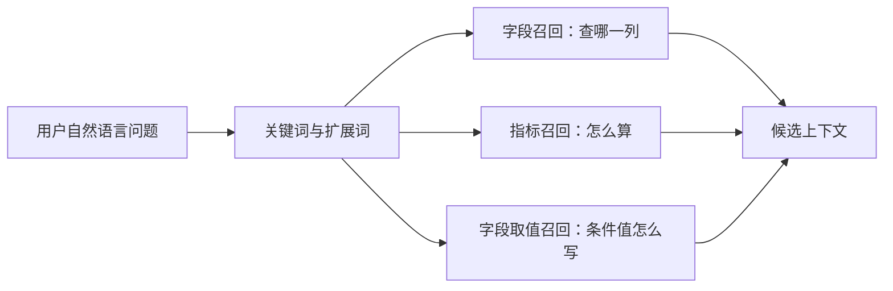
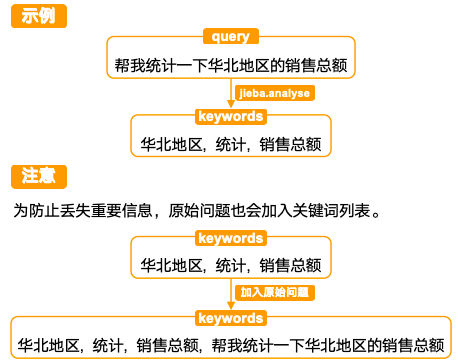
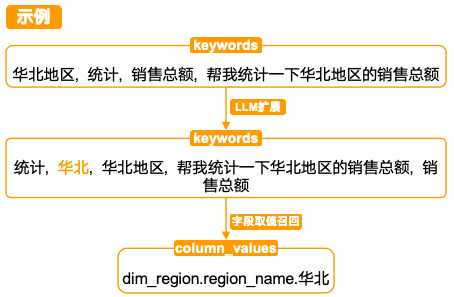

# 11 - 电商问数：关键词抽取与多路召回

---

**本章课程目标：**

- 理解为什么问数智能体要先抽取关键词，再进入字段、指标、字段取值三路召回。
- 掌握 `DataAgentState` 和 `DataAgentContext` 在召回阶段各自保存什么。
- 看懂 `PromptTemplate | llm | JsonOutputParser` 这条最小 LCEL 链路。
- 掌握字段召回和指标召回的共同模式：`关键词 -> Embedding -> Qdrant -> 去重`。
- 掌握字段取值召回的特殊模式：`关键词 -> Elasticsearch -> ValueInfo -> 去重`。

**学习建议：** 这是问数智能体开始填业务逻辑的地方。先看用户问题如何变成关键词，再看关键词为什么需要扩展，最后分别看字段、指标、字段值三路召回。三路代码长得像，但职责不同：字段找列，指标找算法口径，字段值帮过滤条件写对真实取值。

**对应代码分支：** `11-agent-keyword-multi-recall`

---

## 1、本章在问数链路中的位置

上一章我们已经把问数智能体的 `LangGraph` 工作流骨架搭起来了，但很多节点还只是空架子，最多只输出一条执行进度。

从这一章开始，我们正式给前几个节点填业务逻辑。先把工作流拿回来：

```text
用户问题
  -> extract_keywords
  -> recall_column / recall_metric / recall_value
  -> merge_retrieved_info
  -> filter_table / filter_metric
  -> add_extra_context
  -> generate_sql
  -> validate_sql
  -> correct_sql 或 run_sql
```

本章落地的是最前面的四个节点：

```text
extract_keywords  # 从用户问题里抽取关键词
recall_column     # 根据关键词召回可能相关的字段信息
recall_metric     # 根据关键词召回可能相关的指标信息
recall_value      # 根据关键词召回可能相关的字段真实取值
```

以这个问题为例：

```text
统计华北地区的销售总额
```

这里至少包含三类信息：

- `销售总额`：可能是一个业务指标，例如 `GMV`、成交额、订单金额总和；
- `华北地区`：可能是数据库字段里的真实取值，例如 `华北`；
- `地区`：可能对应一个维度字段，例如 `dim_region.region_name`。

如果只召回字段，模型也许能知道“地区”和 `region_name` 有关，但它仍然可能不知道：

- 项目中是否已经定义了 `GMV` 这个指标；
- `销售总额` 到底应该直接用某个字段，还是应该走指标定义；
- 数据库里地区字段真实存的是 `华北`，还是 `华北地区`。

所以从 `extract_keywords` 出来之后，工作流会并行进入三条召回链路：

```text
extract_keywords
  -> recall_column  # 字段信息召回
  -> recall_metric  # 指标信息召回
  -> recall_value   # 字段取值召回
```

到本章结束后，状态里会有三份召回结果：

```text
retrieved_column_infos
retrieved_metric_infos
retrieved_value_infos
```

第 13 章再把这三份结果合并成大模型真正能使用的表结构上下文和指标上下文。

---

## 2、三路召回分别解决什么

自然语言问题里的词并不都属于同一个层级。可以先看几个例子：

```text
统计华北地区销售总额
查询黄金会员客单价
统计数码品类 GMV
最近三个月在职实习生的转正情况如何
```

这些问题里同时混着指标、字段、字段取值、时间范围、人群标签等信息。问数智能体不能只把它们当成普通关键词处理，而要尽量拆清楚它们在 SQL 生成里分别承担什么角色。

### 2.1 字段：解决“查哪一列”

字段召回要解决的是：用户口语里的概念，对应数仓里的哪些字段。

比如用户说：

```text
统计华北地区的销售总额
```

后面生成 SQL 时，模型至少要知道：

- “地区”可能和 `dim_region.region_name` 有关；
- “销售总额”可能和 `fact_order.order_amount` 有关；
- 这些字段分别属于哪张表；
- 字段类型、字段角色、字段描述、字段别名是什么。

这些信息来自第 9 章构建好的字段向量索引，也就是 `Qdrant` 中的 `column_info_collection`。

所以字段召回回答的是：**这个问题可能涉及哪些表字段？**

### 2.2 指标：解决“怎么算”

`销售总额`、`客单价`、`GMV`、`转正率` 更像指标。指标不是普通字段，它通常有业务口径，例如：

- 指标名称：`GMV`
- 指标描述：所有订单成交金额总和
- 指标别名：成交额、交易额、销售总额
- 依赖字段：`fact_order.order_amount`

指标召回要解决的是：当用户说“销售总额”“成交额”“GMV”时，系统能找到已经定义好的指标，并把指标依赖字段带入后续上下文。

所以指标召回回答的是：**这个问题里的度量目标应该如何计算？**

### 2.3 字段取值：解决“条件值怎么写”

`华北`、`黄金会员`、`数码`、`在职`、`实习生` 更像字段真实取值。

字段取值召回要解决的是：当用户说“华北地区”时，系统尽量知道数据库里真实存在的值是什么。

例如 SQL 里可能真正需要的是：

```sql
where dim_region.region_name = '华北'
```

如果模型写成：

```sql
where dim_region.region_name = '华北地区'
```

SQL 语法可能完全正确，但结果可能为空。因为真实数据库里不一定存的是用户口语里的完整表达。

所以字段取值召回回答的是：**过滤条件里的值应该尽量写成数据库真实存在的值。**

### 2.4 三路召回的分工



这张图的重点是“三路分工”，不是“三套模型”。字段、指标和字段取值进入 SQL 时承担的角色不同，所以召回链路也要分开设计。

| 召回链路     | 解决的问题                     | 检索对象     | 技术实现                 |
| ------------ | ------------------------------ | ------------ | ------------------------ |
| 字段召回     | “地区”像哪个字段？             | `ColumnInfo` | `Qdrant` 向量检索        |
| 指标召回     | “销售总额”像哪个指标？         | `MetricInfo` | `Qdrant` 向量检索        |
| 字段取值召回 | “华北地区”在库里真实值是什么？ | `ValueInfo`  | `Elasticsearch` 全文检索 |

字段和指标都使用向量检索，是因为它们主要匹配的是语义相似。比如“销售总额”和 `GMV` 字面不一样，但语义接近。

字段取值使用全文检索，是因为字段取值往往是短文本、枚举值、名称、标签。这个场景更关注真实文本命中，以及命中文档里的 `column_id/value`。

---

## 3、补齐 State、Context 和图结构

上一章讲过，节点之间传递数据靠 `DataAgentState`，运行时工具放在 `DataAgentContext`。召回阶段会同时用到这两个类型。

### 3.1 DataAgentState：保存业务中间结果

本章至少需要五类状态：

- `query`：用户原始问题；
- `keywords`：抽取出的关键词；
- `retrieved_column_infos`：召回到的字段信息；
- `retrieved_metric_infos`：召回到的指标信息；
- `retrieved_value_infos`：召回到的字段取值。

项目对应文件路径：`shopkeeper-agent/app/agent/state.py`

```python
from typing import TypedDict

from app.entities.column_info import ColumnInfo
from app.entities.metric_info import MetricInfo
from app.entities.value_info import ValueInfo


class DataAgentState(TypedDict):
    """一次问数链路中的核心状态"""

    query: str  # 用户输入的查询
    keywords: list[str]  # 抽取的关键词
    retrieved_column_infos: list[ColumnInfo]  # 检索到的字段信息
    retrieved_metric_infos: list[MetricInfo]  # 检索到的指标信息
    retrieved_value_infos: list[ValueInfo]  # 检索到的取值信息
    error: str  # 校验 SQL 时出现的错误信息
```

这里最重要的是三个 `retrieved_*` 字段。三路召回节点各自写回自己的结果，第 12 章的 `merge_retrieved_info` 再统一读取它们。

### 3.2 DataAgentContext：保存运行时工具

召回节点需要访问外部系统：

- 字段召回需要 `Qdrant` 字段仓储和 `Embedding` 客户端；
- 指标召回需要 `Qdrant` 指标仓储和 `Embedding` 客户端；
- 字段取值召回需要 `Elasticsearch` 字段值仓储。

这些对象不是业务中间结果，不应该塞进 `state`。它们是节点执行时要用的工具，所以放在 `DataAgentContext`。

项目对应文件路径：`shopkeeper-agent/app/agent/context.py`

```python
from typing import TypedDict

from langchain_huggingface import HuggingFaceEndpointEmbeddings

from app.repositories.es.value_es_repository import ValueESRepository
from app.repositories.qdrant.column_qdrant_repository import ColumnQdrantRepository
from app.repositories.qdrant.metric_qdrant_repository import MetricQdrantRepository


class DataAgentContext(TypedDict):
    """LangGraph Runtime 中传递的上下文对象"""

    # 字段向量仓储，负责根据向量从 Qdrant 检索候选字段
    column_qdrant_repository: ColumnQdrantRepository
    # Embedding 客户端，字段召回和指标召回都会复用
    embedding_client: HuggingFaceEndpointEmbeddings
    # 指标向量仓储，负责从 Qdrant 检索候选指标
    metric_qdrant_repository: MetricQdrantRepository
    # 字段取值仓储，负责从 Elasticsearch 检索真实字段值
    value_es_repository: ValueESRepository
```

这正好体现了第 10 章讲过的分工：

```text
业务中间结果 -> state
运行时依赖   -> runtime.context
```

### 3.3 在 graph.py 中接入三路召回

项目对应文件路径：`shopkeeper-agent/app/agent/graph.py`

```python
# 注册节点：每个节点负责问数链路中的一个清晰步骤
graph_builder.add_node("extract_keywords", extract_keywords)
graph_builder.add_node("recall_column", recall_column)
graph_builder.add_node("recall_value", recall_value)
graph_builder.add_node("recall_metric", recall_metric)

# 从用户问题开始，先抽取关键词作为后续检索的基础
graph_builder.add_edge(START, "extract_keywords")

# 关键词抽取后并行进入三类召回，分别面向字段、字段值和业务指标
graph_builder.add_edge("extract_keywords", "recall_column")
graph_builder.add_edge("extract_keywords", "recall_value")
graph_builder.add_edge("extract_keywords", "recall_metric")

# 三路召回都完成后，再进入统一的信息合并节点
graph_builder.add_edge("recall_column", "merge_retrieved_info")
graph_builder.add_edge("recall_value", "merge_retrieved_info")
graph_builder.add_edge("recall_metric", "merge_retrieved_info")
```

这段图结构表达的意思很简单：

```text
关键词抽取完成后，三路召回可以并行执行；
三路召回都完成后，再进入 merge_retrieved_info。
```

这里的“并行”不强调三段代码一定在物理线程上同时运行，而是说从图结构上看，它们没有先后依赖。只要 `extract_keywords` 写入了 `keywords`，三路召回就都具备了运行条件。

---

## 4、实现关键词抽取节点



`extract_keywords` 是本章第一个节点。它要做的事情很直接：

```text
读取 state["query"]
  -> 使用 jieba 提取关键词
  -> 按词性过滤无关词
  -> 把原始 query 加入关键词列表
  -> 去重
  -> 返回 {"keywords": keywords}
```

项目对应文件路径：`shopkeeper-agent/app/agent/nodes/extract_keywords.py`

```python
import jieba.analyse
from langgraph.runtime import Runtime

from app.agent.context import DataAgentContext
from app.agent.state import DataAgentState
from app.core.log import logger


async def extract_keywords(state: DataAgentState, runtime: Runtime[DataAgentContext]):
    writer = runtime.stream_writer
    # 通过 stream_writer 输出节点进度，方便本地调试或前端展示 Agent 执行状态
    writer("抽取关键词")

    query = state["query"]

    # 只保留更可能承载业务含义的词性，减少“的、帮我、一下”这类无检索价值的噪声
    allow_pos = (
        "n",   # 名词: 商品、订单、销售额
        "nr",  # 人名: 张三、李四
        "ns",  # 地名: 华北、北京、上海
        "nt",  # 机构团体名: 门店、品牌、渠道
        "nz",  # 其他专有名词: SKU、GMV、AOV
        "v",   # 动词: 统计、对比、查询
        "vn",  # 名动词: 销售、成交、退款
        "a",   # 形容词: 新增、有效、活跃
        "an",  # 名形词: 可用、有效、异常
        "eng", # 英文: GMV、SKU、ROI
        "i",   # 成语或习用语，避免遗漏整体表达
        "l",   # 常用固定短语，例如“销售总额”
    )

    # extract_tags 会基于 TF-IDF 抽取关键词，并按 allowPOS 做词性过滤
    keywords = jieba.analyse.extract_tags(query, allowPOS=allow_pos)

    # 保留原始问题作为兜底检索入口，避免关键词切分不准时丢掉完整语义
    keywords = list(set(keywords + [query]))
    logger.info(f"抽取关键词: {keywords}")
    return {"keywords": keywords}
```

### 4.1 jieba 在这里做了什么

`jieba` 本质上是一个中文分词工具。它可以把一段中文文本拆成词，也提供关键词抽取能力。

仓库地址：https://github.com/fxsjy/jieba

本项目里用的是：

```python
jieba.analyse.extract_tags(query, allowPOS=allow_pos)
```

`extract_tags(...)` 可以基于文本抽取关键词。这里没有显式指定 `topK`，所以使用默认值。真正值得关注的是 `allowPOS`。`POS` 指的是词性，`allowPOS` 的意思是：只保留指定词性的词。

为什么要做词性过滤？

因为后续关键词不是拿来做文本展示，而是要作为字段、指标和值召回的检索条件。如果把“的”“一下”“帮我”这类没有业务检索价值的词也放进去，会增加噪声。

本项目保留的词性大致可以分成几类：

- 名词、专有名词：通常可能对应字段、业务对象、指标概念；
- 地名、机构名：可能对应地区、门店、组织等维度；
- 英文：可能对应 `GMV`、`AOV` 等指标或字段别名；
- 动词、名动词：有时能帮助理解统计动作或业务行为；
- 常用固定短语：一些业务短语可能整体更有意义。

当然，关键词抽取不是完美的语义理解。它只是给后续召回提供第一批入口。因此代码里还会把原始问题也加进去：

```python
keywords = list(set(keywords + [query]))
```

这行代码同时做了两件事：

- `keywords + [query]`：把原始问题加入关键词列表；
- `set(...)`：去掉重复关键词。

保留原始问题是一个兜底策略。如果分词或关键词抽取漏掉了某个重要表达，完整问题仍然可以作为一个召回入口。

### 4.2 测试关键词抽取时看什么

在 `graph.py` 的测试入口里，初始状态需要包含 `query`：

```python
state = DataAgentState(query="统计华北地区的销售总额")
```

执行后，`extract_keywords` 节点会输出流式进度：

```text
抽取关键词
```

日志里会看到类似这样的内容：

```text
抽取关键词: ['统计华北地区的销售总额', '华北地区', '销售总额', '统计']
```

实际顺序不一定完全一致，因为代码里用了 `set` 去重，集合本身不保证顺序。这里不需要纠结顺序，重点看两件事：

- 是否提取出了和业务相关的词，例如“华北地区”“销售总额”；
- 原始问题是否也被保留下来，作为兜底检索入口。

如果运行时看到一些来自 `jieba` 内部的正则警告，一般不用先纠结。只要节点能正常返回关键词，这类警告通常不影响当前教程主线。

---

## 5、召回前的公共准备：LLM、提示词和 LCEL

三路召回都会用到“关键词扩展”：

```text
字段召回：让模型补充字段相关表达
指标召回：让模型补充指标相关表达
字段取值召回：让模型补充可能出现在字段值里的表达
```

这一步让大模型做的不是生成 SQL，而是做一个更轻量的任务：**根据用户问题生成一组更适合检索的业务短语。**

### 5.1 统一封装 LLM

召回节点会用到大模型，后面的过滤、生成 SQL、校正 SQL 也都会用到大模型。因此项目里没有在每个节点里重复初始化模型，而是单独建了一个 `llm.py`，统一创建并导出 `llm` 对象。

项目对应文件路径：`shopkeeper-agent/app/agent/llm.py`

```python
from langchain.chat_models import init_chat_model

from app.conf.app_config import app_config

# 统一从配置读取模型三件套，节点只复用 llm，不重复初始化模型连接
llm = init_chat_model(
    model=app_config.llm.model_name,
    # OpenRouter、NVIDIA NIM、Ollama 等服务兼容 OpenAI 协议时，可以使用 openai provider 接入
    model_provider="openai",
    base_url=app_config.llm.base_url,
    api_key=app_config.llm.api_key,
    # 召回扩展、SQL 生成更看重稳定性，所以这里关闭随机发散
    temperature=0,
)

if __name__ == "__main__":
    # 单独运行本文件时，用一个最小请求验证模型名、密钥和 base_url 是否配置正确
    print(llm.invoke("你好").content)
```

这样做有两个好处：

- 节点代码更干净，只关心自己的业务逻辑；
- 后续如果要更换模型、密钥或接口地址，只需要改配置和初始化位置。

### 5.2 模型调用三件套与 Provider 回退

在第 10 章《LangChain 快速上手与 HelloWorld》中，我们已经接触过大模型调用的三件套：

```text
API Key   -> 你是谁，用来鉴权
模型名    -> 你要调用哪个模型
Base URL  -> 请求发到哪个服务入口
```

当前项目默认按 Provider 回退模式调用模型：

```text
OpenRouter -> NVIDIA NIM -> 本地 Ollama qwen2.5-coder:1.5b
```

你需要自行准备 OpenRouter API Key；如果有 NVIDIA NIM API Key，也可以填入作为第二远端模型。本地 Ollama 作为最后兜底，需要提前准备 `qwen2.5-coder:1.5b`。如果没有可用的模型名、`API Key` 和 `Base URL`，后面的 `llm.invoke(...)`、关键词扩展、字段召回、SQL 生成等步骤都无法真正跑起来。

这些信息统一写在 `app_config.yaml` 的 `llm` 配置项里：

```yaml
llm:
  provider_order: ${oc.env:LLM_PROVIDER_ORDER,openrouter,nvidia,ollama}
  model_name: ${oc.env:LLM_MODEL_NAME,openai/gpt-4o-mini}
  api_key: ${oc.env:LLM_API_KEY}
  base_url: ${oc.env:LLM_BASE_URL,https://openrouter.ai/api/v1}
  openrouter_model_name: ${oc.env:OPENROUTER_MODEL_NAME,openai/gpt-4o-mini}
  openrouter_api_key: ${oc.env:OPENROUTER_API_KEY}
  openrouter_base_url: ${oc.env:OPENROUTER_BASE_URL,https://openrouter.ai/api/v1}
  nvidia_model_name: ${oc.env:NVIDIA_MODEL_NAME,nvidia/llama-3.3-nemotron-super-49b-v1}
  nvidia_api_key: ${oc.env:NVIDIA_API_KEY}
  nvidia_base_url: ${oc.env:NVIDIA_BASE_URL,https://integrate.api.nvidia.com/v1}
  ollama_model_name: ${oc.env:OLLAMA_MODEL_NAME,qwen2.5-coder:1.5b}
  ollama_api_key: ${oc.env:OLLAMA_API_KEY,ollama}
  ollama_base_url: ${oc.env:OLLAMA_BASE_URL,http://127.0.0.1:11434/v1}
```

这里的 `OPENROUTER_API_KEY`、`NVIDIA_API_KEY` 需要写在本地 `.env` 文件里。写教程或提交代码时，不建议把真实 `API Key` 直接提交到公开仓库。

`model_provider="openai"` 不一定表示只能用 OpenAI 官方服务。很多模型服务商会兼容 OpenAI 接口格式，所以这里可以按 OpenAI 协议接入。实际项目里如果供应商不兼容 OpenAI 协议，再按对应供应商调整。

配置完成后，可以先单独运行 `llm.py`，确认模型服务已经调通：

```bash
uv run python -m app.agent.llm
```

如果配置正常，会看到类似下面的输出：

```text
你好！我可以帮助你完成电商问数、SQL 生成和数据分析相关任务。
```

能看到这类回复，就说明至少一个 Provider 的 `model_name`、`api_key`、`base_url` 三项配置已经生效，后面的召回节点才有继续运行的基础。

### 5.3 temperature 与 token

`temperature=0` 是为了让模型输出更稳定。问数召回、SQL 生成这类任务更看重确定性，不希望模型过度发散。

理解 `temperature` 之前，先看一下大模型生成文本的基本过程。大模型并不是一次性把整段答案“想好”再输出，而是根据当前上下文不断预测下一个 `token`。`token` 可以粗略理解成模型处理文本时的最小片段，它可能是一个汉字、一个词的一部分、一个英文单词，或者一个标点符号。

模型每生成一步，都会根据已有上下文，在词表里的大量候选 `token` 上计算一个概率分布，然后从这些候选里选出下一个 `token`。

为什么同一个问题有时会得到不同回答？原因就在于生成时通常会涉及采样。模型不一定永远选择概率最高的那个 `token`，而可能在一组候选 token 中按概率抽样。`top_k`、`top_p` 这类参数控制的是“从哪些候选 token 里抽”，而 `temperature` 更像是在调节概率分布的平滑程度。

温度越低，概率最高的候选会更占优势，模型输出就更稳定、更保守；温度越高，原本概率较低的候选也更容易被选中，输出就更发散、更有创造性。写文章、做创意发散时，可以适当提高温度；但问数、字段召回、SQL 生成这类任务更看重准确和可复现，所以这里把 `temperature` 设为 `0`。

### 5.4 集中管理提示词

项目里不把提示词直接写进 Python 节点，而是集中放在 `prompts/` 目录，然后通过 `prompt_loader.py` 读取。

项目对应文件路径：`shopkeeper-agent/app/prompt/prompt_loader.py`

```python
from pathlib import Path


def load_prompt(name: str) -> str:
    """读取指定名称的 prompt 模板内容"""

    # app/prompt/prompt_loader.py 向上两级回到项目根目录，再进入 prompts 目录
    prompt_path = Path(__file__).parents[2] / "prompts" / f"{name}.prompt"
    return prompt_path.read_text(encoding="utf-8")
```

这里没有直接用相对路径，比如 `prompts/xxx.prompt`，原因是相对路径会受当前程序执行目录影响。如果你从不同目录启动脚本，路径可能就找不到。

本章会用到三份提示词，已放在项目根目录下的 prompts 文件夹中：

```text
extend_keywords_for_column_recall.prompt
extend_keywords_for_metric_recall.prompt
extend_keywords_for_value_recall.prompt
```

它们的输出都要求是 JSON 数组。这样后面可以使用 `JsonOutputParser` 把模型输出直接解析成 Python 列表，不需要额外清洗解释文字。

### 5.5 LCEL 最小链路

三路召回里都会看到这段相似代码：

```python
prompt = PromptTemplate(
    template=load_prompt("extend_keywords_for_column_recall"),
    input_variables=["query"],
)
output_parser = JsonOutputParser()
chain = prompt | llm | output_parser

result = await chain.ainvoke({"query": query})
```

这里的 `prompt | llm | output_parser`，就是第 15 章《LCEL 与链式调用》里讲过的 LCEL 在本项目中的实际用法。

先回顾一下：LangChain 里的很多组件都可以被看成 `Runnable`，也就是“可执行组件”。既然它们都可以被执行、被组合，那么就能用 `|` 管道符把它们串起来。最朴素的理解就是：前一步的输出，会变成后一步的输入。

所以这条链不是三行互不相关的代码，而是一条连续的小流水线：

- `PromptTemplate` 负责把变量填进提示词；
- `llm` 负责根据提示词生成模型输出；
- `JsonOutputParser` 负责把模型输出解析成程序更好处理的数据结构。

这和第 10 章讲过的 `LangGraph` 有一点相似：它们都在描述“步骤之间怎么连接”。区别在于，`LCEL` 更适合表达一条较短的模型调用链，比如“提示词 -> 模型 -> 解析器”；`LangGraph` 更适合表达完整智能体流程，比如多节点、并行召回、条件分支、流式进度输出。

---

## 6、字段信息召回：recall_column


字段召回的目标是找到一批可能相关的 `ColumnInfo`。它的完整流程如下：

```text
读取 query 和 keywords
  -> 使用 LLM 扩展“字段召回”关键词
  -> 合并原始关键词和扩展关键词
  -> 对每个关键词做 Embedding
  -> 查询 Qdrant 字段 collection
  -> 将 payload 还原为 ColumnInfo
  -> 按 column_id 去重
  -> 写入 state["retrieved_column_infos"]
```

项目对应文件路径：`shopkeeper-agent/app/agent/nodes/recall_column.py`

```python
from langchain_core.output_parsers import JsonOutputParser
from langchain_core.prompts import PromptTemplate
from langgraph.runtime import Runtime

from app.agent.context import DataAgentContext
from app.agent.llm import llm
from app.agent.state import DataAgentState
from app.core.log import logger
from app.entities.column_info import ColumnInfo
from app.prompt.prompt_loader import load_prompt


async def recall_column(state: DataAgentState, runtime: Runtime[DataAgentContext]):
    writer = runtime.stream_writer
    writer("召回字段信息")

    # state 保存图内业务中间结果：原始问题和上游抽取出的关键词
    keywords = state["keywords"]
    query = state["query"]
    # context 保存外部运行时工具：向量仓储和 Embedding 客户端
    column_qdrant_repository = runtime.context["column_qdrant_repository"]
    embedding_client = runtime.context["embedding_client"]

    # 用 LLM 把用户问法扩展成“字段语义”列表，例如“销售总额”可扩展出“销售金额”
    prompt = PromptTemplate(
        template=load_prompt("extend_keywords_for_column_recall"),
        input_variables=["query"],
    )
    output_parser = JsonOutputParser()
    chain = prompt | llm | output_parser

    result = await chain.ainvoke({"query": query})

    # 原始关键词和 LLM 扩展词一起参与召回；set 去重，避免重复请求同一关键词
    keywords = set(keywords + result)

    # 用字段 id 做唯一键，因为多个关键词、同一字段的多个向量点都可能命中同一个字段
    column_info_map: dict[str, ColumnInfo] = {}
    for keyword in keywords:
        # 查询词必须先转成向量，才能和第 9 章写入 Qdrant 的字段向量做相似度检索
        embedding = await embedding_client.aembed_query(keyword)
        current_column_infos: list[ColumnInfo] = await column_qdrant_repository.search(
            embedding
        )
        for column_info in current_column_infos:
            if column_info.id not in column_info_map:
                column_info_map[column_info.id] = column_info

    # 写回 state 的是去重后的 ColumnInfo 列表，不暴露 Qdrant 原始 point 结构
    retrieved_column_infos: list[ColumnInfo] = list(column_info_map.values())

    logger.info(f"检索到字段信息：{list(column_info_map.keys())}")
    return {"retrieved_column_infos": retrieved_column_infos}
```

这段代码里，真正属于字段召回的关键点有四个。

### 6.1 字段召回为什么要做关键词扩展

`extract_keywords` 得到的是用户问题里的原始关键词，例如：

```text
统计华北地区的销售总额
销售总额
华北地区
```

但字段元数据里不一定使用这些口语表达。比如“销售总额”在字段里可能写成：

```text
order_amount
订单金额
成交金额
销售金额
```

所以 `recall_column` 会先用字段召回提示词做一次语义扩展：

```python
prompt = PromptTemplate(
    template=load_prompt("extend_keywords_for_column_recall"),
    input_variables=["query"],
)
output_parser = JsonOutputParser()
chain = prompt | llm | output_parser

result = await chain.ainvoke({"query": query})
```

字段召回提示词的重点不是让模型生成 SQL，而是让模型输出更像“字段概念”的短语。比如模型可能输出：

```json
["地区", "销售金额", "订单金额"]
```

然后再把原始关键词和扩展词合并：

```python
keywords = set(keywords + result)
```

这样做的好处是：既保留用户原话作为兜底，又补充更贴近字段元数据的表达，召回范围会更稳。

### 6.2 关键词如何变成字段候选

字段信息在第 9 章已经写入了 `Qdrant`。写入时，字段名、字段描述、字段别名都被转换成向量；查询时，关键词也必须转换成向量，才能在同一个向量空间里做相似度检索。

```python
for keyword in keywords:
    embedding = await embedding_client.aembed_query(keyword)
    current_column_infos: list[ColumnInfo] = await column_qdrant_repository.search(
        embedding
    )
```

这一小段就是字段召回的核心：

```text
关键词文本
  -> Embedding 向量
  -> Qdrant 相似度搜索
  -> ColumnInfo payload
```

当前代码采用的是逐个关键词处理。关键词数量通常不多，这种写法最直观，也方便调试哪一个关键词召回了哪些字段。

如果后续关键词数量变多，可以把 Embedding 改成批量处理，减少 Embedding 请求次数：

```python
keyword_list = list(keywords)
embeddings: list[list[float]] = await embedding_client.aembed_documents(
    keyword_list
)

column_info_map: dict[str, ColumnInfo] = {}

for keyword, embedding in zip(keyword_list, embeddings):
    current_column_infos: list[ColumnInfo] = await column_qdrant_repository.search(
        embedding
    )
    for column_info in current_column_infos:
        if column_info.id not in column_info_map:
            column_info_map[column_info.id] = column_info
```

这只是可选优化。本章先采用逐个处理，把召回流程讲清楚即可。

### 6.3 为什么要按字段 id 去重

`recall_column` 没有把每次查到的字段直接追加到列表里，而是用 `column_info_map` 按字段 `id` 去重：

```python
column_info_map: dict[str, ColumnInfo] = {}

for column_info in current_column_infos:
    if column_info.id not in column_info_map:
        column_info_map[column_info.id] = column_info
```

这里一定要去重，因为重复来源至少有两种。

第一，多个关键词可能召回同一个字段。例如用户问“统计东北地区和华北地区的销售总额”，“东北地区”和“华北地区”都可能召回地区字段。如果不去重，后续上下文里就会重复出现同一个字段。

第二，同一个关键词也可能命中同一个字段的多个向量点。第 9 章构建字段向量索引时，一个字段不是只写一个 point，而是会按字段名、字段描述、字段别名拆成多个 point。例如同一个字段 `dim_region.region_name` 可能对应：

```text
region_name
地区名称
区域
大区
```

这些 point 的 payload 都指向同一个 `ColumnInfo`。如果一个关键词同时命中其中多个 point，返回的字段信息也会重复。

所以这里不能简单 `extend` 到列表里，而是要先按字段 `id` 做唯一键，最后再取出字典里的值：

```python
retrieved_column_infos: list[ColumnInfo] = list(column_info_map.values())
```

这样写回 `state` 的字段候选集就是去重后的结果。

### 6.4 Repository 只负责查询和还原字段实体

字段召回真正查询 `Qdrant` 的逻辑封装在 Repository 中。

项目对应文件路径：`shopkeeper-agent/app/repositories/qdrant/column_qdrant_repository.py`

```python
async def search(
    self, embedding: list[float], score_threshold: float = 0.6, limit: int = 20
) -> list[ColumnInfo]:
    """按向量相似度检索字段元数据，并还原为 ColumnInfo 实体"""

    result = await self.client.query_points(
        collection_name=self.collection_name,
        query=embedding,
        limit=limit,
        score_threshold=score_threshold,
    )
    # Qdrant 只保存字段元数据 payload，业务层继续使用 ColumnInfo
    return [ColumnInfo(**point.payload) for point in result.points]
```

这里的职责很克制：节点负责组织召回流程，Repository 负责屏蔽 `Qdrant` 查询细节。调用方只需要传入关键词向量，拿回 `list[ColumnInfo]`。

几个参数的含义如下：

- `collection_name`：字段向量集合，这里是 `column_info_collection`；
- `query=embedding`：使用关键词向量做相似度查询；
- `score_threshold=0.6`：过滤相似度太低的结果；
- `limit=20`：单次最多返回 20 条候选字段。

第 9 章构建字段向量索引时，完整字段信息已经作为 payload 写入 `Qdrant`。因此这里命中向量点后，可以直接用：`ColumnInfo(**point.payload)`把 payload 还原成业务层使用的 `ColumnInfo`。

---

## 7、指标信息召回：recall_metric


指标召回的逻辑和字段召回非常像，只是检索目标从字段 collection 换成了指标 collection。

整体流程如下：

```text
读取 query 和 keywords
  -> 使用 LLM 扩展“指标召回”关键词
  -> 合并原始关键词和扩展关键词
  -> 对每个关键词做 Embedding
  -> 查询 Qdrant 指标 collection
  -> 将 payload 还原为 MetricInfo
  -> 按 metric_id 去重
  -> 写入 state["retrieved_metric_infos"]
```

### 7.1 为什么要扩展指标关键词

用户的问题里不一定直接出现系统里的指标名。

例如用户问：

```text
统计华北地区的销售总额
```

元数据里可能定义的是：

```text
GMV
成交额
交易额
```

如果只拿 `销售总额` 做检索，可能能召回，也可能召回不稳。于是项目先用大模型做一轮指标关键词扩展。

提示词文件路径：

```text
shopkeeper-agent/prompts/extend_keywords_for_metric_recall.prompt
```

这份提示词的核心约束是：

- 只生成指标检索关键词；
- 不输出字段名、表名、SQL、具体数值或实体取值；
- 优先生成稳定、抽象、可复用的指标概念短语；
- 如果用户显式说了 `GMV/DAU/MAU` 这类指标，要保留原表达，并可补充同义词。

这一步不是让大模型回答问题，而是让它生成更适合“指标向量召回”的查询词。

### 7.2 recall_metric 核心代码

项目对应文件路径：`shopkeeper-agent/app/agent/nodes/recall_metric.py`

```python
from langchain_core.output_parsers import JsonOutputParser
from langchain_core.prompts import PromptTemplate
from langgraph.runtime import Runtime

from app.agent.context import DataAgentContext
from app.agent.llm import llm
from app.agent.state import DataAgentState
from app.entities.metric_info import MetricInfo
from app.prompt.prompt_loader import load_prompt
from app.core.log import logger


async def recall_metric(state: DataAgentState, runtime: Runtime[DataAgentContext]):
    writer = runtime.stream_writer
    writer("召回指标信息")

    query = state["query"]
    keywords = state["keywords"]
    embedding_client = runtime.context["embedding_client"]
    metric_qdrant_repository = runtime.context["metric_qdrant_repository"]

    # 指标扩展关注“怎么算”，例如销售总额可扩展成 GMV、成交额、交易额
    prompt = PromptTemplate(
        template=load_prompt("extend_keywords_for_metric_recall"),
        input_variables=["query"],
    )
    output_parser = JsonOutputParser()
    chain = prompt | llm | output_parser

    result = await chain.ainvoke({"query": query})
    keywords = set(keywords + result)

    metric_info_map: dict[str, MetricInfo] = {}
    for keyword in keywords:
        embedding = await embedding_client.aembed_query(keyword)
        current_metric_infos: list[MetricInfo] = await metric_qdrant_repository.search(
            embedding
        )
        for metric_info in current_metric_infos:
            if metric_info.id not in metric_info_map:
                metric_info_map[metric_info.id] = metric_info

    retrieved_metric_infos: list[MetricInfo] = list(metric_info_map.values())

    logger.info(f"检索到指标信息：{list(metric_info_map.keys())}")
    return {"retrieved_metric_infos": retrieved_metric_infos}
```

这段代码和 `recall_column` 的结构几乎一致：

```text
PromptTemplate -> LLM -> JsonOutputParser
关键词 -> Embedding -> Qdrant -> 去重
```

差异在于：

- 提示词换成 `extend_keywords_for_metric_recall`；
- Repository 换成 `metric_qdrant_repository`；
- 返回结果换成 `retrieved_metric_infos`；
- 去重对象从 `ColumnInfo` 换成 `MetricInfo`。

### 7.3 MetricQdrantRepository.search

项目对应文件路径：`shopkeeper-agent/app/repositories/qdrant/metric_qdrant_repository.py`

```python
class MetricQdrantRepository:
    collection_name = "metric_info_collection"

    def __init__(self, client: AsyncQdrantClient):
        self.client = client

    async def search(
        self,
        embedding: list[float],
        score_threshold: float = 0.6,
        limit: int = 20,
    ) -> list[MetricInfo]:
        result = await self.client.query_points(
            collection_name=self.collection_name,
            query=embedding,
            limit=limit,
            score_threshold=score_threshold,
        )
        return [MetricInfo(**point.payload) for point in result.points]
```

这个 Repository 方法的职责很单一：**给它一个向量，它从指标 collection 里返回一批 `MetricInfo`。**

指标实体对应文件：`shopkeeper-agent/app/entities/metric_info.py`

```python
from dataclasses import dataclass


@dataclass
class MetricInfo:
    id: str
    name: str
    description: str
    relevant_columns: list[str]
    alias: list[str]
```

这里最需要关注的是 `relevant_columns`。第 12 章合并召回信息时，会根据命中的指标，把指标依赖字段也补充到表字段上下文里。

---

## 8、字段取值召回：recall_value



字段取值召回和指标召回的目标不同。

指标召回找的是“业务概念”，字段取值召回找的是“数据库里真实存在的值”。因此它不需要 Embedding，也不查询 Qdrant，而是查询前面已经构建好的 `Elasticsearch` 字段值索引。

整体流程如下：

```text
读取 query 和 keywords
  -> 使用 LLM 扩展“字段取值”关键词
  -> 合并原始关键词和扩展关键词
  -> 对每个关键词查询 Elasticsearch
  -> 将命中的 _source 还原为 ValueInfo
  -> 按 value_id 去重
  -> 写入 state["retrieved_value_infos"]
```

### 8.1 为什么字段取值也要扩展关键词

字段取值不总是用户原话里的某一个完整词。

例如：

```text
最近三个月在职实习生的转正情况如何？
```

这句话里可能需要召回的字段取值包括：

```text
在职
实习生
转正
最近三个月
```

它们后面可能分别对应员工状态、员工类型、转正状态、时间范围等信息。

提示词文件路径：

```text
shopkeeper-agent/prompts/extend_keywords_for_value_recall.prompt
```

这份提示词的核心约束是：

- 只输出字段值层面的内容；
- 禁止输出字段名、表名、指标、SQL 或完整句子；
- 可以输出枚举值、业务实体、时间语义词、角色、人群或标签；
- 不引入用户问题里没有出现的业务概念。

它和指标关键词扩展的目标完全不同：

```text
指标扩展：围绕“度量目标”
取值扩展：围绕“可能出现在字段值里的候选值”
```

### 8.2 recall_value 核心代码

项目对应文件路径：`shopkeeper-agent/app/agent/nodes/recall_value.py`

```python
from langchain_core.output_parsers import JsonOutputParser
from langchain_core.prompts import PromptTemplate
from langgraph.runtime import Runtime

from app.agent.context import DataAgentContext
from app.agent.llm import llm
from app.agent.state import DataAgentState
from app.entities.value_info import ValueInfo
from app.prompt.prompt_loader import load_prompt
from app.core.log import logger


async def recall_value(state: DataAgentState, runtime: Runtime[DataAgentContext]):
    writer = runtime.stream_writer
    writer("召回字段取值")

    query = state["query"]
    keywords = state["keywords"]
    # 字段取值走 Elasticsearch，不需要 embedding_client
    value_es_repository = runtime.context["value_es_repository"]

    # 取值扩展关注“真实值”，例如华北地区可扩展出华北
    prompt = PromptTemplate(
        template=load_prompt("extend_keywords_for_value_recall"),
        input_variables=["query"],
    )
    output_parser = JsonOutputParser()
    chain = prompt | llm | output_parser

    result = await chain.ainvoke({"query": query})
    keywords = set(keywords + result)

    value_infos_map: dict[str, ValueInfo] = {}
    for keyword in keywords:
        # 直接用关键词查 Elasticsearch 字段值索引
        current_value_infos: list[ValueInfo] = await value_es_repository.search(keyword)

        for current_value_info in current_value_infos:
            if current_value_info.id not in value_infos_map:
                value_infos_map[current_value_info.id] = current_value_info

    retrieved_value_infos: list[ValueInfo] = list(value_infos_map.values())
    logger.info(f"检索到字段取值：{list(value_infos_map.keys())}")
    return {"retrieved_value_infos": retrieved_value_infos}
```

和 `recall_metric` 对比一下，会发现差异很集中：

```text
recall_metric:
  keyword -> embedding -> Qdrant -> MetricInfo

recall_value:
  keyword -> Elasticsearch match query -> ValueInfo
```

也就是说，字段取值召回不需要 `embedding_client`。

### 8.3 ValueInfo 的结构

字段取值实体对应文件：`shopkeeper-agent/app/entities/value_info.py`

```python
from dataclasses import dataclass


@dataclass
class ValueInfo:
    id: str
    value: str
    column_id: str
```

三个字段都很关键：

- `id`：字段取值的唯一标识，用于去重；
- `value`：真实字段值，例如 `华北`；
- `column_id`：这个值属于哪个字段，例如 `dim_region.region_name`。

第 13 章合并召回信息时，会根据 `column_id` 找到对应字段，再把 `value` 补到字段的示例值中。这样后面生成 SQL 时，模型不只知道“应该按地区过滤”，还知道“地区字段里有 `华北` 这个真实值”。

### 8.4 ValueESRepository.search

字段取值召回真正查询 ES 的逻辑封装在 `ValueESRepository` 中。

项目对应文件路径：`shopkeeper-agent/app/repositories/es/value_es_repository.py`

先看索引结构：

```python
class ValueESRepository:
    index_name = "value_index"
    index_mappings = {
        "dynamic": False,
        "properties": {
            "id": {"type": "keyword"},
            "value": {
                "type": "text",
                "analyzer": "ik_max_word",
                "search_analyzer": "ik_max_word",
            },
            "column_id": {"type": "keyword"},
        },
    }
```

这里的字段设计比较直接：

- `id` 用 `keyword`，因为它是精确标识；
- `column_id` 用 `keyword`，因为它也是精确标识；
- `value` 用 `text`，并配置 `ik_max_word`，因为它要参与中文全文检索。

再看查询方法：

```python
async def search(
    self,
    keyword: str,
    score_threshold: float = 0.6,
    limit: int = 20,
) -> list[ValueInfo]:
    resp = await self.client.search(
        index=self.index_name,
        query={
            "match": {
                "value": keyword,
            }
        },
        size=limit,
        min_score=score_threshold,
    )
    return [ValueInfo(**hit["_source"]) for hit in resp["hits"]["hits"]]
```

`match` 查询表示：用当前关键词去匹配 `value_index` 中的 `value` 字段。

ES 返回结果的大致结构可以理解成：

```text
resp
  -> hits
    -> hits
      -> [
           {
             "_score": 1.23,
             "_source": {
               "id": "...",
               "value": "华北",
               "column_id": "dim_region.region_name"
             }
           }
         ]
```

真正属于我们业务的数据在 `_source` 里，所以最后用：

```python
ValueInfo(**hit["_source"])
```

把 `_source` 还原成 `ValueInfo` 对象。

### 8.5 为什么字段取值不用向量检索

读到这里，可能会有一个疑问：字段和指标都用了 `Qdrant`，为什么字段取值不也做向量检索？

原因主要有三点。

第一，字段取值通常很短。

```text
华北
数码
在职
黄金会员
```

这类短文本做向量化后，语义空间里的区分度不一定稳定。很多取值不是概念解释，而是一个枚举值、标签或名称。

第二，字段取值更需要“真实命中”。

字段召回和指标召回可以接受“语义接近”，因为后面还有过滤和合并。但字段取值会影响 SQL 的 `where` 条件，越接近数据库真实值越好。

第三，字段取值召回需要带回 `column_id`。

我们不只是想知道 `华北` 这个词存在，还想知道它属于哪个字段。ES 文档中的 `_source` 会直接带回：

```text
value     -> 华北
column_id -> dim_region.region_name
```

这对第 12 章合并字段示例非常重要。

所以本项目采用了这样的组合：

```text
字段/指标：语义召回优先 -> Qdrant
字段取值：真实文本匹配优先 -> Elasticsearch
```

---

## 9、运行完整链路并验证

到这里，本章四个节点已经串起来了：

```text
用户输入 query
  -> extract_keywords
      -> jieba 抽关键词
      -> 加入原始 query
      -> 写入 state["keywords"]

  -> recall_column
      -> LLM 扩展字段召回关键词
      -> Embedding
      -> Qdrant 检索 ColumnInfo
      -> 写入 state["retrieved_column_infos"]

  -> recall_metric
      -> LLM 扩展指标召回关键词
      -> Embedding
      -> Qdrant 检索 MetricInfo
      -> 写入 state["retrieved_metric_infos"]

  -> recall_value
      -> LLM 扩展字段取值关键词
      -> Elasticsearch 检索 ValueInfo
      -> 写入 state["retrieved_value_infos"]
```

当前 `graph.py` 的测试入口如下。

项目对应文件路径：`shopkeeper-agent/app/agent/graph.py`

```python
if __name__ == "__main__":

    async def test():
        """本地调试关键词抽取和三路召回链路"""

        # 字段/指标召回依赖 Qdrant 和 Embedding，字段取值召回依赖 Elasticsearch
        qdrant_client_manager.init()
        embedding_client_manager.init()
        es_client_manager.init()

        column_qdrant_repository = ColumnQdrantRepository(qdrant_client_manager.client)
        metric_qdrant_repository = MetricQdrantRepository(qdrant_client_manager.client)
        value_es_repository = ValueESRepository(es_client_manager.client)

        # 当前只需要传入原始问题，后续节点会逐步把 keywords 和召回结果写回 state
        state = DataAgentState(query="统计华北地区的销售总额")
        context = DataAgentContext(
            column_qdrant_repository=column_qdrant_repository,
            embedding_client=embedding_client_manager.client,
            metric_qdrant_repository=metric_qdrant_repository,
            value_es_repository=value_es_repository,
        )

        # stream_mode="custom" 会接收各节点通过 runtime.stream_writer 写出的进度信息
        async for chunk in graph.astream(
            input=state, context=context, stream_mode="custom"
        ):
            print(chunk)

        # 关闭显式创建的异步客户端，避免本地调试时连接资源悬挂
        await qdrant_client_manager.close()
        await es_client_manager.close()

    asyncio.run(test())
```

在后端项目根目录下运行：

```bash
uv run python -m app.agent.graph
```

一次实际运行输出如下：

```text
(shopkeeper-agent) tools@ToolsMacBook-Pro shopkeeper-agent % uv run python -m app.agent.graph

Building prefix dict from the default dictionary ...
Loading model from cache /var/folders/h_/jqjj5k9n3dz2_0d76h88nk2m0000gn/T/jieba.cache
Loading model cost 0.247 seconds.
Prefix dict has been built successfully.
2026-04-26 21:08:50.544 | INFO     | request_id - 1 | app.agent.nodes.extract_keywords:extract_keywords:46 - 抽取关键词: ['华北地区', '统计华北地区的销售总额', '统计', '销售总额']
抽取关键词
召回字段信息
召回指标信息
召回字段取值
2026-04-26 21:09:02.805 | INFO     | request_id - 1 | app.agent.nodes.recall_column:recall_column:64 - 检索到字段信息：['fact_order.order_quantity', 'fact_order.order_amount', 'dim_region.region_name', 'dim_region.province', 'dim_region.country', 'dim_region.region_id', 'fact_order.region_id', 'dim_date.year', 'dim_date.month', 'dim_date.date_id', 'fact_order.date_id']
2026-04-26 21:09:04.855 | INFO     | request_id - 1 | app.agent.nodes.recall_value:recall_value:51 - 检索到字段取值：['dim_region.region_name.华北']
2026-04-26 21:09:07.551 | INFO     | request_id - 1 | app.agent.nodes.recall_metric:recall_metric:56 - 检索到指标信息：['GMV', 'AOV']
合并召回信息
过滤指标信息
过滤表信息
添加额外上下文
生成SQL
校验SQL
执行SQL
```

这里重点不是看最终 SQL，而是观察三类结果是否进入链路：

- 是否输出了 `抽取关键词`；
- 是否进入了 `召回字段信息`、`召回指标信息`、`召回字段取值`；
- 日志里是否出现字段、指标、字段取值的召回结果。

以“统计华北地区的销售总额”为例，比较理想的召回结果里应该能看到：

- 和地区相关的字段，例如 `region_name`、`province`；
- 和销售金额相关的字段，例如 `order_amount`；
- 和销售总额相关的指标，例如 `GMV`、成交额；
- 和地区条件相关的真实取值，例如 `华北`。

同时，也可能召回一些暂时无关的字段或指标。这是正常的。当前召回阶段的策略是先保证不要漏掉太多，再交给后面的合并和过滤节点继续压缩上下文。

---

**本章小结：**

本章完成了问数智能体的第一组业务节点：**关键词抽取与多路召回**。

可以把整章压缩成下面这条链路：

```text
query
  -> jieba 抽取关键词
  -> 保留原始 query 兜底
  -> LLM 分别扩展字段、指标、字段取值召回关键词
  -> 字段关键词 Embedding 后查 Qdrant，得到 ColumnInfo
  -> 指标关键词 Embedding 后查 Qdrant，得到 MetricInfo
  -> 字段取值关键词查 Elasticsearch，得到 ValueInfo
  -> 三路结果写回 DataAgentState
```

到这里，智能体已经能从“统计华北地区的销售总额”这类自然语言问题里，召回一批可能相关的字段、指标和字段真实取值。第 12 章要做的，就是把这些分散结果合并成更适合 SQL 生成使用的结构化上下文。
