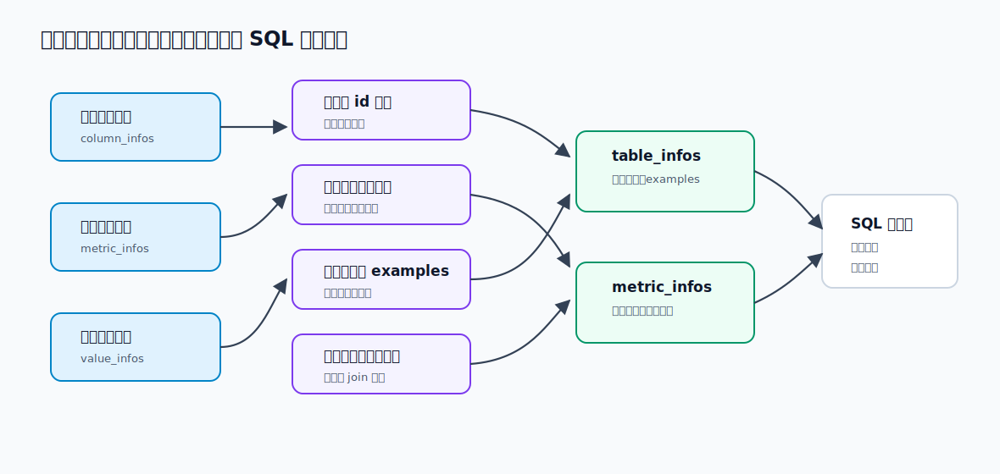

# 12 - 电商问数：召回信息合并与上下文构建

---

**本章课程目标：**

- 理解为什么字段、指标、字段取值三路召回后，还不能直接生成 SQL。
- 掌握 `table_infos` 和 `metric_infos` 这两个后续核心上下文的结构。
- 看懂 `merge_retrieved_info` 如何把分散的 `ColumnInfo`、`MetricInfo`、`ValueInfo` 合并成按表组织的信息。

**学习建议：** 这一章不调用大模型，本质是把上一章召回来的候选信息整理成 SQL 生成能用的上下文。读代码时先拿一组样例输入，观察它如何分组、去重、补字段、转类型，最后变成下游更好消费的结构。这里看懂了，后面 SQL 提示词为什么能写得更稳就有依据。

**对应代码分支：** `12-agent-merge-retrievals`

---

## 1、本章在问数链路中的位置


上一章完成了关键词抽取和三路召回。三路召回结束后，`state` 里会有三份结果：

```text
retrieved_column_infos  # 召回到的字段信息
retrieved_metric_infos  # 召回到的指标信息
retrieved_value_infos   # 召回到的字段真实取值
```

这一章要实现的是下一个节点：`merge_retrieved_info`

在整条问数链路中，它的位置如下：

```text
用户问题
  -> extract_keywords
  -> recall_column / recall_metric / recall_value
  -> merge_retrieved_info
  -> filter_table / filter_metric
  -> add_extra_context
  -> generate_sql
```


召回节点负责“找候选”，合并节点负责“整理候选”。整理后的结果会继续交给过滤节点和 SQL 生成节点使用。

本章结束后，`state` 里会多出两个后续节点最常用的字段：

```text
table_infos   # 按表组织好的表结构上下文
metric_infos  # 整理后的指标上下文
```

后面的过滤表、过滤指标、生成 SQL，都会围绕这两份上下文继续工作。

---

## 2、为什么召回结果不能直接交给大模型

三路召回拿到的信息是分散的。

字段召回得到的是一个字段列表，列表里的每一项都是一个 `ColumnInfo`：

```text
retrieved_column_infos: list[ColumnInfo]
```

比如用户问“统计华北地区的销售总额”，字段召回里可能会有：

```text
fact_order.order_amount  # 订单金额字段
dim_region.region_name   # 地区名称字段
fact_order.region_id     # 订单事实表里的地区外键
```

指标召回得到的是一个指标列表，列表里的每一项都是一个 `MetricInfo`：

```text
retrieved_metric_infos: list[MetricInfo]
```

例如：

```text
GMV  # 销售总额、成交额
AOV  # 客单价
```

字段取值召回得到的是一个真实值列表，列表里的每一项都是一个 `ValueInfo`：

```text
retrieved_value_infos: list[ValueInfo]
```

例如：

```text
dim_region.region_name.华北  # region_name 字段里的真实取值：华北
```

但是大模型生成 SQL 时，更希望看到的是这样的上下文：

```text
有哪些表
每张表有哪些字段
字段类型是什么
字段角色是什么
字段有哪些示例值
指标如何定义
指标依赖哪些字段
表之间可能如何 join
```

这就像让一个人写 SQL。你只给他说：

```text
order_amount
GMV
华北
region_name
```

他还是要猜这些字段分别在哪张表、哪些字段能关联、`华北` 应该放到哪个字段的过滤条件里。

更适合 SQL 生成的输入，是按表组织后的结构：

```yaml
- name: fact_order
  role: fact
  description: 订单事实表
  columns:
    - name: order_amount
      type: decimal
      role: measure
      description: 订单金额

- name: dim_region
  role: dimension
  description: 地区维度表
  columns:
    - name: region_name
      type: string
      role: dimension
      examples: ["华北"]
      description: 地区名称
```

所以 `merge_retrieved_info` 要做的事，不是继续检索，而是把分散的召回结果整理成结构化上下文。

---

## 3、合并后的目标结构



`merge_retrieved_info` 最终返回两个字段：

```python
return {
    "table_infos": table_infos,
    "metric_infos": metric_infos,
}
```

这两个字段会写回 `DataAgentState`。

### 3.1 table_infos：按表组织字段

`table_infos` 是一组表信息。每个表里包含表名、表角色、表描述，以及这张表下相关的字段列表。

大致结构如下：

```python
[
    {
        "name": "fact_order",
        "role": "fact",
        "description": "订单事实表",
        "columns": [
            {
                "name": "order_amount",
                "type": "decimal",
                "role": "measure",
                "examples": [],
                "description": "订单金额",
                "alias": ["成交金额", "销售金额"],
            }
        ],
    }
]
```

这里的重点是“按表分组”。后面生成 SQL 时，模型不只是知道有 `order_amount` 这个字段，还知道它属于 `fact_order`。

### 3.2 metric_infos：整理后的指标定义

`metric_infos` 是一组指标信息。它保留指标生成 SQL 所需的内容：

```python
[
    {
        "name": "GMV",
        "description": "成交金额总和",
        "relevant_columns": ["fact_order.order_amount"],
        "alias": ["成交额", "交易额", "销售总额"],
    }
]
```

它和召回阶段的 `MetricInfo` 很像，只是去掉了不需要给模型看的内部 `id`。

---

## 4、补齐 State 和 Context

### 4.1 DataAgentState：保存合并后的上下文

合并后的 `table_infos` 和 `metric_infos` 后面还要被过滤节点、SQL 生成节点继续读取，所以它们必须放进 `DataAgentState`。

项目对应文件路径：`shopkeeper-agent/app/agent/state.py`

```python
from typing import TypedDict

from app.entities.column_info import ColumnInfo
from app.entities.metric_info import MetricInfo
from app.entities.value_info import ValueInfo


class MetricInfoState(TypedDict):
    # 面向提示词的指标结构，不再保留内部 id
    name: str
    description: str
    relevant_columns: list[str]
    alias: list[str]


class ColumnInfoState(TypedDict):
    # 面向提示词的字段结构，只保留 SQL 生成需要理解的字段属性
    name: str
    type: str
    role: str
    examples: list
    description: str
    alias: list[str]


class TableInfoState(TypedDict):
    # 表信息会嵌套字段列表，方便后续按表组织 SQL 上下文
    name: str
    role: str
    description: str
    columns: list[ColumnInfoState]
```

然后在 `DataAgentState` 中加入合并后的上下文：

```python
class DataAgentState(TypedDict):
    query: str  # 用户输入的查询
    keywords: list[str]  # 抽取的关键词

    retrieved_column_infos: list[ColumnInfo]  # 检索到的字段信息
    retrieved_metric_infos: list[MetricInfo]  # 检索到的指标信息
    retrieved_value_infos: list[ValueInfo]  # 检索到的取值信息

    table_infos: list[TableInfoState]  # 合并和补齐后的表结构上下文
    metric_infos: list[MetricInfoState]  # 合并后的指标上下文

    error: str  # 校验 SQL 时出现的错误信息
```

这里没有直接复用前面定义过的 `TableInfo`、`ColumnInfo`、`MetricInfo` 实体，是因为合并后的结构已经变了。

比如 `TableInfo` 实体只描述一张表本身，并不包含 `columns`；而 SQL 生成阶段需要的是“表 + 字段”的嵌套结构。所以这里单独定义了 `TableInfoState`。

同理，`MetricInfoState` 不需要内部 `id`，只保留指标名称、描述、依赖字段和别名。

---

### 4.2 DataAgentContext：注入 Meta Repository

合并节点需要根据字段 ID、表 ID 再去 `Meta MySQL` 查完整元数据。所以 `DataAgentContext` 里要有 `meta_mysql_repository`。

项目对应文件路径：`shopkeeper-agent/app/agent/context.py`

```python
from typing import TypedDict

from langchain_huggingface import HuggingFaceEndpointEmbeddings

from app.repositories.es.value_es_repository import ValueESRepository
from app.repositories.mysql.meta.meta_mysql_repository import MetaMySQLRepository
from app.repositories.qdrant.column_qdrant_repository import ColumnQdrantRepository
from app.repositories.qdrant.metric_qdrant_repository import MetricQdrantRepository


class DataAgentContext(TypedDict):
    # 字段向量仓储，负责根据向量从 Qdrant 检索候选字段
    column_qdrant_repository: ColumnQdrantRepository
    # Embedding 客户端，负责把关键词转换成向量检索所需的 query vector
    embedding_client: HuggingFaceEndpointEmbeddings
    # 指标向量仓储，负责根据向量从 Qdrant 检索候选指标
    metric_qdrant_repository: MetricQdrantRepository
    # 字段取值全文检索仓储，负责从 Elasticsearch 检索真实字段值
    value_es_repository: ValueESRepository
    # 元数据库仓储，合并阶段用它按 id 补齐字段、表、主外键信息
    meta_mysql_repository: MetaMySQLRepository
```

注意这里的分工：

```text
state           -> 保存本次问数链路里的业务中间结果
runtime.context -> 保存节点执行时要用的外部依赖
```

`meta_mysql_repository` 是外部依赖，所以放在 `context`，不是放在 `state`。

---

## 5、merge_retrieved_info 的合并主线

先把完整逻辑压缩成一条流程：

```text
读取三路召回结果
  -> 把字段召回结果转成 column_id -> ColumnInfo
  -> 根据指标 relevant_columns 补齐字段
  -> 根据字段取值 column_id/value 补齐字段 examples
  -> 按 table_id 对字段分组
  -> 为每张表补充主键和外键字段
  -> 查询表信息，组装 TableInfoState
  -> 把 MetricInfo 转成 MetricInfoState
  -> 写回 table_infos 和 metric_infos
```

这里有两个关键词：

- **补齐**：召回结果可能缺字段，所以要从 `Meta MySQL` 补回来；
- **整理**：召回结果是散的，最终要按表组织成层次结构。

这个节点不需要调用大模型，也不需要访问 Qdrant 或 Elasticsearch。它只处理上一章已经召回出来的信息，并在必要时查 `Meta MySQL`。

---

### 5.1 节点入口：读取 state 和 context

项目对应文件路径：`shopkeeper-agent/app/agent/nodes/merge_retrieved_info.py`

```python
from langgraph.runtime import Runtime

from app.agent.context import DataAgentContext
from app.agent.state import (
    ColumnInfoState,
    DataAgentState,
    MetricInfoState,
    TableInfoState,
)
from app.core.log import logger
from app.entities.column_info import ColumnInfo
from app.entities.metric_info import MetricInfo
from app.entities.table_info import TableInfo
from app.entities.value_info import ValueInfo


async def merge_retrieved_info(state: DataAgentState, runtime: Runtime[DataAgentContext]):
    writer = runtime.stream_writer
    writer("合并召回信息")

    retrieved_column_infos: list[ColumnInfo] = state["retrieved_column_infos"]
    retrieved_metric_infos: list[MetricInfo] = state["retrieved_metric_infos"]
    retrieved_value_infos: list[ValueInfo] = state["retrieved_value_infos"]

    meta_mysql_repository = runtime.context["meta_mysql_repository"]
```

这几行先拿到四类东西：

- 已召回字段：`retrieved_column_infos`
- 已召回指标：`retrieved_metric_infos`
- 已召回字段取值：`retrieved_value_infos`
- 元数据仓储：`meta_mysql_repository`

后面的逻辑都围绕这几份数据展开。

---

### 5.2 第一步：把字段列表转成 Map

合并过程中会不断判断某个字段是否已经存在。如果每次都遍历列表，代码会很绕；所以第一步先把字段列表转成 Map：

```python
retrieved_column_infos_map: dict[str, ColumnInfo] = {
    retrieved_column_info.id: retrieved_column_info
    for retrieved_column_info in retrieved_column_infos
}
```

这个 Map 的结构是：

```text
column_id -> ColumnInfo
```

比如：

```text
fact_order.order_amount -> ColumnInfo(...)
dim_region.region_name  -> ColumnInfo(...)
```

后面无论是补指标依赖字段，还是补字段取值所属字段，都可以通过 `column_id` 快速判断：

```python
if column_id not in retrieved_column_infos_map:
    ...
```

这一步还有一个天然好处：按字段 ID 去重。

---

### 5.3 第二步：把指标依赖字段补进字段列表

指标召回命中的是指标，但生成 SQL 不能只知道指标名。

比如召回到了 `GMV`：

```python
MetricInfo(
    id="GMV",
    name="GMV",
    description="成交金额总和",
    relevant_columns=["fact_order.order_amount"],
    alias=["成交额", "交易额", "销售总额"],
)
```

这里的 `relevant_columns` 记录的是指标依赖的底层字段 ID。也就是说，如果后面要计算 `GMV`，至少需要知道 `fact_order.order_amount` 这个字段。

所以合并节点要做一件事：**只要某个指标被召回，它依赖的字段也必须进入表字段上下文。**

对应代码如下：

```python
# 将指标信息的相关字段信息添加到字段信息中
for retrieved_metric_info in retrieved_metric_infos:
    for relevant_column in retrieved_metric_info.relevant_columns:
        if relevant_column not in retrieved_column_infos_map:
            column_info: ColumnInfo = await meta_mysql_repository.get_column_info_by_id(
                relevant_column
            )
            retrieved_column_infos_map[relevant_column] = column_info
```

这里要注意，`relevant_column` 不是完整字段对象，而是字段 ID。

如果这个字段已经在字段召回结果里，就不需要重复添加；如果不在，就通过 `Meta MySQL` 查出来，再放进 `retrieved_column_infos_map`。

这样后面生成 SQL 时，模型不只是知道“用户问的是 GMV”，还知道“GMV 要用哪个底层字段计算”。

---

### 5.4 第三步：把字段取值补进字段 examples

字段取值召回命中的是数据库里的真实值，比如：

```python
ValueInfo(
    id="dim_region.region_name.华北",
    value="华北",
    column_id="dim_region.region_name",
)
```

它表达的意思是：

```text
字段 dim_region.region_name 里存在一个真实取值：华北
```

这个信息对 SQL 生成很重要。用户说“华北地区”，SQL 里真正应该写的可能是：

```sql
where dim_region.region_name = '华北'
```

所以合并节点要把 `ValueInfo.value` 追加到对应字段的 `examples` 中。

对应代码如下：

```python
# 将字段取值加入到其所属字段的 examples 中
for retrieved_value_info in retrieved_value_infos:
    value = retrieved_value_info.value
    column_id = retrieved_value_info.column_id

    if column_id not in retrieved_column_infos_map:
        column_info: ColumnInfo = await meta_mysql_repository.get_column_info_by_id(
            column_id
        )
        retrieved_column_infos_map[column_id] = column_info

    if value not in retrieved_column_infos_map[column_id].examples:
        retrieved_column_infos_map[column_id].examples.append(value)
```

这段代码做了两个保护。

第一，如果字段取值所属的字段没有被字段召回命中，就先从 `Meta MySQL` 把字段信息查出来。

这很合理：既然 `华北` 这个值属于 `dim_region.region_name`，那后续生成 SQL 大概率也需要 `dim_region.region_name` 这个字段。

第二，追加 `examples` 前先判断是否已经存在。

因为构建元数据知识库时，某些字段本来就已经带了一些示例值。如果直接 `append`，可能会重复出现同一个值。重复值对模型没有帮助，还会让上下文变乱。

到这一步结束，`retrieved_column_infos_map` 里已经包含了三类字段：

- 字段召回直接命中的字段；
- 指标依赖补进来的字段；
- 字段取值所属字段补进来的字段。

---

### 5.5 第四步：按表对字段分组

前面维护的还是一个字段 Map：

```text
column_id -> ColumnInfo
```

但最终要给大模型的是按表组织的结构。所以接下来要按照 `table_id` 分组。

代码如下：

```python
# 按照表对字段信息进行分组
table_to_columns_map: dict[str, list[ColumnInfo]] = {}

for column_info in retrieved_column_infos_map.values():
    table_id = column_info.table_id
    if table_id not in table_to_columns_map:
        table_to_columns_map[table_id] = []
    table_to_columns_map[table_id].append(column_info)
```

这一步得到的结构是：

```text
table_id -> list[ColumnInfo]
```

比如：

```text
fact_order -> [
  fact_order.order_amount,
  fact_order.region_id
]

dim_region -> [
  dim_region.region_name
]
```

这里有一个小细节：每次追加字段前，要先判断 `table_id` 是否已经在 Map 里。

如果是第一次遇到某张表，就先初始化一个空列表：

```python
table_to_columns_map[table_id] = []
```

否则直接 `append` 会因为找不到这个 key 而报错。

---

### 5.6 第五步：为每张表补充主键和外键

这一节是本章最容易被忽略，但非常重要的一步。

向量召回字段时，主键和外键不一定稳定命中。原因也很简单：主外键字段常常语义不明显。

例如很多表的主键都叫：

```text
id
```

或者外键叫：

```text
region_id
customer_id
product_id
```

这些字段对 SQL 的 `join` 很重要，但它们在自然语言问题里不一定出现。用户问：

```text
统计华北地区的销售总额
```

召回可能命中 `region_name` 和 `order_amount`，但不一定命中：

```text
dim_region.region_id
fact_order.region_id
```

如果后续上下文里缺少这些主外键，模型就很难写出正确的关联条件：

```sql
fact_order.region_id = dim_region.region_id
```

所以合并节点会在“按表分组之后”显式补充每张表的主键和外键字段。

为什么要在分组之后补？

因为只有分组之后，我们才知道当前涉及哪些表。知道了表 ID，才能去查这张表下所有 `primary_key` 和 `foreign_key` 字段。

对应代码如下：

```python
# 强制为每个表添加主外键字段
for table_id in table_to_columns_map.keys():
    key_columns: list[ColumnInfo] = await meta_mysql_repository.get_key_columns_by_table_id(
        table_id
    )
    column_ids = [column_info.id for column_info in table_to_columns_map[table_id]]

    for key_column in key_columns:
        if key_column.id not in column_ids:
            table_to_columns_map[table_id].append(key_column)
```

这里不能直接用：

```python
if key_column not in table_to_columns_map[table_id]:
    ...
```

因为 `key_column` 是对象。直接比较对象时，很容易变成比较对象地址，而不是比较字段 ID。这里更稳的做法是先拿到当前表已经存在的字段 ID：

```python
column_ids = [column_info.id for column_info in table_to_columns_map[table_id]]
```

然后按 `key_column.id` 判断是否已经存在。

补主外键会带来一个副作用：可能会多带入一些当前问题暂时用不上的字段。这个问题可以接受，因为下一章的过滤节点还会继续精简上下文。这里优先保证 SQL 生成时不要缺少 join 必需字段。

---

### 5.7 第六步：组装 TableInfoState

现在已经有了：

```text
table_id -> list[ColumnInfo]
```

但最终的 `state["table_infos"]` 需要的是：

```text
list[TableInfoState]
```

所以还要做一次转换。

代码如下：

```python
# 将表信息整理成目标格式
table_infos: list[TableInfoState] = []

for table_id, column_infos in table_to_columns_map.items():
    table_info: TableInfo = await meta_mysql_repository.get_table_info_by_id(table_id)

    columns = [
        ColumnInfoState(
            name=column_info.name,
            type=column_info.type,
            role=column_info.role,
            examples=column_info.examples,
            description=column_info.description,
            alias=column_info.alias,
        )
        for column_info in column_infos
    ]

    table_info_state = TableInfoState(
        name=table_info.name,
        role=table_info.role,
        description=table_info.description,
        columns=columns,
    )
    table_infos.append(table_info_state)
```

这一步做了两层转换。

第一层，把 `ColumnInfo` 转成 `ColumnInfoState`。

`ColumnInfo` 里有 `id`、`table_id` 等内部字段，但提示词上下文里不一定都需要。这里保留的是更适合大模型阅读的字段：

```text
name
type
role
examples
description
alias
```

第二层，把表信息和字段列表组合成 `TableInfoState`。

`get_table_info_by_id(table_id)` 查到的是表名、表角色、表描述；`columns` 来自前面分组后的字段列表。两者合在一起，才是后面 SQL 生成需要的表结构上下文。

---

### 5.8 第七步：组装 MetricInfoState

相比表信息，指标信息的处理简单很多。

召回得到的是 `MetricInfo`：

```python
MetricInfo(
    id="GMV",
    name="GMV",
    description="成交金额总和",
    relevant_columns=["fact_order.order_amount"],
    alias=["成交额", "交易额", "销售总额"],
)
```

最终要写入 `state` 的是 `MetricInfoState`：

```python
class MetricInfoState(TypedDict):
    name: str
    description: str
    relevant_columns: list[str]
    alias: list[str]
```

差别主要是去掉了内部 `id`。代码用列表推导式就能完成：

```python
# 处理指标信息
metric_infos: list[MetricInfoState] = [
    MetricInfoState(
        name=retrieved_metric_info.name,
        description=retrieved_metric_info.description,
        relevant_columns=retrieved_metric_info.relevant_columns,
        alias=retrieved_metric_info.alias,
    )
    for retrieved_metric_info in retrieved_metric_infos
]

return {
    "table_infos": table_infos,
    "metric_infos": metric_infos,
}
```

到这里，`merge_retrieved_info` 节点的核心逻辑就完成了。

---

## 6、完整节点代码

把上面的步骤合起来，完整节点如下。

项目对应文件路径：`shopkeeper-agent/app/agent/nodes/merge_retrieved_info.py`

```python
from langgraph.runtime import Runtime

from app.agent.context import DataAgentContext
from app.agent.state import (
    ColumnInfoState,
    DataAgentState,
    MetricInfoState,
    TableInfoState,
)
from app.core.log import logger
from app.entities.column_info import ColumnInfo
from app.entities.metric_info import MetricInfo
from app.entities.table_info import TableInfo
from app.entities.value_info import ValueInfo


async def merge_retrieved_info(
    state: DataAgentState, runtime: Runtime[DataAgentContext]
):
    """合并召回结果，并输出 SQL 生成前的候选表信息和指标信息"""

    writer = runtime.stream_writer
    writer("合并召回信息")

    retrieved_column_infos: list[ColumnInfo] = state["retrieved_column_infos"]
    retrieved_metric_infos: list[MetricInfo] = state["retrieved_metric_infos"]
    retrieved_value_infos: list[ValueInfo] = state["retrieved_value_infos"]

    meta_mysql_repository = runtime.context["meta_mysql_repository"]

    # 本节点的主线是：
    # 字段召回 + 指标依赖字段 + 字段真实取值 + 主外键补齐
    # -> table_infos / metric_infos，交给后续过滤和 SQL 生成节点继续使用。

    # 1. 以 column_id 为 key 合并字段信息
    # 三路召回可能命中同一个字段，用 dict 可以自然去重；
    # 后续指标依赖字段和字段取值也都通过 column_id 合并进来。
    retrieved_column_infos_map: dict[str, ColumnInfo] = {
        retrieved_column_info.id: retrieved_column_info
        for retrieved_column_info in retrieved_column_infos
    }

    # 2. 补齐指标依赖字段
    # 指标告诉模型“怎么算”，但生成 SQL 还需要知道指标依赖哪些真实字段。
    # 如果相关字段没有被字段召回命中，就从 Meta MySQL 里按 id 查出来补进上下文。
    for retrieved_metric_info in retrieved_metric_infos:
        for relevant_column in retrieved_metric_info.relevant_columns:
            if relevant_column not in retrieved_column_infos_map:
                column_info: ColumnInfo = (
                    await meta_mysql_repository.get_column_info_by_id(relevant_column)
                )
                retrieved_column_infos_map[relevant_column] = column_info

    # 3. 把字段取值合并回字段 examples
    # 字段取值召回命中的是 column_id + value，例如 dim_region.region_name.华北。
    # 把真实 value 放进字段 examples，可以帮助模型写出更接近真实数据的 where 条件。
    for retrieved_value_info in retrieved_value_infos:
        value = retrieved_value_info.value
        column_id = retrieved_value_info.column_id
        if column_id not in retrieved_column_infos_map:
            column_info: ColumnInfo = await meta_mysql_repository.get_column_info_by_id(
                column_id
            )
            retrieved_column_infos_map[column_id] = column_info
        if value not in retrieved_column_infos_map[column_id].examples:
            retrieved_column_infos_map[column_id].examples.append(value)

    # 4. 按表组织字段上下文
    # SQL 生成提示词通常按“表 -> 字段列表”的方式描述结构，
    # 所以这里先把分散的字段按 table_id 归到各自所属表下面。
    table_to_columns_map: dict[str, list[ColumnInfo]] = {}
    for column_info in retrieved_column_infos_map.values():
        table_id = column_info.table_id
        if table_id not in table_to_columns_map:
            table_to_columns_map[table_id] = []
        table_to_columns_map[table_id].append(column_info)

    # 5. 补齐主外键字段
    # 主外键通常不会出现在用户问题里，单靠向量召回容易漏掉；
    # 但多表查询的 Join 路径必须依赖它们，所以每张候选表都要兜底补齐。
    for table_id in table_to_columns_map.keys():
        key_columns: list[
            ColumnInfo
        ] = await meta_mysql_repository.get_key_columns_by_table_id(table_id)
        column_ids = [column_info.id for column_info in table_to_columns_map[table_id]]
        for key_column in key_columns:
            if key_column.id not in column_ids:
                table_to_columns_map[table_id].append(key_column)

    # 6. 生成表结构上下文
    # 数据库实体里可能包含入库和索引用字段，传给模型前只保留必要信息，
    # 让后续过滤和 SQL 生成节点面对的是更稳定的 TableInfoState 结构。
    table_infos: list[TableInfoState] = []
    for table_id, column_infos in table_to_columns_map.items():
        table_info: TableInfo = await meta_mysql_repository.get_table_info_by_id(
            table_id
        )
        columns = [
            ColumnInfoState(
                name=column_info.name,
                type=column_info.type,
                role=column_info.role,
                examples=column_info.examples,
                description=column_info.description,
                alias=column_info.alias,
            )
            for column_info in column_infos
        ]
        table_info_state = TableInfoState(
            name=table_info.name,
            role=table_info.role,
            description=table_info.description,
            columns=columns,
        )
        table_infos.append(table_info_state)

    # 7. 生成指标上下文
    # 指标上下文保留名称 描述 别名和依赖字段，足够让模型理解业务口径。
    metric_infos: list[MetricInfoState] = [
        MetricInfoState(
            name=retrieved_metric_info.name,
            description=retrieved_metric_info.description,
            relevant_columns=retrieved_metric_info.relevant_columns,
            alias=retrieved_metric_info.alias,
        )
        for retrieved_metric_info in retrieved_metric_infos
    ]

    logger.info(f"合并后的表信息：{[table_info['name'] for table_info in table_infos]}")
    logger.info(
        f"合并后的指标信息：{[metric_info['name'] for metric_info in metric_infos]}"
    )

    return {"table_infos": table_infos, "metric_infos": metric_infos}
```

这段代码看起来长，但主线只有两条：

```text
表信息：字段 Map -> 补指标字段 -> 补字段值 -> 按表分组 -> 补主外键 -> TableInfoState
指标信息：MetricInfo -> MetricInfoState
```

---

## 7、MetaMySQLRepository 需要补充的方法

合并节点需要从 `Meta MySQL` 查询三类信息：

- 根据字段 ID 查字段完整信息；
- 根据表 ID 查表完整信息；
- 根据表 ID 查这张表的主键和外键字段。

所以需要在 `MetaMySQLRepository` 中补充三个方法。

项目对应文件路径：`shopkeeper-agent/app/repositories/mysql/meta/meta_mysql_repository.py`

### 7.1 根据字段 ID 查询字段

```python
async def get_column_info_by_id(self, id: str) -> ColumnInfo | None:
    """按字段 id 查询字段元数据，供召回信息合并阶段补齐字段上下文"""
    column_info: ColumnInfoMySQL | None = await self.session.get(ColumnInfoMySQL, id)
    if column_info:
        # Repository 对外返回业务实体，不把 ORM Model 泄露给 Agent 节点
        return ColumnInfoMapper.to_entity(column_info)
    else:
        return None
```

这里使用的是 SQLAlchemy 的 `session.get(...)`。它适合按主键查询单条记录。

查出来的是 ORM Model：`ColumnInfoMySQL`。业务层更希望使用实体对象 `ColumnInfo`，所以最后通过 `ColumnInfoMapper.to_entity(...)` 做一次转换。

### 7.2 根据表 ID 查询表

```python
async def get_table_info_by_id(self, id: str) -> TableInfo | None:
    """按表 id 查询表元数据，最终组装成提示词里的表结构信息"""
    table_info: TableInfoMySQL | None = await self.session.get(TableInfoMySQL, id)
    if table_info:
        return TableInfoMapper.to_entity(table_info)
    else:
        return None
```

这段逻辑和查询字段类似，只是查询对象换成了 `TableInfoMySQL`。

合并阶段用它补充表名、表角色和表描述。

### 7.3 根据表 ID 查询主外键字段

```python
async def get_key_columns_by_table_id(self, table_id: str) -> list[ColumnInfo]:
    """查询指定表的主外键字段，避免 Join 关键字段被向量召回漏掉"""
    # 主外键字段用于后续生成 join 条件，不能完全依赖向量召回命中
    sql = "select * from column_info where table_id = :table_id and role in ('primary_key','foreign_key')"
    # :table_id 是 SQLAlchemy text SQL 的占位符，实际值通过第二个参数传入
    result = await self.session.execute(text(sql), {"table_id": table_id})
    # mappings() 会把结果行转成类似字典的结构，便于解包成 ColumnInfo
    return [ColumnInfo(**dict(row)) for row in result.mappings().fetchall()]
```

这条 SQL 做了两层过滤：

```sql
where table_id = :table_id
  and role in ('primary_key','foreign_key')
```

`:table_id` 是 SQLAlchemy 文本 SQL 中的参数占位符。真正执行时，通过第二个参数传入：

```python
{"table_id": table_id}
```

这样写比直接拼接字符串更稳，也避免把变量硬塞进 SQL 字符串。

`result.mappings().fetchall()` 得到的是类似字典的行数据。代码里再用：

```python
ColumnInfo(**dict(row))
```

把每一行转成 `ColumnInfo` 实体。

---

## 8、在 graph.py 中传入 Meta Repository

因为 `merge_retrieved_info` 会读取：

```python
runtime.context["meta_mysql_repository"]
```

所以本地测试工作流时，`graph.py` 里也要初始化 `Meta MySQL` 客户端，并把 Repository 放进 `context`。

项目对应文件路径：`shopkeeper-agent/app/agent/graph.py`

```python
# 合并节点需要从 Meta MySQL 按 id 反查字段、表和主外键
meta_mysql_client_manager.init()

async with meta_mysql_client_manager.session_factory() as meta_session:
    meta_mysql_repository = MetaMySQLRepository(meta_session)

    context = DataAgentContext(
        # 三路召回阶段已有的运行时依赖
        column_qdrant_repository=column_qdrant_repository,
        embedding_client=embedding_client_manager.client,
        metric_qdrant_repository=metric_qdrant_repository,
        value_es_repository=value_es_repository,
        # 本章新增：合并阶段用于补齐元数据
        meta_mysql_repository=meta_mysql_repository,
    )
```

图结构在第 10 章已经搭好，本章只需要确认三路召回都会汇入合并节点：

```python
graph_builder.add_edge("recall_column", "merge_retrieved_info")
graph_builder.add_edge("recall_value", "merge_retrieved_info")
graph_builder.add_edge("recall_metric", "merge_retrieved_info")

graph_builder.add_edge("merge_retrieved_info", "filter_table")
graph_builder.add_edge("merge_retrieved_info", "filter_metric")
```

这表示：

```text
字段、指标、字段取值三路召回都完成
  -> 合并召回信息
  -> 再分别进入表过滤和指标过滤
```

---

## 9、运行验证

在后端项目根目录运行：

```bash
uv run python -m app.agent.graph
```

测试问题仍然可以使用：

```python
state = DataAgentState(query="统计华北地区的销售总额")
```

执行过程中，流式输出里应该能看到：

```text
2026-04-27 00:29:48.467 | INFO     | request_id - 1 | app.agent.nodes.extract_keywords:extract_keywords:46 - 抽取关键词: ['华北地区', '统计', '统计华北地区的销售总额', '销售总额']
抽取关键词
召回字段信息
召回指标信息
召回字段取值
2026-04-27 00:29:57.592 | INFO     | request_id - 1 | app.agent.nodes.recall_column:recall_column:64 - 检索到字段信息：['fact_order.order_amount', 'fact_order.order_quantity', 'dim_region.region_name', 'dim_region.country', 'dim_region.province', 'fact_order.region_id', 'dim_region.region_id', 'dim_product.category']
2026-04-27 00:30:00.543 | INFO     | request_id - 1 | app.agent.nodes.recall_value:recall_value:59 - 检索到字段取值：['dim_region.region_name.华北']
2026-04-27 00:30:04.302 | INFO     | request_id - 1 | app.agent.nodes.recall_metric:recall_metric:64 - 检索到指标信息：['GMV', 'AOV']
合并召回信息
2026-04-27 00:30:04.398 | INFO     | request_id - 1 | app.agent.nodes.merge_retrieved_info:merge_retrieved_info:116 - 合并后的表信息：['fact_order', 'dim_region', 'dim_product']
2026-04-27 00:30:04.399 | INFO     | request_id - 1 | app.agent.nodes.merge_retrieved_info:merge_retrieved_info:117 - 合并后的指标信息：['GMV', 'AOV']
过滤指标信息
过滤表信息
添加额外上下文
生成SQL
校验SQL
执行SQL
```

合并节点跑通后，可以重点观察 `table_infos` 和 `metric_infos`。

这里要注意：`table_infos` 和 `metric_infos` 不是写回 MySQL 的表数据，而是 LangGraph 当前执行过程中的 `state` 中间结果。所以不要去 MySQL 里找这两个名字的表。

更直接的观察方式有两种。

第一，在 `merge_retrieved_info.py` 的 `return` 前打断点，查看内存变量：

```python
table_infos
metric_infos
```

第二，查看节点里的日志输出：

```python
logger.info(f"合并后的表信息：{[table_info['name'] for table_info in table_infos]}")
logger.info(
    f"合并后的指标信息：{[metric_info['name'] for metric_info in metric_infos]}"
)
```

MySQL 中能看到的是原始元数据表，例如 `table_info`、`column_info`、`metric_info`、`column_metric`。合并节点只是从这些表里读取信息，并在运行时组装出更适合后续节点使用的上下文。

以“统计华北地区的销售总额”为例，比较理想的结果是：

- `table_infos` 中能看到订单事实表，例如 `fact_order`；
- `table_infos` 中能看到地区维度表，例如 `dim_region`；
- `fact_order` 中包含金额字段，例如 `order_amount`；
- `dim_region` 中包含地区名称字段，例如 `region_name`；
- `region_name.examples` 中能看到真实取值 `华北`；
- 相关表中包含必要的主键和外键字段，例如 `region_id`；
- `metric_infos` 中能看到 `GMV` 这类指标。

如果出现一些暂时用不上的表或字段，也先不用紧张。合并阶段宁愿多保留一些上下文，下一章的过滤节点会继续精简。

---

**本章小结：**

本章实现了问数智能体中的 `merge_retrieved_info` 节点。

可以把整章压缩成下面这条链路：

```text
retrieved_column_infos
retrieved_metric_infos
retrieved_value_infos
  -> 字段按 id 转 Map
  -> 指标依赖字段补进字段 Map
  -> 字段真实取值补进字段 examples
  -> 字段按 table_id 分组
  -> 每张表补主键和外键
  -> 组装 table_infos
  -> 组装 metric_infos
```

到这里，前面分散召回到的字段、指标和值，已经被整理成大模型更容易理解的结构化上下文。下一章要做的，就是在这份上下文基础上继续过滤，把和当前问题关系不大的表、字段和指标再压缩掉。
