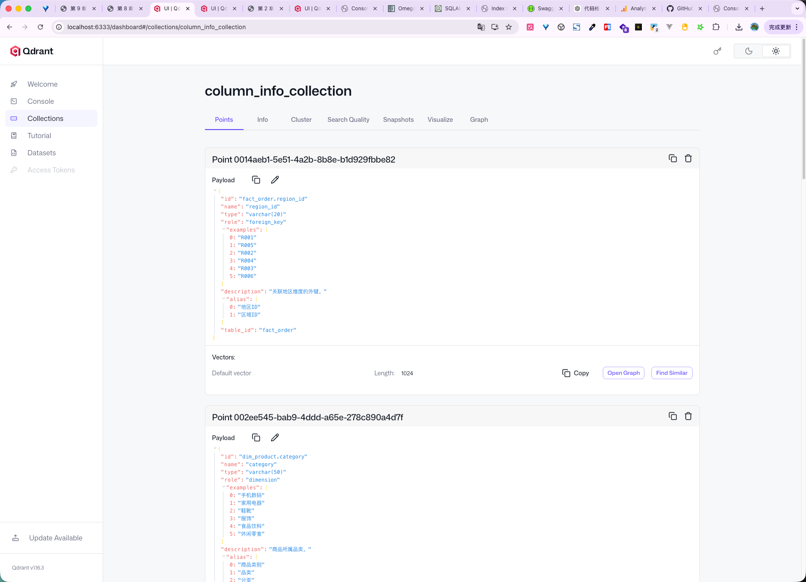
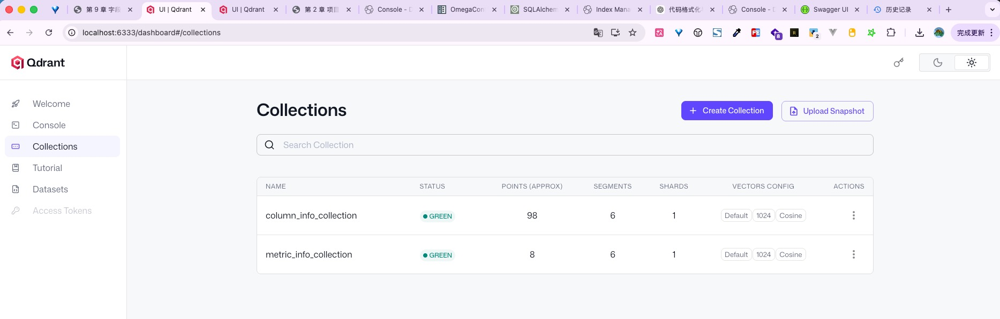

# 9 - 电商问数：字段与指标检索能力构建

---

**本章课程目标：**

理解为什么问数系统不能只靠字段信息，而要同时建设字段向量索引、字段值全文索引和指标向量索引。看懂“字段语义召回 -> 字段真实值匹配 -> 指标语义召回”这三条链路分别解决什么问题，以及它们在元数据知识库构建流程中的位置。建立清晰的分层认识：`Service` 负责编排字段与指标检索能力构建流程，`Qdrant Repository` 负责字段和指标语义向量落库，`ES Repository` 负责字段值全文索引落库，`DW Repository` 负责查询真实字段值。

**学习建议：** 这一章先分清三类召回对象：字段回答“查哪一列”，字段值回答“过滤条件里的真实值怎么写”，指标回答“业务口径怎么算”。向量索引和全文索引只是实现手段，不是学习起点。读到最终测试时，留意三条链路怎样一起为后面的 SQL 生成准备上下文。

**对应代码分支：** `09-metadata-retrieval-capability`

---

上一章我们已经把表信息和字段信息沉淀到了 `Meta MySQL`。这一步解决的是：**系统先有一份稳定、结构化的字段元数据。** 但只有结构化元数据还不够。因为问数系统后面面对的，不是程序员手写的标准 SQL，而是用户的自然语言提问。

例如用户会这样问：统计河北省销售总额；查询黄金会员下单人数；统计数码品类销量；看一下华北地区订单金额；最近 `GMV` 是多少；`AOV` 怎么看。

这些问题里会同时出现三类信息：一类是“销售总额”“订单金额”“品类”这种更像字段含义的表达；一类是“河北省”“黄金会员”“数码”“华北”这种更像字段真实取值的表达；还有一类是 `GMV`、`AOV`、客单价这种更像业务指标的表达。这就意味着，系统后面要解决的并不是单一的“字段检索”，而是三件互相配合的事：识别语义上更像哪个字段，判断是不是某个字段的真实取值，再判断是不是系统已经定义过的业务指标。

所以从这一章开始，我们把字段和指标这几条原本分散的链路收拢到一起，统一从“字段与指标检索能力构建”这个更高一层的视角来理解整条主线。

---

## 1、为什么字段检索不能只靠一种能力

先从一个具体问题开始：字段向量索引能帮系统找到字段，但不能保证过滤条件里的取值一定写对。

如果系统只做字段向量索引，它擅长解决的是：“销售额”像不像 `order_amount`；“会员等级”像不像 `member_level`；“地区”像不像 `region_name`。也就是说，它擅长做**字段语义召回**。

但如果用户的问题是“统计河北省销售总额”，即使系统已经知道“销售总额”更像 `order_amount`，“河北省”大概率和地区字段有关，仍然还有一个关键问题没有解决：**库里到底存的是“河北”还是“河北省”？**

这个问题如果答不准，后面生成的 SQL 就很容易写错。例如下面这条 SQL：

```sql
select sum(order_amount)
from fact_order
join dim_region on fact_order.region_id = dim_region.region_id
where province = '河北省'
```

如果真实数仓里存的是“河北”，那这条 SQL 虽然语法正确，结果却是错的。

所以字段值还必须单独建立一条检索链路。它要解决的是：

- “华北”是不是某个字段的真实取值
- “黄金会员”是不是某个字段里真实存在的值
- “数码”应该落在哪个字段的值域里

也就是说，向量索引回答：**像哪个字段**，全文索引回答：**是不是这个字段里的真实值**。这也说明，字段向量索引和字段值全文索引虽然是两条不同的实现链路，但本质上都在服务同一个更大的目标：**把字段检索能力真正建完整。**

---

## 2、本章在构建链路中的位置与主线

这一章虽然整合了多条检索链路，但它在工程上并不是一个“独立系统”，而是仍然挂在元数据知识库构建主流程之下。

先看当前项目代码里的实际入口。

项目对应文件路径：`shopkeeper-agent/app/scripts/build_meta_knowledge.py`

```python
async def build(config_path: Path):
    meta_mysql_client_manager.init()
    dw_mysql_client_manager.init()
    qdrant_client_manager.init()
    embedding_client_manager.init()
    es_client_manager.init()

    # 表字段入库需要同时连接 Meta MySQL 和 DW MySQL
    async with (
        meta_mysql_client_manager.session_factory() as meta_session,
        dw_mysql_client_manager.session_factory() as dw_session,
    ):
        meta_mysql_repository = MetaMySQLRepository(meta_session)
        dw_mysql_repository = DWMySQLRepository(dw_session)
        # 字段语义召回写入 Qdrant
        column_qdrant_repository = ColumnQdrantRepository(qdrant_client_manager.client)
        embedding_client = embedding_client_manager.client
        # 字段真实值匹配写入 ES
        value_es_repository = ValueESRepository(es_client_manager.client)
        # 指标语义召回写入独立的 Qdrant collection
        metric_qdrant_repository = MetricQdrantRepository(
            qdrant_client_manager.client
        )

        meta_knowledge_service = MetaKnowledgeService(
            meta_mysql_repository=meta_mysql_repository,
            dw_mysql_repository=dw_mysql_repository,
            column_qdrant_repository=column_qdrant_repository,
            embedding_client=embedding_client,
            value_es_repository=value_es_repository,
            metric_qdrant_repository=metric_qdrant_repository,
        )

        # 本章字段与指标两条主线都从这里进入 Service
        await meta_knowledge_service.build(config_path)
```

这里要特别注意：**当前项目根目录下虽然有 `main.py`，但它只是一个占位入口；本章真正对应的业务入口仍然是 `build_meta_knowledge.py`。**

也就是说，本章讲的这些检索能力，不是通过 `main.py` 跑起来的，而是通过元数据知识库构建脚本跑起来的。

再看 `MetaKnowledgeService.build(...)`：

项目对应文件路径：`shopkeeper-agent/app/services/meta_knowledge_service.py`

```python
async def build(self, config_path: Path):
    context = OmegaConf.load(config_path)
    schema = OmegaConf.structured(MetaConfig)
    meta_config: MetaConfig = OmegaConf.to_object(OmegaConf.merge(schema, context))

    if meta_config.tables:
        # 先把表字段落到 Meta MySQL，并返回字段实体列表
        column_infos = await self._save_tables_to_meta_db(meta_config)
        logger.info("保存表信息和字段信息到 Meta MySQL")

        # 同一批字段继续用于构建字段语义向量索引
        await self._save_column_info_to_qdrant(column_infos)
        logger.info("为字段信息建立向量索引")

        # 再按配置同步字段真实值，构建全文索引
        await self._save_value_info_to_es(meta_config, column_infos)
        logger.info("为字段取值建立全文索引")

    if meta_config.metrics:
        # 指标信息和字段关系先写入 Meta MySQL
        metric_infos = await self._save_metrics_to_meta_db(meta_config)
        logger.info("保存指标信息到数据库成功")

        # 再给指标信息建立向量索引
        await self._save_metrics_to_qdrant(metric_infos)
        logger.info("为指标信息建立向量索引成功")
```

整条构建主线可以概括成下面这样：

```text
meta_config
  -> tables
    -> column_infos
    -> 字段向量索引：字段名 / 描述 / 别名 -> Embedding -> Qdrant
    -> 字段值全文索引：字段真实取值 -> ValueInfo -> Elasticsearch
  -> metrics
    -> metric_infos + column_metrics
    -> 指标向量索引：指标名 / 描述 / 别名 -> Embedding -> Qdrant
```

也就是说，这一章并不是在构建几个完全无关的系统，而是在围绕同一份元数据配置，把字段和指标分别推进成不同类型的可检索对象：`Qdrant` 负责字段和指标的语义召回，`Elasticsearch` 负责字段真实值匹配。接下来我们就按这个顺序，一条一条拆开看。

---

## 3、第一部分：字段向量索引构建

字段向量索引要解决的问题是：**怎么让字段信息具备语义检索能力。**

### 3.1 字段向量索引的主流程

项目对应文件路径：`shopkeeper-agent/app/services/meta_knowledge_service.py`

```python
async def _save_column_info_to_qdrant(self, column_infos: list[ColumnInfo]):
    await self.column_qdrant_repository.ensure_collection()

    # 暂存“待向量化文本 + 业务 payload”，此时还不是 Qdrant 的 PointStruct
    points: list[dict] = []
    for column_info in column_infos:
        points.append(
            {
                # 一个字段会拆成多个 point，所以 point id 不能直接复用 column_info.id
                "id": uuid.uuid4(),
                # 字段名也作为一个语义入口，例如 order_amount
                "embedding_text": column_info.name,
                # payload 保存完整字段上下文，方便检索命中后直接使用
                "payload": asdict(column_info),
            }
        )

        points.append(
            {
                "id": uuid.uuid4(),
                # 字段描述更接近用户自然语言表达，例如“订单金额”
                "embedding_text": column_info.description,
                "payload": asdict(column_info),
            }
        )

        for alia in column_info.alias:
            points.append(
                {
                    "id": uuid.uuid4(),
                    # 每个别名单独建 point，用来覆盖“销售额”“成交金额”等不同说法
                    "embedding_text": alia,
                    "payload": asdict(column_info),
                }
            )

    embeddings: list[list[float]] = []
    embedding_texts = [point["embedding_text"] for point in points]
    # 分批调用 Embedding，避免单次请求过大
    embedding_batch_size = 20
    for i in range(0, len(embedding_texts), embedding_batch_size):
        batch_embedding_texts = embedding_texts[i : i + embedding_batch_size]
        # 返回顺序要和输入文本顺序一致，后面才能和 id、payload 对齐
        batch_embeddings = await self.embedding_client.aembed_documents(
            batch_embedding_texts
        )
        embeddings.extend(batch_embeddings)

    ids = [point["id"] for point in points]
    payloads = [point["payload"] for point in points]

    # 最终写入 Qdrant：id + vector + payload
    await self.column_qdrant_repository.upsert(ids, embeddings, payloads)
```

这段代码做了 4 件事：

1. 先确保 `Qdrant` 中用于存字段向量的 collection 存在
2. 把每个字段拆成多个待向量化的 point
3. 调用 `Embedding` 服务批量生成向量
4. 把 `id`、`embedding`、`payload` 一起写入 `Qdrant`


### 3.2 为什么一个字段不会只生成一个 point

这是字段向量索引的核心设计：一个字段不会只建一个点，而是要围绕这个字段拆出多个语义入口。

例如一个字段：

- 字段名：`order_amount`
- 描述：订单金额
- 别名：销售额、成交金额、订单总额

如果你只给 `order_amount` 建一个向量点，后面用户说“销售额”时，就不一定容易被召回。  
所以当前实现采用的是：

- 字段名建一个 point
- 字段描述建一个 point
- 每一个字段别名再各建一个 point

这样做的目的，就是尽量让不同的自然语言表达都能把同一个字段召回来。

如果把这个过程写得再具体一点，一个 `ColumnInfo` 往往会先被展开成这样一组中间数据：

```python
# 同一个字段会被拆成多个语义入口，但 payload 都指向同一个 ColumnInfo
[
    {
        # 字段名入口
        "id": "随机 point id 1",
        "embedding_text": "order_amount",
        "payload": {...完整 column_info...},
    },
    {
        # 字段描述入口
        "id": "随机 point id 2",
        "embedding_text": "订单金额",
        "payload": {...完整 column_info...},
    },
    {
        # 字段别名入口
        "id": "随机 point id 3",
        "embedding_text": "销售额",
        "payload": {...完整 column_info...},
    },
    {
        # 另一个字段别名入口
        "id": "随机 point id 4",
        "embedding_text": "成交金额",
        "payload": {...完整 column_info...},
    },
]
```

这段示例最重要的不是字典长什么样，而是先建立一个清晰认识：**系统不是在给“字段”做一次单点向量化，而是在给“字段的多个语义入口”分别做向量化。**

这样一来，后面用户说“销售额”“订单金额”“成交金额”时，虽然说法不同，但都有机会命中同一个业务字段。

### 3.3 复习 4 个 Qdrant 概念

学习这一段时，容易卡住的不是业务逻辑，而是 `Qdrant` 的几个基础概念。

抓住这 4 个词：`collection` 可以类比成向量库里的一张集合表，`point` 是真正写进 `Qdrant` 的一条记录，`vector` 是某段文本经过向量模型编码后的数值表示，`payload` 则是和向量一起保存的业务数据。

在当前项目里：

- `embedding_text` 最终会变成 `vector`
- `asdict(column_info)` 最终会变成 `payload`

也就是说，向量库里存的并不是孤零零的一串向量，而是“向量 + 完整字段上下文”。

如果把这 4 个概念重新串成一句更贴近代码的话，就是：

```text
一个字段
  -> 拆成多个 point
  -> 每个 point 先有一段 embedding_text
  -> embedding_text 被编码成 vector
  -> vector 和 payload 一起写入同一个 collection
```

很多同学第一次看 `Qdrant` 时，容易把 `point` 和 `payload` 混成一回事。它们并不在同一个层次：`point` 是整条向量记录，`payload` 是这条向量记录里附带的业务信息。也就是说，`payload` 是 `point` 的一部分，而不是和 `point` 并列的东西。

如果把一个真正写入 `Qdrant` 的点简化画出来，大致会像这样：

```python
PointStruct(
    # point 自己的存储 ID，不等同于字段 ID
    id="0b7f...",
    # embedding_text 编码后的向量，检索时主要比较它
    vector=[0.12, -0.08, ...],
    # 命中后返回给业务层的字段上下文
    payload={
        "id": "fact_order.order_amount",
        "name": "order_amount",
        "description": "订单金额",
        "table_id": "fact_order",
        ...
    },
)
```

这样理解之后就会很清楚：向量检索真正比较的是 `vector`，但命中之后对业务最有价值的，是 `payload` 里带回来的字段上下文。

### 3.4 为什么 point 的 id 用 uuid

这里的 `id` 并没有直接复用 `column_info.id`，而是：

```python
# 为每个向量 point 单独生成唯一 ID，避免同一字段拆成多个 point 时互相覆盖
uuid.uuid4()
```

原因很简单：一个字段会拆成多个 point。如果你直接用 `column_info.id`，那同一个字段名、字段描述、字段别名就会冲突。

所以更合理的做法是：**字段本身保持一个稳定的字段 ID，而每个 point 再单独生成自己的唯一 point ID。**

这里有两套不同的标识：`column_info.id` 表示业务字段自己的稳定身份，`point.id` 表示某一个向量点自己的存储身份。这两者同时存在并不冲突，反而正好解决了两个层面的问题：业务层需要知道“这到底是哪个字段”；向量库存储层需要知道“这到底是哪一个点”。

这也是为什么 `payload` 里会继续保留字段自己的 `id`，而不是因为外面已经有 `point.id` 了就把字段 `id` 删掉。

### 3.5 payload 为什么直接保存整个 ColumnInfo

当前实现里：

```python
# 把 ColumnInfo 转成普通字典，作为 Qdrant payload 随向量一起保存
"payload": asdict(column_info)
```

这里不是只保存字段名，也不是只保存某一个小片段，而是直接保存整个 `ColumnInfo` 的字典表示。

这样做的好处是：后面向量检索命中之后，系统可以直接拿回完整字段上下文，而不需要再专门回别的地方拼装字段描述、字段角色、所属表等信息。

这一步从存储角度看，确实会带来一点“信息冗余”。因为同一个字段拆出来的多个 point，`payload` 大部分内容都一样，只是 `embedding_text` 不一样。

但这里项目明显优先选择了另一件事：**查询链路简单。**因为后面一旦命中某个 point，系统立刻就能拿到完整字段信息，而不用再做“先查到 point，再根据字段 id 回 MySQL 二次补全”的额外动作。

对于教程里的这条主线来说，这种设计是很划算的：写入时多存一点重复信息，读取时少做一次额外拼装。

### 3.6 ColumnQdrantRepository 在这条链路里负责什么

项目对应文件路径：`shopkeeper-agent/app/repositories/qdrant/column_qdrant_repository.py`

```python
class ColumnQdrantRepository:
    # 字段向量统一写入这个 collection
    collection_name = "column_info_collection"

    def __init__(self, client: AsyncQdrantClient):
        self.client = client

    async def ensure_collection(self):
        if not await self.client.collection_exists(self.collection_name):
            await self.client.create_collection(
                collection_name=self.collection_name,
                vectors_config=VectorParams(
                    # 必须和 Embedding 模型输出维度一致
                    size=app_config.qdrant.embedding_size,
                    # 用余弦距离衡量文本语义相似度
                    distance=Distance.COSINE,
                ),
            )

    async def upsert(
        self,
        ids: list[str],
        embeddings: list[list[float]],
        payloads: list[dict],
        batch_size: int = 10,
    ):
        # 三个列表必须保持同一顺序，才能正确拼成 Qdrant 需要的向量记录
        points: list[PointStruct] = [
            PointStruct(id=id, vector=embedding, payload=payload)
            for id, embedding, payload in zip(ids, embeddings, payloads)
        ]
        for i in range(0, len(points), batch_size):
            await self.client.upsert(
                collection_name=self.collection_name,
                # 分批写入，降低单次 upsert 压力
                points=points[i : i + batch_size],
            )
```

这个仓储层主要负责两件事：

1. 确保字段 collection 已经建好
2. 把已经准备好的向量点稳定写入 `Qdrant`

这里的职责边界也很清楚：`Service` 决定一个字段该拆成哪些 point，`Repository` 负责 collection 创建和批量落库。

这里还可以再多看懂两个实现细节。

第一个细节是 `ensure_collection()` 里的这段配置：

```python
VectorParams(
    # collection 的向量维度必须和 Embedding 输出维度一致
    size=app_config.qdrant.embedding_size,
    # 字段语义召回通常用余弦距离比较文本向量相似度
    distance=Distance.COSINE,
)
```

它说明 collection 在创建时就已经确定了两个关键约束：向量维度是多少，相似度比较方式是什么。

这里的 `size` 必须和你实际使用的 embedding 模型输出维度保持一致，否则后面写入向量时就会报错。  
这里的 `Distance.COSINE` 则说明后面做相似度检索时，主要按余弦相似度来比较“两个向量方向是否接近”。

第二个细节是 `upsert()` 里的这行：

```python
# 按相同下标把 id、向量、payload 重新拼回一个 point
for id, embedding, payload in zip(ids, embeddings, payloads)
```

它的含义并不复杂，但很重要：前面 `Service` 层虽然是分别维护 `ids`、`embeddings`、`payloads` 这 3 个列表，但真正落库之前，要把它们重新按相同下标一一拼回去，才能变成一个完整的 `PointStruct`。

这条链路按顺序理解会更顺：

```text
中间结构 points
  -> 抽出 embedding_texts 批量做向量化
  -> 得到 embeddings
  -> 再和 ids / payloads 按相同顺序拼回完整 point
  -> PointStruct
  -> Qdrant
```

这一步如果你脑子里是清楚的，后面再看 `zip(...)` 就不会觉得它只是一个“语法小技巧”，而会知道它承担的是“重新把并行数组拼回完整向量点”的职责。

### 3.7 为什么 embedding 和 upsert 都要分批

这里有两个“分批”动作：一个发生在向量化阶段，一个发生在向量入库阶段。前者是为了减轻模型服务的调用压力，后者是为了降低向量库的写入压力，两者合在一起能让构建链路更稳定。

所以这条实现链路更适合按“先把点收集出来 -> 再批量做 embedding -> 最后批量 upsert”的顺序理解。把这两个分批动作看成两道不同的“减压阀”，整体就会很好懂。

例如当前一共准备了 `53` 个待向量化文本，做 embedding 时如果按 `20` 一批，可能会拆成 `20 + 20 + 13`；做 upsert 时如果按 `10` 一批，可能会拆成 `10 + 10 + 10 + 10 + 10 + 3`。

两者虽然都叫“分批”，但分担的压力并不一样：embedding 分批主要是减轻模型服务调用压力，upsert 分批主要是减轻向量库写入压力。

这也是为什么课程代码没有一口气把所有文本都送去向量化、也没有一口气把所有 point 都直接写进 `Qdrant`。

### 3.8 字段向量索引的最小验证

字段向量索引跑完之后，最适合做的最小验证是：

1. 先确认本章依赖服务已经启动

如果你是按前面章节用 `Docker` 准备环境，这一步本质是先确认相关容器已经在运行。

浏览器打开：

- `Qdrant Dashboard`：http://localhost:6333/dashboard#/collections

2. 在后端项目根目录下运行构建脚本

```bash
uv run python -m app.scripts.build_meta_knowledge -c conf/meta_config.yaml
```

3. 确认 `Qdrant` 中已经存在字段 collection `column_info_collection`

4. 确认 collection 中已经有 point 写入

最直观的做法，就是打开 `Qdrant Dashboard` 看看 `column_info_collection` 是否已经创建成功，并且 collection 里的 point 数量不是 `0`。



5. 用一个字段相关短语做最小搜索验证，例如“销售额”是否能召回和 `order_amount` 相关的字段信息

如果你想直接在终端里做一次最小召回验证，可以在后端项目根目录执行下面这段命令：

```bash
uv run python - <<'PY'
import asyncio

from app.clients.embedding_client_manager import embedding_client_manager
from app.clients.qdrant_client_manager import qdrant_client_manager
from app.repositories.qdrant.column_qdrant_repository import ColumnQdrantRepository

async def main():
    embedding_client_manager.init()
    qdrant_client_manager.init()

    repo = ColumnQdrantRepository(qdrant_client_manager.client)
    embedding = await embedding_client_manager.client.aembed_query("销售额")
    results = await repo.search(embedding, limit=5)

    for i, item in enumerate(results, 1):
        print(f"{i}. id={item.id} name={item.name} desc={item.description} table={item.table_id}")

    await qdrant_client_manager.close()

asyncio.run(main())
PY
```

一份实际运行结果大致如下：

```text
1. id=fact_order.order_amount name=order_amount desc=订单金额。 table=fact_order
2. id=fact_order.order_amount name=order_amount desc=订单金额。 table=fact_order
3. id=fact_order.order_amount name=order_amount desc=订单金额。 table=fact_order
4. id=fact_order.order_quantity name=order_quantity desc=订单中商品的购买数量。 table=fact_order
5. id=fact_order.order_quantity name=order_quantity desc=订单中商品的购买数量。 table=fact_order
```

第一，`order_amount` 能排在前面，说明“销售额”这个说法已经成功召回到了和订单金额相关的字段。对这一章来说，这就足够证明字段语义检索链路已经跑通了。

第二，结果里出现重复字段并不奇怪。因为前面构建向量索引时，同一个字段会按字段名、字段描述、字段别名拆成多个 point，所以检索时多个 point 都命中同一个字段，是完全可能发生的。当前这个验证阶段，我们更关心的是“有没有把正确字段召回来”，而不是“结果是否已经做过去重”。

对这一章来说，这已经足够说明字段向量索引的构建链路是通的。

这一步验证的核心不是问数最终结果，而是先确认：**字段语义检索能力已经被真正建出来了。**

---

## 4、第二部分：字段值全文索引构建

字段值全文索引要解决的问题是：**怎么让系统知道字段里有哪些真实值可以匹配。**

### 4.1 字段值全文索引的主流程

项目对应文件路径：`shopkeeper-agent/app/services/meta_knowledge_service.py`

```python
async def _save_value_info_to_es(
    self, meta_config: MetaConfig, column_infos: list[ColumnInfo]
):
    await self.value_es_repository.ensure_index()

    # 把配置整理成“字段 id -> 是否同步真实值”的快速查询表
    column2sync: dict[str, bool] = {}
    for table in meta_config.tables:
        for column in table.columns:
            # 字段 id 要和 ColumnInfo.id 的拼法保持一致
            column2sync[f"{table.name}.{column.name}"] = column.sync

    value_infos: list[ValueInfo] = []
    for column_info in column_infos:
        # 根据字段 id 判断该字段是否需要同步取值
        sync = column2sync[column_info.id]
        if sync:
            # 从数仓查询该字段的 distinct 真实值，作为全文索引的数据来源
            current_column_values = await self.dw_mysql_repository.get_column_values(
                column_info.table_id, column_info.name, 100000
            )
            current_values_infos = [
                ValueInfo(
                    # 字段 id + 字段值，组成一条值记录的唯一 id
                    id=f"{column_info.id}.{current_column_value}",
                    # 真正参与 ES 全文检索的文本
                    value=current_column_value,
                    # 记录这个值属于哪个字段，方便命中后反查字段上下文
                    column_id=column_info.id,
                )
                for current_column_value in current_column_values
            ]
            value_infos.extend(current_values_infos)

    # Repository 负责把 ValueInfo 转成 ES bulk 写入格式
    await self.value_es_repository.index(value_infos)
```

这段代码做了 5 件事：

1. 先确保 Elasticsearch 中用于存字段值的索引存在
2. 读取配置，找出哪些字段允许同步真实取值
3. 去 `DW` 查询这些字段的真实值集合
4. 把每个真实值封装成 `ValueInfo`
5. 批量写入 Elasticsearch

这里还有一个很值得单独看懂的小动作，就是先构造：

```python
# 用字段 id 快速判断该字段是否需要同步真实取值
column2sync: dict[str, bool] = {}
```

然后把配置里的字段同步开关整理成：

```python
# key 是字段 id，value 表示这个字段是否需要同步真实取值
{
    "dim_region.region_name": True,
    "dim_region.region_id": False,
    "dim_customer.member_level": True,
}
```

这么做的好处是，后面遍历 `column_infos` 时，就可以直接用 `column_info.id` 去查这个字段到底要不要同步真实值，而不用再回头嵌套遍历配置对象。

这里做的是一个很典型的“小索引表”动作：原始配置更适合人类阅读，`column2sync` 更适合程序快速判断。这类“先把配置整理成便于程序使用的字典”写法，在工程代码里非常常见。

### 4.2 为什么不是所有字段都要同步真实值

这一点要先建立一个很明确的判断原则：不是所有字段都值得建立全文索引，只有那些会真实出现在用户问题里的维度字段，才适合把真实值同步到 ES。

对应配置在 `meta_config.yaml` 里通过 `sync` 控制：

```yaml
columns:
  - name: province
    role: dimension
    sync: true

  - name: region_id
    role: primary_key
    sync: false
```

含义非常直接：`sync: true` 表示这个字段的真实值要进 ES，`sync: false` 表示这个字段不做字段值全文索引。

为什么不能所有字段都同步？因为像主键、外键、技术标识字段，一般不会成为自然语言问题里的重点值。如果也全部同步进去，只会增加噪声。

这要放回用户真实提问方式里看。用户更可能说的是“华北地区”“黄金会员”“数码品类”“河北省”，而不是“region_id 等于 3”“customer_id 等于 10086”“product_id 等于 7788”。

所以适合同步到 ES 的，通常是“人会在问题里直接说出来的业务值”，而不是“系统内部用于关联和标识的技术值”。

### 4.3 从 DW 查询字段真实值拿到的是什么

项目对应文件路径：`shopkeeper-agent/app/repositories/mysql/dw/dw_mysql_repository.py`

```python
async def get_column_values(self, table_name: str, column_name: str, limit: int = 10):
    # distinct 只取值域，不取重复明细行
    sql = f"select distinct {column_name} from {table_name} limit {limit}"
    result = await self.session.execute(text(sql))
    # 返回单列结果列表，例如 ["华北", "华东", "华南"]
    return result.scalars().fetchall()
```

这里要注意两点：

- 查询的是某个字段的不同值集合
- 会先做 `distinct`

也就是说，这里拿到的不是原始明细，而是这个字段的值域样本，甚至在字段值全文索引这一步里，会用一个足够大的 `limit`，尽量把真实值全集收集出来。

如果还是有点抽象，可以直接把它翻译成具体 SQL 来看。

假设当前字段是 `dim_region.region_name`，那查询大致就是：

```sql
select distinct region_name from dim_region limit 100000
```

返回结果可能是：

```python
# dim_region.region_name 的去重值列表
["华北", "华东", "华南", "西南"]
```

再比如字段是 `dim_customer.member_level`，那查询大致就是：

```sql
select distinct member_level from dim_customer limit 100000
```

返回结果可能是：

```python
# dim_customer.member_level 的去重值列表
["黄金会员", "白银会员", "铂金会员"]
```

这样你就更容易看懂：这一层 Repository 取回来的不是“行”，而是“值列表”。

这也正好说明了一个实现前提：维度字段的不同取值通常是有限且可控的，所以用一个足够大的 `limit` 来近似拿全量值，是这里可以接受的简化做法。

### 4.4 为什么要先封装成 ValueInfo

项目对应文件路径：`shopkeeper-agent/app/entities/value_info.py`

```python
@dataclass
class ValueInfo:
    # 字段值记录的唯一标识，通常由 column_id + value 拼出来
    id: str
    # 字段真实值，例如“华北”“黄金会员”“数码”
    value: str
    # 这个真实值所属的字段，例如 dim_region.region_name
    column_id: str
```

它的作用可以概括成一句话：**把字段真实值组织成系统内部统一流转的数据对象。** 这 3 个字段分别表示：`id` 是这一条字段值记录的唯一标识，`value` 是真实字段值，`column_id` 表示这个值属于哪个字段。

这里的 `id` 会被拼成：

```python
# 用“字段 id + 字段值”组成 ES 文档唯一 ID
f"{column_info.id}.{current_column_value}"
```

例如：`dim_region.region_name.华北`、`dim_customer.member_level.黄金`、`dim_product.category.数码`。

这样一来，既能保证唯一性，也能天然保留字段上下文。

这里先封装成 `ValueInfo`，而不是直接临时拼成一个 ES 字典再写入，还有一个很实际的工程好处：**让“业务对象”和“存储格式”分开。**

它可以看作两个阶段：

1. 先在业务层回答清楚：这条字段值记录到底包含什么信息
2. 再在 Repository 层回答清楚：这些信息应该怎样写进 ES

这样写的好处是，后面即使你不往 ES 里写，而是想把这批字段值拿去做别的处理，`ValueInfo` 这个对象本身也依然能复用。

### 4.5 ValueESRepository 在这条链路里负责什么

项目对应文件路径：`shopkeeper-agent/app/repositories/es/value_es_repository.py`

```python
class ValueESRepository:
    # 字段真实值统一写入这个 ES index
    index_name = "value_index"
    index_mappings = {
        # 关闭动态映射，避免写入时偷偷生成不可控字段
        "dynamic": False,
        "properties": {
            # 唯一标识只需要精确匹配，不需要分词
            "id": {"type": "keyword"},
            "value": {
                # 真实业务值要支持全文检索，所以使用 text
                "type": "text",
                # 写入时使用中文分词器建立倒排索引
                "analyzer": "ik_max_word",
                # 查询时使用同一套分词逻辑，提高匹配稳定性
                "search_analyzer": "ik_max_word",
            },
            # 字段 id 用来精确定位所属字段，不需要分词
            "column_id": {"type": "keyword"},
        },
    }

    def __init__(self, client: AsyncElasticsearch):
        self.client = client

    async def ensure_index(self):
        if not await self.client.indices.exists(index=self.index_name):
            await self.client.indices.create(
                index=self.index_name, mappings=self.index_mappings
            )

    async def index(self, value_infos: list[ValueInfo], batch_size=20):
        if not value_infos:
            return

        # 分批写入 ES，降低单次 bulk 请求压力
        for i in range(0, len(value_infos), batch_size):
            batch_value_infos = value_infos[i : i + batch_size]
            # ES bulk 需要“操作描述 + 文档内容”交替排列
            batch_operations = []
            for value_info in batch_value_infos:
                # 先告诉 ES：下一条文档要 index 到哪个索引、使用哪个 _id
                batch_operations.append(
                    {"index": {"_index": self.index_name, "_id": value_info.id}}
                )
                # 再追加真正的文档内容
                batch_operations.append(asdict(value_info))
            await self.client.bulk(operations=batch_operations)
```

这个仓储层主要负责两件事：

1. 确保字段值索引存在
2. 把 `ValueInfo` 批量写入 ES

这里的职责分工也很清楚：`Service` 负责准备“哪些值要写进去”，`Repository` 负责处理“ES 应该怎么建、怎么写”。

把 Repository 内部动作拆开看，就是两步：

1. `ensure_index()`：先把索引结构准备好
2. `index()`：再把 `ValueInfo` 一批一批写进去

这个拆分很像前面 Qdrant 那条链路里的做法：先确保 collection 存在，再执行批量 upsert。无论是向量库还是全文索引库，这里都遵循同一种工程习惯：**先准备存储容器，再批量写数据。**

### 4.6 为什么 mapping 要这样设计

这里最值得建立起来的一个 ES 认知，就是：**字段值能不能被正确全文检索，很大程度上取决于 mapping。**

当前 mapping 里最关键的地方有 4 个：

1. `dynamic: false`
   关闭动态映射，保证索引结构稳定

2. `id: keyword`
   因为 `id` 只是唯一标识，不需要分词

3. `column_id: keyword`
   因为它只是精确指向所属字段，也不需要分词

4. `value: text + ik_max_word`
   因为这个字段才是真正要做全文检索的字段，必须使用 `text` 类型和中文分词器

这里的判断逻辑可以直接记住：  
如果一个字段要支持全文检索，它就必须是 `text` 类型；而 `keyword` 更适合精确匹配，不适合这种自然语言值匹配场景。

这里还有一个细节值得顺手建立起来：`analyzer` 控制写入文档时怎么分词，`search_analyzer` 控制查询时怎么分词。当前实现里这两个都设置成了 `ik_max_word`，也就是说，字段值写入索引时按同一套中文分词规则切词，用户查询这些值时也按同一套中文分词规则切词。写入侧和查询侧的分词逻辑保持一致后，检索结果通常会更稳定。

### 4.7 bulk operations 为什么是“操作 + 数据”交替结构

这也是 ES 最容易让初学者犯晕的地方。

当前批量写入代码里，真正往 `bulk` 里传的是：

```python
# 操作行：告诉 ES 写入目标和文档 _id
batch_operations.append(
    {"index": {"_index": self.index_name, "_id": value_info.id}}
)
# 数据行：紧跟在操作行后面，表示要写入的文档内容
batch_operations.append(asdict(value_info))
```

它不是单纯的“数据对象列表”，而是一组一组的交替结构：前一项告诉 ES 接下来做什么操作，后一项告诉 ES 这次操作对应的数据是什么。这也正是为什么这里的 `operations` 不是普通列表，而必须采用这种交替结构。

如果把两条 `ValueInfo` 真正展开一下，会更直观：

```python
# ES bulk 里每条文档都由“操作行 + 数据行”组成
[
    # 操作行：声明下一条文档写入哪个索引、使用哪个 _id
    {"index": {"_index": "value_index", "_id": "dim_region.region_name.华北"}},
    # 数据行：真正写入的 ValueInfo 内容
    {
        "id": "dim_region.region_name.华北",
        "value": "华北",
        "column_id": "dim_region.region_name",
    },
    # 第二条文档同样遵循“操作行 + 数据行”的结构
    {"index": {"_index": "value_index", "_id": "dim_customer.member_level.黄金会员"}},
    {
        "id": "dim_customer.member_level.黄金会员",
        "value": "黄金会员",
        "column_id": "dim_customer.member_level",
    },
]
```

你把它看成“命令行 + 参数”“命令行 + 参数”这种交替结构就好理解了。

### 4.8 字段值全文索引的最小验证

字段值全文索引跑完之后，最适合做的最小验证是：

1. 先确认本章依赖服务已经启动

浏览器打开：

- `Kibana Dev Tools`：`http://localhost:5601/app/dev_tools#/console/shell`

2. 在后端项目根目录下运行构建脚本

```bash
uv run python -m app.scripts.build_meta_knowledge -c conf/meta_config.yaml
```

如果你已经打开 `Kibana Dev Tools`，这一部分最方便的验证方式就是直接查索引信息和 mapping。

3. 抽样检查文档结构是否符合 `ValueInfo`
4. 用真实业务词做最小全文检索验证，例如：`华北`、`黄金会员`、`数码`

并确认结果中的 `column_id` 是否正确。

如果你想像截图里那样，直接在 `Kibana Dev Tools` 里一次性粘贴执行，可以把下面这段合在一起跑：

```http
# 1. 看索引 mapping
GET value_index/_mapping

# 2. 抽样看几条文档
GET value_index/_search
{
  "size": 5
}

# 3. 用真实业务词做最小搜索，例如查“华北地区”
GET value_index/_search
{
  "query": {
    "match": {
      "value": "华北地区"
    }
  }
}
```

你也可以把第三段里的 `华北地区` 换成 `黄金会员`、`数码` 继续验证。

这时候你最关心的不是分数有多漂亮，而是返回结果里能不能看到类似下面这种结构：

- `value` 命中了真实业务值
- `column_id` 指向正确字段，例如 `dim_region.region_name`

这一步验证的核心不是“写没写进去”，而是确认：**字段真实值匹配能力已经真正建立起来了。**


---

## 5、字段两条检索链路到底如何协同

到这里，我们就先把字段检索能力完整串起来了。一次完整的字段部分检索能力构建，本质上是在围绕同一批 `column_infos` 做两条不同的增强：

1. 向量索引把字段推进成“可语义召回”
2. 全文索引把字段推进成“可真实值匹配”

如果只做向量索引，系统擅长找“字段”却不擅长确认“值”；如果只做全文索引，系统擅长找“真实值”却不擅长处理“销售额”“订单金额”“成交总额”这种字段语义表达。只有两者同时存在，后面的 NL2SQL 生成环节才有机会同时拿到正确的字段候选和正确的字段真实值候选。

这也正是为什么字段向量索引和字段值全文索引更适合放在同一章里统一理解。它们不是两种彼此竞争的技术方案，而是在围绕同一批字段元数据，各自补齐不同方向的检索能力。

---

## 6、为什么指标也要进入同一套元数据知识库

如果只把表、字段和字段值建进知识库，系统当然已经能回答很多问题，但它还缺一类非常关键的对象：**指标。**

例如下面这些表达：`GMV`、`AOV`、成交总额、平均订单金额。

它们和字段不一样。字段通常是数仓里的原子属性，例如 `order_amount`、`order_quantity`；指标则更像业务分析时真正拿来讨论的统计口径。对人来说，`GMV` 是一个很熟悉的词，但对系统来说，如果你不把它显式写进元数据知识库，模型并不会天然知道：这个指标是什么意思；它和哪些底层字段相关；用户说“成交总额”时，是在说字段，还是在说指标。

所以这一章还必须再向前补一步：**把指标也沉淀成正式的知识对象，再给它建立自己的语义召回能力。**

当前配置文件里，指标定义放在 `metrics` 下：

项目对应文件路径：`shopkeeper-agent/conf/meta_config.yaml`

```yaml
metrics:
  - name: GMV
    description: 全称Gross Merchandise Value，表示所有订单的成交金额总和。
    relevant_columns:
      - fact_order.order_amount
    alias: [成交总额, 订单总额]
  - name: AOV
    description: 全称Average Order Value，表示所有订单的成交金额平均值。
    relevant_columns:
      - fact_order.order_quantity
    alias: [平均单价, 平均订单金额]
```

这里重点看三个字段：

- `name`：指标名称
- `description`：指标定义与口径
- `relevant_columns`：这个指标和哪些底层字段直接相关

到这里你就能先建立一个直觉：字段解决的是“库里有哪些原始属性”，指标解决的是“业务分析里有哪些高频统计对象”。这两类对象都应该进入知识库，但它们的组织方式并不完全一样。

---

## 7、先把指标信息和字段关系写入 Meta MySQL

### 7.1 指标信息入库的主流程

项目对应文件路径：`shopkeeper-agent/app/services/meta_knowledge_service.py`

```python
async def _save_metrics_to_meta_db(
    self, meta_config: MetaConfig
) -> list[MetricInfo]:
    metric_infos: list[MetricInfo] = []
    column_metrics: list[ColumnMetric] = []

    for metric in meta_config.metrics:
        metric_info = MetricInfo(
            # 当前实现里直接用指标名作为稳定 ID
            id=metric.name,
            name=metric.name,
            description=metric.description,
            relevant_columns=metric.relevant_columns,
            alias=metric.alias,
        )
        metric_infos.append(metric_info)

        for column in metric.relevant_columns:
            column_metric = ColumnMetric(column_id=column, metric_id=metric.name)
            column_metrics.append(column_metric)

    # 指标信息和字段关联关系要放在同一笔事务里，避免只写进去一半
    async with self.meta_mysql_repository.session.begin():
        self.meta_mysql_repository.save_metric_infos(metric_infos)
        self.meta_mysql_repository.save_column_metrics(column_metrics)

    return metric_infos
```

这段代码做了 4 件事：

1. 遍历配置里的 `metrics`
2. 把每一个指标整理成 `MetricInfo`
3. 把指标和底层字段之间的关系整理成 `ColumnMetric`
4. 在同一笔事务里统一写入 `metric_info` 和 `column_metric`

这段代码最值得关注的不是写法，而是它一次同时落了两类数据：一类是“指标本身是什么”，另一类是“指标和字段之间有什么关系”。

### 7.2 为什么既要有 MetricInfo，又要有 ColumnMetric

先看这两个业务实体：

项目对应文件路径：

- `shopkeeper-agent/app/entities/metric_info.py`
- `shopkeeper-agent/app/entities/column_metric.py`

```python
@dataclass
class MetricInfo:
    # 指标唯一标识，当前实现直接使用指标名
    id: str
    name: str
    description: str
    relevant_columns: list[str]
    alias: list[str]


@dataclass
class ColumnMetric:
    column_id: str
    metric_id: str
```

`MetricInfo` 负责表达“这个指标本身是什么”，`ColumnMetric` 负责表达“这个指标和哪些字段相关”。这两层信息不能混成一张平面表来看。

原因很简单：指标和字段之间本来就不是单纯的一对一关系。一个指标可能依赖多个字段，一个字段也可能被多个指标复用。所以这里单独抽出 `ColumnMetric` 这层关系对象，本质是在告诉系统：**指标不是孤零零的一条说明文本，它还带着一层可追踪的字段依赖关系。**

### 7.3 为什么 MetricInfo.id 直接用指标名

这里和字段那条链路不太一样。字段要用 `table.column` 这种形式来区分同名字段；指标配置里本身就已经要求 `name` 具有业务唯一性，所以当前实现直接使用：

```python
# 指标名本身就是当前配置里的唯一业务标识
id=metric.name
```

例如：`GMV`、`AOV`。

这一步的好处是简单直接，后面无论是写入元数据库、建立向量索引，还是做指标召回，都会继续沿用这个稳定的指标 ID。

### 7.4 Meta Repository 在这一部分承接了什么

项目对应文件路径：`shopkeeper-agent/app/repositories/mysql/meta/meta_mysql_repository.py`

```python
def save_metric_infos(self, metric_infos: list[MetricInfo]):
    # 业务实体落库前先通过 Mapper 转成 ORM 模型
    self.session.add_all(
        [MetricInfoMapper.to_model(metric_info) for metric_info in metric_infos]
    )

def save_column_metrics(self, column_metrics: list[ColumnMetric]):
    self.session.add_all(
        [
            ColumnMetricMapper.to_model(column_metric)
            for column_metric in column_metrics
        ]
    )
```

这里的角色分工和前面第 8 章完全一致：`Service` 决定这一轮应该写哪些业务实体、哪些写入要放在同一笔事务里；`Repository` 负责把这些业务实体翻译成 ORM 模型，再交给 `session.add_all(...)` 落库。到了指标这里，整个工程分层没有变，只是多了两类新的业务对象。

---

## 8、再给指标信息建立向量索引

### 8.1 指标向量索引的主流程

项目对应文件路径：`shopkeeper-agent/app/services/meta_knowledge_service.py`

```python
async def _save_metrics_to_qdrant(self, metric_infos: list[MetricInfo]):
    await self.metric_qdrant_repository.ensure_collection()

    points: list[dict] = []
    for metric_info in metric_infos:
        points.append(
            {
                # 一个指标会拆成多个 point，所以每个 point 都需要独立 ID
                "id": uuid.uuid4(),
                "embedding_text": metric_info.name,
                "payload": asdict(metric_info),
            }
        )

        points.append(
            {
                "id": uuid.uuid4(),
                "embedding_text": metric_info.description,
                "payload": asdict(metric_info),
            }
        )

        for alia in metric_info.alias:
            points.append(
                {
                    "id": uuid.uuid4(),
                    "embedding_text": alia,
                    "payload": asdict(metric_info),
                }
            )

    embeddings: list[list[float]] = []
    embedding_texts = [point["embedding_text"] for point in points]
    embedding_batch_size = 20
    for i in range(0, len(embedding_texts), embedding_batch_size):
        batch_embedding_texts = embedding_texts[i : i + embedding_batch_size]
        # 返回顺序要和输入文本顺序一致，后面才能和 id、payload 对齐
        batch_embeddings = await self.embedding_client.aembed_documents(
            batch_embedding_texts
        )
        embeddings.extend(batch_embeddings)

    ids = [point["id"] for point in points]
    payloads = [point["payload"] for point in points]

    await self.metric_qdrant_repository.upsert(ids, embeddings, payloads)
```

指标向量索引的主线和字段向量索引基本平行：

1. 先确保指标自己的 collection 存在
2. 把每个指标拆成名字、描述、别名这几个语义入口
3. 调用 Embedding 服务分批生成向量
4. 把 `id`、`embedding`、`payload` 一起写进 Qdrant

### 8.2 为什么指标也要拆成多个 point

原因和字段完全一样：用户表达指标时，未必会直接说标准指标名。例如 `GMV` 这个指标，用户可能会说：`GMV`、成交总额、订单总额。

如果你只给 `GMV` 这个名字建一个向量点，后面用户说“成交总额”时，就不一定容易稳定召回。所以当前实现里，一个指标也会围绕“指标名 + 指标描述 + 指标别名”拆出多个 point。

这一步的本质和字段向量索引是一致的：**不是给对象本身只建一个点，而是给对象的多个语义入口分别建点。**

### 8.3 为什么指标要放在独立 collection

这里要单独强调：指标向量不能和字段向量混在同一个 collection 里。

字段和指标虽然都做语义检索，但它们是两类不同对象：

- 字段解决的是“原始属性有哪些”
- 指标解决的是“业务统计口径有哪些”

后面系统在召回时，本来就应该能区分“我这次是在找字段”还是“我这次是在找指标”。所以最自然的做法，就是让它们各自拥有独立 collection。

项目对应文件路径：`shopkeeper-agent/app/repositories/qdrant/metric_qdrant_repository.py`

```python
# 指标向量写入独立的指标 collection
class MetricQdrantRepository:
    collection_name = "metric_info_collection"
```

这和字段向量仓储里的：

```python
# 字段向量写入独立的字段 collection
collection_name = "column_info_collection"
```

正好形成一一对应。

### 8.4 MetricQdrantRepository 在这条链路里负责什么

项目对应文件路径：`shopkeeper-agent/app/repositories/qdrant/metric_qdrant_repository.py`

```python
class MetricQdrantRepository:
    collection_name = "metric_info_collection"

    def __init__(self, client: AsyncQdrantClient):
        self.client = client

    async def ensure_collection(self):
        if not await self.client.collection_exists(self.collection_name):
            await self.client.create_collection(
                collection_name=self.collection_name,
                vectors_config=VectorParams(
                    # 必须和 Embedding 模型输出维度一致
                    size=app_config.qdrant.embedding_size,
                    # 指标语义召回同样使用余弦距离比较文本向量相似度
                    distance=Distance.COSINE,
                ),
            )

    async def upsert(
        self,
        ids: list[str],
        embeddings: list[list[float]],
        payloads: list[dict],
        batch_size: int = 10,
    ):
        # 按相同下标把 id、向量、payload 重新拼回完整 point
        zipped = list(zip(ids, embeddings, payloads))
        for i in range(0, len(zipped), batch_size):
            batch = zipped[i : i + batch_size]
            batch_points = [
                PointStruct(id=id, vector=embedding, payload=payload)
                for id, embedding, payload in batch
            ]
            await self.client.upsert(
                collection_name=self.collection_name, points=batch_points
            )
```

它负责的事情和字段仓储层也几乎一样：

- `ensure_collection()`：准备好指标 collection
- `upsert()`：把已经准备好的指标向量点稳定写入 Qdrant

这也说明了一个清楚的工程规律：字段和指标虽然是两条不同业务链路，但在存储层的组织方式高度一致。

---

## 9、把整条元数据知识库构建链路做一次最终测试

到这里，元数据知识库的核心构建链路已经齐了：

- 表信息、字段信息写入 `Meta MySQL`
- 字段向量写入 `Qdrant`
- 字段真实值写入 `Elasticsearch`
- 指标信息和字段关系写入 `Meta MySQL`
- 指标向量写入 `Qdrant`

现在我们可以把整条链路从头到尾完整跑一遍。

### 9.1 重跑前清理容器数据

如果你当前环境是按前面章节用 `Docker` 跑起来的，而且想做一次干净的最终测试，进入后端项目的 `docker/` 目录，执行：

```bash
docker compose down -v
docker compose up -d
```

这里的重点不是命令本身，而是要知道为什么要这样做：`Qdrant`、`Elasticsearch` 和 `MySQL` 都会留下之前构建过的数据。如果你想验证“从零开始重新构建”的过程，先清掉旧数据会更直观。

### 9.2 等基础服务真正启动完成

这一轮测试最容易忽略的一点，是服务虽然已经执行了启动命令，但不代表马上就完全可用。这里面通常启动最慢的是 `Embedding` 服务，因为它要先把模型权重加载到内存里。所以在真正执行构建脚本之前，更稳妥的做法是先确认各个依赖服务都已经进入可访问状态。可以打开 http://localhost:8081/docs/ 看看 `Embedding` 服务的接口文档是否能正常访问；只要 `Embedding` 服务已经可用，通常其他几个服务也基本都已经起来了。

### 9.3 在后端项目根目录执行完整构建

```bash
uv run python -m app.scripts.build_meta_knowledge -c conf/meta_config.yaml
```

如果这一轮没有报错，你通常会看到类似下面这类阶段性日志：

加载配置文件成功、保存表信息和字段信息到 Meta MySQL、为字段信息建立向量索引、为字段取值建立全文索引、保存指标信息到数据库成功、为指标信息建立向量索引成功。

这些日志的意义在于：一旦哪一步出错，你能立刻知道当前卡在表字段入库、字段向量、字段值全文索引，还是指标这条链路上。

### 9.4 这一轮最终测试具体看什么

最终测试时，重点确认下面几件事。

1. `Meta MySQL` 里已经有结构化数据

至少要能看到 `table_info`、`column_info`、`metric_info`、`column_metric` 这些表里已经有内容。


2. `Qdrant` 里已经有两个 collection

当前项目里对应的是 `column_info_collection` 和 `metric_info_collection`。



3. `Elasticsearch` 里的字段值索引已经建好

当前项目里对应的是 `value_index`。


做到这里，就可以给这一阶段下一个明确结论：**元数据知识库已经不只是“设计出来了”，而是真的构建并验证完成了。**

---

## 10、把整条链路再压缩成一句话

如果你读完这一章后，只想记住一句最高频总结，那可以概括成下面这句：**字段与指标检索能力构建，本质是把元数据配置继续推进成可检索、可关联、可验证的知识对象。**

把它展开一点，就是：

```text
表与字段信息
  -> 写入 Meta MySQL

字段信息
  -> 拆成多个语义点
  -> 向量化后写入 Qdrant

字段真实值
  -> 封装成 ValueInfo
  -> 全文索引后写入 Elasticsearch

指标信息与字段关系
  -> 写入 Meta MySQL

指标信息
  -> 拆成多个语义点
  -> 向量化后写入 Qdrant
```

前面三条链路解决“字段和字段值怎么被正确召回”，后面两条链路解决“指标怎么被系统理解并和底层字段建立关系”。

---

**本章小结：**

- 字段向量索引解决“像哪个字段”的问题，让字段名、字段描述和字段别名都能参与语义召回。
- 字段值全文索引解决“是不是字段真实值”的问题，让 `华北地区`、`黄金会员`、`数码` 这类业务值可以被准确匹配。
- 指标信息入库解决“指标本身是什么、依赖哪些字段”的问题，`MetricInfo` 保存指标定义，`ColumnMetric` 保存指标和字段的关联关系。
- 指标向量索引解决“像哪个指标”的问题，让 `GMV`、`成交总额`、`平均订单金额` 这类不同说法都能召回到对应指标。
- `Service` 负责编排整条构建流程，`Meta Repository` 负责结构化落库，`Qdrant Repository` 负责字段和指标向量落库，`ES Repository` 负责字段值全文索引落库，`DW Repository` 负责查询真实字段值。

到这里，元数据知识库这条主线就已经基本收住了。后面真正进入问数智能体实现阶段时，系统之所以能围绕表、字段、字段值和指标组织上下文，靠的就是这一章和前面几章一起搭起来的这套基础。
