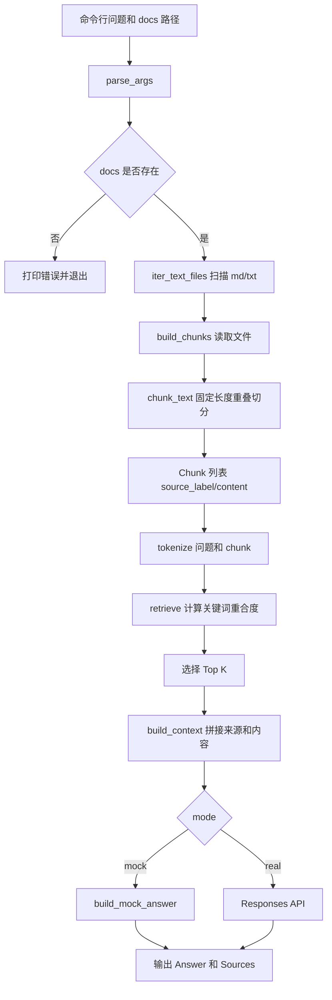
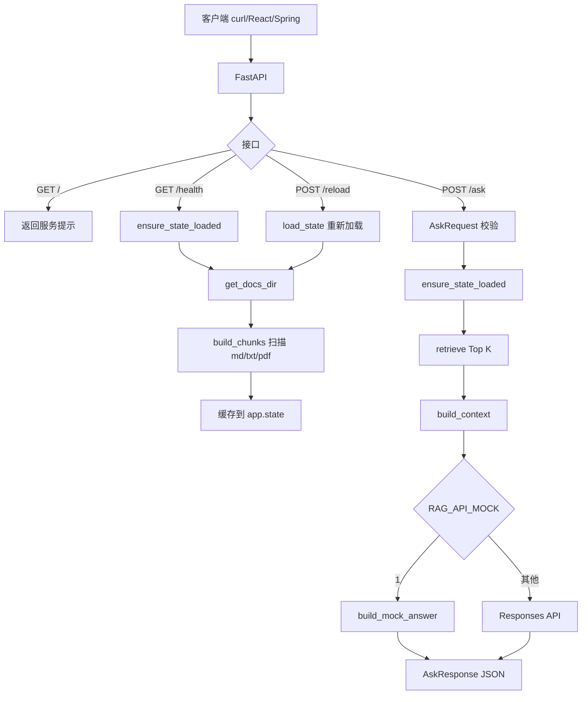
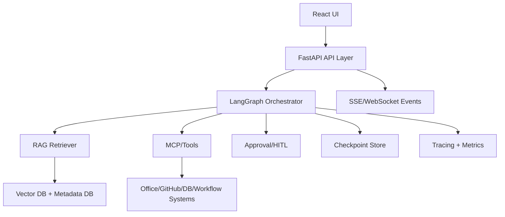
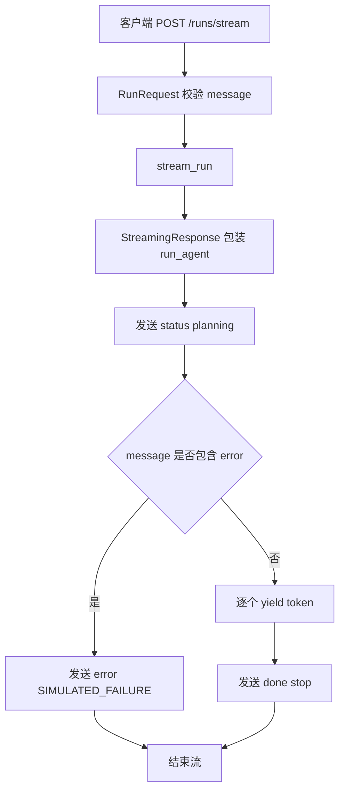
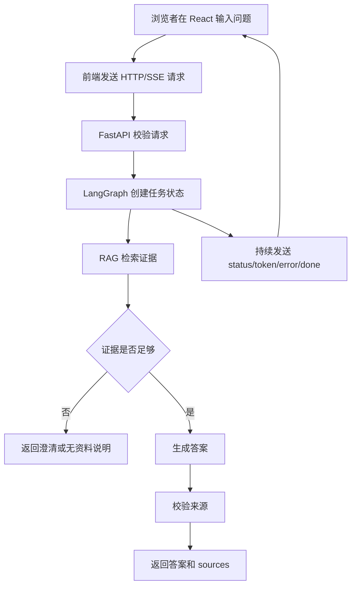

# 2026 企业级 AI Agent 开发学习笔记（完整版）

> 本教材根据当前 `ai-learn/` 目录实际存在的文档和示例整理。不存在的项目只放在“后续规划”，不写成已完成内容。

## 使用说明

这本文档不是目录清单，而是一套从 Python 基础、RAG、LangChain、LangGraph、MCP 到企业级完整项目的系统化学习教材。配套目录按三条学习线组织：

```text
llm-lab -> agent-lab -> agent-advanced
```

原 `ai-learn/README.md` 中已经说明：所有会调用 LLM 的 Python 示例共用 `llm_runtime.py`，默认回退顺序为 OpenRouter、NVIDIA NIM、本地 Ollama，最后才进入 Mock。真实密钥只能放在 WSL 环境变量或被 Git 忽略的 `.env` 中，不能写入代码、README 或 `.env.example`。本教材保留这个原则，并把它扩展成贯穿所有示例的工程规范。

学习时建议始终按下面方法处理每个示例：

1. 先读对应 README，确认输入、输出、边界。
2. 用 Mock 或本地模式跑通默认命令。
3. 阅读 `main.py`，找出输入层、处理层、模型层、输出层。
4. 改一个参数，观察输出变化。
5. 记录“教学版能力、企业版差距、下一步升级点”。

## 当前实际存在的示例地图

| 目录 | 主题 | 本教材中的位置 |
| --- | --- | --- |
| `llm-lab/examples` | Python、文件读写、Pydantic、文本切分、模型调用 | 第 1 卷 |
| `llm-lab/examples/runnable_composition_demo` | LCEL Runnable 组合 | 第 3 卷 |
| `agent-lab/projects/chat_cli` | 最小聊天 CLI | 第 1 卷 |
| `agent-lab/projects/structured_output_demo` | Pydantic 结构化输出 | 第 1 卷、第 3 卷 |
| `agent-lab/projects/doc_qa_agent` | 本地文档问答、Chunk、Top K、Prompt | 第 2 卷重点 |
| `agent-lab/projects/rag_api_demo` | FastAPI RAG 服务、`/ask`、`/health`、`/reload`、缓存 | 第 1 卷、第 2 卷、第 6 卷重点 |
| `agent-lab/projects/streaming_agent_api_demo` | SSE、`StreamingResponse`、`yield`、事件流 | 第 1 卷、第 6 卷重点 |
| `agent-lab/projects/tool_agent_demo` | Tool Calling、只读文件工具、安全边界 | 第 5 卷 |
| `agent-lab/projects/workflow_agent` | 固定三阶段工作流 | 第 4 卷 |
| `agent-advanced/projects/langchain_chain_demo` | LangChain 链式编排 | 第 3 卷 |
| `agent-advanced/projects/vector_db_demo` | 内存向量库概念版 | 第 2 卷 |
| `agent-advanced/projects/vector_db_qdrant_demo` | Qdrant 接入骨架 | 第 2 卷 |
| `agent-advanced/projects/vector_db_chroma_demo` | Chroma 接入骨架 | 第 2 卷 |
| `agent-advanced/projects/advanced_rag_pipeline_demo` | 查询改写、召回、重排、引用 | 第 2 卷 |
| `agent-advanced/projects/internal_hybrid_rag_demo` | 社内文件 + Wiki、ACL、混合检索 | 第 2 卷、第 6 卷 |
| `agent-advanced/rag/advanced-patterns` | Parent、Compression、HyDE、Corrective RAG | 第 2 卷 |
| `agent-advanced/projects/langgraph_workflow_demo` | LangGraph 状态图 | 第 4 卷 |
| `agent-advanced/langgraph-enterprise` | Checkpoint、Memory、HITL、Subgraph、Streaming | 第 4 卷 |
| `agent-advanced/multi-agent/graph_team_demo` | Supervisor/Handoff/预算/终止条件 | 第 4 卷、第 5 卷 |
| `agent-advanced/deep-research/deep_research_demo` | 计划、检索、去重、引用、写作、审校闭环 | 第 4 卷 |
| `agent-advanced/mcp` | MCP Server、Client、Remote、Multi Router | 第 5 卷 |
| `agent-advanced/business-agents/*` | SES、面试、Office、客服、Coding/GitHub | 第 5 卷、第 6 卷 |
| `agent-advanced/projects/japan_retail_analysis_agent` | React + FastAPI + SSE/WebSocket + SQLite checkpoint + 业务工作流 | 第 6 卷 |
| `agent-advanced/frontend/chat_ui_demo` | React 聊天 UI | 第 6 卷 |
| `agent-advanced/eval/rag_eval_demo` | RAG 离线评估 | 第 2 卷、第 6 卷 |
| `agent-advanced/observability/tracing_demo` | JSONL tracing、耗时、失败记录 | 第 6 卷 |
| `agent-advanced/deployment/container_demo` | 最小容器化服务示例 | 第 6 卷 |

## 第 1 卷：Python + FastAPI 基础（约 100 页）

### 第 1 章 Python 工程基础

#### 本章学习目标

掌握 AI 应用开发里最常用的 Python 基础：命令行参数、文件读写、数据类、Pydantic 校验、异常处理、环境变量和模块导入。

#### 为什么要学习

企业级 Agent 项目首先是普通软件工程项目。模型调用只是其中一层；如果文件路径、输入校验、错误处理和配置管理做不好，后面的 RAG、Tool Calling、LangGraph 都会变得不可控。

#### 核心概念解释

- `argparse`：把命令行输入变成程序参数。
- `dataclass`：定义轻量数据对象，例如 RAG 的 `Chunk`。
- `Pydantic`：定义请求、响应和结构化输出合同。
- 环境变量：保存 Key、模型名、服务地址、文档路径等外部配置。
- Mock 模式：在没有真实模型或外部服务时保证示例可运行。

#### 示例项目对应关系

- `llm-lab/examples/basics.py`
- `llm-lab/examples/dataclass_example.py`
- `llm-lab/examples/pydantic_example.py`
- `llm-lab/examples/file_io_example.py`
- `llm-lab/examples/model_call_example.py`
- `agent-lab/projects/chat_cli`
- `agent-lab/projects/structured_output_demo`

#### 企业级项目中如何使用

企业项目通常会把配置放到 `.env`、Kubernetes Secret 或云平台 Secret Manager 中；把 Pydantic 模型作为 API 合同；把输入校验、错误码、日志字段统一。学习示例里 `llm_runtime.py` 的 provider fallback 思路，在企业版里会扩展成模型网关、超时、重试、审计和成本统计。

#### 常见误区

- 把 API Key 写进代码或 README。
- 没有 Mock 模式，导致新人和 CI 无法离线运行。
- 把模型输出当成可靠 JSON，不做 schema 校验。
- 所有逻辑写在一个 `main()` 中，无法测试。

#### 练习任务

1. 给 `model_call_example.py` 增加 `--timeout` 参数。
2. 用 Pydantic 定义一个 `TaskSummary`，包含 `title`、`priority`、`risks`。
3. 给任意 CLI 示例增加清晰的错误提示：参数为空、路径不存在、Key 未配置。

### 第 2 章 FastAPI 服务基础

#### 本章学习目标

理解 FastAPI 如何把 Python 函数变成 HTTP API，掌握路由、请求模型、响应模型、健康检查、CORS 和服务启动方式。

#### 为什么要学习

企业内部人员不会直接运行 Python 脚本来使用 Agent。真实系统需要 React 页面、Java 后端、自动化任务或其他服务通过 HTTP 调用后端能力。

#### 核心概念解释

- `FastAPI()`：创建 ASGI 应用对象。
- `@app.get` / `@app.post`：注册接口。
- `BaseModel`：定义 JSON 请求和响应结构。
- `uvicorn main:app`：导入 `main.py` 并运行其中的 `app` 对象。
- `app.state`：保存服务运行期间共享状态，例如文档 chunk 缓存。
- `HTTPException`：把业务异常转换成 HTTP 错误响应。

#### 示例项目对应关系

- `agent-lab/projects/rag_api_demo`
- `agent-lab/projects/streaming_agent_api_demo`
- `agent-advanced/projects/japan_retail_analysis_agent`
- `agent-advanced/deployment/container_demo`

#### 企业级项目中如何使用

企业版 API 需要鉴权、限流、超时、请求 ID、结构化日志、OpenAPI 文档、健康检查、灰度发布和可观测性。`rag_api_demo` 的 `/health`、`/ask`、`/reload` 是最小形态，后续可拆成 router、service、repository、model gateway。

#### 常见误区

- 以为 Python Web 项目一定要有 `main()` 函数。
- 启动时立即加载大索引，导致服务启动慢或失败。
- API 返回字段不固定，前端无法稳定解析。
- 忘记 CORS，导致本地 React 页面无法访问。

#### 练习任务

1. 给 `rag_api_demo` 增加 `GET /config`，返回 `CHUNK_SIZE`、`CHUNK_OVERLAP`、`TOP_K`。
2. 给 `/ask` 增加请求字段 `top_k`，并限制范围为 1 到 10。
3. 给 `/health` 增加 `mode` 字段，显示当前是 mock 还是 real。

### 第 3 章 流式 API 与用户体验

#### 本章学习目标

掌握 SSE 的基本格式，理解 `StreamingResponse`、异步生成器、`yield`、`status/token/error/done` 事件的作用。

#### 为什么要学习

Agent 往往需要检索、调用工具、生成长文本。如果 API 一直等待最终结果，使用者会以为系统卡住。流式输出可以持续反馈进度和内容。

#### 核心概念解释

- SSE：Server-Sent Events，服务端向客户端持续发送事件文本。
- `StreamingResponse`：FastAPI 中用于返回流式内容的响应类型。
- `yield`：每产生一个事件就发送给客户端。
- `status`：告诉前端当前阶段，例如 planning、retrieving、generating。
- `token`：返回局部文本。
- `error`：结构化错误事件。
- `done`：正常结束事件。

#### 示例项目对应关系

- `agent-lab/projects/streaming_agent_api_demo`
- `agent-advanced/langgraph-enterprise`
- `agent-advanced/projects/japan_retail_analysis_agent`

#### 企业级项目中如何使用

企业版流式接口需要处理断线重连、心跳、代理缓冲、任务取消、鉴权、限流和日志追踪。`streaming_agent_api_demo` 已经演示了禁用 Nginx 代理缓冲的响应头：`X-Accel-Buffering: no`。

#### 常见误区

- 只流式输出 token，不输出阶段状态。
- 错误后继续发送 `done`，导致前端状态混乱。
- 忘记 `curl -N`，本地测试看不到实时输出。
- 没有心跳，长任务容易被代理或浏览器断开。

#### 练习任务

1. 给 `streaming_agent_api_demo` 增加 `heartbeat` 事件。
2. 把 `status` 扩展为 `planning -> retrieving -> generating`。
3. 在前端用 `EventSource` 或 fetch stream 显示事件流。

## 第 2 卷：RAG（Chunk、Embedding、Retriever、Vector DB）（约 150 页）

### 第 4 章 RAG 总体模型

#### 本章学习目标

理解 RAG 的完整链路：Loader、Chunk、Embedding、Retriever、Top K、Context、Prompt、LLM、Citation、Evaluation。

#### 为什么要学习

企业内部知识更新快，通用模型不知道企业制度、项目文档、故障手册和权限信息。RAG 的价值是先找到依据，再让模型组织答案。

#### 核心概念解释

- Loader：读取文件、Wiki、数据库、API。
- Chunk：把长文档切成可检索片段。
- Embedding：把文本转换成向量。
- Retriever：根据问题召回候选片段。
- Top K：保留最相关的 K 个片段。
- Context：给模型的证据上下文。
- Citation：输出来源，便于使用者验证。
- Evaluation：评估召回、引用、答案准确性。

#### 示例项目对应关系

- `llm-lab/examples/text_split_example.py`
- `agent-lab/projects/doc_qa_agent`
- `agent-lab/projects/rag_api_demo`
- `agent-advanced/projects/vector_db_demo`
- `agent-advanced/projects/advanced_rag_pipeline_demo`
- `agent-advanced/projects/internal_hybrid_rag_demo`
- `agent-advanced/eval/rag_eval_demo`

#### 企业级项目中如何使用

企业 RAG 常见架构是：资料接入服务负责增量同步，索引服务负责 chunk 与 embedding，向量库负责检索，reranker 负责重排，生成服务负责 prompt 和答案，评估服务持续监控质量。权限过滤必须发生在检索前或检索中，不能只在最终答案阶段处理。

#### 常见误区

- 把整份文档直接塞给模型。
- 只看最终回答，不看召回证据。
- Top K 越大越好。实际上过多上下文会引入噪声。
- 没有来源，答案无法验证。

#### 练习任务

1. 用 `text_split_example.py` 调整 chunk size，观察切分结果。
2. 给 `doc_qa_agent` 输出每个命中 chunk 的前 120 字摘要。
3. 为 `rag_eval_demo` 增加一个“引用覆盖率”指标。

### 第 5 章 重点示例：doc_qa_agent

#### 本章学习目标

通过 `doc_qa_agent` 学会本地文档读取、Chunk 切分、关键词检索、Top K 选择、Prompt 构建和来源输出。

#### 为什么要学习

这是 RAG 最小闭环。只有看懂这个例子，后续升级 Embedding、向量库、LangChain Retriever、LangGraph 工作流才有基础。

#### 核心概念解释

`doc_qa_agent/main.py` 支持 `.md`、`.txt` 文件，默认 `CHUNK_SIZE = 1200`、`CHUNK_OVERLAP = 200`、`TOP_K = 4`。它先扫描 `--docs` 指定目录，读取 UTF-8 文本，切成 `Chunk(source_label, content, score)`，用关键词重合度检索，再把命中片段拼成 `Retrieved context` 交给模型或 Mock。

#### 示例项目对应关系

核心文件：

- `agent-lab/projects/doc_qa_agent/main.py`
- `agent-lab/projects/doc_qa_agent/README.md`
- `agent-lab/projects/doc_qa_agent/RAG文档路径_TopK_Chunk切分补足学习资料.md`
- `agent-lab/projects/doc_qa_agent/test_docs/*`

#### 整体流程图



#### 源码执行流程

1. `parse_args()` 读取 `question`、`--docs`、`--model`、`--mock`、`--real`。
2. `main()` 把 `--docs` 转成绝对路径，检查是否存在且是目录。
3. `build_chunks()` 调用 `iter_text_files()` 递归查找 `.md` 和 `.txt`。
4. 每个文件用 UTF-8 读取，无法解码的文件跳过。
5. `chunk_text()` 做滑动窗口切分，下一段从 `end - CHUNK_OVERLAP` 开始。
6. 每个片段被包装为 `Chunk`，来源标签形如 `相对路径#chunk1`。
7. `retrieve()` 对问题和片段分别 `tokenize()`，用交集大小作为分数。
8. 按 `score` 降序、`source_label` 升序排序，取前 `TOP_K`。
9. `build_context()` 把命中片段拼成模型上下文。
10. `answer_question()` 在 mock 模式返回教学文本，在 real 模式调用模型。
11. `main()` 打印答案和来源列表。

#### 关键函数解释

- `iter_text_files(base_dir)`：RAG Loader 的最小版，只负责找文件。
- `chunk_text(text)`：RAG Splitter 的最小版，用字符长度和重叠窗口保持上下文连续。
- `build_chunks(base_dir)`：把文件内容转换成可检索数据结构。
- `tokenize(text)`：教学版分词器，支持英文、数字、中文、日文假名。
- `retrieve(question, chunks)`：教学版 Retriever，用关键词重合度实现 Top K。
- `build_context(top_chunks)`：Prompt 构建前的上下文整理。
- `answer_question(...)`：模型调用边界，负责把 question + context 交给 LLM。

#### 教学版与企业版区别

| 维度 | 教学版 | 企业版 |
| --- | --- | --- |
| 文件类型 | `.md`、`.txt` | PDF、Word、Excel、HTML、Wiki、DB、对象存储 |
| 切分策略 | 固定字符长度 | 按标题、段落、表格、语义、token 长度混合切分 |
| 检索方式 | 关键词重合 | BM25 + 向量召回 + rerank |
| 索引存储 | 每次运行内存构建 | 持久化向量库和元数据数据库 |
| 权限控制 | 无 | 用户、组织、角色、文档级 ACL |
| 观测性 | stdout | trace、召回日志、来源命中率、成本统计 |

#### 如何升级到 LangChain / LangGraph

升级到 LangChain 时，可以把 `iter_text_files()` 替换为 document loader，把 `chunk_text()` 替换为 text splitter，把 `retrieve()` 替换为 vectorstore retriever，把 `build_context()` 替换为 prompt template + document chain。

升级到 LangGraph 时，可以把流程拆成节点：

```text
load_docs -> split -> retrieve -> grade_context -> generate -> cite -> finish
```

如果需要低置信度回退，可以增加条件边：证据不足时进入 `ask_clarification` 或 `handoff`。

#### 企业级项目中如何使用

在企业内部文档问答中，`doc_qa_agent` 对应“离线 PoC”。生产落地时，建议保留它的教学心智：所有回答都必须能追溯到 `source_label`。真正实现时，把文档加载、切分、检索、生成拆成独立服务或模块，并加入权限、缓存、评估和审计。

#### 常见误区

- 以为没有向量库就不能学 RAG。关键词检索足够帮助理解链路。
- 只调大 `TOP_K`，不看 chunk 质量。
- 忽略 chunk overlap，导致答案依据被切断。
- 输出来源只显示文件名，不显示 chunk 编号。

#### 练习任务

1. 给命令行增加 `--top-k` 参数。
2. 支持 `.py` 文件检索，但只允许在显式参数开启时读取。
3. 在 `Sources` 中打印每个 chunk 的前 80 字。
4. 增加“无命中时不调用模型”的分支。

#### 面试可能会问的问题

1. 为什么 RAG 要切 chunk，而不是直接输入整篇文档？
2. `CHUNK_OVERLAP` 的作用是什么？
3. Top K 太大或太小分别有什么问题？
4. 为什么要把来源标签放进 prompt？
5. 关键词检索和向量检索各自适合什么场景？

### 第 6 章 重点示例：rag_api_demo

#### 本章学习目标

理解如何把本地 RAG 脚本服务化，掌握 `/ask`、`/health`、`/reload`、PDF 读取、内存缓存、CORS 和请求/响应 schema。

#### 为什么要学习

企业级 AI Agent 通常不是 CLI，而是服务。React 页面、Java 后端、自动化任务和其他系统都需要通过 API 访问 RAG 能力。

#### 核心概念解释

`rag_api_demo` 把 `doc_qa_agent` 的文档读取、chunk、retrieve、context、answer 变成 FastAPI 服务。它支持 `.md`、`.txt`、`.pdf`，通过 `RAG_API_DOCS_DIR` 指定资料目录，通过 `RAG_API_MOCK=1` 强制 Mock。运行状态保存在 `app.state.client`、`app.state.docs_dir`、`app.state.chunks` 中。

#### 示例项目对应关系

核心文件：

- `agent-lab/projects/rag_api_demo/main.py`
- `agent-lab/projects/rag_api_demo/README.md`
- `agent-lab/projects/rag_api_demo/README_LEARN.md`
- `agent-lab/projects/rag_api_demo/react-client/README.md`
- `agent-lab/projects/rag_api_demo/spring-client/README.md`

#### 整体流程图



#### 源码执行流程

1. `uvicorn main:app` 导入 `main.py`，创建 `FastAPI` 应用。
2. 程序注册 CORS，允许本地 React 常见端口访问。
3. `app.state` 初始化为空状态。
4. 第一次访问 `/health` 或 `/ask` 时，`ensure_state_loaded()` 检查状态是否为空。
5. `load_state()` 读取 `RAG_API_DOCS_DIR`，构建 chunks，并根据模式创建模型客户端。
6. `/health` 返回 `status`、`docs_dir`、`chunk_count`。
7. `/reload` 强制重新执行 `load_state()`，用于文档更新后刷新缓存。
8. `/ask` 用 `AskRequest` 校验输入，检索 Top K，构建 context，调用 `answer_question()`，返回 `AskResponse`。

#### 关键函数解释

- `get_docs_dir()`：从环境变量读取并校验文档目录。
- `read_document_text(file_path)`：根据扩展名读取文本，PDF 使用 `pypdf`。
- `load_state()`：服务缓存构建入口，负责 docs、chunks、client。
- `ensure_state_loaded()`：懒加载控制点。
- `ask(request)`：核心业务接口。
- `reload_docs()`：手动刷新索引。
- `health()`：服务状态检查。

#### 教学版与企业版区别

| 维度 | 教学版 | 企业版 |
| --- | --- | --- |
| 状态缓存 | `app.state` 内存 | Redis、数据库、索引服务、对象存储 |
| 文档刷新 | 手动 `/reload` | 增量同步、队列、定时任务、文件变更监听 |
| API 安全 | 本地学习，无鉴权 | OAuth、JWT、IAM、租户隔离、权限过滤 |
| 检索 | 关键词 Top K | Hybrid Search、向量库、reranker |
| 错误处理 | 500 + detail | 统一错误码、trace_id、告警 |
| 前端 | React/Spring 示例 | 多端接入、权限感知 UI、来源展开 |

#### 如何升级到 LangChain / LangGraph

升级 LangChain：用 loader/splitter/vectorstore/retriever 替代当前本地函数，把 `/ask` 中的检索和生成包装成 chain。

升级 LangGraph：把 `/ask` 处理拆成状态图：

```text
validate_request -> retrieve -> rerank -> generate -> verify_citation -> respond
```

若要支持流式响应，可把最终 `respond` 拆成 SSE 节点，或与第 7 章的流式模板合并。

#### 企业级项目中如何使用

`rag_api_demo` 是企业项目最常见的 PoC 起点。真实落地时通常会保留 `/health`，扩展 `/ask`，把 `/reload` 改成后台索引任务，同时把前端接到 React 或现有门户。服务边界要稳定：请求字段、响应字段、错误格式不能随意变化。

#### 常见误区

- 以为服务启动就已经加载文档；当前代码是懒加载。
- 文档变更后忘记调用 `/reload`。
- 前端只展示答案，不展示 sources。
- 把 `/reload` 暴露给所有使用者。

#### 练习任务

1. 给 `/ask` 增加 `top_k`。
2. 给 `/reload` 增加简单 token 校验。
3. 给 `/health` 增加 `last_reload_at`。
4. 在 `AskResponse` 中增加 `context_preview`，限制最大长度。

#### 面试可能会问的问题

1. `uvicorn main:app` 的 `main:app` 是什么意思？
2. 为什么要有 `/health`？
3. `/reload` 和服务重启有什么区别？
4. 为什么请求和响应要用 Pydantic？
5. 如何避免多个请求同时触发重复加载？

### 第 7 章 Embedding、Retriever 与 Vector DB

#### 本章学习目标

理解从关键词检索升级到向量检索的关键步骤，掌握 collection、payload、metadata、upsert、search/query、top-k 的含义。

#### 为什么要学习

关键词检索只能匹配字面词。企业文档里同一含义可能有多种表达，例如“费用精算”“报销”“経費申請”。Embedding 可以让语义相近的文本更容易被召回。

#### 核心概念解释

- Embedding Model：把文本变成向量。
- Vector DB：保存向量、文本和元数据，支持相似度检索。
- Collection：向量库中的一组数据。
- Payload / Metadata：来源、权限、标题、时间等结构化信息。
- Upsert：插入或更新向量。
- Similarity Search：按向量相似度召回。

#### 示例项目对应关系

- `agent-advanced/projects/vector_db_demo`
- `agent-advanced/projects/vector_db_qdrant_demo`
- `agent-advanced/projects/vector_db_chroma_demo`
- `agent-advanced/projects/internal_hybrid_rag_demo`

#### 企业级项目中如何使用

内存版适合教学；Qdrant 适合独立向量服务；Chroma 适合本地持久化原型。企业版要考虑索引重建、分片、备份、权限元数据、版本号、删除策略和可观测性。

#### 常见误区

- 认为有向量库就一定比关键词好。
- 只保存文本，不保存来源和权限 metadata。
- 不做重排，直接把相似度最高的结果交给模型。
- 索引更新后不记录版本，导致答案不可追溯。

#### 练习任务

1. 跑通 `vector_db_demo`，解释 `collection` 和 `top-k`。
2. 对比 Qdrant 和 Chroma README，整理它们的接入差异。
3. 给向量检索结果增加 `source_type` 字段。

### 第 8 章 高级 RAG：改写、重排、引用、权限、评估

#### 本章学习目标

掌握查询改写、多路召回、rerank、引用生成、ACL 权限过滤、RAG 评估等高级能力。

#### 为什么要学习

企业 RAG 的难点不在“能回答”，而在“能稳定回答、能引用证据、不能越权、质量可评估”。这些能力决定 PoC 能否进入真实环境。

#### 核心概念解释

- Query Rewrite：把原问题扩展成多种检索表达。
- Rerank：对召回候选重新排序。
- Hybrid Search：关键词 + 向量 + 结构化过滤。
- ACL：按角色和权限过滤可见资料。
- Parent Document：小 chunk 检索，大文档片段返回。
- Corrective RAG：证据不足时修正检索或拒答。

#### 示例项目对应关系

- `agent-advanced/projects/advanced_rag_pipeline_demo`
- `agent-advanced/projects/internal_hybrid_rag_demo`
- `agent-advanced/rag/advanced-patterns`
- `agent-advanced/eval/rag_eval_demo`

#### 企业级项目中如何使用

对于企业内部知识库，检索前应先根据使用者角色过滤可访问文档。召回后进行 rerank，再把证据和来源交给生成层。评估集应覆盖热门问题、边界权限、无答案问题、过期文档和多来源冲突。

#### 常见误区

- 权限过滤只在答案阶段做。
- 引用看起来像来源，但实际上没有参与生成。
- 评估只看人工主观感觉，没有固定样本集。
- 无证据时仍然生成流畅答案。

#### 练习任务

1. 在 `advanced_rag_pipeline_demo` 中开启 `--show-stats`，解释每一步结果。
2. 在 `internal_hybrid_rag_demo` 中分别用 `employee`、`manager`、`it_admin` 查询同一问题。
3. 给评估样本增加一个“无答案”问题。

## 第 3 卷：LangChain 1.x（约 150 页）

### 第 9 章 LangChain 1.x 的定位

#### 本章学习目标

理解 LangChain 在企业 Agent 项目中的定位：把 Prompt、Model、Parser、Retriever、Tool、Memory 等组件组织成可组合链路。

#### 为什么要学习

当项目从一个脚本变成多个步骤时，手写函数串联会越来越乱。LangChain 的价值是提供统一的 Runnable 接口和组合方式，让链路更易替换、测试和观测。

#### 核心概念解释

- Prompt Template：把变量填入提示词。
- Model：统一模型调用接口。
- Output Parser：把模型输出转成结构化数据。
- Runnable：可执行组件，支持 `invoke`、`batch`、`stream`。
- LCEL：LangChain Expression Language，用 `|` 组合链路。

#### 示例项目对应关系

- `agent-advanced/projects/langchain_chain_demo`
- `llm-lab/examples/runnable_composition_demo`
- `agent-lab/projects/structured_output_demo`

#### 企业级项目中如何使用

企业项目会把 prompt、retriever、parser、model gateway、tracing 作为可替换组件。LangChain 适合做链式处理和 RAG 组合，但复杂状态流、循环、人审和多角色调度更适合交给 LangGraph。

#### 常见误区

- 把 LangChain 当成必须使用的“魔法框架”。
- 链路太长但没有命名中间步骤，难以调试。
- 不做输出解析，仍然让后续代码读自由文本。
- 把所有业务逻辑塞进 prompt。

#### 练习任务

1. 跑通 `langchain_chain_demo` 的 mock 模式。
2. 把一个普通 Python 预处理函数包装成 `RunnableLambda`。
3. 用 `batch` 同时处理 3 个问题。

### 第 10 章 Runnable 组合模式

#### 本章学习目标

掌握 `RunnablePassthrough.assign`、`RunnableParallel`、`RunnableBranch`、`batch`、`stream`。

#### 为什么要学习

企业系统经常需要先补充字段、并行计算多个结果、再根据条件路由。Runnable 组合能把这些步骤显式表达出来。

#### 核心概念解释

- `RunnablePassthrough.assign`：保留原始输入并追加字段。
- `RunnableParallel`：对同一输入并行计算多个输出。
- `RunnableBranch`：根据条件选择分支。
- `batch`：批量执行。
- `stream`：流式执行。

#### 示例项目对应关系

- `llm-lab/examples/runnable_composition_demo/main.py`

#### 企业级项目中如何使用

可以把“问题分类、检索、权限过滤、答案格式化”做成 Runnable。对于 RAG 问题走检索分支，对于普通咨询走直接回答分支，对于高风险请求走拒绝或审批分支。

#### 常见误区

- 为了使用框架而把简单逻辑复杂化。
- 分支条件不可观测，排查时不知道走了哪条路。
- 批处理没有设置并发和限流。

#### 练习任务

1. 在 runnable 示例中新增 `security` 意图。
2. 给输出增加 `length` 字段并解释用途。
3. 用 `--stream` 观察输出形态。

### 第 11 章 从教学脚本迁移到 LangChain

#### 本章学习目标

学会把 `doc_qa_agent` 和 `rag_api_demo` 中的手写函数逐步替换为 LangChain 组件。

#### 为什么要学习

直接重写项目风险高。更好的方式是保留现有行为，一层一层替换：先替换 splitter，再替换 retriever，再替换 prompt 和 parser。

#### 核心概念解释

- Loader 对应 `iter_text_files()` / `read_document_text()`。
- Splitter 对应 `chunk_text()`。
- Retriever 对应 `retrieve()`。
- Prompt Template 对应 `build_context()` + prompt 字符串。
- Parser 对应响应结构化。

#### 示例项目对应关系

- `agent-lab/projects/doc_qa_agent`
- `agent-lab/projects/rag_api_demo`
- `agent-advanced/projects/langchain_chain_demo`

#### 企业级项目中如何使用

迁移时要先写 smoke test，确保同一个问题仍能返回来源。不要一次性引入向量库、reranker、LangChain 和新前端；每次只改一个边界。

#### 常见误区

- 一次性大改，导致无法判断问题来自哪里。
- 忽略已有 README 中的运行命令和测试观点。
- 迁移后丢失 `sources` 字段。

#### 练习任务

1. 只把 `chunk_text()` 替换成 LangChain splitter。
2. 只把 prompt 字符串替换成 PromptTemplate。
3. 保留原 API 响应字段不变。

## 第 4 卷：LangGraph（约 200 页）

### 第 12 章 LangGraph 状态图基础

#### 本章学习目标

理解 State、Node、Edge、Conditional Edge、START、END、循环和递归限制。

#### 为什么要学习

企业 Agent 不是一次模型调用，而是多步骤、有分支、有状态、有失败恢复的流程。LangGraph 用图表达这些流程，比隐式 prompt 更可控。

#### 核心概念解释

- State：图中共享的状态对象。
- Node：读取状态并返回状态更新的函数。
- Edge：节点之间的执行顺序。
- Conditional Edge：根据状态决定下一步。
- Recursion Limit：防止无限循环。

#### 示例项目对应关系

- `agent-advanced/projects/langgraph_workflow_demo`
- `agent-lab/projects/workflow_agent`
- `agent-advanced/langgraph-enterprise/demos/enterprise_graph.py`

#### 企业级项目中如何使用

把固定业务流程设计成图：需求解析、检索、工具调用、审批、生成报告、审校、落库。每个节点只做一件事，状态字段清晰命名，边界条件显式可测。

#### 常见误区

- 把图画得很复杂，但状态字段没有定义清楚。
- 节点里偷偷做很多副作用，难以恢复。
- 没有终止条件。

#### 练习任务

1. 给基础工作流增加一个 `review` 节点。
2. 增加条件边：低置信度回到检索。
3. 设置较低 recursion limit，观察错误。

### 第 13 章 企业级 LangGraph 能力

#### 本章学习目标

理解 Checkpoint、Memory、Human-in-the-loop、Subgraph、Streaming 在企业流程中的作用。

#### 为什么要学习

真实业务需要暂停、恢复、审批、审计和局部复用。一次性执行完的脚本无法满足这些要求。

#### 核心概念解释

- Checkpoint：保存图状态，支持恢复。
- Memory：长期或会话级上下文。
- HITL：高风险节点暂停等待人工决策。
- Subgraph：把复杂流程拆成可复用子图。
- Streaming：节点执行过程持续输出事件。

#### 示例项目对应关系

- `agent-advanced/langgraph-enterprise`
- `agent-advanced/projects/japan_retail_analysis_agent`
- `agent-advanced/deep-research/deep_research_demo`

#### 企业级项目中如何使用

审批、外部发送、数据库写入、合同生成、报价发送等高风险动作必须设置人工确认。Checkpoint 应持久化到数据库，事件流应返回给前端，审计日志应记录每个节点的输入、输出和决策。

#### 常见误区

- 只有最终结果，没有中间过程。
- 人工审批只是 UI 按钮，后端没有真正阻断。
- Checkpoint 只保存在内存，服务重启就丢失。

#### 练习任务

1. 在已有图中增加一个 `approval_required` 状态字段。
2. 把一个子流程拆成 subgraph。
3. 把图执行过程输出成 SSE 事件。

### 第 14 章 Multi-Agent 与 Deep Research

#### 本章学习目标

理解 Supervisor、Handoff、Planner、Researcher、Writer、Reviewer、预算和终止条件。

#### 为什么要学习

多 Agent 的核心不是“多个模型聊天”，而是把职责拆开，并由可控调度器管理状态、成本和结束条件。

#### 核心概念解释

- Supervisor：根据状态决定下一个角色。
- Worker Agent：执行单一职责的节点。
- Handoff：从一个角色转交给另一个角色。
- Budget：限制步骤数、token、成本或时间。
- Review Loop：写作后审校，不通过则返工。

#### 示例项目对应关系

- `agent-advanced/projects/multi_agent_team_demo`
- `agent-advanced/multi-agent/graph_team_demo`
- `agent-advanced/deep-research/deep_research_demo`

#### 企业级项目中如何使用

复杂任务如研究报告、投标材料、故障复盘、代码审查适合拆成多角色流程。但每个角色的工具权限、上下文范围和输出 schema 都要清楚，否则多 Agent 会放大错误。

#### 常见误区

- 没有 Supervisor，多个角色互相调用导致死循环。
- 没有预算，任务不可控。
- Writer 可以访问所有工具，权限过大。
- Reviewer 只看文本流畅度，不检查引用和证据。

#### 练习任务

1. 用低预算运行 `graph_team_demo`，观察提前终止。
2. 给 Researcher 增加两条证据。
3. 给 Reviewer 增加“不含来源则 revise”的规则。

## 第 5 卷：MCP 与 Agent（约 150 页）

### 第 15 章 Tool Calling 基础

#### 本章学习目标

理解模型如何选择工具、本地程序如何执行工具、工具结果如何回填给模型，以及为什么要限制工具能力。

#### 为什么要学习

Agent 的本质是“模型 + 工具 + 状态 + 控制边界”。没有工具，模型只能生成文本；有了工具但没有边界，会带来安全风险。

#### 核心概念解释

- Tool Schema：告诉模型工具名、参数和含义。
- Tool Execution：本地程序真正执行工具。
- Tool Result：把工具结果作为证据回给模型。
- Allowlist：只允许已授权工具。
- Path Sandbox：限制文件访问范围。

#### 示例项目对应关系

- `agent-lab/projects/tool_agent_demo`
- `agent-advanced/business-agents/mcp_office_agent`
- `agent-advanced/business-agents/coding_github_agent`

#### 企业级项目中如何使用

企业 Agent 的工具必须有权限模型、审计、幂等、超时、重试和人工审批。只读工具和写入工具要分开；发送邮件、删除数据、合并 PR、提交订单等副作用动作必须进入审批。

#### 常见误区

- 让模型直接决定执行高风险动作。
- 工具返回自由文本，缺少结构化结果。
- 文件工具没有路径边界。
- 工具错误被吞掉，最终答案仍然装作成功。

#### 练习任务

1. 在 `tool_agent_demo` 中新增只读工具 `get_file_size`。
2. 尝试读取 `../README.md`，确认越界会失败。
3. 给工具调用日志增加时间戳。

### 第 16 章 MCP 协议与生态

#### 本章学习目标

理解 MCP Client、Server、Tools、Resources、Prompts、stdio transport、remote transport 和 Multi-MCP Router。

#### 为什么要学习

企业系统里工具来源很多：Office、GitHub、数据库、内部审批、工单、文件服务器。MCP 的价值是用统一协议暴露工具能力，减少每个 Agent 重复写适配代码。

#### 核心概念解释

- MCP Server：暴露工具、资源或提示词的一端。
- MCP Client：发现并调用 server 能力的一端。
- stdio transport：本地进程通信。
- streamable HTTP：远程服务通信。
- Multi Router：根据任务路由到不同 MCP server。

#### 示例项目对应关系

- `agent-advanced/mcp/server.py`
- `agent-advanced/mcp/client.py`
- `agent-advanced/mcp/multi_router.py`
- `agent-advanced/business-agents/mcp_office_agent`

#### 企业级项目中如何使用

MCP Server 应按领域拆分，例如文档检索、审批、邮件草稿、代码仓库。每个 server 都要有认证、权限、审计、速率限制和错误码。Router 只负责选择工具，不应绕过权限系统。

#### 常见误区

- 把 MCP 当成模型本身。
- 一个 MCP Server 暴露所有能力，权限边界混乱。
- Remote transport 没有鉴权。
- 工具描述不清，模型容易选错工具。

#### 练习任务

1. 运行 `(cd ai-learn/agent-advanced/mcp && python3 client.py "审批")`。
2. 运行 `multi_router.py "PR 合并"`，观察路由结果。
3. 设计一个“费用审批 MCP Server”的工具列表。

### 第 17 章 业务 Agent 安全边界

#### 本章学习目标

理解业务 Agent 为什么要有租户隔离、证据引用、审批、风险分级和人工转接。

#### 为什么要学习

企业内部人员使用 Agent 时，最关心的是正确性、安全性和可追溯性。一个能回答但不能解释、不能审计、不能阻断风险的 Agent 不适合生产。

#### 核心概念解释

- Tenant Isolation：租户隔离。
- Evidence-based Answer：基于证据回答。
- Human Handoff：证据不足时转人工。
- Approval Boundary：高风险动作等待人工批准。
- Risk Gate：安全规则阻断。

#### 示例项目对应关系

- `agent-advanced/business-agents/enterprise_customer_service_agent`
- `agent-advanced/business-agents/japan_ses_sales_agent`
- `agent-advanced/business-agents/interview_agent`
- `agent-advanced/business-agents/mcp_office_agent`
- `agent-advanced/business-agents/coding_github_agent`

#### 企业级项目中如何使用

业务 Agent 应输出统一 `Result`：状态、消息、数据、是否需要审批。客服类 Agent 必须在证据不足时转人工；代码审查类 Agent 应对密钥等高风险内容直接阻断；Office 类 Agent 可以创建草稿，但不能自动发送。

#### 常见误区

- 把“能生成建议”误解成“可以自动执行”。
- 不区分 proposal、draft、completed、blocked、handoff。
- 没有记录审批原因。
- 用 LLM 判断所有安全规则，而不是本地确定性规则优先。

#### 练习任务

1. 给 `coding_github_agent` 增加一条规则：发现 `eval(` 标记为 medium。
2. 给 `mcp_office_agent` 增加 `delete_document`，但默认拒绝。
3. 给 `enterprise_customer_service_agent` 增加一个新的知识库条目和来源编号。

## 第 6 卷：企业级完整项目（React + FastAPI + LangGraph + RAG）（约 200 页）

### 第 18 章 企业级 Agent 总体架构

#### 本章学习目标

把前五卷的能力组合成完整系统：React 前端、FastAPI 后端、LangGraph 编排、RAG 检索、MCP 工具、评估、Tracing、部署。

#### 为什么要学习

学习单点技术不等于能交付系统。企业级项目需要从使用者入口、API 合同、后端工作流、资料索引、权限、安全、监控、部署和测试一起考虑。

#### 核心概念解释

- Frontend：聊天 UI、任务状态、来源展示、错误展示。
- API Layer：鉴权、请求校验、SSE、OpenAPI。
- Orchestration：LangGraph 管理状态、分支、人审。
- Retrieval：RAG 提供证据。
- Tools：MCP 或本地工具执行外部能力。
- Persistence：任务、checkpoint、日志、评估结果。
- Observability：trace、span、成本、错误。

#### 示例项目对应关系

- `agent-advanced/projects/japan_retail_analysis_agent`
- `agent-advanced/frontend/chat_ui_demo`
- `agent-lab/projects/rag_api_demo/react-client`
- `agent-advanced/observability/tracing_demo`
- `agent-advanced/deployment/container_demo`

#### 企业级项目中如何使用

一个典型企业 Agent 可以按下面架构拆分：



#### 常见误区

- 前端只显示最终答案，不显示阶段和来源。
- 后端把所有逻辑写在一个 route 里。
- LangGraph 状态没有持久化。
- RAG 没有权限过滤。
- 只做 demo，不做评估和部署说明。

#### 练习任务

1. 画出 `japan_retail_analysis_agent` 的前后端调用图。
2. 给聊天 UI 增加来源列表区域。
3. 把一次任务执行日志写入 JSONL。

### 第 19 章 重点示例：streaming_agent_api_demo

#### 本章学习目标

掌握 Agent 服务化从普通 JSON API 到流式事件 API 的过渡方式。

#### 为什么要学习

RAG 和 Agent 经常需要数秒到数十秒。如果没有流式反馈，使用者只能等待。SSE 让系统可以持续输出“正在规划、正在检索、正在生成、已完成或出错”。

#### 核心概念解释

`streaming_agent_api_demo/main.py` 创建 `FastAPI(title="Streaming Agent API Demo")`，定义请求体 `RunRequest(message)`，用 `event(name, data)` 把事件格式化为 SSE 文本，再由 `run_agent(message)` 异步生成 `status`、`token`、`error`、`done`。`stream_run()` 返回 `StreamingResponse`。

#### 示例项目对应关系

- `agent-lab/projects/streaming_agent_api_demo/main.py`
- `agent-lab/projects/streaming_agent_api_demo/README.md`

#### 整体流程图



#### 源码执行流程

1. 服务启动时创建 FastAPI 应用，并打印本地模拟模式说明。
2. `RunRequest` 限制 `message` 长度为 1 到 1000。
3. 客户端 POST `/runs/stream`。
4. FastAPI 校验 JSON 后进入 `stream_run()`。
5. `stream_run()` 返回 `StreamingResponse(run_agent(...))`。
6. `run_agent()` 先 yield `status`。
7. 如果输入包含 `error`，yield `error` 后 return。
8. 正常路径逐个 yield token。
9. 最后 yield `done`。

#### 关键函数解释

- `event(name, data)`：把结构化事件变成 SSE 文本。
- `run_agent(message)`：异步生成器，是流式输出核心。
- `stream_run(request)`：HTTP route，把生成器交给 `StreamingResponse`。

#### 教学版与企业版区别

| 维度 | 教学版 | 企业版 |
| --- | --- | --- |
| token 来源 | 本地列表 | 模型流、工具事件、图节点事件 |
| 错误处理 | 模拟 error | 统一错误码、可恢复/不可恢复区分 |
| 连接管理 | 简单关闭 | 心跳、断线重连、取消任务 |
| 安全 | 无鉴权 | 用户鉴权、任务归属校验 |
| 代理 | 禁用缓冲头 | Nginx/ALB/CDN 超时与缓冲配置 |

#### 如何升级到 LangChain / LangGraph

LangChain：把 chain 的 `.stream()` 结果转成 `token` 事件。

LangGraph：把每个节点开始、结束、错误、输出转成事件：

```text
graph_node_start -> status
model_stream_chunk -> token
tool_error -> error
graph_finish -> done
```

#### 企业级项目中如何使用

在完整项目里，SSE 用于任务进度和文本生成，WebSocket 可用于双向控制。建议事件字段固定：`event_id`、`task_id`、`stage`、`timestamp`、`payload`。前端应按事件类型更新 UI，不要把所有事件当普通文本拼接。

#### 常见误区

- 错误路径也发送 `done`。
- 使用者取消页面后，后端任务继续跑。
- 没有阶段事件，只有 token。
- 反向代理缓冲导致前端一次性收到所有内容。

#### 练习任务

1. 增加 `event_id`。
2. 增加 `heartbeat`。
3. 把 `/runs/stream` 返回的 token 改成模拟 RAG 的“检索中、生成中”。

#### 面试可能会问的问题

1. SSE 和 WebSocket 的区别是什么？
2. `yield` 在流式响应里起什么作用？
3. 为什么错误后不应该继续发送 `done`？
4. 反向代理缓冲会造成什么问题？
5. 如何设计前端事件处理状态机？

### 第 20 章 重点示例：从 rag_api_demo 到完整应用

#### 本章学习目标

理解如何把 `rag_api_demo` 扩展成 React + FastAPI + LangGraph + RAG 的完整项目骨架。

#### 为什么要学习

企业内部人员最终需要一个可使用的入口，而不只是后端接口。完整应用要让使用者输入问题、看到进度、查看来源、处理错误，并在需要时触发重载或审批。

#### 核心概念解释

从 `rag_api_demo` 出发，完整应用至少包含：

- React 输入框、提交按钮、结果区、来源区。
- FastAPI `/ask` 或 `/runs/stream`。
- RAG 检索服务。
- LangGraph 编排节点。
- 状态持久化和日志。
- 评估与部署说明。

#### 示例项目对应关系

- `agent-lab/projects/rag_api_demo`
- `agent-lab/projects/rag_api_demo/react-client`
- `agent-advanced/frontend/chat_ui_demo`
- `agent-advanced/projects/japan_retail_analysis_agent`

#### 整体流程图



#### 源码执行流程

当前已存在的 `rag_api_demo` 后端流程是 `/ask -> ensure_state_loaded -> retrieve -> build_context -> answer_question -> AskResponse`。要升级成完整应用，可保留 `/ask` 作为同步接口，再新增 `/runs/stream` 作为流式接口。LangGraph 负责任务状态；RAG 节点复用当前 `retrieve()` 逻辑，后续替换为向量库。

#### 关键函数解释

- `ask()`：同步问答入口。
- `stream_run()`：流式任务入口，可从 `streaming_agent_api_demo` 迁移。
- `retrieve()`：检索节点。
- `build_context()`：上下文节点。
- `answer_question()`：生成节点。
- `load_state()`：索引缓存加载节点。

#### 教学版与企业版区别

教学版可以把所有逻辑放在一个 `main.py`。企业版应拆分：

```text
api/
  routers/
  schemas.py
application/
  task_service.py
retrieval/
  loaders.py
  index.py
  retriever.py
orchestration/
  graph.py
infrastructure/
  model_gateway.py
  tracing.py
frontend/
```

#### 如何升级到 LangChain / LangGraph

先用 LangChain 替换检索链路，再用 LangGraph 编排流程。不要同时改前端、后端、检索和编排。推荐顺序：

1. 保留 `/ask` 响应字段。
2. 替换 splitter/retriever。
3. 引入 graph，但保持单一路径。
4. 增加条件边和人审。
5. 增加流式事件。

#### 企业级项目中如何使用

企业应用中，React 前端要展示来源、错误和任务状态；FastAPI 要负责鉴权和 API 合同；LangGraph 要负责状态和审批；RAG 要负责证据；Tracing 要负责排查；部署要有容器和环境变量说明。

#### 常见误区

- 先做漂亮 UI，后端没有稳定 API。
- 后端返回自由文本，前端无法展示来源。
- LangGraph 引入太早，基础 RAG 还没测通。
- 没有 Mock，联调依赖真实模型和外部服务。

#### 练习任务

1. 给 React 客户端增加 sources 展示。
2. 用 SSE 替换同步等待体验。
3. 在后端记录每次问题、命中 sources 和耗时。

#### 面试可能会问的问题

1. 一个企业级 RAG Agent 应该有哪些模块？
2. 同步 `/ask` 和流式 `/runs/stream` 如何取舍？
3. 前端为什么必须展示来源？
4. 如何设计 RAG 的缓存与重载？
5. 如何把 PoC 拆成可维护的服务层？

### 第 21 章 评估、观测与部署

#### 本章学习目标

掌握 RAG/Agent 评估、JSONL tracing、失败记录、成本统计、部署和交付检查。

#### 为什么要学习

企业级系统上线后，问题一定会发生。没有评估和观测，就无法判断是检索失败、模型失败、工具失败、权限失败还是前端展示失败。

#### 核心概念解释

- Evaluation Dataset：固定测试问题和期望来源。
- Trace：一次请求的完整链路 ID。
- Span：链路中的一个步骤，例如 retrieve、rerank、generate。
- Metrics：延迟、错误率、召回数、成本。
- Deployment：容器、环境变量、健康检查、日志。

#### 示例项目对应关系

- `agent-advanced/eval/rag_eval_demo`
- `agent-advanced/observability/tracing_demo`
- `agent-advanced/deployment/container_demo`
- `agent-advanced/交付前检查清单.md`
- `agent-advanced/开发测试部署流程.md`

#### 企业级项目中如何使用

每个 `/ask` 请求应生成 `trace_id`。检索阶段记录命中文档、分数和权限过滤结果；生成阶段记录模型、耗时、token 和错误；前端展示阶段记录任务状态。部署时用环境变量配置模型、索引路径、服务地址和安全参数。

#### 常见误区

- 只在报错时记录日志，不记录成功路径。
- 评估集只包含容易问题。
- 没有成本统计，无法控制预算。
- 容器里缺少健康检查。

#### 练习任务

1. 运行 `tracing_demo`，打开 JSONL 查看 span。
2. 给 `rag_api_demo` 的 `/ask` 增加耗时统计。
3. 给评估样本增加权限边界问题。

### 第 22 章 后续规划

#### 本章学习目标

明确哪些内容当前目录尚未完整实现，避免把规划误认为已完成项目。

#### 为什么要学习

学习路线需要区分“已经可运行”“已有骨架”“后续可扩展”。这样做作品集、写简历和面试讲解时更诚实，也更专业。

#### 核心概念解释

当前已存在 Qdrant、Chroma、LangGraph、MCP、React、FastAPI、Tracing、业务 Agent 等示例。以下内容可作为后续规划，不应描述成当前已完成的生产系统：

- PGVector 完整接入。
- Elasticsearch/OpenSearch 混合检索生产版。
- 统一认证授权中心。
- 完整 CI/CD。
- 多租户生产级权限系统。
- 大规模文档增量索引平台。
- 真实 Office/GitHub/CRM 写操作闭环。
- 分布式任务队列和后台索引服务。

#### 示例项目对应关系

这些规划可以基于现有项目继续扩展：

- 从 `rag_api_demo` 扩展生产 RAG API。
- 从 `internal_hybrid_rag_demo` 扩展权限检索。
- 从 `mcp_office_agent` 扩展真实 MCP Office Connector。
- 从 `japan_retail_analysis_agent` 扩展完整业务作品集。

#### 企业级项目中如何使用

后续规划应以小步交付为单位：先保证现有 API 和评估稳定，再引入真实向量库；先实现只读工具，再实现草稿类工具；先做人工审批，再做自动执行。

#### 常见误区

- 把“计划接入”写成“已经接入”。
- 为了显得完整而忽略当前代码实际能力。
- 没有验收标准。

#### 练习任务

1. 选择一个后续规划，写出最小验收标准。
2. 给它设计目录结构，但不要先写复杂代码。
3. 明确哪些接口必须保持兼容。

## 附录 A：推荐学习顺序

1. `llm-lab/examples`
2. `chat_cli`
3. `structured_output_demo`
4. `doc_qa_agent`
5. `rag_api_demo`
6. `streaming_agent_api_demo`
7. `tool_agent_demo`
8. `workflow_agent`
9. `langchain_chain_demo`
10. `vector_db_demo`
11. `advanced_rag_pipeline_demo`
12. `internal_hybrid_rag_demo`
13. `langgraph_workflow_demo`
14. `langgraph-enterprise`
15. `mcp`
16. `multi-agent/graph_team_demo`
17. `japan_retail_analysis_agent`

## 附录 B：Markdown 预览建议

在 VS Code 中打开本文件后，可以使用：

- 快捷键 `Ctrl+Shift+V`：打开当前 Markdown 预览。
- 快捷键 `Ctrl+K V`：在侧边打开预览。
- 命令面板 `Markdown: Open Preview to the Side`。

Mermaid 图在 VS Code 预览中通常可以渲染；如果本地扩展不支持，可安装 Markdown Preview Mermaid Support。
