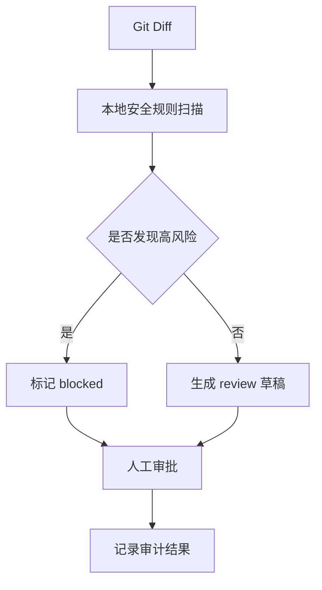

# Coding / GitHub Agent

需求：读取 diff 后做安全审查并生成 review 提案；不自动修改仓库、不 push、不 merge。高危密钥问题阻断后续动作。

```bash
python3 main.py "+ password = 'demo'"
python3 main.py "+ value = parse(data)"
```

验收：疑似密钥返回 `blocked/high`；普通 diff 返回 `proposal`；两者都要求审批。简历表述：实现 diff 风险检测、分级门禁和人工审批式 GitHub 工作流。

## 业务场景（完整说明）

- **使用者**：开发人员、代码审查者和安全负责人。
- **要解决的问题**：在 PR 合并前发现硬编码密钥、吞异常等高风险改动，并把自动检测结果交给人工审批。
- **输入与输出**：输入 Git diff；输出风险等级、问题列表、阻断状态和审计记录。
- **生产环境差距**：需要接入 GitHub App、增量 diff、规则配置、误报反馈和受保护分支权限。

## 整体流程图


