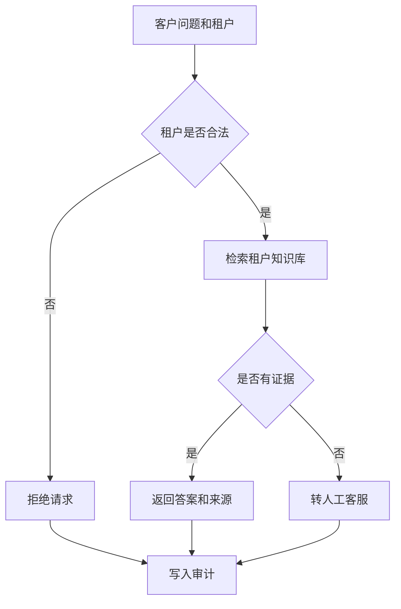

# 企业客服 Agent

需求：租户校验后仅按知识库证据回答并返回来源；证据不足必须转人工，不能编造。

```bash
python3 main.py "退款需要几天" --tenant acme
python3 main.py "我要修改合同" --tenant acme
python3 main.py "退款" --tenant unknown
```

验收：已知问题返回 `source`；未知问题为 `handoff`；非法租户为 `rejected`。简历表述：实现租户隔离、知识引用和低置信人工转接。

## 业务场景（完整说明）

- **使用者**：企业客户、客服人员和知识库运营人员。
- **要解决的问题**：在租户隔离前提下回答常见问题；证据不足时不猜测，转交人工客服。
- **输入与输出**：输入租户和问题；输出知识答案及来源，或拒绝、人工转接状态。
- **生产环境差距**：需要真实租户鉴权、向量检索、敏感信息脱敏、会话历史和工单系统集成。

## 整体流程图


