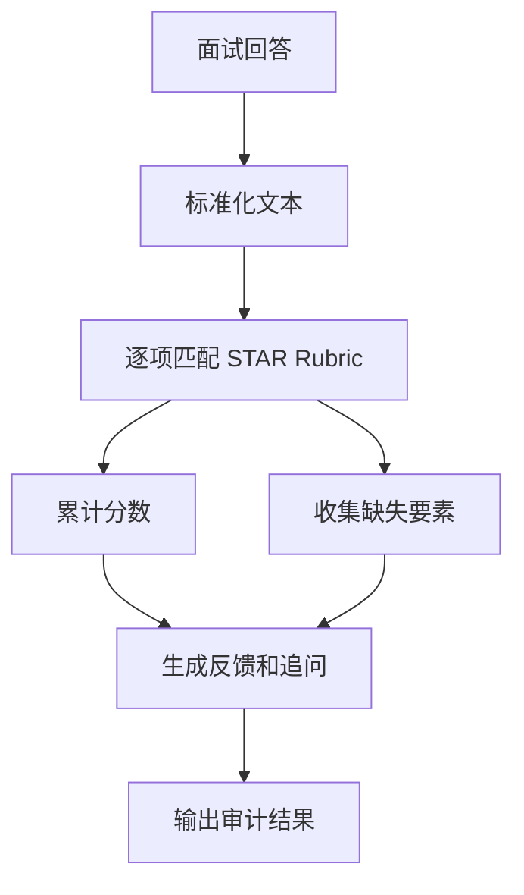

# 面试 Agent

需求：对 STAR 回答做确定性 rubric 评分，指出缺项并生成下一轮追问；不把主观语言风格当成事实能力结论。

```bash
python3 main.py "situation task action result metric reflection"
```

验收：满要素为 10 分；缺失项出现在 `missing`；结果包含审计记录。简历表述：实现结构化面试训练、rubric 评分与可解释反馈。

## 业务场景（完整说明）

- **使用者**：求职者、面试教练和企业培训人员。
- **要解决的问题**：检查 STAR 回答是否包含情境、任务、行动、结果、指标和复盘。
- **输入与输出**：输入一段面试回答；输出评分、缺失要素和下一步追问。
- **生产环境差距**：需要多语言语义判断、岗位化评分表、历史训练记录和人工教练复核。

## 整体流程图


