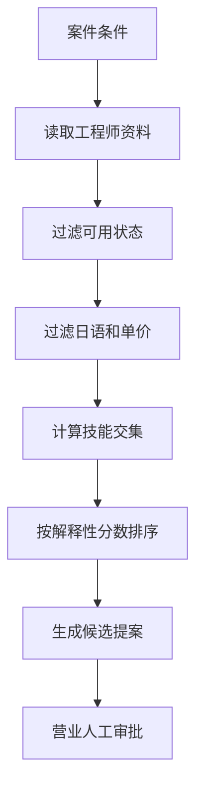

# 日本 SES 营业 Agent

需求：按技能、日本语等级、单价上限和稼动状态筛选工程师，形成可解释的候选提案。设计：硬条件先过滤，技能交集与日语等级再评分；结果必须人工批准，不能自动发送履历。

```bash
python3 main.py --skills python,rag --japanese 2 --max-rate 85
```

验收：只返回 `available` 且满足日语/单价条件的人员；每个结果带匹配技能与分数；状态为 `proposal`。简历表述：实现 SES 案件—人材匹配、解释性评分与人工审批边界。

## 业务场景（完整说明）

- **使用者**：日本 SES 营业、人员协调员和项目负责人。
- **要解决的问题**：根据案件技能、日语等级、预算和人员可用状态筛选候选工程师。
- **输入与输出**：输入技能、最低日语等级和最高单价；输出排序候选人、命中技能和解释性分数。
- **生产环境差距**：需要连接 CRM/人才库、处理技能同义词、档期冲突、个人信息权限和营业人工确认。

## 整体流程图


