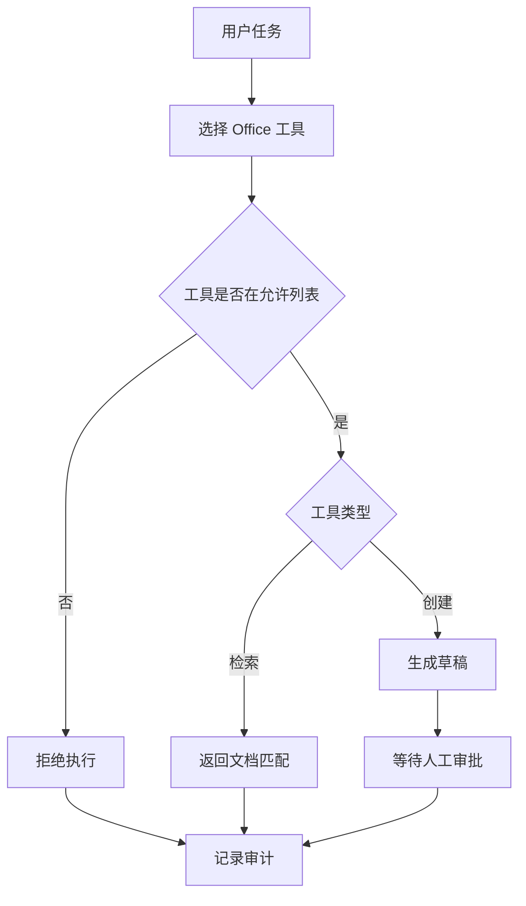

# MCP Office Agent

需求：Office 场景只能使用 allowlist 中的“检索文档”和“创建草稿”；发送、删除和覆盖等动作默认拒绝。项目内的本地 adapter 用于离线验收，真实 MCP transport 见 `../../mcp/`。

```bash
python3 main.py search_documents "费用"
python3 main.py create_draft "会议纪要"
```

验收：查询直接完成；创建内容只返回 `draft` 且要求审批；allowlist 外工具无法进入执行函数。简历表述：实现 MCP 工具权限、草稿审批和调用审计。

## 业务场景（完整说明）

- **使用者**：行政、销售、项目助理和内部自动化平台。
- **要解决的问题**：允许 Agent 安全检索 Office 资料和创建草稿，同时禁止未授权工具及自动发送。
- **输入与输出**：输入工具名和文本；输出检索结果或待审批草稿。
- **生产环境差距**：需要真实 MCP/Office 连接器、OAuth、用户级权限、幂等键、审批回调和完整审计。

## 整体流程图


