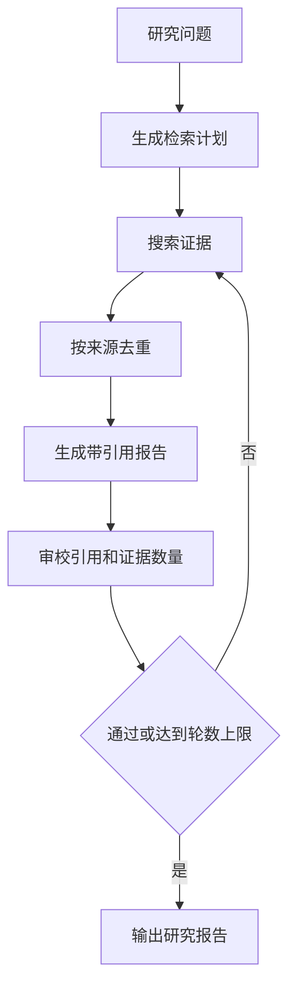

# Deep Research 主线项目

真实 LangGraph 工作流：研究计划 → 多查询检索 → 证据去重 → 带引用写作 → 引用/证据审校 → 必要时再检索。`max_rounds` 和 `recursion_limit` 防止无界研究。

```bash
cd deep_research_demo
python3 main.py "LangGraph MCP Agent 如何保证安全"
```

验收：报告中的每条事实都有 `[Sx]` 引用；来源表与正文一致；至少两条独立证据；达到最大轮次后必须结束。默认语料固定且离线，接真实搜索 API 时还需增加域名 allowlist、抓取时间、原文 URL、发布日期、事实支持度和 token/金额预算。

## 图片式模板解释

输入：进入 `deep_research_demo` 后运行 `python3 main.py "调研企业 RAG 评估方案"`；处理前数据是研究问题、来源集合和轮数预算。

```text
研究问题 -> plan()：拆分子问题
│
▼
search() -> deduplicate()：收集并去重证据
│
▼
write()：生成带引用草稿
│
▼
review() -> route()：检查引用、证据数量和缺口
├── research -> 回到 search()
└── 通过或达到轮数 -> 输出研究报告
```

节点对应：`plan()` 控制研究范围，`search()` 取证，`deduplicate()` 去重，`write()` 合成，`review()` 与 `route()` 决定继续或终止。最小输出是带来源的报告和研究轨迹。

## 业务场景（完整说明）

- **使用者**：研究员、咨询顾问、售前和需要证据报告的业务人员。
- **要解决的问题**：把开放问题拆成检索任务，收集并去重证据，生成带引用报告，再通过审校决定结束或继续研究。
- **输入与输出**：输入研究问题和最大轮数；输出 Markdown 报告、来源列表、审校状态和轮数。
- **生产环境差距**：需要真实搜索与抓取、来源可信度、时效性判断、引用定位、成本预算和内容合规。

## 整体流程图


