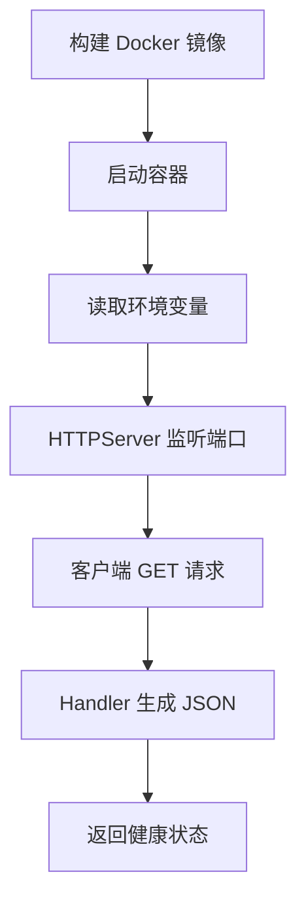

# Container Demo

这个 demo 演示一个最小可容器化的 Python 服务。

## 业务场景说明

- 适用场景：想把 Python 服务放进统一运行环境，避免本地和线上机器差异带来的问题。
- 如果不用这种方式：不同机器上的依赖和配置很容易不一致，出现“我这边能跑，你那边不行”的情况。
- 解决的问题：用 Dockerfile 和 compose 固化环境，让部署、调试和交付更稳定。
- 举例说明：例如先用 Docker Compose 启动最小服务栈，检查容器、端口和依赖是否都正常。

## 你会学到什么

- 如何用 Dockerfile 打包一个简单服务
- 如何用环境变量配置服务行为
- 如何用 docker compose 启动一个最小服务

## 运行方式

本地直接运行：

```bash
python3 app.py
```

## 业务场景（完整说明）

- **使用者**：应用开发者、平台工程师和部署初学者。
- **要解决的问题**：把最小 HTTP 服务打包成可重复启动、可健康检查的容器。
- **输入与输出**：输入环境变量和 GET 请求；输出服务状态 JSON。
- **生产环境差距**：需要非 root 用户、健康探针、资源限制、结构化日志、镜像扫描和滚动发布。

## 整体流程图



容器运行：

```bash
docker build -t agent-advanced-container-demo .
docker run --rm -p 8088:8088 -e APP_NAME="agent-advanced-demo" agent-advanced-container-demo
```

## 目录结构

```text
container_demo/
├── app.py
├── Dockerfile
└── docker-compose.yml
```
