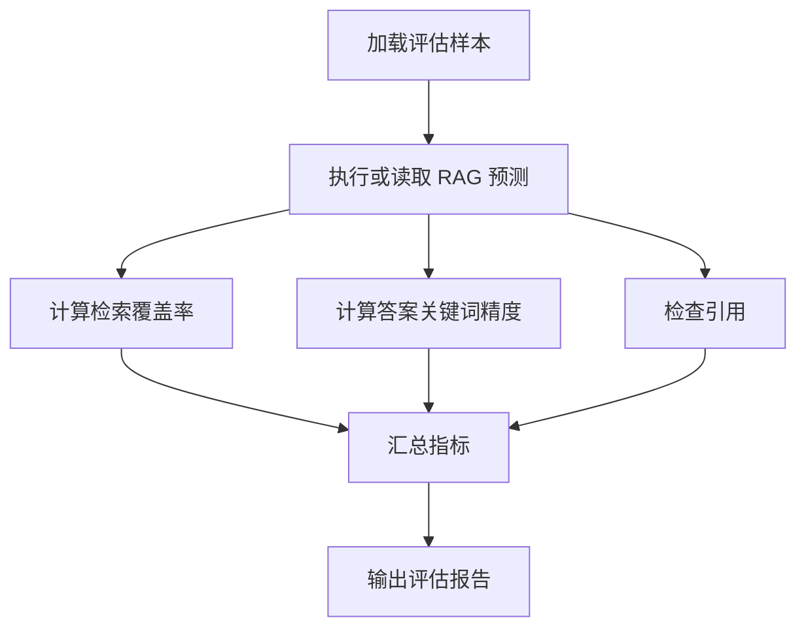

# RAG Eval Demo

这个 demo 用一组本地样本模拟 RAG 评估。

## 业务场景说明

- 适用场景：需要在小样本上验证 RAG 的命中率、引用覆盖率和整体答题质量。
- 如果不用这种方式：很难量化优化前后差异，只能靠主观感觉判断“好像变好了没有”。
- 解决的问题：用样本和简单指标把评估标准固定下来，方便做迭代和回归。
- 举例说明：例如比较两种检索配置在同一份文档集上的命中率，看哪种更适合作为默认方案。

## 你会学到什么

- 怎么把问题、参考答案、检索结果组织成评估样本
- 怎么计算最简单的检索命中率和引用覆盖率
- 怎么输出一份可读的评估报告

## 运行方式

```bash
python3 eval_rag.py
```

## 业务场景（完整说明）

- **使用者**：RAG 开发者、测试人员和模型质量负责人。
- **要解决的问题**：在发布前用固定样本量化检索覆盖率、答案关键词精度和引用完整性。
- **输入与输出**：输入评估样本及预测结果；输出逐样本得分和汇总指标。
- **生产环境差距**：需要真实检索结果、人工标注集、版本对比、统计置信度和持续评估流水线。

## 整体流程图



## 目录结构

```text
rag_eval_demo/
├── eval_rag.py
└── samples.json
```
