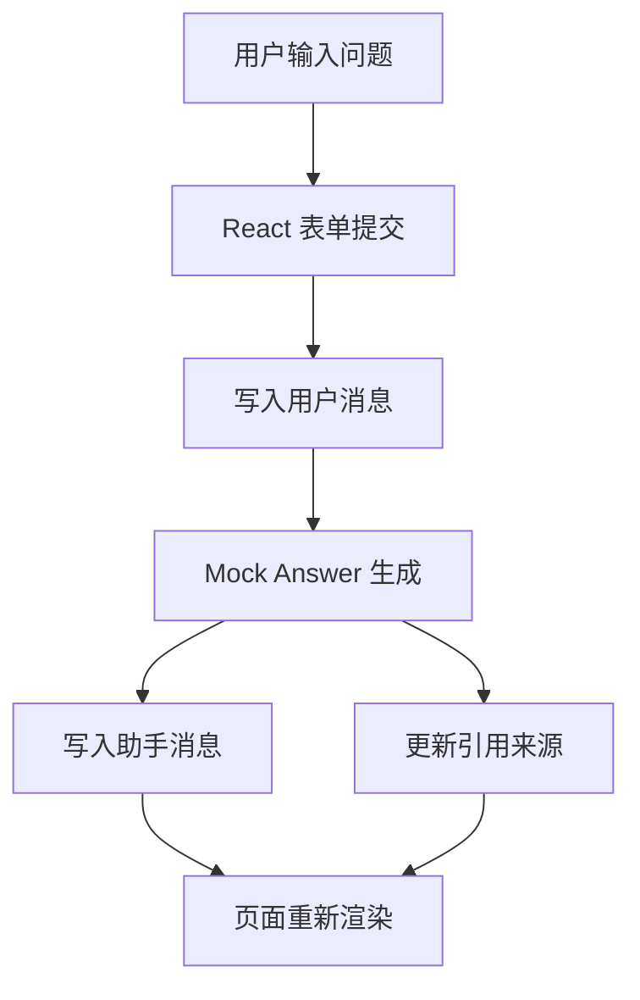

# React Chat UI Demo

这个 demo 是一个最小的 Agent / RAG 前端壳子，重点不是对接真实后端，而是先把页面结构搭起来。

## 业务场景说明

- 适用场景：需要一个最小聊天界面来验证消息流、对话历史和来源展示的产品形态。
- 如果不用这种方式：只有后端接口的话，很难直观看到交互体验，也缺少前端骨架给后续联调。
- 解决的问题：先把页面结构和状态展示跑通，再把真实后端替换进去会更稳。
- 举例说明：例如先让前端能发出一条消息，再逐步接入流式输出和历史消息展示。

## 你会学到什么

- 聊天输入框怎么组织
- 消息列表怎么渲染
- 引用来源怎么展示
- 如何把“用户消息 / 系统回复 / sources”分层显示

## 运行方式

```bash
npm install
npm run dev
```

默认会在 `http://localhost:5173` 打开。

## 目录结构

```text
chat_ui_demo/
├── index.html
├── package.json
├── tsconfig.json
├── vite.config.ts
└── src/
    ├── App.tsx
    ├── main.tsx
    └── styles.css
```

## 设计说明

- 这里使用假数据，先把 UI 和交互跑通
- 后面接真实 API 时，只需要把 `sendMessage()` 替换成后端请求即可
- 这个 demo 适合和 `agent-advanced/projects/internal_hybrid_rag_demo` 配合学习

## 业务场景（完整说明）

- **使用者**：内部知识问答用户、前端开发者和 Agent 产品经理。
- **要解决的问题**：先验证聊天消息、引用来源和回答布局，再接入真实 RAG 后端。
- **输入与输出**：输入浏览器中的问题；输出 Mock 回答、来源列表和最新回答视图。
- **生产环境差距**：需要真实 API、登录鉴权、流式响应、错误重试、反馈按钮和会话持久化。

## 整体流程图


