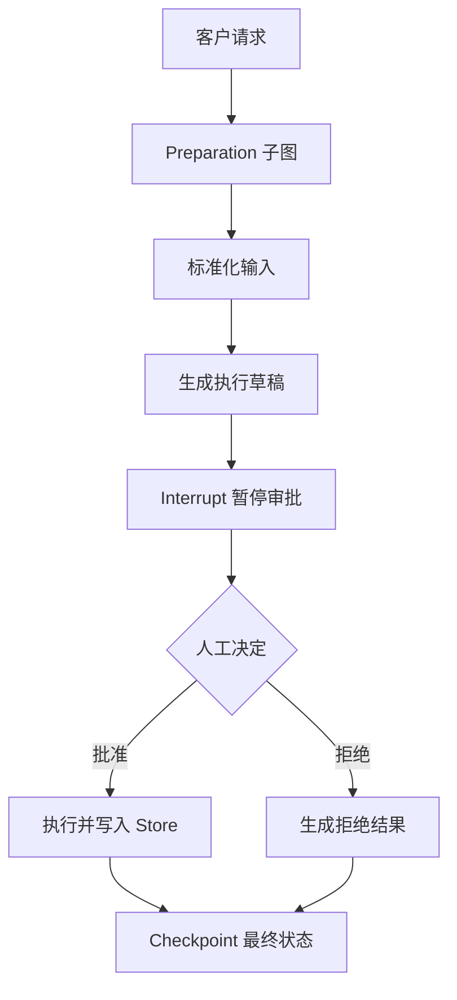

# LangGraph 企业能力主线

`demos/enterprise_graph.py` 在一张真实状态图中覆盖：

- `InMemorySaver` + `thread_id`：Checkpoint 与线程恢复
- `InMemoryStore`：跨线程的客户长期 Memory
- `interrupt` + `Command(resume=...)`：HITL 审批与恢复
- 编译后的准备子图：Subgraph
- `stream(..., stream_mode="updates")`：节点级 Streaming
- reducer：并行/嵌套节点安全追加事件

```bash
cd ai-learn/agent-advanced/langgraph-enterprise
python3 demos/enterprise_graph.py "发送三万日元以上报价" --decision yes
python3 demos/enterprise_graph.py "删除客户记录" --decision no --thread reject-1
```

验收：首次运行停在 `approval` checkpoint，恢复后进入执行或拒绝分支；终端持续打印节点更新。内存实现适合教学，生产应换 SQLite/Postgres checkpointer 和持久化 Store，并为 `thread_id` 增加租户隔离。

## 概念边界

Checkpoint 保存“某个线程运行到哪里”；短期 Memory 是该线程状态；Store 保存可跨线程读取的长期事实。HITL 必须在有 checkpointer 的图上使用，否则进程恢复后无法可靠续跑。

## 图片式模板解释

输入：运行示例并提交一条客户请求；处理前数据是请求、Graph State、Checkpoint 和持久化 Store。

```text
客户请求 -> Preparation 子图 -> 标准化输入 -> 执行草稿
│
▼
interrupt()：保存 Checkpoint 并暂停
├── 人工拒绝 -> 生成拒绝结果 -> END
└── 人工批准 -> 恢复 Graph -> 执行动作 -> 写入 Store -> END
```

节点对应：子图封装阶段，Checkpoint 支持暂停恢复，Interrupt 建立人工审批，Store 保存跨运行数据。最小输出是批准后的执行结果或拒绝结果。

## 业务场景（完整说明）

- **使用者**：需要审批、恢复执行和长期记忆的企业 Agent 平台团队。
- **要解决的问题**：业务执行到高风险节点时暂停审批，并能依靠 checkpoint 在同一 thread 中恢复。
- **输入与输出**：输入客户请求、线程、客户和审批决定；输出流式节点更新、最终结果和跨线程 Store 数据。
- **生产环境差距**：需要持久化 checkpoint、分布式锁、审批身份校验、超时处理、数据保留策略和幂等执行。

## 整体流程图


