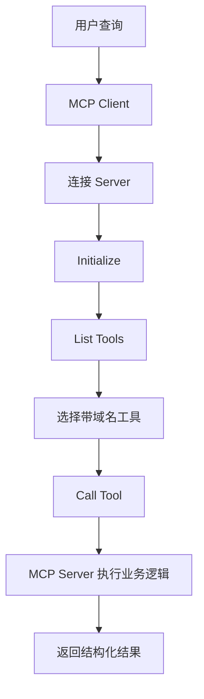

# MCP Client / Server / Remote / Multi-MCP

本目录使用真实 MCP Python SDK，不是协议模拟。

```bash
cd ai-learn/agent-advanced/mcp
python3 client.py "审批"                       # stdio server 自动启停
python3 multi_router.py "PR 合并"              # 两个独立 server + 命名空间路由
python3 server.py --transport streamable-http   # 终端 A
python3 client.py "审批" --transport remote    # 终端 B
python3 client.py x --limit 99                  # 参数错误路径
```

覆盖点：FastMCP 工具 schema、工具发现、调用、超时、参数错误、stdio、Streamable HTTP、Multi-MCP 工具目录与同名冲突处理。

安全边界：示例工具只创建草稿，不发送邮件或修改文件；Remote MCP 生产部署必须增加 TLS、认证、租户隔离、allowlist、调用审计和服务端超时。不要把 bearer token 放进 URL 或日志。

依赖：`mcp>=1.0`。当前 Remote 示例绑定 `127.0.0.1`，不对公网暴露。

## 业务场景（完整说明）

- **使用者**：Agent 平台开发者、工具服务开发者和企业集成团队。
- **要解决的问题**：让客户端用标准协议发现和调用不同进程或远程服务提供的工具，并处理多服务同名工具。
- **输入与输出**：输入查询、transport 和服务地址；输出工具目录、路由结果及结构化工具响应。
- **生产环境差距**：需要身份认证、TLS、工具级授权、超时重试、服务发现、限流和调用审计。

## 整体流程图


