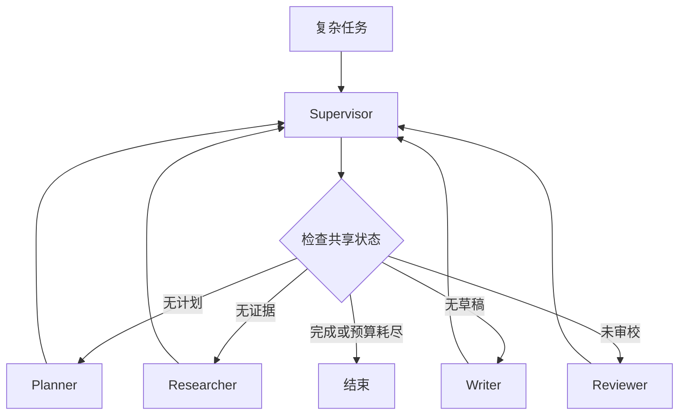

# 真实 Multi-Agent 图编排

LangGraph Supervisor 根据共享状态把任务 handoff 给 Planner、Researcher、Writer、Reviewer。所有 worker 回到 Supervisor；`budget` 与 `recursion_limit` 提供双重终止保护。

```bash
python3 main.py "设计日本 SES 案件匹配方案"
python3 main.py "预算终止演示" --budget 2
```

验收：正常预算产生计划、证据、草稿和 `pass`；低预算提前终止。该实现用确定性 worker 隔离编排逻辑，接入 LLM 时无需改变图结构。

## 图片式模板解释

输入：`python3 main.py "设计日本 SES 案件匹配方案"`；处理前数据是任务、共享 State、budget 和 recursion limit。

```text
任务 -> graph.invoke() -> Supervisor：读取共享 State 和预算
├── 无计划 -> Planner -> 回到 Supervisor
├── 无证据 -> Researcher -> 回到 Supervisor
├── 无草稿 -> Writer -> 回到 Supervisor
├── 未审校 -> Reviewer -> 回到 Supervisor
├── 已通过 -> END
└── budget 耗尽 -> 提前终止
```

节点对应：Supervisor 只负责路由，Worker 各写一部分 State，预算和递归限制共同防止死循环。最小输出包含计划、证据、草稿、审校结果和步骤数。

## 业务场景（完整说明）

- **使用者**：复杂任务自动化团队和 Multi-Agent 平台开发者。
- **要解决的问题**：把规划、研究、写作和审校职责拆开，由 Supervisor 根据共享状态持续调度，并用预算强制终止。
- **输入与输出**：输入任务和步骤预算；输出计划、证据、草稿、审校结果及实际步骤数。
- **生产环境差距**：需要真实 LLM worker、角色权限、并发控制、上下文裁剪、成本核算和失败恢复。

## 整体流程图


