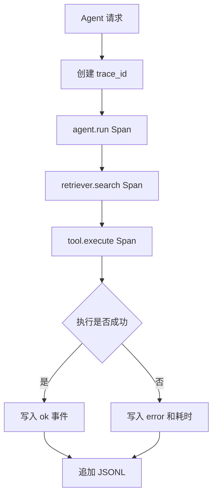

# Tracing 与成本观测

`tracing_demo` 将每个 span 的 trace/span ID、耗时、状态、错误、token 和估算成本写入 JSONL，便于后续接 OpenTelemetry、LangSmith 或平台日志。

```bash
cd tracing_demo
python3 main.py
python3 main.py --fail
```

验收：成功路径写入三个 `ok` span；失败路径同时记录子 span 和父 span 的错误原因。生产环境不得把 prompt、客户资料或密钥直接写入 trace。

## 业务场景（完整说明）

- **使用者**：Agent 开发、SRE、平台运维和成本管理人员。
- **要解决的问题**：定位一次 Agent 请求经过哪些步骤、每步耗时多少、在哪里失败以及消耗多少 token/成本。
- **输入与输出**：输入一次模拟运行及可选失败开关；输出带 trace_id、span_id、状态、耗时和属性的 JSONL。
- **生产环境差距**：需要 OpenTelemetry 后端、采样策略、敏感字段脱敏、跨服务 trace 传播和告警规则。

## 整体流程图


