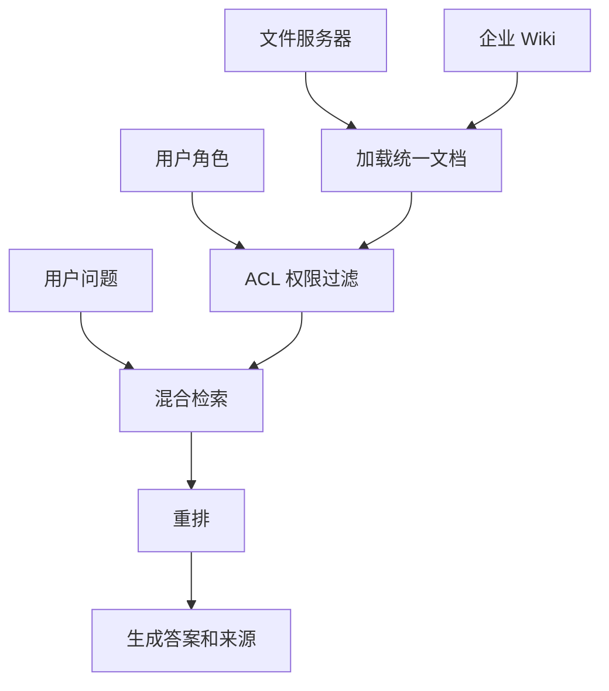

# 社内文件 + Wiki 混合检索 RAG Demo

这个 demo 用本地文件模拟两类社内资料源：

- `server_docs/`：服务器上的制度类、流程类资料
- `wiki_docs/`：社内 Wiki 上的操作类、FAQ 类资料

它重点演示四层：

1. 接入层：把不同来源统一加载成文档
2. 检索层：对可访问文档做关键词检索和 rerank
3. 权限层：按角色过滤不可见文档
4. 引用层：输出带来源的答案

## 业务场景说明

- 谁会用：资料分散在共享文件夹和公司 Wiki，并且员工、经理、IT 管理员拥有不同查看权限的企业团队。
- 现实中的问题：员工查询发布流程时，答案可能需要同时参考服务器里的正式规定和 Wiki 里的操作步骤；但管理员专用的访问控制文档不能出现在普通员工的答案中。
- 这个例子怎么解决：先把 `server_docs/` 和 `wiki_docs/` 统一加载成文档，再根据 `--role` 过滤无权查看的资料，只对允许访问的内容进行检索、重排和答案整理。
- 现实例子：普通员工询问“远程办公怎么申请”，系统可以返回员工手册和 Wiki 操作说明；询问管理员事故处理内容时，无权限文档会被过滤，不会进入答案。
- 初学者重点：混合检索不仅是“同时搜索两个目录”，还要保留资料来源、角色权限和引用信息。这个 demo 用本地文件模拟真实文件服务器和 Wiki。

## 安装

这个 demo 只用 Python 标准库，不需要额外安装第三方包。

如果你想先看统一环境说明，可以参考 [项目依赖总表](../DEPENDENCIES.md)。

## 你会学到什么

- 怎么把文件服务器和 Wiki 当成两个资料源接入
- 怎么在检索前做权限过滤
- 怎么让答案带来源引用
- 怎么把“社内搜索”拆成可测试的小步骤

## 运行方式

```bash
/usr/bin/python3 /home/victorkure/workspace/vscode_study/ai-lab/ai-learn/agent-advanced/projects/internal_hybrid_rag_demo/main.py "远程办公和发布流程有什么要求？" --role employee
```

可选角色：

- `employee`
- `manager`
- `it_admin`

例如：

```bash
/usr/bin/python3 /home/victorkure/workspace/vscode_study/ai-lab/ai-learn/agent-advanced/projects/internal_hybrid_rag_demo/main.py "事故处理流程和访问控制怎么查？" --role it_admin
```

## 常见报错

- `FileNotFoundError`：通常是 `assets/` 或 `catalog.json` 路径不对，先确认在 demo 目录内运行。
- `Permission denied` 风格的问题：先检查 `--role` 是否选对，很多文档默认只对部分角色可见。

## 目录结构

```text
internal_hybrid_rag_demo/
├── main.py
└── assets/
    ├── catalog.json
    ├── server_docs/
    └── wiki_docs/
```

## 设计重点

- `server_docs/` 更像制度、流程、审批、规范
- `wiki_docs/` 更像 FAQ、操作说明、排障指南、发布手册
- `catalog.json` 保存来源、标题、路径、ACL 等元数据
- `main.py` 负责统一接入、权限过滤、检索、引用生成

## 学习建议

先看 `main.py` 的四个分层函数，再看 `assets/` 里的资料样本。  
如果你要做成真实企业系统，下一步通常就是：

1. 把本地目录换成真正的文件服务器
2. 把 Wiki 读取器换成 Confluence / SharePoint / Notion API
3. 把 ACL 接到公司权限系统
4. 把检索层升级成向量检索 + rerank

## 业务场景（完整说明）

- **使用者**：企业员工、IT 支持、HR 和知识平台管理员。
- **要解决的问题**：同时检索文件服务器与 Wiki，并在召回前按角色过滤无权访问的资料。
- **输入与输出**：输入问题和用户角色；输出可访问来源、混合检索排名和引用答案。
- **生产环境差距**：需要真实身份系统、文档 ACL 同步、向量与关键词融合、审计和索引更新。

## 整体流程图


