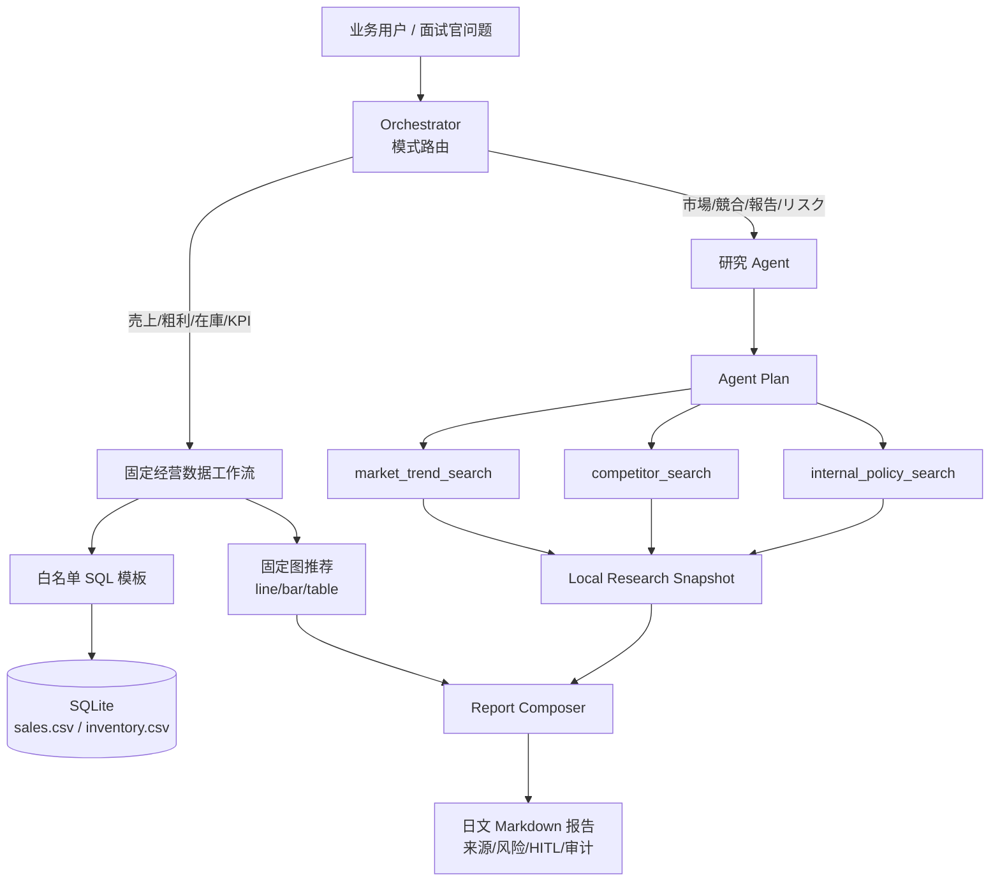

# 日本小売经营分析 Agent

`阶段 3：做一个组合改造项目` 的独立学习项目。它是“电商问数 + 深度研搜”的缩小版完整工程：前后台分离、FastAPI API、SSE、WebSocket、LangGraph StateGraph、LangGraph SQLite checkpoint、固定经营问数工作流、自主研究 Agent、日文报告输出和 React 前端。

详细架构看：

- [Architecture](./docs/ARCHITECTURE.md)
- [Run Effect](./docs/RUN_EFFECT.md)
- [Backend Framework](./docs/BACKEND_FRAMEWORK.md)
- [Function Overview](./docs/FUNCTION_OVERVIEW.md)
- [Production Gaps](./docs/PRODUCTION_GAPS.md)
- [README Learn](./README_LEARN.md)
- [Basic Design](./BASIC_DESIGN.md)
- [Testing](./TESTING.md)

## 项目目标

- 用本地 SQLite 和 CSV 提供可验证的销售、粗利、库存数据。
- 用固定工作流处理经营 KPI，展示什么时候应该使用固定图和固定 SQL 模板。
- 用研究 Agent 模拟市场趋势、竞争情报、社内资料调查，展示什么时候需要自主工具选择。
- 最终生成日文经营分析报告，包含数据库结果、调查来源、风险提示、人工确认记录和审计日志。
- 后端提供 REST、SSE、WebSocket；前端通过 Vite proxy 调用后端。
- Orchestrator 使用 LangGraph `StateGraph`，并用 `SqliteSaver` 按 task id 保存图执行 checkpoint。
- 离线可运行，不依赖外部数据库、搜索 API 或 LLM Key。

## 生产化状态

当前项目是生产风格缩小版，不是可直接上线版本。

已完成：

- FastAPI REST、SSE、WebSocket。
- React/Vite 前端。
- LangGraph `StateGraph` + `SqliteSaver` checkpoint。
- SQLite task/event/report store。
- 固定经营问数工作流。
- 研究 Agent 工具选择和来源引用。
- 基础 metrics、Dockerfile、docker-compose、`.env.example`。

未完成：

- 认证授权、RBAC、多租户。
- SQL AST parser、行列级权限、PII masking。
- 企业 DWH、企业搜索、SharePoint/Confluence 接入。
- LangGraph interrupt/resume 的真正人工审批 UI。
- OpenTelemetry/Prometheus、CI/CD、migration、load test。

完整清单见 [Production Gaps](./docs/PRODUCTION_GAPS.md)。

## 运行

从 `ai-lab/` 目录执行：

```bash
python3 ai-learn/agent-advanced/projects/japan_retail_analysis_agent/main.py
```

启动后端：

```bash
cd ai-learn/agent-advanced/projects/japan_retail_analysis_agent
python3 server.py
```

后端默认地址：

```text
http://127.0.0.1:8020
```

启动前端：

```bash
cd ai-learn/agent-advanced/projects/japan_retail_analysis_agent/frontend
npm install
npm run dev
```

前端默认地址：

```text
http://127.0.0.1:5178
```

指定问题：

```bash
python3 ai-learn/agent-advanced/projects/japan_retail_analysis_agent/main.py \
  "6月の売上・在庫リスクを確認し、市場トレンドと競合状況を踏まえて経営会議向けに報告してください。"
```

输出 Markdown 文件：

```bash
python3 ai-learn/agent-advanced/projects/japan_retail_analysis_agent/main.py \
  --output /tmp/japan-retail-report.md
```

运行测试：

```bash
python3 -m unittest discover ai-learn/agent-advanced/projects/japan_retail_analysis_agent/tests
```

只看审计日志：

```bash
python3 ai-learn/agent-advanced/projects/japan_retail_analysis_agent/main.py \
  "売上と在庫を確認し、市場トレンドと競合を含めて報告" \
  --show-audit-only
```

后端 API 示例：

```bash
curl -X POST http://127.0.0.1:8020/api/tasks \
  -H "Content-Type: application/json" \
  -d '{"question":"売上と在庫を確認し、市場トレンドと競合を含めて報告","mode":"hybrid"}'
```

## 架构图



## 为什么这样设计

| 问题类型 | 实现方式 | 理由 |
| --- | --- | --- |
| 売上、粗利、在庫、欠品、地域別 KPI | 固定工作流 + 白名单 SQL | 数据口径必须稳定，可测试、可审计、可重复 |
| 趋势、竞品、社内资料、会议报告 | 自主 Agent 选择工具 | 信息来源随问题变化，需要动态规划和引用整理 |
| 图表展示 | 固定图优先 | 月次趋势、地域排行、库存风险表是标准经营图，不应每次让模型自由决定 |
| 报告写作 | Agent/Composer 合成 | 需要把数据、调查、风险、人工确认组织成业务文档 |

## 目录结构

```text
japan_retail_analysis_agent/
  main.py                # CLI 入口
  server.py              # FastAPI/Uvicorn 启动入口
  retail_agent/
    core/                # 配置、日志、错误
    interfaces/http/     # routers、schemas、dependencies
    application/         # use case / task service
    infrastructure/      # repository、metrics 等 adapter
    cli.py               # 命令行参数和输出
    models.py            # EvidenceBlock、Source、AuditEvent、State
    api/                 # FastAPI REST、SSE、WebSocket
    checkpoint/          # task event/report 持久化
    events/              # 运行事件总线
    data/                # SQLite 仓库、SQL guard、查询模板
    workflows/           # 固定经营数据工作流
    research/            # 研究 Agent 和本地调查工具
    orchestration/       # data/research/hybrid 路由
    reporting/           # 日文报告生成
  frontend/              # React + Vite 前端
  Dockerfile             # 后端容器
  docker-compose.yml     # 本地容器运行
  pyproject.toml         # Python 项目元信息
  .env.example           # 环境变量样例
  data/
    sales.csv            # 可验证销售/粗利/客数数据
    inventory.csv        # 可验证库存/欠品风险数据
    research_notes.md    # 本地市场/竞品/社内资料快照
  docs/
    ARCHITECTURE.md      # 架构和能力映射
    BACKEND_FRAMEWORK.md # 后端分层框架说明
    FUNCTION_OVERVIEW.md # 功能介绍
    PRODUCTION_GAPS.md   # 未完成生产化清单
    RUN_EFFECT.md        # 运行模式和效果
  BASIC_DESIGN.md        # 教学式基本设计
  README_LEARN.md        # 学习顺序
  TESTING.md             # 测试说明
  tests/
    test_main.py         # hybrid 路由、SQL 模板、SELECT-only guard 测试
  requirements.txt       # 无第三方依赖说明
```

## 面试说明要点

- 固定图不是“低级做法”，它是经营 KPI 场景的治理手段：指标口径、SQL、图表、权限和审计都要稳定。
- 自主 Agent 不适合直接生成任意 SQL；它更适合开放式调查、资料整合、报告草稿和来源追踪。
- 日本现场常见关注点是既存系统接入、个人信息、权限、稟議、审计、误答控制和分阶段 PoC。
- 这个项目已经具备 FastAPI + SSE/WebSocket + LangGraph SqliteSaver checkpoint + React 前端；下一步可以接企业搜索 API、认证授权和真实数据库。
- 不要把它说成“可直接上线生产”，应说成“生产框架骨架 + 可运行作品集”。

## 可扩展方向

1. 把 `RetailDataWarehouse` 换成只读 PostgreSQL/MySQL 连接，并保留 SQL AST 校验。
2. 把 `ResearchAgent` 的本地 Markdown 工具替换为企业许可的搜索 API、SharePoint、Confluence 或社内 Wiki。
3. 增加 LangGraph interrupt/resume，把当前人工确认记录升级为真正的 HITL 中断恢复。
4. 增加评估集：经营问题的 expected SQL/result，报告问题的引用正确率和风险覆盖率。
5. 增加 FastAPI 接口和前端，把固定图和 Agent 报告分区展示。
