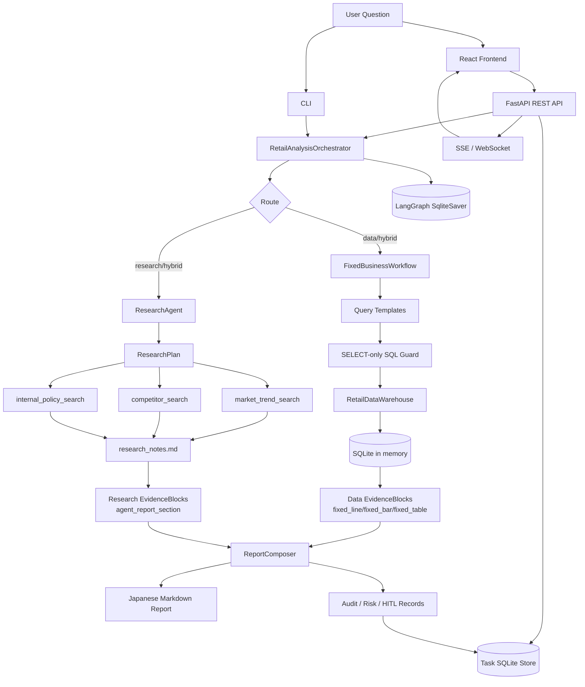

# Architecture

这个项目是两个原工程的缩小版综合体：保留“电商问数”的受控结构化数据查询边界，保留“深度研搜”的研究计划、工具调用、引用和报告交付边界，并补齐前后台分离、SSE/WebSocket、LangGraph StateGraph、LangGraph SQLite checkpoint 和 React 展示层。

## 能力映射

| 来源项目能力 | 本项目对应模块 | 说明 |
| --- | --- | --- |
| 电商问数：结构化数据查询 | `retail_agent/data/warehouse.py` | 用 SQLite 模拟经营数据库 |
| 电商问数：指标模板和 schema linking | `retail_agent/data/templates.py`、`retail_agent/workflows/business.py` | 用问题关键词路由到白名单 KPI 模板 |
| 电商问数：SQL 安全边界 | `retail_agent/data/sql_guard.py` | SELECT-only guard，禁止非只读 SQL |
| 电商问数：固定图和可验证结果 | `EvidenceBlock.chart_kind`、`use_fixed_chart=True` | 月次、地域、库存风险走固定图 |
| 深度研搜：任务规划 | `retail_agent/research/agent.py` | 根据问题规划需要调用的调查工具 |
| 深度研搜：多来源工具 | `retail_agent/research/tools.py` | 市场趋势、竞品、社内资料三类工具 |
| 深度研搜：来源引用 | `Source`、`EvidenceBlock.sources` | 每个调查块保留来源和更新时间 |
| 深度研搜：报告交付 | `retail_agent/reporting/composer.py` | 生成日文 Markdown 报告 |
| 深度研搜：实时事件 | `retail_agent/api/app.py`、`retail_agent/events/bus.py` | SSE 和 WebSocket 推送任务进度 |
| LangGraph 图编排 | `retail_agent/orchestration/orchestrator.py` | 用 StateGraph 编排 route/data/research/report 节点 |
| LangGraph checkpoint | `RetailAnalysisOrchestrator._checkpointer()` | 用 `SqliteSaver` 按 task id 保存图执行 checkpoint |
| 任务持久化 | `retail_agent/checkpoint/store.py` | 用 SQLite 持久化任务、事件和最终报告 |
| 前后台分离 | `server.py`、`frontend/` | FastAPI 后端 + React/Vite 前端 |
| 企业现场治理 | `AuditEvent`、`human_confirmation`、`risks` | 保留审计、人工确认、风险提示 |

## 逻辑架构



## 运行模式

| mode | 会运行什么 | 适合说明什么 |
| --- | --- | --- |
| `data` | 只运行固定经营数据工作流 | 为什么经营 KPI 不应该全交给自主 Agent |
| `research` | 只运行研究 Agent | 为什么市场/竞品/资料调查需要动态工具选择 |
| `hybrid` | 两者都运行 | 日本现场经营分析报告的完整组合 |
| `auto` | 根据问题自动选择 | 面试中展示 Orchestrator 的路由思路 |

## 为什么现在仍然不是完整生产系统

这个项目已经具备可运行前后台分离工程，但仍然是缩小版，不是生产上线版。尚未实现：

- LangGraph interrupt/resume 的人工审批恢复。
- 真正的 LLM planning、外部搜索 API、企业 Wiki API。
- SQL AST parser、行列级权限、PII masking。
- 多租户、SSO、RBAC、审计落库。
- 离线评测集和线上质量监控。

完整生产差距清单见 [Production Gaps](./PRODUCTION_GAPS.md)。

面试时应该这样表述：

> 这是一个组合项目骨架，用来证明我知道哪些部分必须受控、哪些部分可以 Agent 化；生产化时会把固定工作流换成 LangGraph，把研究工具换成企业许可 API，并补权限、审计、评估和持久化。

## 代码结构

```text
japan_retail_analysis_agent/
  main.py
  server.py
  retail_agent/
    core/
      config.py
      logging.py
      errors.py
    interfaces/
      http/
        dependencies.py
        schemas.py
        routers/
          health.py
          tasks.py
          streams.py
    application/
      task_service.py
    infrastructure/
      repositories/
        task_repository.py
      observability/
        metrics.py
    api/
      app.py
      schemas.py
    checkpoint/
      store.py
    events/
      bus.py
    cli.py
    models.py
    settings.py
    utils.py
    data/
      sql_guard.py
      templates.py
      warehouse.py
    workflows/
      business.py
    research/
      agent.py
      tools.py
    orchestration/
      orchestrator.py
    reporting/
      composer.py
  data/
    sales.csv
    inventory.csv
    research_notes.md
  docs/
    ARCHITECTURE.md
    RUN_EFFECT.md
  frontend/
    src/
      main.tsx
      styles.css
  Dockerfile
  docker-compose.yml
  pyproject.toml
  tests/
    test_main.py
    test_api.py
```
