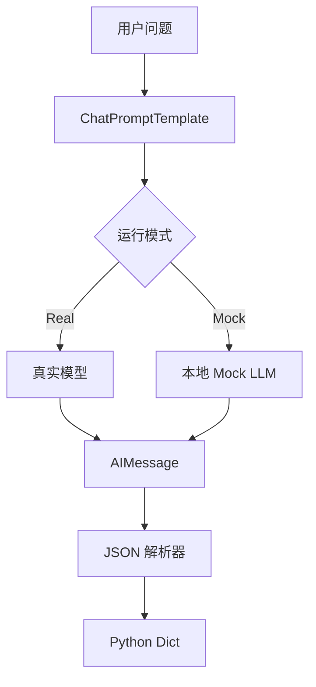

# langchain_chain_demo

LangChain 风格最小链路示例。

如果你想先把 LangChain 的知识补齐，再来跑这个 demo，可以先看：

- [frameworks/langchain/LangChain 学习笔记](../../frameworks/langchain/LangChain学习笔记.md)

这个 demo 重点练三件事：

1. `ChatPromptTemplate` 组织提示词
2. `RunnableLambda` / `|` 串起链路
3. 结构化输出解析

默认会先尝试真实模型；如果没配 API Key，会自动回退到 mock。

## 业务场景说明

- 谁会用：需要重复执行“整理输入、调用模型、解析结果”这类固定步骤的开发人员，例如客服摘要、邮件分类和学习计划生成。
- 现实中的问题：假设客服系统要把客户问题整理成摘要、处理步骤和关键词。如果提示词、模型调用和 JSON 解析全部写在一个函数里，后面更换模型或增加字段时很容易改乱。
- 这个例子怎么解决：使用 `ChatPromptTemplate` 负责准备提示词，模型或 Mock 负责生成内容，`parse_response()` 负责把模型输出解析成字典，再用 `|` 把三个步骤连接起来。
- 现实例子：客服输入“客户登录后看不到订单”，链路先把问题放进提示词，再让模型生成严格 JSON，最后程序取得 `summary`、`steps` 和 `keywords`，供工单页面显示。
- 初学者重点：这个 demo 只演示 `Prompt -> Model -> Parser`，目前没有文档检索、Memory 或 Agent 工具调用。

## 安装

```bash
/usr/bin/python3 -m pip install -r /home/victorkure/workspace/vscode_study/ai-lab/ai-learn/agent-advanced/projects/requirements.txt
```

依赖说明见 [项目依赖总表](../DEPENDENCIES.md)。

## 运行

```bash
/usr/bin/python3 /home/victorkure/workspace/vscode_study/ai-lab/ai-learn/agent-advanced/projects/langchain_chain_demo/main.py "什么是 LangChain 的链式编排"
```

强制 mock：

```bash
/usr/bin/python3 /home/victorkure/workspace/vscode_study/ai-lab/ai-learn/agent-advanced/projects/langchain_chain_demo/main.py "什么是 LangChain 的链式编排" --mock
```

如果你已经配置了 API Key，直接不加 `--mock` 就会优先尝试真实模式。

如果你想同时看“模型原始输出”和“解析后的结果”，再加上 `--show-raw`。

```bash
/usr/bin/python3 /home/victorkure/workspace/vscode_study/ai-lab/ai-learn/agent-advanced/projects/langchain_chain_demo/main.py "什么是 LangChain 的链式编排" --show-raw
```

输出里会先看到 `=== 原始结果 ===`，再看到 `=== 解析后结果 ===`。

## 常见报错

- 如果终端里的 `which python3` 还指向别的 `.venv`，就直接用 `/usr/bin/python3` 执行上面的命令。
- 如果 VS Code 里还是红线，通常是 Python 解释器没切到当前 WSL 的 `/usr/bin/python3`，重载窗口或重新选择解释器即可。
- `缺少 langchain-openai`：只在真实模式需要；如果只是练流程，直接用 `--mock` 即可。

## 学习顺序

1. 先看 `build_prompt()`
2. 再看 `mock_llm()`
3. 再看 `parse_response()`
4. 最后看 `build_chain()`
5. 如果想继续往后学，再看 `Tool Calling`、`Memory`、`Retriever`、`RAG`、`Agent`

如果想理解“上面那段是原始模型输出，下面那段是重新组装后的结构化结果”，再补看一次 `--show-raw` 的输出：

- `raw_message.content` 是模型直接吐出来的原始内容
- `parse_response()` 是把原始内容重新解析成字典
- `print(json.dumps(...))` 打印的是解析后的最终结果

## 业务场景（完整说明）

- **使用者**：需要快速组合提示词、模型和输出解析器的 LLM 应用开发者。
- **要解决的问题**：把自由文本问题稳定转换为包含 summary、steps、keywords 的结构化结果。
- **输入与输出**：输入用户问题；输出解析后的 Python 字典或原始模型文本。
- **生产环境差距**：需要 schema 校验重试、模型超时、提示词版本管理、缓存和质量评估。

## 整体流程图


