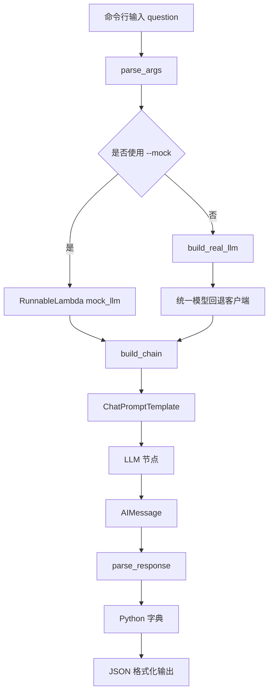

# langchain_chain_demo 源码导读

## 1. 学习目标

这个项目用一个很小的示例演示 LangChain 最基础的链路：

```text
用户问题
  ↓
Prompt 模板
  ↓
Mock 或真实模型
  ↓
AIMessage
  ↓
JSON 解析
  ↓
结构化结果
```

完成本次学习后，应当能够：

- 说清楚 `ChatPromptTemplate`、`RunnableLambda` 和 `|` 运算符的作用。
- 找到命令行输入进入链路的位置。
- 说清楚数据在每个节点中的类型变化。
- 区分模型的原始文本和解析后的 Python 字典。
- 在没有 API Key 的情况下，理解并使用 Mock 模式学习完整链路。

本导读只分析源码，不修改项目代码和 README。

## 2. 项目文件概览

| 文件或目录 | 学习价值 | 本阶段建议 |
| --- | --- | --- |
| `main.py` | 项目的全部核心逻辑 | 必须阅读 |
| `requirements.txt` | 声明 `langchain-core`、`langchain-openai` 依赖 | 快速阅读 |
| `README.md` | 项目使用说明 | 可作为运行参考，本次不修改 |
| `image.png`、`image-1.png` | 文档配图 | 源码学习时可以跳过 |
| `__pycache__/` | Python 自动生成的字节码缓存 | 跳过，不要手工修改 |
| `../../llm_runtime.py` | 真实模型的统一回退运行模块 | 第二遍选读 |

> 路径说明：本文位于 `projects/langchain_chain_demo/`，因此 `../../llm_runtime.py` 指向 `agent-advanced/llm_runtime.py`。

## 3. 最短阅读顺序

第一次阅读不要从第一行逐字看到最后一行。建议按数据流阅读：

1. `main()`：先找到程序入口。
2. `build_chain()`：看链由哪些节点组成。
3. `build_prompt()`：看输入怎样变成消息。
4. `mock_llm()`：看模型节点怎样接收和返回数据。
5. `parse_response()`：看原始输出怎样变成字典。
6. `parse_args()`：补充理解命令行参数。
7. `build_real_llm()`：最后再理解真实模型分支。

建议第一遍使用 Mock 模式理解链路，不要一开始就被网络、API Key 和模型供应商问题分散注意力。

## 4. 必须阅读的函数

| 函数 | 位置 | 为什么必须读 | 阅读时重点观察 |
| --- | --- | --- | --- |
| `main()` | `main.py:174` | 程序总入口，控制模式选择、链构建、执行和输出 | `args.mock`、`chain.invoke()`、`--show-raw` 分支 |
| `build_chain()` | `main.py:154` | 展示 LangChain 链的核心组合方式 | `prompt \| llm \| RunnableLambda(parse_response)` |
| `build_prompt()` | `main.py:70` | 展示 system 和 human Prompt 的定义 | `{question}` 如何接收输入字典中的值 |
| `mock_llm()` | `main.py:99` | 无需 API Key 也能看懂模型节点的输入输出 | `prompt_value`、`AIMessage`、JSON 字符串 |
| `parse_response()` | `main.py:137` | 展示输出解析和降级处理 | 代码围栏清理、`json.loads()`、解析失败回退 |
| `parse_args()` | `main.py:36` | 决定程序从命令行收到什么 | `question`、`--mock`、`--model`、`--show-raw` |

### 4.1 `main()`：程序总导演

`main()` 本身不负责生成 Prompt 或回答问题，它负责把各部分组织起来：

1. 调用 `parse_args()` 读取命令行。
2. 根据 `args.mock` 选择 Mock 链或真实模型链。
3. 调用 `chain.get_graph().draw_mermaid()` 显示链路结构。
4. 根据 `args.show_raw` 决定是否先展示模型原始结果。
5. 调用 `invoke()` 真正执行链路。
6. 使用 `json.dumps()` 把结果打印为易读的中文 JSON。

初学者最应该找到的执行语句是：

```python
result = chain.invoke({"question": args.question})
```

这里的字典就是链的初始输入。键名 `question` 必须与 Prompt 模板中的 `{question}` 一致。

### 4.2 `build_chain()`：把节点串成链

核心代码可以读成一句话：

```python
return prompt | llm | RunnableLambda(parse_response)
```

其中：

- `prompt` 接收 `{"question": "..."}`，输出格式化后的聊天消息。
- `llm` 接收聊天消息，输出 `AIMessage`。
- `parse_response` 接收 `AIMessage`，输出 Python 字典。
- `|` 表示前一个节点的输出自动成为后一个节点的输入。

这就是 LangChain Expression Language（LCEL）最基础的链式组合思想。

### 4.3 `build_prompt()`：把变量变成消息

Prompt 由两条消息组成：

- system：规定角色，并要求输出包含 `summary`、`steps`、`keywords` 的严格 JSON。
- human：把输入字典中的 `question` 填入 `问题：{question}`。

例如，输入：

```python
{"question": "LangChain 的链是什么？"}
```

格式化后的人类消息是：

```text
问题：LangChain 的链是什么？
```

### 4.4 `mock_llm()`：本地模拟模型节点

这个函数没有调用外部模型，而是用普通 Python 代码模拟模型行为：

1. 从 `prompt_value.to_messages()` 中取得最后一条 human 消息。
2. 调用 `extract_keywords()` 提取关键词。
3. 创建包含三个字段的 `payload` 字典。
4. 用 `json.dumps()` 把字典变为 JSON 字符串。
5. 把字符串包装为 `AIMessage` 返回。

必须注意：这里取得的是格式化后的整条 human 消息，所以 `question` 变量的内容包含前缀 `问题：`，不只是用户最初输入的文字。

### 4.5 `parse_response()`：从消息到字典

解析器执行三件事：

1. 取出 `AIMessage.content` 并去除首尾空白。
2. 如果模型输出以 Markdown 代码围栏开头，先移除围栏。
3. 尝试用 `json.loads()` 转为 Python 对象。

如果模型没有返回合法 JSON，函数不会直接终止，而是回退为：

```json
{
  "summary": "模型原始内容",
  "steps": [],
  "keywords": []
}
```

这个设计保证演示可以继续，但它只保证“有结果”，并不保证结果完全符合业务要求。

## 5. 第二遍再读的函数

| 函数 | 位置 | 作用 | 为什么可以第二遍再读 |
| --- | --- | --- | --- |
| `extract_keywords()` | `main.py:85` | 用正则提取并去重关键词，最多返回 6 个 | 它是 Mock 效果的辅助逻辑，不影响理解 LCEL 主链 |
| `build_real_llm()` | `main.py:119` | 把统一模型客户端包装成 LangChain 节点 | 涉及外部运行模块和供应商回退，复杂度较高 |
| `build_generation_chain()` | `main.py:164` | 构建不带解析器的 `prompt → llm` 链 | 只服务于 `--show-raw` 教学功能 |

### 5.1 `extract_keywords()`

它使用正则寻找长度至少为 2 的英文、数字或连续中文片段，然后按出现顺序去重，最多保留 6 项。

这只是教学用的简单规则，不等于真正的自然语言关键词抽取。中文连续文本可能会被当成一个很长的词组。

### 5.2 `build_real_llm()`

它先通过 `build_fallback_client()` 创建统一客户端，再定义内部函数 `invoke()`：

1. 把 LangChain Prompt 转为消息列表。
2. 取第一条消息作为 system instructions。
3. 取最后一条消息作为用户输入。
4. 调用 `client.responses.create(...)`。
5. 把 `response.output_text` 包装成 `AIMessage`。

`../../llm_runtime.py` 负责实际供应商选择，当前顺序是：

```text
OpenRouter（配置后）
  ↓ 失败
ChatNVIDIA（配置后）
  ↓ 失败
Ollama qwen2.5-coder:1.5b
  ↓ 失败
最终 Mock 文本
```

本阶段只需要理解这个边界，不需要深入 `_ResponsesAdapter`、工具调用转换或 Pydantic Mock 值生成逻辑。

### 5.3 `build_generation_chain()`

它只组合：

```text
Prompt → LLM
```

因为没有 `parse_response` 节点，所以返回值仍是 `AIMessage`。这让学习者能比较“模型原始字符串”和“解析后的 Python 字典”。

## 6. 第一遍可以跳过的内容

这里的“跳过”是指暂时不深挖，不代表永远不用学。

| 内容 | 可以暂时跳过的原因 |
| --- | --- |
| `main.py:24-28` 的父目录扫描 | 只是为了找到共享的 `llm_runtime.py` 并加入导入路径，不是 LangChain 核心概念 |
| `DEFAULT_MODEL` 的环境变量细节 | Mock 学习链路时不会影响核心结果 |
| `--real` 参数声明 | 当前执行分支实际只检查 `args.mock`，先记下观察即可 |
| `../../llm_runtime.py` 中 `_chat_tools()`、`_mock_value()` | 服务于更广泛的工具调用和结构化输出示例，本 Demo 没有直接使用 |
| `FallbackOpenAI._create()` 的全部异常细节 | 本阶段只需知道它按供应商顺序尝试并最终回退 |
| 图片和 `__pycache__/` | 不参与程序执行逻辑 |

## 7. 项目执行流程

### 7.1 纯文本流程

```text
启动 main.py
  ↓
parse_args() 解析 question 和开关
  ↓
是否指定 --mock？
  ├─ 是：build_chain(True)
  └─ 否：build_chain(False)，构建真实模型节点
  ↓
打印链路 Mermaid 文本
  ↓
是否指定 --show-raw？
  ├─ 是：运行 prompt → llm，再手工调用 parse_response()
  └─ 否：运行 prompt → llm → parse_response 完整链
  ↓
把解析结果格式化为 JSON 并打印
```

### 7.2 Mermaid 流程图



## 8. 从输入到输出的全过程

下面以安全、离线的 Mock 模式为例：

```bash
python main.py "解释 LangChain 的基础链路" --mock
```

### 第一步：Shell 产生字符串参数

操作系统把以下内容交给 Python：

```text
question = "解释 LangChain 的基础链路"
--mock = True
```

### 第二步：`parse_args()` 生成 Namespace

主要字段可以理解为：

```python
Namespace(
    question="解释 LangChain 的基础链路",
    mock=True,
    real=False,
    model="openrouter/free",
    show_raw=False,
)
```

### 第三步：`main()` 构建 Mock 链

`args.mock` 为 `True`，所以执行：

```python
chain = build_chain(True, args.model)
```

链的逻辑结构是：

```text
ChatPromptTemplate → mock_llm → parse_response
```

### 第四步：`chain.invoke()` 注入输入

初始输入是：

```python
{"question": "解释 LangChain 的基础链路"}
```

Prompt 模板把它转换成 system 和 human 两条消息，其中 human 内容为：

```text
问题：解释 LangChain 的基础链路
```

### 第五步：`mock_llm()` 生成原始模型消息

Mock 节点构造一个字典，将其序列化为 JSON 字符串，再包装成：

```python
AIMessage(content="{ ...JSON 字符串... }")
```

此时数据仍是“消息中的字符串”，还不是最终 Python 字典。

### 第六步：`parse_response()` 解析消息

`json.loads()` 把 `AIMessage.content` 转为类似下面的字典：

```python
{
    "summary": "这是关于……的教学型回答。",
    "steps": ["……", "……", "……"],
    "keywords": ["问题", "解释", "LangChain", "基础链路"],
}
```

关键词的实际切分由简单正则决定，因此可能与上面的示意略有差异。

### 第七步：终端输出

`main()` 再把字典格式化成 JSON 文本并打印。完整类型变化如下：

| 阶段 | 数据类型 | 示例 |
| --- | --- | --- |
| 命令行 | `str` | `解释 LangChain 的基础链路` |
| 参数解析后 | `argparse.Namespace` | `args.question` |
| 链初始输入 | `dict` | `{"question": "..."}` |
| Prompt 输出 | `ChatPromptValue` | system + human 消息 |
| 模型节点输出 | `AIMessage` | `content` 中保存 JSON 字符串 |
| 解析器输出 | `dict` | `summary`、`steps`、`keywords` |
| 终端展示 | JSON 文本 | 缩进后的中文结果 |

## 9. `--show-raw` 模式有什么不同

使用：

```bash
python main.py "解释 LangChain 的基础链路" --mock --show-raw
```

程序会构建一条不带解析器的生成链：

```text
Prompt → Mock LLM → AIMessage
```

然后分别输出：

1. `raw_message.content`：模型生成的原始 JSON 字符串。
2. `parse_response(raw_message)`：解析后的 Python 结构再次格式化为 JSON。

这个模式最适合观察“生成”和“解析”是两个独立步骤。

## 10. 源码中值得留意的行为

这些不是本阶段要修复的问题，而是训练源码阅读能力的观察记录。

### 10.1 注释说默认 Mock，实际入口默认尝试真实模式

文件开头写着“默认使用 mock 模式”，但 `main()` 的实际判断是：只有明确传入 `--mock` 才直接使用 Mock；否则会构建真实模型链。

学习时应以实际控制流为准。为了避免意外访问模型服务，本阶段建议始终显式加 `--mock`。

### 10.2 `--real` 当前没有参与模式判断

`parse_args()` 定义了 `--real`，但 `main()` 没有读取 `args.real`。当前行为是：

- 有 `--mock`：使用 Mock。
- 没有 `--mock`：尝试真实模型。
- 单独添加 `--real` 不会改变上述逻辑。

### 10.3 外层异常回退不一定捕获调用阶段异常

`try` 包围的是 `build_chain(False, ...)`。真正的模型请求通常在后面的 `invoke()` 中发生，所以调用阶段抛出的异常不一定由这个 `try` 捕获。

不过，共享的 `llm_runtime.py` 自己会逐个捕获供应商异常，并在全部不可用时返回最终 Mock 文本。

### 10.4 `--show-raw` 会另外构建并运行生成链

它不是从完整链中截取中间结果，而是重新构建 `generation_chain` 并调用一次。真实模型模式下，这意味着它执行的是一次独立模型请求。

此外，它使用 `args.mock` 决定模式，而不是读取前面最终构建出的 `chain` 使用了什么模式。

### 10.5 解析器没有做字段级校验

`parse_response()` 只检查内容是不是合法 JSON，没有验证：

- 是否一定是字典。
- 是否包含全部三个字段。
- `steps` 和 `keywords` 是否一定是列表。

生产项目通常会使用 Pydantic、JSON Schema 或 LangChain 结构化输出能力增加校验。

## 11. 与后续学习链路的关系

| 当前概念 | 后续方向 | 升级方式 |
| --- | --- | --- |
| `prompt \| llm \| parser` | LangGraph | 把每个步骤变成图节点和状态转换 |
| 单个问题输入 | RAG | 在模型前增加检索节点和上下文 |
| 单次模型调用 | Agent | 增加工具选择、循环和停止条件 |
| 简单 JSON 解析 | 可靠结构化输出 | 使用 Pydantic 校验和错误重试 |
| 本地 Mock | 自动化测试 | 为每个节点准备固定输入和断言 |
| 供应商回退 | AI-Learn 统一模型层 | 集中管理 OpenRouter、ChatNVIDIA、Ollama |

对未来 Stock-Agent 来说，这条最小链可以演变为：

```text
股票代码
  ↓
股票数据获取
  ↓
分析 Prompt
  ↓
模型总结
  ↓
风险字段校验
  ↓
Markdown 报告
```

本 Demo 最值得迁移的思想不是某个具体函数，而是“每个节点只负责一种转换，并让输入输出类型清楚可见”。

## 12. 本项目验收标准

完成学习后，尝试不看源码回答以下问题：

- [ ] 链的三个核心节点分别是什么？
- [ ] `{"question": "..."}` 在哪里被填入 Prompt？
- [ ] `mock_llm()` 为什么要返回 `AIMessage`，而不是直接返回字典？
- [ ] `parse_response()` 的输入和输出类型分别是什么？
- [ ] `RunnableLambda` 在项目中包装了哪些普通 Python 函数？
- [ ] `--show-raw` 为什么需要一条不含解析器的链？
- [ ] 没有 API Key 时，怎样避免访问真实服务并完成学习？
- [ ] 如果把项目升级成 RAG，应在哪个位置加入检索步骤？

能够画出下面的链并口头解释每个箭头，即达到本阶段基本验收标准：

```text
dict → ChatPromptValue → AIMessage → dict → JSON 文本
```

## 13. 学习记录模板

复制下面内容，在每次学习后填写。为了遵守“本次只生成一个文件”的要求，当前不另外创建学习笔记文件。

````markdown
# langchain_chain_demo 学习记录

## 基本信息

- 学习日期：
- 学习用时：
- 使用环境：Windows 11 / WSL Ubuntu / VSCode / Codex
- 运行模式：Mock / OpenRouter / ChatNVIDIA / Ollama
- 本次目标：

## 我运行的命令

```bash
# 在这里记录命令，不要写入 API Key 或 Token
```

## 我看到的结果

- Mermaid 链路：
- 原始模型输出：
- 解析后输出：
- 是否符合预期：

## 我理解的执行流程

请用自己的话填写：

1. 输入从哪里进入：
2. Prompt 如何生成：
3. 模型节点收到什么：
4. 模型节点返回什么：
5. 解析器做了什么：
6. 最终输出在哪里打印：

## 必须阅读函数复盘

| 函数 | 我理解的作用 | 输入 | 输出 | 是否掌握 |
| --- | --- | --- | --- | --- |
| `parse_args()` |  |  |  |  |
| `build_prompt()` |  |  |  |  |
| `mock_llm()` |  |  |  |  |
| `parse_response()` |  |  |  |  |
| `build_chain()` |  |  |  |  |
| `main()` |  |  |  |  |

## 今天遇到的问题

| 问题 | 原因 | 解决方法 | 是否需要复习 |
| --- | --- | --- | --- |
|  |  |  |  |

## 我的关键收获

1. 
2. 
3. 

## 我还不理解的地方

- 
- 

## 验收结果

- [ ] 能解释 `prompt \| llm \| parser`
- [ ] 能说出各阶段的数据类型
- [ ] 能使用 Mock 模式观察原始与解析结果
- [ ] 能说明真实模型与共享运行模块的边界

## 下一步衔接

- 下一项目：LangGraph 基础工作流 Demo
- 需要带过去的知识：节点、输入输出、状态转换、Mock 测试
- 开始下一步前需要复习：
````

## 14. 一句话复盘

`langchain_chain_demo` 的核心不是“调用一次模型”，而是把 Prompt、模型和解析器包装成输入输出清晰、可以组合和替换的处理链。
